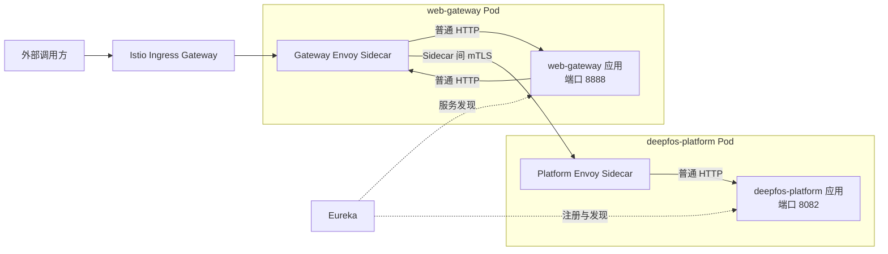
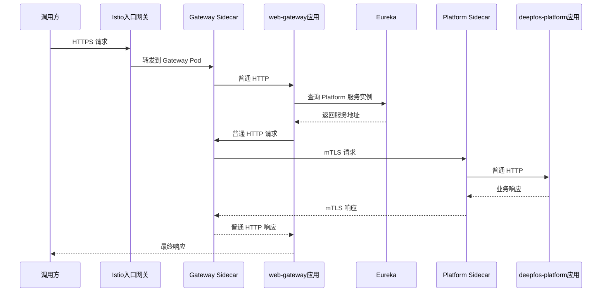

# DeepFOS Platform Istio Sidecar 接入说明

> 状态：评审中
> 最后更新：2026-08-20
> 适用范围：`deepfos-platform`、`web-gateway` 在对方 Kubernetes 集群内接入 Istio
> 关联文档：无

## 1. 结论

对方已确认：

- Istio 当前版本标识为 `1-15-5-r5`，后续计划升级到 `1.18`。
- 我方服务部署在对方 Kubernetes 集群内。
- 接入方式为业务 Pod 注入 Sidecar。

在这种模式下，**为了让服务经过 Istio，通常不需要修改 Java 代码，也不需要增加 Istio Java 依赖**。

建议首期继续保留 Eureka：

- Java 仍通过 Eureka 获取服务地址。
- 应用仍使用普通 HTTP。
- Gateway 和 Platform Pod 都注入 Envoy Sidecar。
- 两个 Sidecar 之间由 Istio 建立双向 TLS（mTLS）。
- 先以 `PERMISSIVE` 模式验证，再切换到 `STRICT`。

项目里的 Maven `k8s` profile 是 Kubernetes 服务发现依赖，与 Istio Sidecar 注入不是一回事。仅为接入 Sidecar，不需要专门改打 `k8s` profile 包。

## 2. Sidecar 是什么

Sidecar 是与业务容器部署在同一个 Pod 中的 Envoy 代理。业务应用仍监听原端口并发送普通 HTTP，请求会被 Pod 网络规则透明转给 Envoy。

Sidecar 主要负责：

- 服务间 mTLS；
- 流量路由和灰度；
- 超时、有限重试和异常实例摘除；
- 请求指标、访问日志和代理层链路信息；
- 基于工作负载身份的访问控制。

Sidecar 不替代现有业务鉴权。Token、Cookie、API Key、平台签名、企业和空间权限仍由 `web-gateway` 与业务应用处理。

下图展示本项目接入后的整体关系。



Istio Ingress Gateway 处理集群入口流量。Gateway 调 Platform 时不需要再次绕回 Ingress Gateway，而是直接由两个业务 Pod 的 Sidecar 处理东西向通信。

## 3. 一次请求的处理流程

下图说明保留 Eureka 时，Gateway 调用 Platform 的完整流程。



应用不需要调用 `istiod`，也不要把 Java 客户端改成访问 Envoy 的 `15001`、`15006` 等内部端口。mTLS 证书由 Istio 和 Sidecar 自动管理。

## 4. 对当前项目的影响

首期保留 Eureka 时：

- 不需要修改 Java 业务代码，也不需要增加 Istio 依赖。
- 不需要因为 Sidecar 而改打 Maven `k8s` profile 包。
- 应用继续使用普通 HTTP，不能主动访问 Envoy 内部端口。
- Token、Cookie、API Key 和业务权限逻辑保持不变。

如果以后移除 Eureka，应用应访问 Kubernetes Service DNS，例如 `http://deepfos-platform:8082`，而不是所谓的 VirtualService IP。该服务发现迁移应另行评审。

当前项目有按 Eureka 实例逐个清理本地缓存的逻辑。如果 Eureka 改为只返回一个 Kubernetes Service 虚拟地址，就不能保证请求覆盖每个 Pod，需要改为 Redis Pub/Sub 或 MQ 广播。

## 5. 运维接入步骤

1. 为 `web-gateway` 和 `deepfos-platform` 创建 Kubernetes Service。
2. 为两个 Deployment 或所在命名空间开启 Sidecar 自动注入。
3. 滚动重建 Pod，确认每个 Pod 同时包含业务容器和 `istio-proxy`。
4. 保持 Eureka 和现有 HTTP 地址不变，在 `PERMISSIVE` 模式验证请求链路。
5. 验证所有调用方均已进入 Mesh 后，再将目标范围切换到 `STRICT` mTLS。

建议使用以下健康检查：

```text
/actuator/health/liveness
/actuator/health/readiness
```

不要使用 `/server-check` 作为 liveness，因为它会检查 ClickHouse 等外部依赖。外部依赖短暂异常不应导致业务 Pod 被持续重启。

## 6. 最小验证清单

- [ ] Gateway 和 Platform Pod 中都存在 Ready 状态的 `istio-proxy`。
- [ ] Gateway 能通过现有 Eureka 地址调用 Platform。
- [ ] 代理指标或日志能证明请求经过双方 Sidecar。
- [ ] `PERMISSIVE` 模式下主要业务接口和文件上传正常。
- [ ] 切换到测试范围的 `STRICT` 后，Gateway 调 Platform 仍成功。
- [ ] 删除一个 Platform Pod 后，请求能进入其他 Ready Pod。
- [ ] 多副本下，Space、Menu 和 OS 的本地缓存均能被清理。

## 7. 待确认事项

1. 对方提供完整 `istioctl version` 输出，确认控制面和数据面实际版本。
2. Eureka 最终注册 Pod IP，还是 Kubernetes Service DNS。
3. 对方当前 PeerAuthentication 默认是 `PERMISSIVE` 还是 `STRICT`。
4. 从 `1.15` 升级到 `1.18` 是否与业务首次接入安排在同一变更窗口；建议分开执行。
