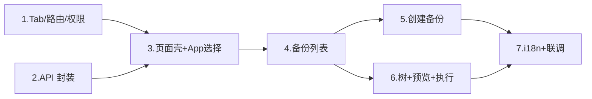

# 前端元素备份与恢复页面代码执行计划

> 状态：草稿
> 最后更新：2026-08-06
> 适用范围：`front-end-development-group` account 模块空间配置页；对接 `deepfos-platform` system-server 元素备份恢复 MVP
> 关联文档：
> - [../README.md](../README.md)
> - 后端：`deepfos-platform` commit `335df5ee`（`feat: 元素备份\恢复-mvp`）
> - 后端计划：`deepfos-platform/ai-docs/plan/element-backup-mvp-validation-plan.md`
> - 恢复规则：`deepfos-platform/ai-docs/plan/element-partial-restore-rules.md`
> - 协作规范：`docs/AGENTS.md`

## 1. 交付目标

完成后，顾问在空间配置管理中可：

1. 在「概览」右侧看到「元素备份」Tab，并进入独立页面。
2. 先选择当前空间下的某个 App，再对该 App 发起 `FULL` / `PARTIAL` 手动备份。
3. 查看该 App 的备份列表与备份内容树。
4. 从备份树勾选可恢复元素，生成恢复预览（`NOOP` / `UPDATE` / `RECREATE` / `BLOCKED`），确认后执行恢复。
5. 正确处理后端错误码（如预览过期、参数无效、载荷超限等），且未选中元素不被改写。

本次**只做前端**对接已落地的后端五个接口；不改后端表结构与恢复编排逻辑。

## 2. 依据与现状

### 2.1 已确认事实（代码核实）

**后端入口**（`ElementBackupController`）：

| 方法 | 路径 | 作用 |
| --- | --- | --- |
| POST | `/element-backup/snapshots` | 创建备份 |
| GET | `/element-backup/snapshots?pageNum&pageSize` | 备份列表 |
| GET | `/element-backup/snapshots/{snapshotId}/tree` | 备份树 |
| POST | `/element-backup/snapshots/{snapshotId}/restore-preview` | 恢复预览 |
| POST | `/element-backup/snapshots/{snapshotId}/restore` | 执行恢复 |

关键约束（来自 `ElementSnapshotServiceImpl` / `ElementRestoreServiceImpl`）：

- 企业、空间、App、用户均从 `RequestContext` 读取；缺少 `space` / `app` / `user` 会返回 `PARAM_INVALID`。
- 快照按 `enterprise_id + space_id + app_id` 隔离；切错 App 会 `SNAPSHOT_SCOPE_MISMATCH`。
- `PARTIAL` 最多 200 个元素；压缩载荷总量上限 20MB。
- 恢复必须先预览拿到 `planDigest`，执行时带同一 `selectedItemIds + planDigest`；不一致则 `RESTORE_PREVIEW_EXPIRED`。
- 仅 `objectType=ELEMENT` 且 `scopeRole=SELECTED` 的树节点可勾选恢复；祖先目录不可选。
- MVP 不做：定时备份、ZIP 导入导出、异步任务进度、整个 App 精确回滚 UI、备份删除。

**前端空间配置入口**（当前生效路径）：

```text
/system-account/configurationManage
  → ConfigurationRoutes
  → SpaceRoutes + SpaceLayout（HappyTabs）
  → MENU_INFO / spaceMenuAccess / SpaceRoutes 路由表
```

- Tab 文案「概览」对应 key `spaceInfo`，定义在 `SpaceLayout.tsx` 的 `spaceTabLabels`。
- 路由元数据在 `components/SpaceContent/MENU_INFO.ts`；页面组件在 `SpaceRoutes.tsx` lazy 注册。
- 权限过滤在 `spaceMenuAccess.ts`（`getPermittedSpaceMenuKeys`）；单测在 `spaceMenuAccess.test.ts`。
- 样式参考：`configManageHappyTabs.module.less`、`AuthorizationLayout` 的 Tabs 用法、`LanguageManage` / `ApiKeys` / `RecycleBin` 的列表页布局。

**请求头现状**（关键缺口）：

- account 模块 `requestV2.getBaseAuthorization` 会自动注入 `space`、`enterprise-id`、`language`、`apptoken`。
- **不会自动注入 `app`**。备份接口必须由调用方显式传 `headers: { app }`（可参考 `getApplicationList` 对 `app` header 的写法，以及作业管理里按 App 过滤的模式）。

### 2.2 设计决策（本计划采用）

1. **入口位置**：在空间配置 `HappyTabs` 中，「概览」右侧紧挨增加「元素备份」Tab（用户明确要求）。
2. **作用域**：页面在空间级，但业务操作在 App 级；页内顶部提供 App 下拉，切换后刷新列表。
3. **实现模块**：放在 `src/modules/account/pages/configurationManage/...`，与空间配置其他 Tab 一致；API 走 `systemServer`（`/deepfos-server/system-server`）。
4. **样式**：复用现有 HappyTabs / antd Table / HappyModal / HappySpin / HappyEmpty，不新开视觉体系。
5. **路由**：只扩展现有 Space 分区路由，不新增顶层 BrowserRouter，不引入 RR v6。

### 2.3 假设与待确认

| 项 | 当前处理 | 确认责任方 |
| --- | --- | --- |
| Tab 可见权限 | MVP 暂定与空间管理员同级：`hasPermission('-1')` 或 `spaceAdmin/systemAdmin` 可见；无独立权限码 | 产品 / 后端 |
| 部分备份「当前元素树」 | 首版优先复用 system/app 侧已有元素目录树接口（需带 `app` header）；若跨模块耦合过重，再拆轻量选择器 | 前端 / 后端 |
| `hasAdmin` 平台管理员 Tab 集 | 平台管理员当前只看到成员/密钥等；MVP **不**把元素备份塞进 `adminTabLabels`（空间管理员侧可见即可） | 产品 |
| 创建人展示 | 列表 `createdBy` 为用户 ID；首版直接展示 ID，后续可接用户详情 | 前端可后续优化 |

## 3. 范围

### 3.1 包含

- 空间配置 Tab + 路由 + 菜单权限接入。
- `element-backup` 五个接口的前端 service / 类型。
- 页面：App 选择、备份列表、创建备份（全量/部分）、备份树、恢复预览、执行恢复、错误提示。
- account 模块 i18n 词条（Lingui）。
- `spaceMenuAccess` 相关单测更新。

### 3.2 不包含

- 后端改动、DDL、异步任务中心、备份删除/保留策略。
- 整个 App 精确回滚模式 UI。
- 引用闭包递归恢复、业务数据恢复。
- ZIP 导入导出。
- 定时 / Agent 自动备份。
- 把功能迁到 system 元素管理主界面（非本次入口）。

## 4. 前置条件与依赖

1. 本地/联调环境已执行 `app_element_snapshot_mvp.sql`，system 库三表可用。
2. 后端 `system-server` 含 commit `335df5ee` 及以上。
3. 联调请求必须带完整上下文：`space`（中间件）+ `app`（页面显式）+ 登录用户。
4. 当前空间下至少有一个可操作 App（`getApplicationList` / `getAppList` 可查到）。
5. 部分备份依赖可用的元素树数据源（见 2.3）；若暂无合适树接口，可先交付 FULL + 列表/恢复闭环，PARTIAL 选择器标为阻塞项。

## 5. 页面信息架构

```text
空间配置 Tabs:  [概览] [元素备份] [应用管理] ...
                    │
                    ▼
            ElementBackupPage
            ├── 顶部：App Select +「新建备份」
            ├── 中部：备份列表 Table（分页）
            │     列：快照ID / 范围 / 状态 / 元素数 / 说明 / 创建人 / 时间 / 操作
            │     操作：查看并恢复
            └── 抽屉/二级页：RestoreWorkspace
                  ├── 左：备份树（仅 restoreSelectable 可勾选）
                  ├── 右：预览结果（summary + actions 表）
                  └── 底：预览 / 执行恢复（executable=false 禁用执行）
```

创建备份弹窗：

- 范围：`FULL` | `PARTIAL`
- 说明：可选，最长 500（与后端字段一致）
- `PARTIAL`：元素树多选，前端限制 ≤200，提交 `selectedElementIds`

交互约束：

- 未选 App：列表空态 + 禁用新建。
- 切 App：清空选中快照与预览态，重新拉列表。
- 执行恢复成功后关闭抽屉并刷新列表；若 `RESTORE_PREVIEW_EXPIRED`，提示重新预览并清空旧 digest。
- `BLOCKED` 项展示 `blockReason`；`warnings` 用 Alert/Tag 展示，不阻断查看。

## 6. 实施步骤

### 1. 接入空间 Tab 与路由

- 修改位置：
  - `front-end-development-group/src/modules/account/pages/configurationManage/components/SpaceContent/MENU_INFO.ts`
  - `.../SpaceRoutes.tsx`
  - `.../SpaceLayout.tsx`
  - `.../spaceMenuAccess.ts`
  - `.../spaceMenuAccess.test.ts`
  - （若仍被引用）遗留 `SpaceContent/index.tsx` 内重复 MENU / Tabs，保持一致，避免双入口漂移
- 具体改动：
  - `MENU_INFO` 增加 `elementBackup`：
    - `url: '/system-account/configurationManage/space/elementBackup'`
    - `title` / `key` 与现有命名风格一致
    - `index` 插在 `spaceInfo` 之后（例如 `'1.5'` 或重排序号，以不影响其它逻辑为准）
  - `SpaceRoutes` 增加 lazy 页面与 `SPACE_ROUTES` 项。
  - `SpaceLayout.spaceTabLabels` 在「概览」后插入「元素备份」；权限条件与 `spaceMenuAccess` 对齐。
  - `getPermittedSpaceMenuKeys`：在 `spaceInfo` 后按确认的权限规则 push `elementBackup`。
- 依赖关系：无
- 验证方式：
  - 打开 `/system-account/configurationManage/space?...`，确认 Tabs 顺序为「概览 → 元素备份 → …」
  - 点击 Tab URL 变为 `.../space/elementBackup`，search 中 `menu` 同步
  - 跑 `spaceMenuAccess.test.ts`，补一条「管理员/空间管理员可见元素备份」断言

### 2. 新增 API 封装与类型

- 修改位置：新建
  - `src/modules/account/services/elementBackup.ts`
  - （可选）`src/modules/account/pages/configurationManage/components/SpaceContent/ElementBackup/types.ts`
- 具体改动：
  - 使用现有 `systemServer`（与 `spaceContent.ts` / `utils/request.ts` 同前缀）。
  - 封装五个方法，**每次请求显式传入** `headers: { app, space? }`（space 通常已由中间件注入，但仍建议页面把当前 space 传齐，避免边缘场景丢失）。
  - TypeScript 类型对齐后端 DTO：
    - `CreateSnapshotRequest/Response`
    - `SnapshotListResponse` / `SnapshotListItem`
    - `SnapshotTreeResponse`（folders / elements / children）
    - `RestorePreviewRequest/Response`（含 `actions`、`summary`、`planDigest`、`executable`）
    - `RestoreExecuteRequest/Response`
  - 枚举常量：`scopeType: FULL|PARTIAL`，`status: CREATING|SUCCESS|FAILED`，`action: NOOP|UPDATE|RECREATE|BLOCKED`，`scopeRole: SELECTED|ANCESTOR_CONTEXT`。
- 依赖关系：步骤 1 可并行
- 验证方式：
  - 在浏览器 Network 确认请求打到 `/deepfos-server/system-server/element-backup/snapshots`
  - Request Headers 含非空 `app` 与 `space`
  - 无 app 时前端拦截，不发请求

### 3. 搭建 ElementBackup 主页面壳

- 修改位置：新建目录
  - `.../SpaceContent/ElementBackup/index.tsx`（页面入口）
  - `.../ElementBackup/ElementBackupPage.tsx`
  - `.../ElementBackup/ElementBackupPage.module.less`
  - `.../ElementBackup/AppSelector.tsx`（可内联，若简单则不必拆）
- 具体改动：
  - 从 `GlobalStore` 取 `space`；用 `getApplicationList` 或 `getAppList({ spaceId, dimName: '' })` 拉 App 选项（与 ApiKeys / 作业筛选项保持一致优先）。
  - 选中 App 写入组件 state（可同步 URL query `app=`，便于刷新保留；若加 query，沿用 `generatorAccountQuery` 风格，勿破坏现有 `menu/space` 参数）。
  - 布局参考 `LanguageManage`：顶栏工具区 + 下方内容区；空态用 `HappyEmpty`，加载用 `HappySpin`。
- 依赖关系：步骤 1、2
- 验证方式：切空间、切 App 时列表区域正确重置；无 App 时空态文案清晰

### 4. 实现备份列表

- 修改位置：
  - `.../ElementBackup/SnapshotList.tsx`
  - service：`listSnapshots`
- 具体改动：
  - antd `Table` + 分页（`pageNum/pageSize`，默认 20，对齐后端）。
  - 列展示：`snapshotId`、`scopeType`（全量/部分）、`status`、`selectedElementCount`、`description`、`createdBy`、`createdAt`。
  - 仅 `status=SUCCESS` 提供「查看并恢复」；`FAILED` 展示失败态（若列表无 `errorMessage` 字段则只显示状态，待确认是否扩展接口——**当前 DTO 无 errorMessage，首版只显示 FAILED**）。
  - 「新建备份」按钮打开创建弹窗。
- 依赖关系：步骤 2、3
- 验证方式：创建成功后列表首条出现；分页切换正常；跨 App 列表互不串数据

### 5. 实现创建备份弹窗

- 修改位置：
  - `.../ElementBackup/CreateSnapshotModal.tsx`
  - （PARTIAL）`.../ElementBackup/CurrentElementTree.tsx`
- 具体改动：
  - 表单：`scopeType` Radio、`description` TextArea。
  - `FULL`：直接 `POST /element-backup/snapshots`，body 仅 `scopeType` + `description`。
  - `PARTIAL`：展示可勾选元素树；提交 `selectedElementIds`；前端校验非空且 ≤200。
  - 提交中按钮 loading；成功 toast + 关闭 + 刷新列表；若 `businessDataExcluded=true`，成功提示中附带「已排除业务数据」说明。
  - 错误码映射（至少）：`PARTIAL_ELEMENT_LIMIT`、`SNAPSHOT_MVP_SIZE_LIMIT`、`SYSTEM_ELEMENT_NOT_SUPPORTED`、`SNAPSHOT_CREATE_FAILED`、`PARAM_INVALID`。
  - **元素树数据源**：优先调研复用 `system` 模块已有目录树请求（如 `element-info` 相关），请求必须带目标 `app`；若引入 system 依赖过重，可临时用「按元素 ID 手工输入/多选」仅作联调，但不得作为正式交付——正式交付需树选。
- 依赖关系：步骤 4；PARTIAL 依赖元素树方案确认
- 验证方式：
  - FULL 备份成功
  - PARTIAL 选 1～N 个元素成功；选 >200 前端拦截
  - 系统元素被后端拒绝时错误可读

### 6. 实现备份树 + 恢复预览/执行

- 修改位置：
  - `.../ElementBackup/RestoreDrawer.tsx`（或全屏二级面板）
  - `.../ElementBackup/SnapshotTree.tsx`
  - `.../ElementBackup/RestorePreviewPanel.tsx`
- 具体改动：
  - 打开时 `GET .../tree`，把 `folders/elements/children` 转成 antd `Tree` `treeData`。
  - 仅 `restoreSelectable===true` 的节点可勾选；祖先上下文节点禁用并可用 Tag 标注「路径上下文」。
  - 「生成预览」：`POST restore-preview`，body `{ selectedItemIds }`；保存返回的 `planDigest`。
  - 预览区展示 `summary`（noop/update/recreate/blocked/createFolder）与 `actions` 表（action、warnings、blockReason）。
  - 「执行恢复」：仅当 `executable===true` 且本地仍持有与上次预览一致的 `selectedItemIds + planDigest`；调用 `POST restore`。
  - 执行前二次确认 Modal（高风险写操作）。
  - 处理 `RESTORE_PREVIEW_EXPIRED`：清空 digest，要求重新预览。
  - 勾选变更后作废旧预览结果（避免用过期 digest 执行）。
- 依赖关系：步骤 4
- 验证方式：走通「备份 → 改元素 → 预览 UPDATE → 执行 → 再预览 NOOP」；人为改 digest 或改当前元素后执行应失败并提示重预览

### 7. i18n 与文案

- 修改位置：account 模块 locales（按项目 Lingui 流程：`pnpm extract` → 翻译 → `pnpm compile`）
- 具体改动：
  - 所有用户可见文案使用 `msg` / `i18n._`，与邻近空间配置页一致。
  - 覆盖：Tab 名、按钮、空态、范围/状态/动作枚举、错误提示、确认框。
- 依赖关系：步骤 1～6 过程中同步加词条
- 验证方式：`pnpm extract` 后 account catalog 出现新词条；中英切换无裸中文 key（若项目有英包）

### 8. 联调与回归

- 修改位置：无强制代码；必要时补 `data-testid`（参考授权页 `account-license-manage-page`）
- 具体改动：按第 7 节测试计划执行
- 依赖关系：步骤 1～7
- 验证方式：见「完成标准」

## 7. 测试计划

### 7.1 单元

- [ ] 更新 `spaceMenuAccess.test.ts`：权限矩阵包含/排除 `elementBackup`。
- [ ] （可选）树数据转换函数纯函数单测：后端 `SnapshotTreeResponse` → antd Tree nodes，校验不可选节点 `disableCheckbox`。

### 7.2 手工 / 联调（MVP 闭环）

- [ ] 给定已登录空间管理员与可用 App，当打开空间配置，则「概览」右侧出现「元素备份」。
- [ ] 给定选中 App A，当创建 FULL 备份，则列表出现 `SUCCESS` 记录且 `scopeType=FULL`。
- [ ] 给定选中若干元素，当创建 PARTIAL 备份，则 `selectedElementCount` 与勾选一致。
- [ ] 给定成功快照，当打开树，则仅 SELECTED 元素可勾选，祖先目录不可选。
- [ ] 给定修改过的已备份元素，当预览，则对应 action 为 `UPDATE` 且 `executable=true`。
- [ ] 给定预览成功，当执行恢复，则返回 updated/recreated 计数，且未选元素保持不变。
- [ ] 给定预览后再次修改当前元素，当仍用旧 `planDigest` 执行，则提示预览过期。
- [ ] 给定未选 App 或请求缺 `app` header，则前端拦截或后端 `PARAM_INVALID`，页面有明确提示。
- [ ] 给定 App A 的快照，当切换到 App B，则看不到 A 的快照（或请求报 scope 不匹配并被 UI 处理）。

### 7.3 回归

- [ ] 空间其它 Tab（概览、应用管理、作业等）切换正常，URL/search 不被元素备份逻辑破坏。
- [ ] `hasAdmin` 平台管理员视图未误加该 Tab（若产品未要求）。
- [ ] RR 仍为 v5；无 `useNavigate` / 第二套 Router。

## 8. 发布、迁移与回滚

- **开关**：无独立前端开关；Tab 可见性由权限函数控制。若需紧急下线，从 `spaceTabLabels` / `getPermittedSpaceMenuKeys` 移除 `elementBackup` 即可，不影响后端数据。
- **数据迁移**：无前端迁移；后端三表由 DBA/发布流程执行 SQL。
- **兼容**：仅调用新增 API，不改旧接口契约。
- **回滚**：回退前端相关 commit；已产生快照保留在 system 库，不自动清理（符合 MVP「不删快照」）。
- **监控**：关注接口 4xx/5xx 与 `E1141*` 错误码日志；恢复接口有 App 级分布式锁，注意超时提示。

## 9. 风险与待确认事项

| 风险 / 缺口 | 影响 | 应对 |
| --- | --- | --- |
| 请求缺 `app` header | 全部接口失败 | 页面强制 App 选择；service 层断言 app |
| 无现成「当前元素树」接口可干净复用 | PARTIAL 阻塞 | 先交付 FULL+恢复；并行确认树接口或后端补 system-server 只读树 |
| 同步备份/恢复耗时长 | UI 假死感 | 按钮 loading；文案提示大数据量可能较慢；超限依赖后端 20MB / 200 元素限制 |
| 权限码未定义 | 可能对普通成员暴露入口 | MVP 先限空间管理员；确认后改 `spaceMenuAccess` |
| 遗留 `SpaceContent/index.tsx` 双份菜单 | Tab 不一致 | 以 `SpaceLayout`+`MENU_INFO.ts` 为准，同步或确认遗留路径已废弃 |
| `createdBy` 为用户 ID | 可读性差 | 首版接受；后续批量换昵称 |

## 10. 完成标准（Definition of Done）

- [ ] 「概览」右侧存在「元素备份」Tab，路由与权限过滤生效，相关单测通过。
- [ ] 五个后端接口均有类型化封装，且请求携带正确 `app`/`space`。
- [ ] FULL 备份、列表、树、预览、执行恢复主路径在联调环境可重复演示。
- [ ] PARTIAL 备份具备可用的元素多选能力，或已在文档中明确阻塞原因与替代排期（不得静默缺失）。
- [ ] 预览过期、BLOCKED、缺 App 等失败路径有明确用户提示，且不会带着过期 digest 静默成功。
- [ ] i18n 词条已 extract/compile；无新增 Router/i18n 实例；符合 view-main-v2 硬约束。
- [ ] 本计划中「待确认」项已关闭，或在 README 中移交并标注责任方。

## 11. 建议文件清单（实施时按需微调）

```text
src/modules/account/
  services/elementBackup.ts
  pages/configurationManage/
    SpaceLayout.tsx                          # Tab 插入
    SpaceRoutes.tsx                          # 路由
    spaceMenuAccess.ts                       # 权限
    spaceMenuAccess.test.ts
    components/SpaceContent/
      MENU_INFO.ts
      ElementBackup/
        index.tsx
        ElementBackupPage.tsx
        ElementBackupPage.module.less
        SnapshotList.tsx
        CreateSnapshotModal.tsx
        CurrentElementTree.tsx               # PARTIAL
        RestoreDrawer.tsx
        SnapshotTree.tsx
        RestorePreviewPanel.tsx
        types.ts
```

## 12. 建议实施顺序（压缩并行）



预计可并行：步骤 1 与 2；步骤 5 与 6 在列表完成后并行。
