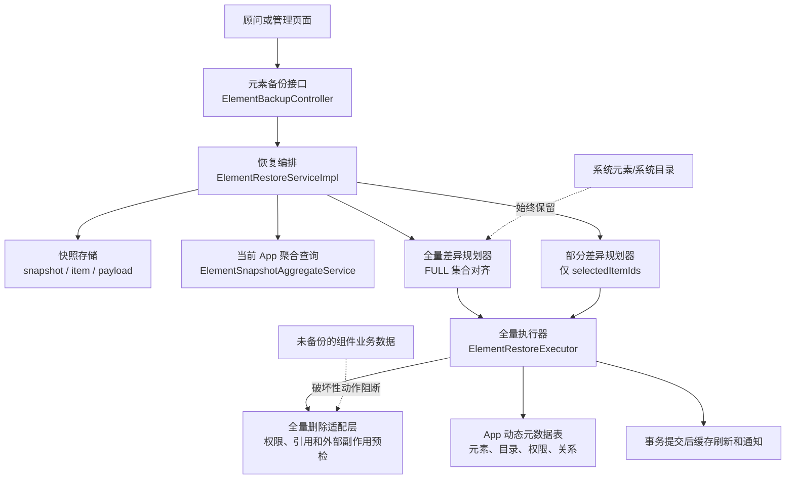
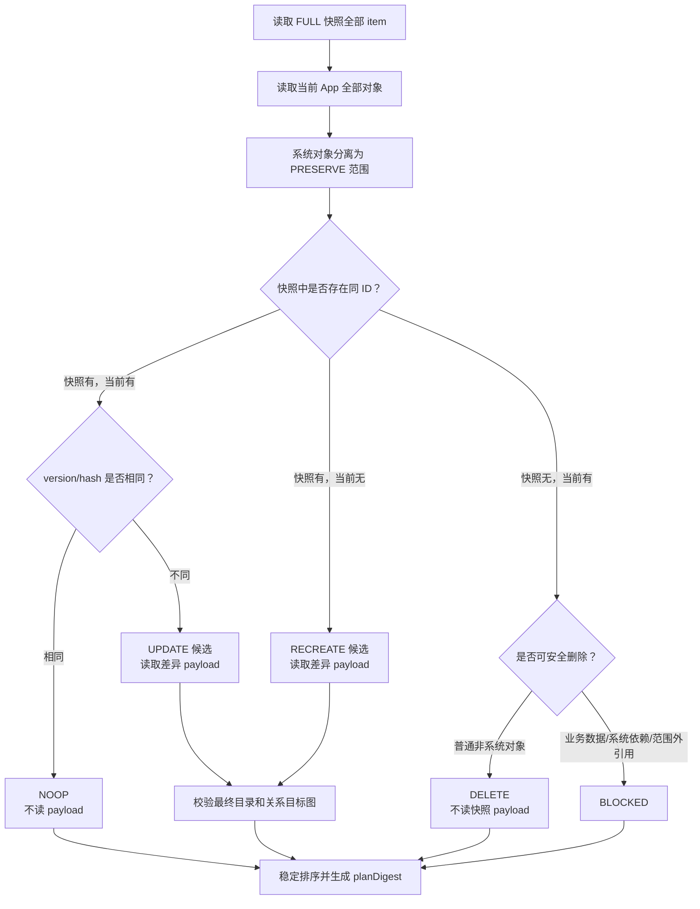
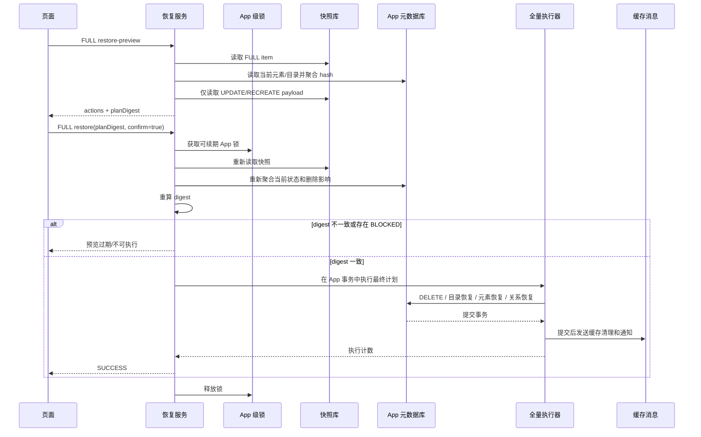
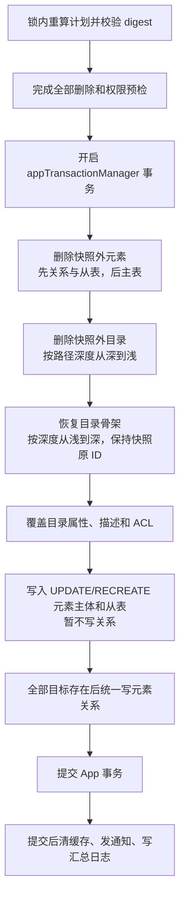

# 全量恢复功能扩展代码执行计划

> 状态：评审中
> 最后更新：2026-08-07
> 适用范围：`deepfos-platform` `feature_app_snapshot` 分支，`system-server` 元素备份恢复开发阶段
> 关联文档：
> - [../README.md](../README.md)
> - [2026-08-07-恢复预览按哈希差异加载优化.md](./2026-08-07-恢复预览按哈希差异加载优化.md)
> - `deepfos-platform/ai-docs/plan/element-backup-mvp-validation-plan.md`
> - `deepfos-platform/ai-docs/plan/element-partial-restore-rules.md`

## 1. 交付目标

在现有“从 FULL 或 PARTIAL 快照中勾选元素做部分恢复”的能力之外，增加真正的整个 App 全量恢复模式：

1. 只有 `scopeType=FULL` 的成功快照可以发起全量恢复。
2. 全量恢复以快照为目标状态，对当前 App 的非系统元素和非系统目录做完整集合差异。
3. 快照内对象恢复为快照状态；快照外新增的普通非系统对象被删除；系统对象始终保留。
4. 目录按快照原始 ID、父子层级、属性、多语言描述和 ACL 恢复，不再仅作为元素路径上下文复用或补建。
5. 继续复用已经落地的 `element_version -> hash -> 差异 payload` 快速路径；`NOOP`、`DELETE` 不读取快照 payload。
6. 预览与执行使用同一套规划算法；执行时在 App 级锁内重算并校验 `planDigest`，不允许按过期计划写入。
7. 部分恢复继续只处理 `selectedItemIds`，不因本次改造获得删除范围外对象的能力。

本计划中的“精确全量恢复”指备份覆盖范围内的 App 配置精确对齐，具体包括：

- 非系统目录配置、目录多语言描述和目录 ACL。
- 非系统元素 Schema、内容、Blob、操作标签、描述、元素权限和元素关系。
- 目录 ID、元素 ID、父子关系和目标路径。

它不包括组件业务数据和审计时间字段。`business_data_flag=true` 元素的业务数据没有进入快照，因此不能宣称 App 业务数据也被回滚。

## 2. 依据与当前代码事实

### 2.1 代码基线

本计划基于 2026-08-07 的以下代码状态：

| 项目 | 值 |
| --- | --- |
| 后端仓库 | `deepfos-platform` |
| 分支 | `feature_app_snapshot` |
| HEAD | `5955a27c perf(element-backup): 预览用 element_version 做 L0 指纹跳过聚合` |
| 前序相关提交 | `ed582b29`、`ff594d03`、`e02675a1`、`f7b96d55` |

### 2.2 已确认事实

| 已确认事实 | 代码定位 | 对本计划的影响 |
| --- | --- | --- |
| 当前两个恢复接口都要求 `selectedItemIds` | `system-server/.../dto/RestorePreviewRequest.java`、`RestoreExecuteRequest.java`、`service/impl/ElementRestoreServiceImpl.java` | 当前只有部分恢复，必须增加显式恢复模式 |
| 当前动作只有 `NOOP` / `UPDATE` / `RECREATE` / `BLOCKED` | `system-server/.../enums/RestoreAction.java` | 全量集合差异需要新增 `DELETE` |
| 当前规划只读取选中的 `ELEMENT + SELECTED` item | `ElementRestoreServiceImpl#doBuildRestorePlan` | FULL 模式需要读取快照全部 item 并同时规划目录 |
| 当前 FULL 快照保存全部非系统元素和全部非系统目录 | `ElementSnapshotServiceImpl#createSnapshot`、`appendFullFolders` | 已有快照索引可以表达全量集合边界 |
| 元素 item 已有 `payload_hash` 和 `element_version` | `AppElementSnapshotItem` | 全量预览可以直接复用 L0/L1 快速分类 |
| 当前只为 hash 不同或元素缺失的项读取 payload | `ElementRestoreServiceImpl#doBuildRestorePlan` | FULL 模式不得退回“全部查 payload、全部解压” |
| 当前目录 payload 只有 `folderInfo` | `ElementSnapshotAggregateService#aggregateFolder`、`ElementSnapshotPayloadV1.State` | 现有 FULL 快照不能精确恢复目录多语言描述和 ACL |
| `queryFolderDesLanguageByIds` 只查一个 language | `IFolderInfoMapper` 及各数据库 `FolderInfoMapper.xml` | 备份目录时需要新增“按 IDs 查询全部语言”的批量 SQL |
| `IFolderPermissionMapper#selectAll` 只查单目录且排除创建者权限 | `IFolderPermissionMapper` 及各数据库 `FolderPermissionMapper.xml` | 需要新增按目录 IDs 读取真实完整 ACL 的批量 SQL |
| 当前执行器只复用或创建缺失目录，不覆盖目录载荷 | `ElementRestoreExecutor#ensureAncestorFolders` | FULL 目录执行必须单独实现，不能复用部分恢复目录语义 |
| 当前元素 `UPDATE` 是删除元数据从表和主表后按 payload 重插 | `ElementRestoreExecutor#restoreUpdate`、`deleteElementChildren` | 可继续用于同 ID 覆盖，但不能充当快照外对象的标准删除链 |
| 平台标准元素删除包含权限、通知、业务数据、关系、缓存、作业和日志等副作用 | `IElementInfoService#removeElementInstance`、`ElementInfoServiceImpl#removeElementInstance`、`RemoveTransactionalServiceImpl#removeElementInstance` | 全量 `DELETE` 需要专用删除编排/适配层，不能直接批量删 Mapper |
| 平台标准目录删除会递归删除子目录和元素 | `FolderInfoServiceImpl#removeFolderInfo`、`deleteFolderInfo` | 全量计划已经精确列出对象，不能直接调用递归 UI 删除入口 |
| 恢复执行使用 `appTransactionManager`，MQ 发送发生在方法返回前 | `ElementRestoreExecutor#execute` | 全量恢复要把缓存事件推迟到事务提交后 |
| 当前 App 恢复锁固定过期时间为 120 秒 | `ElementRestoreServiceImpl#restore` | 全量执行需使用可续期锁或显式检测锁所有权，防止长任务越过租约 |

### 2.3 当前行为与目标行为

| 场景 | 当前行为 | 全量恢复目标 |
| --- | --- | --- |
| FULL 快照中存在、当前相同 | 只有被勾选时才 `NOOP` | 自动纳入全量计划并 `NOOP` |
| FULL 快照中存在、当前被修改 | 只有被勾选时才 `UPDATE` | 自动 `UPDATE` |
| FULL 快照中存在、当前已删除 | 只有被勾选时才 `RECREATE` | 自动 `RECREATE` |
| 当前新增、FULL 快照不存在 | 完全不处理 | 普通非系统对象 `DELETE`；不可安全删除对象 `BLOCKED` |
| 目录属性或 ACL 改变 | 不比较、不恢复 | 计算目录 hash 并 `UPDATE` |
| 当前目录 ID 与快照不同但路径相同 | 按路径复用当前目录 | 删除快照外目录，并按快照原 ID 恢复 |
| 系统元素/系统目录 | 不进入快照 | 明确保留，不进入删除集合 |

## 3. 范围与非目标

### 3.1 本次包含

- 直接修改现有恢复请求、响应和动作模型，不新增 V2 接口、V2 DTO 或双版本解析。
- `PARTIAL` 与 `FULL` 两种恢复模式的参数校验和权限校验。
- FULL 快照目录载荷补全：目录信息、多语言描述、完整目录 ACL。
- 元素和目录的全量集合差异及 `NOOP` / `UPDATE` / `RECREATE` / `DELETE` / `BLOCKED` 动作。
- 快照外普通非系统元素和目录的安全删除。
- 全量执行的目录原 ID 恢复、元素两阶段写入和关系最终态绑定。
- `planDigest`、App 级互斥锁、事务提交后缓存刷新、日志和指标。
- 清理开发环境旧快照并用新载荷重新创建基准快照。
- 部分恢复回归测试。

### 3.2 明确不包含

- 不兼容旧开发快照，不保留旧目录载荷解析分支。
- 不新增 `ElementSnapshotPayloadV2`，直接修改当前 `ElementSnapshotPayloadV1.State` 和聚合规则。
- 不备份或恢复组件业务数据。
- 不恢复 `create_time`、`modify_time` 等审计时间，不把执行人伪装成历史用户。
- 不删除、不重建、不覆盖 `system_tag=true` 的系统元素和系统目录。
- 不把 PARTIAL 快照解释成 App 完整状态，PARTIAL 模式永远不会产生范围外 `DELETE`。
- 不做跨 App 级联回滚；会破坏范围外引用的删除必须在预览中阻断。
- 不在本次引入异步恢复任务表、进度条或失败重试框架。
- 不自动创建“恢复前保护快照”；联调和发布操作必须先人工创建当前 FULL 快照作为回退点。

## 4. 模式边界与系统全景

恢复模式由请求显式声明，快照类型不能代替恢复模式。FULL 快照既可用于部分恢复，也可用于全量恢复；PARTIAL 快照只能用于部分恢复。



模式矩阵如下：

| 快照 `scopeType` | 请求 `restoreMode` | 是否允许 | 处理范围 |
| --- | --- | --- | --- |
| `PARTIAL` | `PARTIAL` | 是 | 本次 `selectedItemIds` |
| `FULL` | `PARTIAL` | 是 | 本次 `selectedItemIds` |
| `FULL` | `FULL` | 是 | 快照内全部非系统目录/元素与当前 App 全量集合 |
| `PARTIAL` | `FULL` | 否 | 返回 `FULL_RESTORE_REQUIRES_FULL_SNAPSHOT` |

## 5. 对外接口直接变更

继续复用现有 endpoint：

- `POST /element-backup/snapshots/{snapshotId}/restore-preview`
- `POST /element-backup/snapshots/{snapshotId}/restore`

不新增 `/v2` 或平行 full-restore endpoint。现有开发调用方直接按新契约改造。

### 5.1 预览请求

`RestorePreviewRequest` 增加必填字段 `restoreMode`：

```json
{
  "restoreMode": "FULL"
}
```

部分恢复请求：

```json
{
  "restoreMode": "PARTIAL",
  "selectedItemIds": [101, 102]
}
```

校验规则：

| 字段 | `PARTIAL` | `FULL` |
| --- | --- | --- |
| `restoreMode` | 必填，值为 `PARTIAL` | 必填，值为 `FULL` |
| `selectedItemIds` | 必填、非空，只允许可选的 `ELEMENT + SELECTED` item | 必须为空；传入时按参数错误处理，不能静默忽略 |
| 快照类型 | `FULL` 或 `PARTIAL` | 只能是 `FULL` |

### 5.2 执行请求

```json
{
  "restoreMode": "FULL",
  "planDigest": "sha256:...",
  "confirmFullRestore": true
}
```

- `planDigest` 在两种模式都必填。
- `confirmFullRestore=true` 只在 FULL 执行时必填；预览不需要。
- 页面必须展示 `UPDATE`、`RECREATE`、`DELETE`、`BLOCKED` 数量并进行二次确认，不能只显示“恢复 N 个元素”。
- `confirmFullRestore` 只是显式风险确认，不能替代权限校验和 digest 校验。

### 5.3 预览响应

直接把现有元素专用 action 改为对象通用 action：

```json
{
  "snapshotId": "SNP...",
  "restoreMode": "FULL",
  "planDigest": "sha256:...",
  "executable": true,
  "actions": [
    {
      "objectType": "ELEMENT",
      "objectId": "EL100",
      "objectName": "模型A",
      "elementType": "MODEL",
      "fullPath": "/一级目录/",
      "action": "UPDATE",
      "currentHash": "1234567890ab",
      "snapshotHash": "abcdef123456",
      "warnings": [],
      "blockReason": null
    },
    {
      "objectType": "FOLDER",
      "objectId": "DIR20",
      "objectName": "二级目录",
      "fullPath": "/一级目录/二级目录/",
      "action": "RECREATE",
      "currentHash": null,
      "snapshotHash": "fedcba654321",
      "warnings": [],
      "blockReason": null
    }
  ],
  "summary": {
    "elementNoop": 1000,
    "elementUpdate": 10,
    "elementRecreate": 2,
    "elementDelete": 3,
    "elementBlocked": 0,
    "folderNoop": 100,
    "folderUpdate": 2,
    "folderRecreate": 1,
    "folderDelete": 1,
    "folderBlocked": 0,
    "preservedSystemElement": 5,
    "preservedSystemFolder": 2
  }
}
```

内部 `RestorePlan` 建议直接拆为 `elementItems` 和 `folderItems`，响应再按稳定顺序合并，避免在一个类中堆叠大量只对目录或元素有效的可空字段。

### 5.4 执行响应

`RestoreExecuteResponse` 增加并区分以下计数：

- `updatedElements`、`recreatedElements`、`deletedElements`、`skippedElements`
- `updatedFolders`、`recreatedFolders`、`deletedFolders`、`skippedFolders`
- `preservedSystemElements`、`preservedSystemFolders`
- `status`、`finishedAt`

### 5.5 错误码

在 `E1141Enums` 中增加明确错误，不用通用 `SNAPSHOT_CREATE_FAILED` 表达全量恢复失败：

| 建议标识 | 触发条件 |
| --- | --- |
| `FULL_RESTORE_REQUIRES_FULL_SNAPSHOT` | PARTIAL 快照请求 FULL 恢复 |
| `FULL_RESTORE_CONFIRM_REQUIRED` | FULL 执行未显式确认 |
| `FULL_RESTORE_DELETE_BLOCKED` | 对象需要破坏性删除但不满足安全边界 |
| `FULL_RESTORE_SYSTEM_DEPENDENCY_CONFLICT` | 待删除目录或元素仍被保留的系统对象占用或引用 |
| `RESTORE_LOCK_LOST` | 执行期间无法确认仍持有 App 级锁 |

继续使用现有 `RESTORE_PREVIEW_EXPIRED` 表达 digest 不一致。

## 6. FULL 快照目录载荷补全

### 6.1 直接修改当前载荷类

不创建 V2 类。直接在 `ElementSnapshotPayloadV1.State` 增加：

```text
folderInfo
folderDescriptions[]
folderPermissions[]
```

目录 payload 的稳定内容为：

| 分组 | 字段 |
| --- | --- |
| `identity` | `enterpriseId`、`spaceId`、`appId`、`elementId`（目录 ID）、`folderId`（父目录 ID）、`elementName`、`fullPath` |
| `folderInfo` | `id`、`parentId`、`name`、`fullPath`、`description`、`status`、`systemTag`、`openPermission`、`openExtend`、`allocationPermission`、`optionalActions`、`space`、`app` |
| `folderDescriptions` | `languageCode`、`value` |
| `folderPermissions` | `objType`、`objId`、`permission`、`allocation`、`sourceFolderInfoId`、`sourceObjId`、`createPermission` |

`folderPermissions` 不保存由请求上下文可以确定的 `space`、`app`，恢复时统一使用当前快照归属；不得信任 payload 中的动态表路由值。

### 6.2 规范化和 hash

- 描述按 `languageCode` 排序。
- 权限按 `createPermission + allocation + permission + objType + objId + sourceFolderInfoId + sourceObjId` 排序。
- 所有布尔值使用统一 JSON 布尔表示，不能在不同数据库驱动下出现 `0/1` 与 `true/false` hash 漂移。
- 不把 `createTime`、`modifyTime`、`modifyUser` 纳入目录 hash。
- 当前目录 hash 与快照目录 hash 必须调用同一个聚合和规范化入口。

### 6.3 批量读取要求

`aggregateFolder` 不能对每个目录分别查询描述和权限。增加批量入口 `aggregateFolders(...)`：

1. 一次读取 `folder_info`。
2. 按目录 ID 分批读取全部语言描述。
3. 按目录 ID 分批读取完整 ACL，包括创建者权限和分配/继承来源字段。
4. 在内存中按目录 ID 分组、规范排序并编码。

需要同时修改所有当前支持的 Mapper 变体：

```text
app-server/src/main/resources/app-mapper/common/
├── mysql/FolderInfoMapper.xml + FolderPermissionMapper.xml
├── oceanbase/FolderInfoMapper.xml + FolderPermissionMapper.xml
├── dm/FolderInfoMapper.xml + FolderPermissionMapper.xml
├── kingbase8/FolderInfoMapper.xml + FolderPermissionMapper.xml
├── opengauss/FolderInfoMapper.xml + FolderPermissionMapper.xml
└── postgresql/FolderInfoMapper.xml + FolderPermissionMapper.xml
```

开发环境中的旧快照缺少新增字段。代码上线后先清理旧快照并重新创建，不做空字段兼容。

## 7. 全量差异和动作模型

### 7.1 比较集合

FULL 预览一次性建立以下索引：

```text
snapshotElementsById = FULL 快照的 ELEMENT + SELECTED items
snapshotFoldersById  = FULL 快照的 FOLDER + SELECTED items
currentElementsById  = 当前 App 全部非系统元素
currentFoldersById   = 当前 App 全部非系统目录
preservedSystem      = 当前 App 系统元素和系统目录，仅计数和冲突检查
```

PARTIAL 模式继续使用当前所选 item 路径，不调用全量集合差逻辑。

### 7.2 核心判定流程



### 7.3 元素判定表

| 快照 | 当前 | 判定 | 动作 | 是否读 payload |
| --- | --- | --- | --- | --- |
| 有 | 同 ID 有，`element_version` 相同 | L0 命中 | `NOOP` | 否 |
| 有 | 同 ID 有，version 不同但 hash 相同 | L1 命中 | `NOOP` | 否 |
| 有 | 同 ID 有，hash 不同 | 配置改变 | `UPDATE` | 是 |
| 有 | 同 ID 无 | 当前被删除 | `RECREATE` | 是 |
| 无 | 当前有，普通非系统元素 | 备份后新增 | `DELETE` | 否 |
| 无 | 当前有，`businessDataFlag=true` | 删除会丢失未备份业务数据 | `BLOCKED` | 否 |
| 无 | 当前有，系统元素 | 范围外 | 保留，不生成执行动作 | 否 |

快照内 `businessDataFlag=true` 元素可以按现有能力恢复 Schema，但必须继续提示“业务数据未恢复”。快照外且带该标记的当前元素禁止自动删除。

### 7.4 目录判定表

| 快照 | 当前 | 判定 | 动作 |
| --- | --- | --- | --- |
| 有 | 同 ID 有，完整目录 hash 相同 | 无变化 | `NOOP` |
| 有 | 同 ID 有，hash 不同 | 属性、路径、描述或 ACL 改变 | `UPDATE` |
| 有 | 同 ID 无 | 当前已删除 | `RECREATE` |
| 无 | 当前有，普通非系统目录且无保留对象依赖 | 备份后新增 | `DELETE` |
| 无 | 当前有，但包含系统对象或其他保留对象 | 不能安全删除 | `BLOCKED` |
| 无 | 当前有，系统目录 | 范围外 | 保留，不生成执行动作 |

FULL 模式不沿用“同路径不同 ID 就复用当前目录”的部分恢复规则。若快照目录 `DIR20` 已不存在，而当前 `DIR90` 占用了相同路径，则规划为：

```text
DIR90 -> DELETE
DIR20 -> RECREATE
```

执行顺序保证先释放路径，再按原始 ID 恢复。

### 7.5 最终目标图和关系规划

全量关系不能只对着“预览时当前 App”解析，因为关系目标可能也在同一计划中 `RECREATE`。需要先构建执行后的最终目标图：

```text
finalFolders = 快照非系统目录 + 当前保留的系统目录
finalElements = 快照非系统元素 + 当前保留的系统元素
```

- `UPDATE` / `RECREATE` 元素的出边按 `finalElements` 解析。
- 快照目标在同一计划中 `RECREATE` 时视为可绑定，不应误报缺失。
- 目标不在快照但属于保留系统对象时，可以绑定到当前系统对象。
- 最终图中仍缺失的目标沿用现有 `DANGLING + warning` 语义；存在歧义仍 `BLOCKED`。
- FULL 执行不调用 `rebindDanglingIncomingRelations` 把当前态悬空关系重新带回；最终非系统关系只能来自快照 payload。

## 8. `planDigest`、权限和并发控制

### 8.1 digest 内容

`planDigest` 的规范化输入至少包含：

- `restoreMode`、`snapshotId`、快照归属和状态。
- 每个元素和目录的 `objectType`、`objectId`、动作、`currentHash`、`snapshotHash`。
- `UPDATE` / `RECREATE` 的目标父目录 ID、路径和最终关系绑定。
- `DELETE` 对象的当前身份、父目录、路径、版本/hash 和删除影响摘要。
- `BLOCKED` 原因和 warnings。
- 系统对象保留计数不参与写动作，但影响冲突的系统对象 ID 必须进入 digest。

所有集合按 `objectType + objectId` 稳定排序后计算，不能依赖数据库返回顺序。

### 8.2 执行前重新规划



### 8.3 权限

FULL 预览和执行都必须验证当前用户是 App 管理员。不能仅依赖页面入口隐藏，也不能只逐元素检查写权限。

实现时复用 `PermissionService#checkAdmin` 获取 `UserPermissionVo`，要求 `getAppAdmin()==true`；权限不足返回 `NO_RESTORE_PERMISSION`。PARTIAL 模式保持现有权限语义，本计划不顺带改变其授权范围。

### 8.4 锁租约

固定 120 秒租约对全量删除不安全。实现前确认 `DistributedLockIntensity` 是否提供 owner 校验的续期能力：

- 若有，FULL 执行启用自动续期并在每个执行阶段检查锁所有权。
- 若没有，在 elementbackup 包内增加基于同一 `requestId` 的安全续期封装；只允许持有者续期和释放。
- 任一阶段发现锁丢失，事务写入前直接终止；事务执行中发现则抛出异常回滚并返回 `RESTORE_LOCK_LOST`。

## 9. 删除安全编排

### 9.1 为什么不能直接调用 Mapper

快照外元素的 `DELETE` 与当前 `restoreUpdate` 的“同 ID 元数据替换”语义不同。直接调用：

```text
deleteElementChildren + deleteElementInfoByIds
```

会漏掉标准删除链中的组件通知、业务数据清理、被引用关系、跨 App 关系、缓存、作业和操作日志。反过来，直接调用 UI 的 `IElementInfoService#removeElementInstance` 又会把逐元素权限、逐元素 job/log/notice 和独立外部调用混入全量事务，难以预检和保证全成全败。

### 9.2 专用删除适配层

新增 `FullRestoreDeletionCoordinator`，把删除分成两个阶段：

1. `prepare(plan)`：只读预检，收集所有待删除对象的权限、系统保护、子孙对象、入边、跨 App 引用和外部删除要求，不产生副作用。
2. `executePreparedDeletion(...)`：只接受与 digest 绑定的预检结果，在 App 事务中执行元数据删除，并登记提交后副作用。

适配层必须复用标准删除链已经验证过的底层清理能力，不复制一套缩水版 Mapper 清单；同时不能直接把递归目录删除入口嵌入全量执行。

### 9.3 阻断边界

以下情况整次 FULL 计划 `executable=false`：

- 快照外待删元素 `businessDataFlag=true`。
- 删除需要不可回滚的组件业务数据远程调用，而当前适配层无法提供补偿或已确认幂等删除。
- 待删元素被保留的系统元素或范围外 App 对象引用，标准行为会破坏范围外对象。
- 待删目录包含保留的系统元素、系统目录或其他非删除对象。
- 当前用户不是 App 管理员。
- 删除预检发现系统元素保护、身份占用或权限上下文不完整。

预览 action 必须显示具体 `objectId`、路径和 `blockReason`，不能只返回一个总错误。

### 9.4 外部副作用

- App 数据库写入由一个 `appTransactionManager` 事务覆盖。
- 缓存 MQ、通知和操作日志在事务提交后统一发送，禁止在可能回滚的事务内提前发送成功消息。
- 无法回滚的远程业务删除不放进数据库事务伪装成原子操作；本次默认阻断此类对象。
- FULL 恢复写一条包含快照 ID、digest、各动作计数和执行人的汇总审计记录，不为 1200 个 `NOOP` 生成逐项日志。

## 10. 全量执行顺序

执行顺序必须先解除占用，再恢复目录骨架，最后恢复元素和关系：



具体约束：

1. `DELETE` 元素先于目录，防止目录非空。
2. 目录删除按 `fullPath` 深度降序；目录恢复按深度升序。
3. `UPDATE` 目录也按父目录优先执行，以便恢复移动/改名后的完整路径。
4. 目录 `UPDATE` / `RECREATE` 都替换多语言描述和完整 ACL；空列表表示清空，不是“保留当前值”。
5. 元素 `UPDATE` 继续使用同 ID 元数据替换，不触发业务数据删除。
6. FULL 元素关系分两阶段写入，不能在目标元素尚未重建时按当前态误判。
7. `NOOP` 和 `DELETE` 的 `payload` 必须为 `null`；只有 `UPDATE` / `RECREATE` 强制要求 payload。

## 11. 实施步骤

### 1. 直接调整恢复接口和动作模型

- 修改位置：
  - `system-server/src/main/java/com/proinnova/system/elementbackup/rest/ElementBackupController.java`
  - `system-server/src/main/java/com/proinnova/system/elementbackup/dto/RestorePreviewRequest.java`
  - `system-server/src/main/java/com/proinnova/system/elementbackup/dto/RestoreExecuteRequest.java`
  - `system-server/src/main/java/com/proinnova/system/elementbackup/dto/RestorePreviewResponse.java`
  - `system-server/src/main/java/com/proinnova/system/elementbackup/dto/RestoreExecuteResponse.java`
  - `system-server/src/main/java/com/proinnova/system/elementbackup/enums/RestoreAction.java`
  - 新增 `system-server/src/main/java/com/proinnova/system/elementbackup/enums/RestoreMode.java`
  - `system-server/src/main/java/com/proinnova/system/common/enums/E1141Enums.java`
- 具体改动：增加 `restoreMode`、FULL 二次确认、对象通用 action、目录/元素分组计数和 `DELETE`；按第 5 节做参数矩阵校验。
- 依赖关系：无。
- 验证方式：Controller/DTO 单元测试覆盖四种快照与模式组合、FULL 传 selectedItemIds、缺少确认、未知 mode 和错误码。

### 2. 补齐 FULL 目录快照载荷

- 修改位置：
  - `system-server/src/main/java/com/proinnova/system/elementbackup/dto/ElementSnapshotPayloadV1.java`
  - `system-server/src/main/java/com/proinnova/system/elementbackup/service/ElementSnapshotAggregateService.java`
  - `system-server/src/main/java/com/proinnova/system/elementbackup/service/impl/ElementSnapshotServiceImpl.java`，`appendFullFolders`
  - `app-server/src/main/java/com/proinnova/app/folder/dao/IFolderInfoMapper.java`
  - `app-server/src/main/java/com/proinnova/app/permission/dao/IFolderPermissionMapper.java`
  - 六种数据库的 `FolderInfoMapper.xml` 和 `FolderPermissionMapper.xml`
- 具体改动：为目录 State 增加描述和 ACL；新增全语言描述、完整权限的批量查询；实现 `aggregateFolders` 并让 FULL 快照批量聚合目录；保持规范排序。
- 依赖关系：无，但旧快照在本步骤上线后不可继续用于 FULL 恢复。
- 验证方式：
  - 同一目录在不同查询返回顺序下 hash 一致。
  - 修改任一目录属性、任一语言描述或任一 ACL 后 hash 必须改变。
  - 100 个目录只产生固定次数的描述/权限批量查询，不出现每目录两次 SQL。
  - `SnapshotPayloadCodecTest` 覆盖新增字段序列化和解压。

### 3. 将部分恢复规划与全量恢复规划明确分流

- 修改位置：
  - `system-server/src/main/java/com/proinnova/system/elementbackup/service/impl/ElementRestoreServiceImpl.java`
  - `system-server/src/main/java/com/proinnova/system/elementbackup/service/RestorePlan.java`
  - `system-server/src/main/java/com/proinnova/system/elementbackup/service/ElementSnapshotPersistService.java`
- 具体改动：
  - 把当前 `doBuildRestorePlan` 收敛为 `buildPartialRestorePlan`，保持行为不变。
  - 新增 `buildFullRestorePlan`，通过现有 `selectBySnapshotId` 读取全部 item。
  - `RestorePlan` 增加 `restoreMode`、`elementItems`、`folderItems`、系统保留计数和删除影响摘要。
  - 两种规划都复用 payload 去重加载、关系解析、digest 编码等公共小方法，不复制整个算法。
- 依赖关系：步骤 1。
- 验证方式：现有 `ElementRestoreServiceImplTest` 的 PARTIAL 用例全部通过；FULL 调用不会依赖 `selectedItemIds`。

### 4. 实现 FULL 元素和目录集合差异

- 修改位置：
  - `ElementRestoreServiceImpl#buildFullRestorePlan`
  - `ElementSnapshotAggregateService#aggregateElements`、新增的 `aggregateFolders`
  - `RestorePlan` 的元素/目录计划项
- 具体改动：
  - 批量读取当前全部元素和目录，先分离系统对象，再以原始 ID 做集合差。
  - 元素先比较 `element_version`，只为 version 不匹配项聚合 current hash。
  - 目录聚合完整 hash。
  - 只为 `UPDATE` / `RECREATE` 的 distinct `payload_hash` 查询和解压 payload。
  - `DELETE` 只携带当前身份和影响摘要，不查快照 payload。
  - 构建最终目录/元素目标索引，按最终态规划关系。
- 依赖关系：步骤 2–3。
- 验证方式：混合 `NOOP + UPDATE + RECREATE + DELETE + BLOCKED` 用例中动作、payload 查询 hash 集合、summary 和稳定排序都准确。

### 5. 加入 App 管理员校验、确认和可续期锁

- 修改位置：
  - `ElementRestoreServiceImpl#restorePreview`、`restore`
  - `app-server/src/main/java/com/proinnova/app/permission/service/PermissionService.java` 的现有 `checkAdmin` 能力
  - elementbackup 包内新增锁封装（仅当 `DistributedLockIntensity` 无安全续期接口）
- 具体改动：FULL 预览/执行要求 App 管理员；FULL 执行要求二次确认；锁内重算全量计划；执行阶段续期并检查 owner。
- 依赖关系：步骤 1、4。
- 验证方式：非 App 管理员被拒绝；预览后新增、修改、删除任意非系统元素或目录都会使旧 digest 失效；模拟锁丢失时事务无写入。

### 6. 新增全量恢复专用删除编排

- 修改位置：
  - 新增 `system-server/src/main/java/com/proinnova/system/elementbackup/service/FullRestoreDeletionCoordinator.java`
  - 复用/适配 `app-server/src/main/java/com/proinnova/app/element/service/impl/ElementInfoServiceImpl.java`
  - 复用/适配 `app-server/src/main/java/com/proinnova/app/element/service/impl/RemoveTransactionalServiceImpl.java`
  - 参考但不直接调用递归入口 `app-server/src/main/java/com/proinnova/app/folder/service/impl/FolderInfoServiceImpl.java`
- 具体改动：实现无副作用 `prepare` 和事务内 `executePreparedDeletion`；批量校验业务数据、系统后代、当前入边和跨 App 引用；把可回滚元数据删除与提交后副作用分开。
- 依赖关系：步骤 4–5。
- 验证方式：
  - 业务数据元素、系统后代、范围外引用分别生成明确 `BLOCKED`。
  - 预检失败时任何 Mapper 写方法和外部调用均未发生。
  - 删除普通元素后，其权限、关系、元数据从表、主表和缓存失效范围完整。
  - 中途 SQL 异常时所有 App 表写入回滚。

### 7. 实现目录精确恢复

- 修改位置：
  - `system-server/src/main/java/com/proinnova/system/elementbackup/service/ElementRestoreExecutor.java`
  - `app-server/src/main/java/com/proinnova/app/folder/dao/IFolderInfoMapper.java`
  - `app-server/src/main/java/com/proinnova/app/permission/dao/IFolderPermissionMapper.java`
  - 六种数据库的目录 Mapper XML
- 具体改动：
  - 增加恢复专用目录 insert/update SQL，覆盖第 6 节定义的可恢复字段。
  - 增加批量删除目录描述和全部目录 ACL 的 SQL；不能复用当前只删部分权限的 `deleteByFolderIds`。
  - 按深度删除和恢复目录，保持快照原 ID。
  - `UPDATE` / `RECREATE` 后以“删除旧集合 + 批量插入快照集合”替换描述和 ACL。
  - PARTIAL 继续走 `ensureAncestorFolders`，不覆盖现存目录配置。
- 依赖关系：步骤 2、4、6。
- 验证方式：目录移动、改名、删除后重建、同路径不同 ID 占用、空 ACL、多个语言描述和系统父目录锚点均有集成测试。

### 8. 实现元素两阶段恢复和最终关系绑定

- 修改位置：
  - `ElementRestoreExecutor#execute`
  - `ElementRestoreExecutor#restoreUpdate`、`restoreRecreate`、`insertElementFromPayload`
  - `ElementRestoreServiceImpl#planOutboundRelations`
- 具体改动：
  - FULL 先写所有 `UPDATE` / `RECREATE` 元素主体、内容、Blob、标签、描述和权限，暂不写关系。
  - 全部目标元素存在后统一写快照关系。
  - FULL 禁用当前态悬空入边自动重绑定；PARTIAL 继续保持现有行为。
  - `DELETE`、`NOOP` payload 为空时执行器不得访问 payload。
- 依赖关系：步骤 4、7。
- 验证方式：A、B 同时被重建且 A→B 时最终关系为 B 的恢复后身份；循环引用、缺失系统目标、歧义目标和 PARTIAL 入边回归均覆盖。

### 9. 将缓存、通知和日志移动到提交后

- 修改位置：
  - `ElementRestoreExecutor#execute`
  - `ProducersFolderMessage` 调用点
  - 全量删除适配层的通知/日志登记点
- 具体改动：事务内只收集 `RestoreSideEffects`；事务提交后合并发送元素和目录缓存失效、通知及一条汇总审计日志；回滚时不发送成功副作用。
- 依赖关系：步骤 6–8。
- 验证方式：使用事务同步测试断言 commit 前无 MQ，commit 后只发送去重消息；rollback 后消息和成功日志为 0。

### 10. 补齐测试、观测和性能基准

- 修改位置：
  - `system-server/src/test/java/com/proinnova/system/elementbackup/service/impl/ElementSnapshotServiceImplTest.java`
  - `system-server/src/test/java/com/proinnova/system/elementbackup/service/impl/ElementRestoreServiceImplTest.java`
  - `system-server/src/test/java/com/proinnova/system/elementbackup/service/ElementRestoreExecutorTest.java`
  - 新增删除编排和多数据库 Mapper 集成测试
- 具体改动：补齐第 12 节全部场景；增加 FULL 预览分阶段耗时和低基数计数；日志不输出 ID 列表、完整 hash 或 payload。
- 依赖关系：步骤 1–9。
- 验证方式：模块测试通过；1200 元素基准达到性能目标；SQL 日志确认无目录/权限 N+1。

### 11. 清理开发快照并完成联调

- 修改位置：开发环境 `app_element_snapshot`、`app_element_snapshot_item`、`app_element_snapshot_payload` 测试数据和前端调用契约。
- 具体改动：确认数据库和租户后清理旧开发快照，重新创建 FULL/PARTIAL 基准；页面显式传 `restoreMode` 并展示目录、删除和阻断计数。
- 依赖关系：步骤 1–10。
- 验证方式：新 FULL 快照的任一目录 payload 都有 `folderDescriptions` 和 `folderPermissions` 字段；FULL/PARTIAL 两条闭环均通过。

## 12. 测试计划

### 12.1 单元测试

- [ ] FULL 模式拒绝 PARTIAL 快照。
- [ ] FULL 模式拒绝非空 `selectedItemIds`，PARTIAL 模式拒绝空列表。
- [ ] FULL 执行缺少确认或 digest 时不进入锁和执行器。
- [ ] 元素 version 相同直接 `NOOP`，不聚合 current hash、不查 payload。
- [ ] version 不同但 hash 相同为 `NOOP`，不查 payload。
- [ ] 目录属性、任一语言描述或任一 ACL 变化均为 `UPDATE`。
- [ ] `UPDATE` / `RECREATE` 只加载差异 payload；`NOOP` / `DELETE` payload 为 null。
- [ ] 快照外普通元素/目录为 `DELETE`。
- [ ] 快照外业务数据元素为 `BLOCKED`。
- [ ] 系统元素/目录不进入删除 action，并计入 preserve summary。
- [ ] digest 对元素、目录、删除对象、阻断原因和最终关系绑定变化敏感，且与集合输入顺序无关。
- [ ] FULL 最终图能解析同一计划中被重建的关系目标。
- [ ] PARTIAL 仍只处理 selected item，不新增 `DELETE`。

### 12.2 App 数据库集成测试

准备一个包含目录、描述、ACL、元素内容、权限和关系的 FULL 快照，快照后制造以下变化：

| 变化 | 预期动作/结果 |
| --- | --- |
| 修改元素内容 | 元素 `UPDATE`，恢复后聚合 hash 等于快照 hash |
| 删除快照元素 | 元素 `RECREATE`，保持原 ID |
| 新增普通元素 | 元素 `DELETE` |
| 新增业务数据元素 | `BLOCKED`，整次不执行 |
| 修改目录名称、状态或权限开关 | 目录 `UPDATE` |
| 修改目录多语言描述 | 目录 `UPDATE`，恢复全部语言 |
| 修改目录 ACL | 目录 `UPDATE`，恢复完整权限记录 |
| 删除目录 | 目录按原 ID `RECREATE` |
| 相同路径创建不同 ID 目录 | 新目录 `DELETE`，快照目录 `RECREATE` |
| 新增目录和其下普通元素 | 先删元素、后删目录 |
| 新目录包含系统元素 | 目录 `BLOCKED` |
| A、B 同时删除且快照 A→B | 两者重建后 A 正确绑定 B |
| 执行前修改任一对象 | 旧 digest 返回 `RESTORE_PREVIEW_EXPIRED`，无写入 |
| 执行中注入 SQL 异常 | App 元数据事务全部回滚，无成功 MQ |

恢复完成后重新运行 FULL preview，除业务数据提示外，所有备份覆盖对象都应为 `NOOP`，且快照外普通非系统对象数量为 0。

### 12.3 多数据库 Mapper 测试

至少对 mysql/oceanbase 执行完整集成测试，并对 dm/kingbase8/opengauss/postgresql 做 Mapper 加载和 SQL 语法验证，覆盖：

- 批量读取全部目录描述。
- 批量读取包含创建者权限的完整 ACL。
- 批量删除描述和全部 ACL。
- 恢复专用目录 insert/update。

### 12.4 性能验证

使用新快照预热 3 次，再正式执行 10 次，记录中位数和 P95。设计目标如下：

| 场景 | 数据规模 | 目标 |
| --- | --- | --- |
| 全量无差异 | 1200 元素 + 300 目录 | 预览中位数不高于 2500ms，P95 不高于 3500ms |
| 少量差异 | 1200 元素中 12 UPDATE、3 RECREATE、3 DELETE | payload 查询返回行数不超过 15 个元素差异 hash 加目录差异 hash |
| 目录全无差异 | 300 目录 | 描述和权限读取为固定批次数，不随目录数形成 N+1 |
| 全部差异 | 1200 元素 | 相比当前全差异路径不退化超过 15%，且内存中不保留重复解压对象 |

FULL 预览汇总日志至少包含：

```text
snapshotItemCount/currentElementCount/currentFolderCount
elementNoop/update/recreate/delete/blocked
folderNoop/update/recreate/delete/blocked
payloadRequiredCount/distinctPayloadHashCount
itemLoadMs/currentAggregateMs/payloadLoadMs/relationPlanMs/totalMs
```

## 13. 发布、数据处理与回滚

### 13.1 开发环境发布

1. 合入代码并部署，不保留旧接口和旧载荷兼容分支。
2. 确认只针对开发环境后，清理三张元素快照表中的旧测试快照。
3. 重新创建至少一个 FULL 和一个 PARTIAL 基准快照。
4. 在执行破坏性 FULL 联调前，再创建一份“当前态 FULL 保护快照”。
5. 先跑 preview 和只读校验，再执行全量恢复。

快照表 DDL 不需要变化；新增目录字段位于压缩 JSON payload 中。

### 13.2 代码回滚

- 回滚后端代码时同时停止新契约页面调用。
- 回滚代码不会自动反向撤销已经执行的 App 元数据变化。
- 需要业务回退时，使用联调前创建的当前态 FULL 保护快照重新恢复；若新代码已回滚到不支持 FULL 的版本，只能重新部署支持 FULL 的代码后操作。
- 因为不兼容旧载荷，代码前后切换后应清理对应开发快照并按当前代码重建，不能混用。

## 14. 风险与应对

| 风险 | 影响 | 应对 |
| --- | --- | --- |
| 把“配置全量恢复”误解为业务数据全量恢复 | 业务数据无法回到快照时刻 | 接口提示和文档明确边界；快照外业务数据元素删除直接阻断 |
| 目录快照遗漏真实 ACL | 恢复后权限与快照不一致 | 新增完整 ACL 批量查询，覆盖创建者和来源字段；旧快照清理重建 |
| 直接 Mapper 删除遗漏平台副作用 | 关系、缓存或组件状态残留 | 使用专用删除适配层并复用标准删除底层能力 |
| 在事务内发送 MQ | 回滚后缓存被错误清理或页面认为成功 | 所有成功副作用移到 commit 后 |
| 关系目标也在同一计划中重建 | 按当前态解析会误报缺失或绑定错误 | 先构建最终目标图，元素两阶段写入 |
| 新目录占用快照路径 | 目录原 ID 无法恢复 | 先删除快照外对象，再按深度恢复快照目录 |
| 删除目录包含系统对象 | 可能误删系统配置 | 系统对象保留；此类目录动作 `BLOCKED` |
| 120 秒锁过期 | 两个恢复任务并发写同一 App | 可续期 owner 锁，执行阶段持续校验所有权 |
| 多数据库 SQL 漏改 | 非 mysql 环境启动或运行失败 | 六种 Mapper 同步修改并做加载/语法测试 |
| 全量 action 响应过大 | 页面渲染和网络开销增加 | 先保持 1200 级同步响应；若实测超限再单独设计分页，不在本次预设框架 |

## 15. 完成标准（Definition of Done）

- [ ] 请求必须显式区分 `PARTIAL` 与 `FULL`，且模式/快照类型校验符合第 4、5 节。
- [ ] FULL 快照目录 payload 包含目录属性、全部语言描述和完整 ACL，旧开发快照已清理重建。
- [ ] FULL preview 能同时返回元素和目录的 `NOOP` / `UPDATE` / `RECREATE` / `DELETE` / `BLOCKED`。
- [ ] 当前快照外普通非系统元素和目录会被删除，系统对象始终保留。
- [ ] 当前快照外业务数据元素、系统后代冲突和范围外引用会阻断整次执行，且无副作用。
- [ ] 目录按快照原 ID、层级、属性、描述和 ACL 恢复；相同路径不同 ID 不会被静默复用。
- [ ] FULL 恢复完成后再次预览，备份覆盖对象全部为 `NOOP`，不存在快照外普通非系统对象。
- [ ] FULL 关系按最终目标图恢复，同一计划中重建的目标可正确绑定。
- [ ] `NOOP` / `DELETE` 不查询 payload；只有差异 `UPDATE` / `RECREATE` 加载 distinct hash。
- [ ] 执行时锁内重算 digest；预览后任一相关变化都会返回 `RESTORE_PREVIEW_EXPIRED`。
- [ ] App 数据库写入全成全败；回滚时不发送成功 MQ、通知或日志。
- [ ] PARTIAL 的选中恢复语义、哈希快速路径和既有测试全部通过。
- [ ] 六种数据库 Mapper 变体已同步，mysql/oceanbase 完整集成测试和其余语法/加载验证通过。
- [ ] 1200 元素性能测试达到第 12.4 节目标，日志证明不存在 payload 和目录权限 N+1。
- [ ] 接口文档、页面调用和本目录 README 索引已同步。
