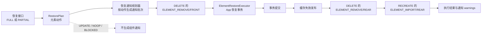
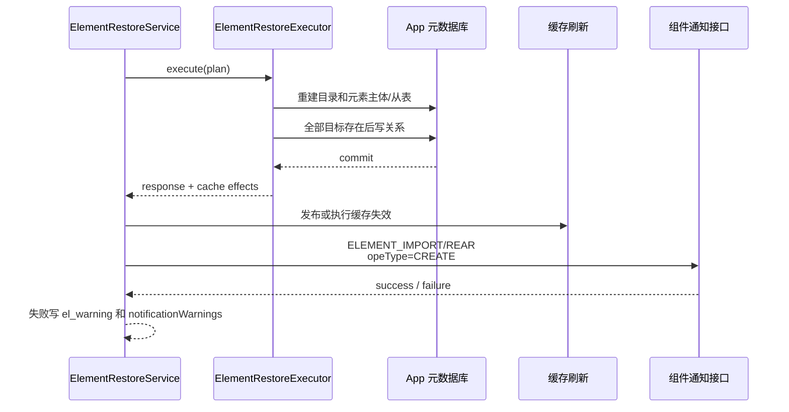
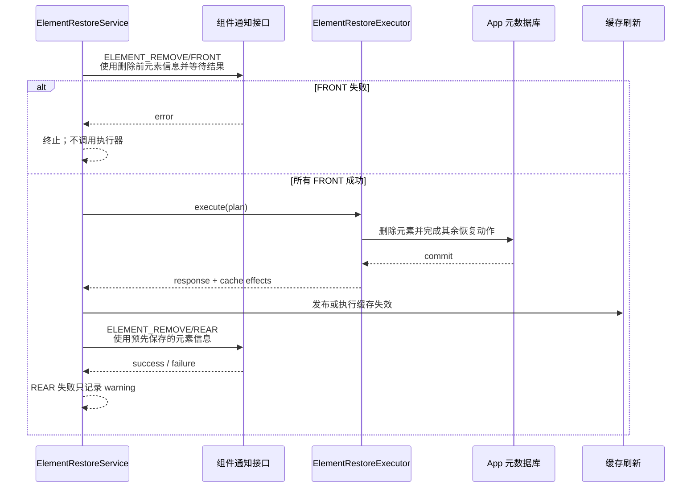

# 恢复重建与删除组件通知代码执行计划

> 状态：已确认
> 最后更新：2026-08-07
> 适用范围：`deepfos-platform` `system-server` 元素备份恢复；FULL 与 PARTIAL 恢复共用
> 关联文档：
> - [../README.md](../README.md)
> - [2026-08-07-全量恢复功能扩展.md](./2026-08-07-全量恢复功能扩展.md)
> - [2026-08-07-恢复预览按哈希差异加载优化.md](./2026-08-07-恢复预览按哈希差异加载优化.md)

## 1. 交付目标

为元素恢复增加由“最终恢复动作”驱动的组件通知，不根据 `restoreMode` 分叉：

1. 任意 FULL 或 PARTIAL 恢复中，只要元素动作是 `RECREATE`，就在恢复事务提交后调用 `ELEMENT_IMPORT/REAR`。
2. 任意恢复模式只要产生元素 `DELETE`，就在删除前调用 `ELEMENT_REMOVE/FRONT`，在恢复事务提交后调用 `ELEMENT_REMOVE/REAR`。
3. `UPDATE`、`NOOP`、`BLOCKED` 不调用 `ELEMENT_IMPORT` 或 `ELEMENT_REMOVE`。
4. 目录动作不调用元素组件通知。
5. FRONT 调用失败时不开始数据库恢复；REAR 调用失败时不回滚已经提交的恢复数据，而是返回 warning 并记录日志。
6. 缓存失效和组件通知都不能在可能回滚的 App 事务中提前发送成功信号。

核心规则如下：

| `objectType` | 恢复动作 | 事务前 | 事务提交后 |
| --- | --- | --- | --- |
| `ELEMENT` | `RECREATE` | 无 | `ELEMENT_IMPORT/REAR`，`opeType=CREATE` |
| `ELEMENT` | `DELETE` | `ELEMENT_REMOVE/FRONT` | `ELEMENT_REMOVE/REAR` |
| `ELEMENT` | `UPDATE` | 无 | 无 |
| `ELEMENT` | `NOOP` / `BLOCKED` | 无 | 无 |
| `FOLDER` | 任意动作 | 无 | 无 |

`UPDATE` 的当前内部实现虽然会删除元素元数据后重新插入，但这是实现细节，不代表业务语义上的删除或导入，禁止因此发送两类通知。

## 2. 依据与当前代码事实

### 2.1 恢复链路

| 已确认事实 | 代码定位 | 影响 |
| --- | --- | --- |
| PARTIAL 恢复已经可能产生 `RECREATE` | `system-server/.../service/impl/ElementRestoreServiceImpl.java`，`determineAction` | 通知不能只放在 FULL 分支 |
| 当前恢复执行器对 `UPDATE` / `RECREATE` 写入元素，但没有组件导入通知 | `system-server/.../service/ElementRestoreExecutor.java` | 需要在外层增加动作通知编排 |
| `ElementRestoreExecutor#execute` 使用 `appTransactionManager` | 同上，`execute` | 在方法内部末尾调用 REAR 仍发生在 commit 前 |
| 当前缓存 MQ 在事务方法返回前发送 | 同上，`producersFolderMessage.sendMessage` | 需要改为提交后发送或登记事务后副作用 |

### 2.2 元素导入通知

| 已确认事实 | 代码定位 | 影响 |
| --- | --- | --- |
| 平台元素导入和权限导入完成后，批次结束时才调用导入后置通知 | `app-server/.../ElementImportAsyncServiceImpl#importNotice`、`noticeForElementImport` | 恢复 RECREATE 也应等全部元素、权限和关系提交后再通知 |
| 导入后置通知按 `moduleId + elementType + ELEMENT_IMPORT + REAR` 匹配配置 | `SpModuleOperateNoticeConfigManage#noticeForElementImport` | 恢复通知复用同一配置和请求协议 |
| 导入后置请求包含 `space/app/elementName/elementType/folderId/businessData/opeType` | `SpModuleOperateNoticeConfigManage#sendNoticeForElementImport` | RECREATE 使用恢复后的目录和 `opeType=CREATE` |
| 当前导入通知实际固定同步 HTTP 调用；失败设置元素 `el_warning=1` 并抛出 | 同上 | 恢复提交后捕获失败，保留 warning，不能回滚 |
| `/element-info/import/callback` 是组件业务数据导入完成后反向回调平台，依赖 `opeId` 和导入明细记录 | `ElementInfoController#importCallBack`、`ElementOpeServiceImpl#importCallBack` | 恢复不得调用该接口，也不得伪造导入作业 |

### 2.3 元素删除通知

| 已确认事实 | 代码定位 | 影响 |
| --- | --- | --- |
| 标准删除先执行 `ELEMENT_REMOVE/FRONT`，再调用事务删除，最后执行 `ELEMENT_REMOVE/REAR` | `ElementInfoServiceImpl#removeElementInstance` | 恢复 DELETE 保持相同前后置语义 |
| 真正的元素删除在 `RemoveTransactionalServiceImpl#removeElementInstance` 的 App 事务中 | `RemoveTransactionalServiceImpl` | 恢复 REAR 必须等整个恢复事务提交后发送 |
| 删除通知按 `moduleId + elementType + ELEMENT_REMOVE + FRONT/REAR` 匹配配置 | `SpModuleOperateNoticeConfigManage#noticeForElementRemove` | 执行前一次加载配置，按元素匹配 |
| 删除通知请求包含 `space/app/elementName/elementType/folderId/isDeleteData` | `SpModuleOperateNoticeConfigManage#sendNoticeForElementRemove` | DELETE 必须在删除前保存当前元素身份和业务数据标记 |
| 通用通知的同步配置会传播异常；异步配置只提交异步任务并记录失败 | `SpModuleOperateNoticeConfigManage#sendNoticeRequest`、`ModuleInvokClientImpl` | FRONT 若继续异步则无法保证先通知后删除 |
| 当前通知没有重试或持久化 outbox | `ModuleInvokClientImpl#sendNoticeRequestBySync`、`sendNoticeRequestByAsync` | 本计划只能保证进程内顺序，不承诺进程崩溃后的最终送达 |

## 3. 范围与非目标

### 3.1 本次包含

- FULL、PARTIAL 共用的恢复动作通知规划。
- `RECREATE -> ELEMENT_IMPORT/REAR`。
- `DELETE -> ELEMENT_REMOVE/FRONT + REAR`。
- FRONT 与 App 恢复事务、REAR 与 commit 的严格调用顺序。
- 通知配置批量加载、目标去重、失败 warning 和汇总日志。
- 将当前恢复缓存 MQ 移到事务提交后。
- 单元测试、事务集成测试和 FULL/PARTIAL 回归。

### 3.2 明确不包含

- 不为 `UPDATE` 发送 `ELEMENT_IMPORT`，也不发送 `ELEMENT_REMOVE`。
- 不调用 `/element-info/import/callback`，不创建导入主记录、明细记录或假 `opeId`。
- 不导入或删除组件业务数据；业务数据恢复边界由原恢复方案决定。
- 不为目录动作设计组件通知。
- 不新增通知重试任务、通知 outbox 或 exactly-once 协议。
- 不修改组件现有通知 URL 和请求字段含义。
- 不因为通知改造改变 `NOOP`、`UPDATE`、`RECREATE`、`DELETE` 的判定规则。

## 4. 组件边界

通知编排放在恢复服务外层，事务执行器只负责 App 数据写入和返回待执行副作用。



建议新增两个内部对象：

```text
RestoreNotificationBatch
├── removeFrontNotices
├── removeRearNotices
└── importRearNotices

RestoreElementNotice
├── action
├── elementId
├── moduleId
├── elementName
├── elementType
├── folderId
├── fullPath
├── businessDataFlag
└── stableKey
```

- `DELETE` 通知信息来自执行前的当前元素，不能等删除后再查表。
- `RECREATE` 通知信息来自快照 payload 和执行后的目标目录映射。
- `stableKey` 使用 `action + elementId`，保证同一计划内每个动作只通知一次。
- 通知批次只由 `objectType` 和 `action` 决定，不读取 `restoreMode`。

## 5. RECREATE 通知顺序

PARTIAL 和 FULL 中的 RECREATE 使用完全相同的顺序。



约束：

1. 必须在元素主体、内容、权限和关系全部写完后通知。
2. 必须在 `ElementRestoreExecutor#execute` 事务代理完成 commit 后通知，不能写在该方法结尾。
3. 只通知实际执行成功的 `RECREATE`；事务回滚时一个也不通知。
4. 使用 `NoticeEnum.ELEMENT_IMPORT + NoticeEnum.REAR`。
5. `opeType` 固定为 `ElementImportNoticeEnum.CREATE`。
6. `businessData` 为空；恢复不模拟业务数据文件导入。
7. 不调用组件回平台的 `/element-info/import/callback`。

## 6. DELETE 通知顺序

当前只有整个 App 全量恢复计划产生范围外 `DELETE`，但实现不绑定 FULL；未来其他恢复模式产生 DELETE 时自动复用。



约束：

1. 所有 DELETE 的 FRONT 在任何 App 表写入前执行。
2. FRONT 必须等待组件调用完成；即使原配置为 ASYNC，恢复专用入口也要使用同步 transport，才能保证“先通知、后删除”。
3. 任一同步 FRONT 失败时，不调用 `ElementRestoreExecutor`，因此没有部分数据库写入。
4. DELETE 元素信息在 FRONT 前保存到 `RestoreElementNotice`，供提交后的 REAR 使用。
5. REAR 只为数据库事务实际提交成功的 DELETE 发送。
6. REAR 失败不能把已提交恢复改成整体失败，也不能自动重跑整个恢复。

多个 DELETE 的 FRONT 不是分布式事务：前面组件已成功收到 FRONT、后面的 FRONT 失败时，数据库不会执行，但前面通知无法撤回。现有通知协议没有 prepare/rollback 回调，因此 FRONT 必须被定义为无不可逆副作用的校验/准备通知。

## 7. 混合计划的统一顺序

一个恢复计划同时包含 DELETE、UPDATE 和 RECREATE 时，固定顺序为：

```text
1. 锁内重算 RestorePlan 并校验 planDigest
2. 从计划生成 RestoreNotificationBatch
3. 一次加载 ELEMENT_REMOVE 和 ELEMENT_IMPORT 通知配置
4. 逐个同步执行 DELETE 的 ELEMENT_REMOVE/FRONT
5. 开启并执行一个 App 恢复事务
   5.1 DELETE 元素
   5.2 目录删除/恢复
   5.3 UPDATE/RECREATE 元素主体和从表
   5.4 统一恢复关系
6. 提交事务
7. 发布元素与目录缓存失效
8. 执行 DELETE 的 ELEMENT_REMOVE/REAR
9. 执行 RECREATE 的 ELEMENT_IMPORT/REAR(CREATE)
10. 写一条恢复汇总日志并返回 notificationWarnings
```

`UPDATE` 只参与第 5、7 步，不进入第 4、8、9 步。

## 8. 通知配置与请求组装

### 8.1 配置加载

每个恢复请求最多加载两次组件通知配置：

- 存在 `DELETE` 时调用一次 `getOperateNoticeConfigByOperate(ELEMENT_REMOVE)`。
- 存在 `RECREATE` 时调用一次 `getOperateNoticeConfigByOperate(ELEMENT_IMPORT)`。

不能为每个元素单独查询 system-server 通知配置。

### 8.2 RECREATE 请求

复用 `SpModuleOperateNoticeConfigManage#noticeForElementImport` 的协议：

| 字段 | 来源 |
| --- | --- |
| `space` / `app` | 当前 `RequestContext` 和快照归属校验结果 |
| `moduleId` | 快照元素 payload |
| `elementName` / `elementType` | 快照元素身份 |
| `path` | 恢复后的完整目录路径 |
| `folderId` | 恢复后的目标目录 ID；由现有方法按 path 解析或直接使用最终映射 |
| `businessData` | `null` |
| `opeType` | `CREATE` |

### 8.3 DELETE 请求

复用 `SpModuleOperateNoticeConfigManage#noticeForElementRemove` 的协议：

| 字段 | 来源 |
| --- | --- |
| `space` / `app` | 当前上下文 |
| `moduleId` | 删除前当前元素 |
| `elementName` / `elementType` | 删除前当前元素 |
| `folderId` | 删除前当前元素目录 ID |
| `isDeleteData` | 删除前 `businessDataFlag` |

全量恢复方案当前会阻断快照外 `businessDataFlag=true` 元素的自动删除，因此可执行 DELETE 的 `isDeleteData` 预期为 `false`；仍传真实值，不在通知层写死。

## 9. 事务与失败语义

### 9.1 事务边界

建议在 `ElementRestoreServiceImpl#restore` 的锁内采用以下调用关系：

```text
notificationService.beforeExecute(plan)
restoreExecutor.execute(...)     // @Transactional，返回时已 commit
cacheEffectDispatcher.dispatch(...)
notificationService.afterCommit(plan, response)
```

不能在 `ElementRestoreExecutor#execute` 内部直接发 REAR；Spring 事务要到代理方法正常返回后才提交。

### 9.2 失败处理

| 失败位置 | 数据库状态 | 接口结果 |
| --- | --- | --- |
| REMOVE/FRONT 同步失败 | 未开始恢复事务 | 整体失败，可重新预览/执行 |
| 恢复事务失败 | 全部回滚 | 整体失败；不发 REMOVE/REAR 和 IMPORT/REAR |
| 缓存失效发布失败 | 数据已提交 | 恢复成功并返回 warning；记录告警 |
| REMOVE/REAR 同步失败 | 数据已提交 | 恢复成功并返回 notification warning |
| IMPORT/REAR 失败 | 数据已提交 | 恢复成功、元素 `el_warning=1`、返回 notification warning |
| 异步 REAR 实际发送失败 | 数据已提交 | 由现有异步客户端记录错误；当前响应无法感知 |

`RestoreExecuteResponse` 增加：

- `notificationFailedCount`
- `notificationWarnings`

数据已提交后的通知失败不能返回普通“恢复失败”，避免调用方重复执行 DELETE/RECREATE。统一保持 `status=SUCCESS`，通过 `notificationFailedCount` 和 `notificationWarnings` 表达通知异常。

### 9.3 送达保证

本次保证：

- 正常进程内 FRONT 发起完成后才进入事务。
- 正常进程内事务 commit 后才发起 REAR。
- 同一恢复计划内每个元素/动作最多调用一次。

本次不保证：

- 进程在 commit 后、REAR 前崩溃时仍能最终送达。
- 调用方重试整个恢复请求时组件绝不收到重复 FRONT。
- 异步通知一定送达。

若后续需要最终送达和可重试，必须单独引入持久化 outbox 和幂等通知键，不能靠内存列表补足。

## 10. 实施步骤

### 1. 增加恢复通知计划模型

- 修改位置：
  - `system-server/src/main/java/com/proinnova/system/elementbackup/service/RestorePlan.java`
  - 新增 `system-server/src/main/java/com/proinnova/system/elementbackup/service/RestoreNotificationBatch.java`
  - 新增 `system-server/src/main/java/com/proinnova/system/elementbackup/service/RestoreElementNotice.java`
- 具体改动：从元素计划项提取通知所需的稳定身份；DELETE 保存当前元素信息，RECREATE 保存快照身份和目标路径；按 `action + elementId` 去重。
- 依赖关系：无。
- 验证方式：同一元素重复进入输入时只生成一个通知；目录和 UPDATE 不生成通知。

### 2. 实现与模式无关的通知规划器

- 修改位置：
  - 新增 `system-server/src/main/java/com/proinnova/system/elementbackup/service/RestoreElementNotificationService.java`
  - `system-server/src/main/java/com/proinnova/system/elementbackup/service/impl/ElementRestoreServiceImpl.java`
- 具体改动：只根据 `objectType + RestoreAction` 生成 FRONT/REAR 批次；禁止读取 `restoreMode` 决定是否通知；有 DELETE/RECREATE 时分别批量加载 REMOVE/IMPORT 配置。
- 依赖关系：步骤 1。
- 验证方式：相同动作集合在 FULL 与 PARTIAL 模式下生成完全相同的通知批次。

### 3. 在事务前执行 DELETE 的 REMOVE/FRONT

- 修改位置：
  - `ElementRestoreServiceImpl#restore`
  - `app-server/src/main/java/com/proinnova/app/manage/SpModuleOperateNoticeConfigManage.java`
  - `app-server/src/main/java/com/proinnova/app/client/IModuleInvokClient.java`
- 具体改动：为恢复增加一个等待完成的 REMOVE 通知入口，复用现有 URL 解析和请求字段，但强制使用同步 transport；所有 FRONT 成功后才调用执行器。
- 依赖关系：步骤 2。
- 验证方式：任一 FRONT 抛错时 `restoreExecutor.execute` 调用次数为 0；ASYNC 配置下测试仍先等待 FRONT 完成。

### 4. 将恢复事务结果与事务后副作用分离

- 修改位置：
  - `system-server/src/main/java/com/proinnova/system/elementbackup/service/ElementRestoreExecutor.java`
  - 新增或扩展内部 `RestoreExecutionResult` / `RestoreSideEffects`
  - `ProducersFolderMessage` 当前调用点
- 具体改动：执行器事务内只写 App 表并收集缓存失效 DTO；事务方法返回后由外层发布缓存消息，确保回滚时没有成功缓存消息和 REAR。
- 依赖关系：步骤 2。
- 验证方式：事务同步测试证明 commit 前没有缓存 MQ；rollback 时缓存消息和 REAR 都为 0。

### 5. 在提交后执行 DELETE/RECREATE 的 REAR

- 修改位置：
  - `ElementRestoreServiceImpl#restore`
  - `RestoreElementNotificationService`
  - 复用 `SpModuleOperateNoticeConfigManage#noticeForElementRemove`
  - 复用 `SpModuleOperateNoticeConfigManage#noticeForElementImport`
- 具体改动：缓存失效发布后，先发送 DELETE 的 `ELEMENT_REMOVE/REAR`，再发送 RECREATE 的 `ELEMENT_IMPORT/REAR`；RECREATE 传 `opeType=CREATE` 和空 businessData；UPDATE 不进入两个列表；不调用 `/import/callback`。
- 依赖关系：步骤 3–4。
- 验证方式：Mockito `InOrder` 和真实事务测试共同证明 `commit -> cache dispatch -> REMOVE/REAR -> IMPORT/REAR`。

### 6. 增加执行响应和可观测性

- 修改位置：
  - `system-server/src/main/java/com/proinnova/system/elementbackup/dto/RestoreExecuteResponse.java`
  - `ElementRestoreServiceImpl#restore`
- 具体改动：增加通知失败计数和 warning；日志记录 restoreMode、snapshotId、planDigest 前缀、removeFront/removeRear/importRear 数量和失败数量，不记录完整 payload。
- 依赖关系：步骤 5。
- 验证方式：REAR 同步失败时数据保持已提交、响应为成功带 warning，不触发执行器重试。

### 7. 补齐自动化测试和回归

- 修改位置：
  - `system-server/src/test/java/com/proinnova/system/elementbackup/service/impl/ElementRestoreServiceImplTest.java`
  - `system-server/src/test/java/com/proinnova/system/elementbackup/service/ElementRestoreExecutorTest.java`
  - 新增 `RestoreElementNotificationServiceTest.java`
  - 必要的 app-server 通知管理测试
- 具体改动：覆盖第 11 节矩阵及 FULL/PARTIAL 回归。
- 依赖关系：步骤 1–6。
- 验证方式：测试通过，且 1200 个 NOOP/UPDATE 不产生任何组件通知调用。

## 11. 测试计划

### 11.1 动作矩阵

- [ ] PARTIAL + ELEMENT RECREATE：只发一次 `ELEMENT_IMPORT/REAR(CREATE)`。
- [ ] FULL + ELEMENT RECREATE：与 PARTIAL 使用同一服务和请求字段。
- [ ] 任意模式 + ELEMENT DELETE：事务前发 REMOVE/FRONT，提交后发 REMOVE/REAR。
- [ ] ELEMENT UPDATE：即使内部删除重插元数据，也不发 IMPORT/REMOVE。
- [ ] ELEMENT NOOP/BLOCKED：不发通知。
- [ ] FOLDER RECREATE/DELETE：不发元素通知。
- [ ] 混合 2 DELETE + 3 RECREATE + 100 UPDATE：通知数分别为 2 组 REMOVE 和 3 个 IMPORT，不受 UPDATE 数影响。

### 11.2 顺序和事务

- [ ] FRONT 成功后才调用 `ElementRestoreExecutor#execute`。
- [ ] 第二个 DELETE 的 FRONT 失败时，执行器未调用，App 表无写入。
- [ ] 恢复事务回滚时不发 REMOVE/REAR、IMPORT/REAR 和成功缓存消息。
- [ ] RECREATE 的关系、权限和目录均可查询后才调用 IMPORT/REAR。
- [ ] commit 后先发布缓存失效，再调用 REMOVE/REAR 和 IMPORT/REAR。
- [ ] REAR 同步失败不回滚数据，响应包含对应 elementId 和通知类型 warning。

### 11.3 协议与回归

- [ ] RECREATE 请求 `opeType=CREATE`、`businessData=null`、folderId 为恢复后目录。
- [ ] DELETE FRONT/REAR 使用删除前的 elementName/type/folderId/businessDataFlag。
- [ ] 恢复链路从不调用 `/element-info/import/callback`，也不写元素导入主/明细记录。
- [ ] 通知配置每类操作每请求最多查询一次。
- [ ] 没有匹配通知配置时正常恢复，不计为通知失败。
- [ ] PARTIAL UPDATE/NOOP 的现有耗时和调用次数不因通知能力增加而明显变化。
- [ ] FULL 全量恢复既有动作、digest 和事务测试继续通过。

## 12. 发布、回滚与观测

### 12.1 发布

- 无数据库 DDL 和快照数据迁移。
- 后端和组件通知配置不需要同时升级；没有配置的元素直接跳过通知。
- 联调至少准备一个有 `ELEMENT_IMPORT/REAR` 配置的组件和一个有 `ELEMENT_REMOVE/FRONT+REAR` 配置的组件。
- 上线前确认 REMOVE/FRONT 组件实现没有不可逆删除副作用，实际删除应发生在平台删除流程或 REAR 之后。

### 12.2 回滚

- 回滚本改造只会恢复到“不发送恢复动作通知”的旧行为，不改变已提交快照或 App 数据。
- 若恢复数据已经提交但 REAR 失败，代码回滚不能补发通知，需要根据汇总日志人工处理。
- 不允许通过重新执行整个恢复来单纯补通知；第二次计划动作可能已变为 NOOP，并且重复 DELETE FRONT 有副作用风险。

### 12.3 指标和日志

至少记录：

```text
restoreMode/snapshotId/planDigestPrefix
removeFrontCount/removeFrontFailed
removeRearCount/removeRearFailed
importRearCount/importRearFailed
notificationConfigLoadMs/frontNoticeMs/rearNoticeMs
```

不记录完整请求 payload、业务数据内容或完整 hash。

## 13. 风险与应对

| 风险 | 影响 | 应对 |
| --- | --- | --- |
| 把 UPDATE 当作导入 | 恢复变重并触发组件重复初始化 | 动作矩阵明确只有 RECREATE 发 IMPORT，单元测试锁定 |
| 在事务内发送 REAR | 组件可能读取到未提交数据，回滚后收到假成功通知 | 由外层服务在事务方法返回后统一发送 |
| REMOVE/FRONT 配置为异步 | 组件尚未收到通知时元素已被删除 | 恢复专用 FRONT 强制等待同步调用完成 |
| 多个 FRONT 中途失败 | 已成功 FRONT 无法撤回但数据库未执行 | 明确 FRONT 只能做校验/准备，不做不可逆删除 |
| REAR 失败后返回整体失败 | 调用方重试会重复破坏性动作 | 数据成功与通知 warning 分离，禁止自动重跑恢复 |
| commit 后进程崩溃 | REAR 可能漏发 | 当前明确为已知限制；若要求最终送达另建 outbox |
| 缓存 MQ 已发布但尚未消费 | 组件回调后立即查询可能短暂读到旧缓存 | 保证先发布缓存失效；若组件要求强一致，再增加同步缓存清理能力 |
| 通知逐元素同步执行 | 大量 RECREATE/DELETE 增加执行时间 | 只对两种动作通知、配置批量读取；先观测数量和耗时，不并行打爆组件 |

## 14. 完成标准（Definition of Done）

- [ ] 通知规划完全由 `objectType + RestoreAction` 决定，不依赖 FULL/PARTIAL。
- [ ] PARTIAL 和 FULL 的 ELEMENT RECREATE 都在 commit 后发送一次 `ELEMENT_IMPORT/REAR(CREATE)`。
- [ ] 任意模式的 ELEMENT DELETE 都在事务前发送 `ELEMENT_REMOVE/FRONT`，commit 后发送 `ELEMENT_REMOVE/REAR`。
- [ ] UPDATE、NOOP、BLOCKED 和所有目录动作不发送两类元素通知。
- [ ] 恢复没有调用 `/element-info/import/callback`，没有创建假导入记录或 `opeId`。
- [ ] REMOVE/FRONT 失败时执行器未调用，App 表无写入。
- [ ] 恢复事务失败或回滚时没有 REAR 和成功缓存消息。
- [ ] REAR 失败不回滚数据，接口返回可定位的 notification warning。
- [ ] 缓存失效发布发生在 commit 后、REAR 发起前。
- [ ] 每类通知配置每个恢复请求最多查询一次，每个元素/动作最多通知一次。
- [ ] FULL/PARTIAL 恢复回归测试和通知顺序测试全部通过。
- [ ] README 已加入本计划索引，接口响应字段和运维日志说明已同步。
