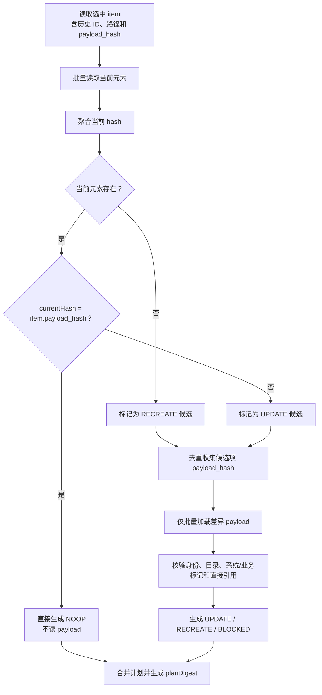
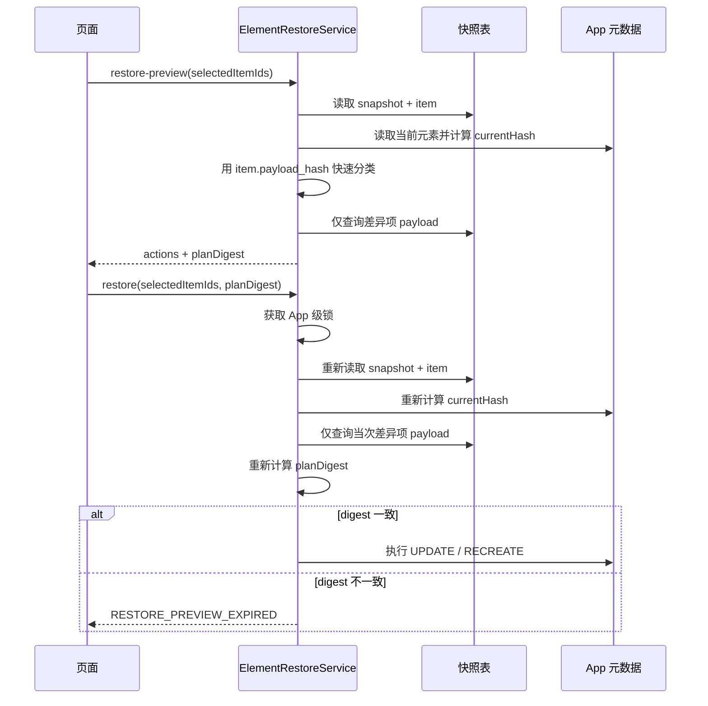

# 恢复预览按哈希差异加载优化代码执行计划

> 状态：已确认
> 最后更新：2026-08-07
> 适用范围：`deepfos-platform` `system-server` 元素备份恢复开发阶段
> 关联文档：
> - [../README.md](../README.md)
> - `deepfos-platform/ai-docs/plan/element-backup-mvp-validation-plan.md`
> - `deepfos-platform/ai-docs/plan/element-partial-restore-rules.md`

## 1. 交付目标

将恢复预览和恢复执行的计划生成改为“先比较 hash，后按差异加载 payload”：

1. `app_element_snapshot_item.payload_hash` 作为快照元素的唯一目标 hash，不再为比对解压 payload 并重新计算快照 hash。
2. 当前元素存在且 `currentHash == item.payloadHash` 时直接返回 `NOOP`，不查该元素的 `app_element_snapshot_payload`。
3. 仅当 hash 不同或当前元素不存在时，才批量加载对应 payload，继续判定 `UPDATE` / `RECREATE` / `BLOCKED`。
4. 仅为需要读取 payload 的差异项解析直接引用、预加载目标目录和元素。
5. 保持现有五个对外接口、响应字段、`planDigest` 和恢复事务语义不变。

## 2. 依据与现状

### 2.1 已确认事实

| 事实 | 定位 |
| --- | --- |
| `app_element_snapshot_item.payload_hash` 保存规范化快照 JSON 的 SHA-256，同时是 payload 表的查找键 | `system-server/src/main/java/com/proinnova/system/elementbackup/po/AppElementSnapshotItem.java` |
| 当前实现在比对前收集所有选中 item 的 hash，然后一次加载所有 payload | `ElementRestoreServiceImpl#doBuildRestorePlan`，现有 152–158 行附近 |
| 当前实现对每个已解压 payload 再执行 `SnapshotPayloadCodec.contentHash(payload)` | `ElementRestoreServiceImpl#determineAction`，现有 314–316 行附近 |
| 当前先对所有选中元素执行关系预加载，即使元素最终为 `NOOP` | `ElementRestoreServiceImpl#preloadRelationLookups` |
| 恢复执行器对 `NOOP` 元素直接 `continue`，只有 `UPDATE` / `RECREATE` 真正使用 `RestorePlanItem.payload` | `ElementRestoreExecutor#execute` |
| 现有公开动作只有 `NOOP` / `UPDATE` / `RECREATE` / `BLOCKED` | `RestoreAction` |

### 2.2 本次性能基线

2026-08-07 开发环境日志中，一次 1218 个元素的 `restore-preview` 耗时 2834ms：

| 阶段 | 约耗时 | 说明 |
| --- | ---: | --- |
| 聚合当前元素状态 | 1830ms | 包括 content/blob/权限/关系读取和当前 hash 计算 |
| 查询快照 payload | 260ms | `selectByHashes` 返回 1218 条压缩载荷 |
| 解压、反序列化快照 payload | 约 200ms | 所有选中项都执行 |
| 关系目录/元素预加载 | 约 230ms | 包含对当前元素的重复路径查询 |

本计划直接消除 `NOOP` 项的后三项开销。当前 hash 聚合仍然需要，因为 item 表保存的是历史快照 hash，不是 App 实时状态 hash。

### 2.3 动作语义

| 快照 item | 当前 App | 快速判定 | 最终动作 | 是否需要 payload |
| --- | --- | --- | --- | --- |
| 存在 | 同 ID 存在，hash 相同 | 无差异 | `NOOP` | 否 |
| 存在 | 同 ID 存在，hash 不同 | 已修改 | `UPDATE` 或 `BLOCKED` | 是 |
| 存在 | 同 ID 不存在 | 当前已删除 | `RECREATE` 或 `BLOCKED` | 是 |
| 本次未选中 | 当前存在 | 范围外 | 不处理 | 否 |

`RECREATE` 表示“快照中有、当前已删除，恢复时重建”。本次不新增 `DELETE` 动作；选中元素恢复不会删除快照外的当前元素。

## 3. 设计决策

### 3.1 直接采信 item hash

开发阶段只保留一套 hash 语义：

- `item.payload_hash` 就是恢复预览的快照比较 hash。
- 移除预览中“解压 payload 后重新计算快照 hash”的兼容逻辑。
- 现有开发快照数据清理后重新生成，不提供旧快照兼容。

### 3.2 两阶段生成恢复计划

优化后先使用 item 和当前 hash 建立候选动作，再为差异项读取完整恢复载荷。



### 3.3 payload 可空的内部约束

`RestorePlanItem.payload` 改为以下明确不变式：

```text
action == NOOP                    -> payload 允许为 null
action == UPDATE | RECREATE       -> payload 必须非 null
action == BLOCKED                 -> payload 可保留已加载值
```

`ElementRestoreExecutor` 已在访问 payload 前跳过 `NOOP`，但需要增加单元测试锁定该不变式，并在执行 `UPDATE` / `RECREATE` 前做防御性校验。

### 3.4 预览和执行复用同一规划算法



这样不保存临时计划，也不降低执行前并发校验强度。

## 4. 范围

### 4.1 本次包含

- 调整 `ElementRestoreServiceImpl` 的计划生成顺序。
- 直接使用 `AppElementSnapshotItem.payloadHash` 判断快照 hash。
- 只查询差异项的 payload，并按 hash 去重。
- 只预加载差异项的目录和直接引用目标。
- 利用已读取的 `currentByIdMap` 填充请求级元素路径缓存，避免重复查询选中元素。
- 补充单元测试、批量性能验证和阶段耗时观测。

### 4.2 本次不包含

- 不兼容旧 hash 算法或旧开发快照。
- 不修改三张快照表的 DDL。
- 不修改恢复预览的请求和响应结构。
- 不新增 `DELETE` 动作，不实现整个 App 精确回滚。
- 不在本次引入“当前元素 hash 物化表”。
- 不并行执行多个 Mapper 查询。

## 5. 前置条件与依赖

1. 开发环境允许删除现有元素备份快照，并用当前 `SnapshotPayloadCodec` 规则重新生成测试快照。
2. `app_element_snapshot_item.payload_hash` 与创建快照时 `AggregatedPayload.payloadHash` 保持直接一致。
3. 性能验证时关闭 MyBatis Mapper DEBUG 日志，避免本次 1218 个参数产生约 706KiB 日志干扰。
4. 本次不改变当前 hash 聚合的完整性；`element_info/content/blob/ope_tag/name_des/permission/relation` 仍按现有规则纳入 currentHash。

## 6. 实施步骤

### 1. 提取 item hash 快速分类

- 修改位置：`deepfos-platform/system-server/src/main/java/com/proinnova/system/elementbackup/service/impl/ElementRestoreServiceImpl.java`，`doBuildRestorePlan`、`determineAction`
- 具体改动：
  - 先建立每个 selected item 的 `RestorePlanItem`，`snapshotHash` 直接设为 `hashPrefix(item.getPayloadHash())`。
  - 批量聚合当前存在元素后，直接比较 `currentAggregate.getPayloadHash()` 和 `item.getPayloadHash()`。
  - hash 相同时设置 `NOOP`，`targetFolderId` 使用当前元素的 `folderId`，并立即放入 plan。
  - hash 相同时不再从 payload 读取 `systemTag` / `businessDataFlag`；使用已加载的 `currentById` 保留现有阻断和 warning 语义。hash 相同保证这些参与 hash 的字段与快照相同。
  - hash 不同或当前元素不存在时，加入 `payloadRequiredItems`。
  - 从 `determineAction` 移除 `SnapshotPayloadCodec.contentHash(payload)`，后续统一使用 item hash。
- 依赖关系：无
- 验证方式：
  - hash 相同的单元测试中，断言 action 为 `NOOP`。
  - 使用 Mockito 断言 `persistService.getPayloads(...)` 从未被调用。
  - 断言 `snapshotHash/currentHash/targetFolderId/planDigest` 仍为非空且稳定值。

### 2. 仅批量加载差异 payload

- 修改位置：
  - `ElementRestoreServiceImpl#doBuildRestorePlan`
  - `ElementRestoreServiceImpl#loadPayloads`
  - `ElementSnapshotPersistService#getPayloads`（保持方法契约，无需改 Mapper SQL）
- 具体改动：
  - 从 `payloadRequiredItems` 收集非空 `payloadHash`，使用 `LinkedHashSet` 去重后一次调用 `getPayloads`。
  - 不再从全部 `selectedItems` 收集 payload hash。
  - `payloadRequiredItems` 为空时，不调用 payload Mapper，不创建解压对象。
  - 对差异项保留现有“必需 payload 不存在则整个计划失败”语义。
  - 多个 item 共用相同 hash 时只加载、解压、反序列化一次。
- 依赖关系：步骤 1
- 验证方式：
  - 100 个选中项中 3 个 hash 不同，断言 `getPayloads` 仅收到 3 个差异 hash。
  - 100 个项全部 `NOOP`，断言 payload 查询次数为 0。
  - 当前元素不存在时，断言加载该 item payload 并生成 `RECREATE`。

### 3. 缩小关系预加载范围

- 修改位置：
  - `ElementRestoreServiceImpl#preloadRelationLookups`
  - `ElementSnapshotAggregateService` 请求级 `LookupCache`
- 具体改动：
  - `preloadRelationLookups` 参数从全部 `selectedItems` 改为 `payloadRequiredItems`。
  - 只解析差异 payload 中的 `relations`，只预加载其直接引用目标。
  - 对当前同 ID 已存在的差异项，不再把元素自身加入“同路径元素”查询；该查询只对 `RECREATE` 候选用于检查同路径不同 ID 冲突。
  - 在 `LookupCache` 增加一个可组装方法，将 `currentByIdMap.values()` 按 `(elementName, elementType, folderId)` 预先放入 `elementsByKey`。
  - 关系目标本身就在已加载当前元素中时，直接命中缓存。
- 依赖关系：步骤 2
- 验证方式：
  - 全部 `NOOP` 时，断言不产生关系预加载调用；`buildFolderPathMapping` 本身必需的目录查询不应误计为关系预加载。
  - `UPDATE` 候选不查询自身路径冲突；`RECREATE` 候选仍检查同路径不同 ID。
  - 直接引用缺失和歧义的警告/阻断行为与优化前一致。

### 4. 锁定恢复执行的 payload 不变式

- 修改位置：
  - `deepfos-platform/system-server/src/main/java/com/proinnova/system/elementbackup/service/RestorePlan.java`
  - `deepfos-platform/system-server/src/main/java/com/proinnova/system/elementbackup/service/ElementRestoreExecutor.java`
  - `deepfos-platform/system-server/src/test/java/com/proinnova/system/elementbackup/service/ElementRestoreExecutorTest.java`（若尚无则新建）
- 具体改动：
  - 在 `RestorePlanItem.payload` 字段注释中写明“`NOOP` 可空，可执行写动作必须非空”。
  - 保持执行器先跳过 `NOOP`，然后再访问 payload。
  - 对 `UPDATE` / `RECREATE` 的 payload 为空情况抛出明确的快照载荷缺失异常，不允许以 NPE 失败。
- 依赖关系：步骤 1–2
- 验证方式：
  - 含 `payload=null` 的 `NOOP` 计划可成功执行，`skipped` 计数正确。
  - `UPDATE` / `RECREATE` 的 payload 为空时整个 App 事务不产生任何写入。

### 5. 增加阶段耗时和加载数量观测

- 修改位置：`ElementRestoreServiceImpl#buildRestorePlan`
- 具体改动：
  - 记录或上报以下低基数指标：`selectedCount`、`currentCount`、`noopCount`、`payloadRequiredCount`、`distinctPayloadHashCount`。
  - 分阶段记录：item 读取、current 聚合、payload 读取与解析、关系预加载、计划组装。
  - 不记录 selected ID 列表、完整 hash 列表或 payload 内容。
  - INFO 级别只输出一条汇总；不为每个元素输出日志。
- 依赖关系：步骤 1–3
- 验证方式：
  - 1218 个元素时仅有一条计划阶段汇总日志。
  - 日志能直接看出“选中 1218、NOOP N、读取 payload M”。

### 6. 清理旧开发快照并重建基准

- 修改位置：开发环境 `system` 库的元素快照测试数据
- 具体改动：
  - 在执行前确认清理范围仅为开发环境三张元素快照表。
  - 按 `snapshot -> item -> payload` 引用关系处理开发数据，然后使用当前代码重新创建联调快照。
  - 清理操作必须由开发或 DBA 确认目标数据库和范围后执行，不把清库 SQL 写入应用启动逻辑。
- 依赖关系：代码改造部署前后均可，但新性能基准必须使用重建后快照
- 验证方式：
  - 新快照的 `item.payload_hash` 与对应 payload 主键一致。
  - 备份树、预览、恢复闭环可重复执行。

## 7. 代码结构建议

`doBuildRestorePlan` 不应继续增加单个超长循环。建议保持以下最小拆分：

```text
doBuildRestorePlan
├── loadAndValidateSelectedItems
├── buildFolderPathMapping
├── loadCurrentAggregates
├── classifyByItemHash
│   ├── NOOP -> 直接生成 plan item
│   └── DIFF/MISSING -> payloadRequiredItems
├── loadPayloadsForRequiredItems
├── preloadRelationLookupsForRequiredItems
├── finalizeChangedPlanItems
└── buildPlanDigest
```

可使用一个私有请求级上下文承载 `item/current/currentAggregate/planItem/payloadRequired`，但不新增公开 DTO 或通用框架。

## 8. 测试计划

### 8.1 单元测试

在 `ElementRestoreServiceImplTest` 至少覆盖：

- [ ] 当前元素存在且 item hash 相同：`NOOP`，不调用 `getPayloads`。
- [ ] item hash 相同且当前元素 `businessDataFlag=true`：不读 payload，但仍返回现有业务数据 warning。
- [ ] 当前元素存在且 item hash 不同：只加载该 hash，结果为 `UPDATE`。
- [ ] 当前元素不存在：加载该 hash，结果为 `RECREATE`。
- [ ] 同路径不同 ID：差异项有 payload 且结果为 `BLOCKED`。
- [ ] 混合 2 个 `NOOP` + 1 个 `UPDATE` + 1 个 `RECREATE`：只查询后两者的 distinct hash。
- [ ] 多个差异 item 共用同一 hash：只解压一次。
- [ ] 差异项 payload 缺失：返回明确错误，不生成可执行计划。
- [ ] `NOOP` 的 payload 为空：预览响应序列化正常，恢复执行器正确跳过。
- [ ] 差异项的引用缺失/歧义：warnings、blockReason 和 executable 与现有规则一致。
- [ ] 预览后当前 hash 变化：执行时重算 digest 不一致，返回 `RESTORE_PREVIEW_EXPIRED`。

### 8.2 集成与性能验证

使用同一个重建后快照连续执行预热 3 次 + 正式 10 次，记录中位数和 P95。

| 场景 | 数据 | 必须验证 |
| --- | --- | --- |
| 全部无差异 | 1200 个 `NOOP` | payload SQL 次数 = 0；解压次数 = 0；关系预加载不扫描 payload |
| 少量差异 | 1200 中修改 12 个、删除 3 个 | payload 返回行数 <= 15 个 distinct hash；动作分类正确 |
| 全部差异 | 1200 个 hash 全部不同 | 功能与优化前一致；耗时不得相比基线退化超过 10% |
| 执行前变化 | 预览后再修改一个元素 | 旧 digest 失效，不产生部分恢复 |

### 8.3 性能目标

以已记录的 2834ms 作为同数据量参考基线，以下是本次设计目标，不是已实测结论：

- [ ] 1200 个全 `NOOP` 的预览中位数不高于 2200ms，或相对原基线降低至少 20%。
- [ ] payload 阶段耗时在全 `NOOP` 场景为 0（不计普通方法调用开销）。
- [ ] 少量差异场景中，payload 查询和解析数量与 distinct 差异 hash 数量一致，与 selected 总数无关。
- [ ] 全部差异场景不为了优化少量差异而产生明显额外循环或数据复制开销。

## 9. 接口与数据影响

### 9.1 对外接口

无契约变更：

- `POST /element-backup/snapshots/{snapshotId}/restore-preview`
- `POST /element-backup/snapshots/{snapshotId}/restore`

`selectedItemIds`、`actions`、`summary`、`planDigest`、`executable` 和现有错误码保持不变。

### 9.2 表结构

不执行 DDL。`app_element_snapshot_item.payload_hash` 同时承担：

1. 快照内容 hash。
2. 需要恢复载荷时的 `app_element_snapshot_payload.payload_hash` 查找键。

## 10. 发布、数据处理与回滚

- **发布前**：确认目标为开发环境，清理旧快照测试数据，用新规则重建联调快照。
- **发布**：只发布 Java 代码，无 DDL，无对外 API 协议升级。
- **回滚**：回退计划生成相关代码即可；新生成的 payload 格式未变，不需要反向数据迁移。
- **数据恢复**：开发快照为可重建测试数据；如需保留特定样本，清理前由开发人员显式导出，不在应用内自动备份。

## 11. 风险与待确认事项

| 风险 | 影响 | 应对 |
| --- | --- | --- |
| item hash 与 currentHash 规范化规则不一致 | 本应 `NOOP` 的项被判为 `UPDATE` | 单一 `SnapshotPayloadCodec` 生成两侧 hash；清理开发旧快照；加入同 payload 直接相等测试 |
| `NOOP.payload=null` 的内部假设被后续代码破坏 | 恢复执行发生 NPE | 在计划模型注释、执行器防御校验和单测中三重锁定 |
| 仅对差异项预加载关系后遗漏阻断判定 | 不安全恢复 | `NOOP` 不执行写入；所有 `UPDATE` / `RECREATE` 仍必须完整执行身份、目录和直接引用检查 |
| 全部元素都有差异 | 性能收益很小 | 保证两阶段处理是 O(n)，且全差异场景退化不超过 10% |
| 当前 hash 聚合仍占约 1.8s | 优化后仍难达到亚秒 | 本次先消除快照 payload 冗余读取；如后续要求亚秒，再单独评审当前 hash 物化与可靠失效机制 |

无待产品确认的接口或动作语义变更。

## 12. 完成标准（Definition of Done）

- [ ] 给定开发环境新快照，当前 hash 与 item hash 相同时，预览返回 `NOOP` 且不查询 payload 表。
- [ ] 给定 1200 个选中元素中只有 M 个 distinct 差异 hash，当生成预览或执行计划时，payload 查询只返回 M 条。
- [ ] 给定当前元素不存在，当预览时，系统加载其 payload 并返回 `RECREATE` 或明确 `BLOCKED`。
- [ ] 给定差异元素存在身份、路径或引用冲突，当预览时，现有 warnings/blockReason/executable 语义不变。
- [ ] 给定 `NOOP` 计划项没有 payload，当执行恢复时，该项被跳过且 `skipped` 计数正确。
- [ ] 给定预览后元素发生变化，当提交旧 `planDigest` 执行时，系统返回 `RESTORE_PREVIEW_EXPIRED` 且不产生部分写入。
- [ ] 1200 个全 `NOOP` 性能场景中，payload SQL 和 payload 解压次数均为 0，并达到第 8.3 节性能目标。
- [ ] 开发旧快照已按确认范围清理，联调快照已使用当前 hash 规则重建。
- [ ] `ElementRestoreServiceImplTest`、`SnapshotPayloadCodecTest` 及新增执行器测试全部通过。
