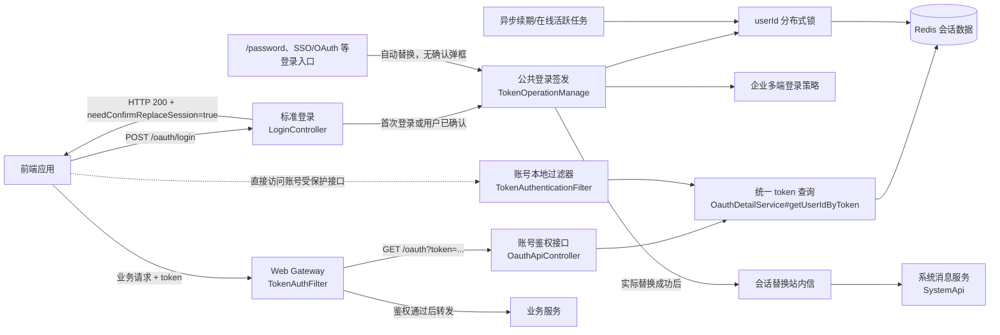
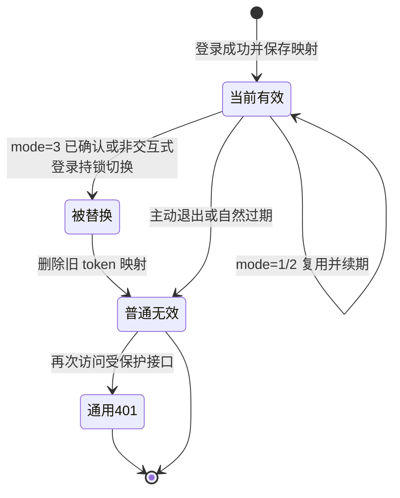
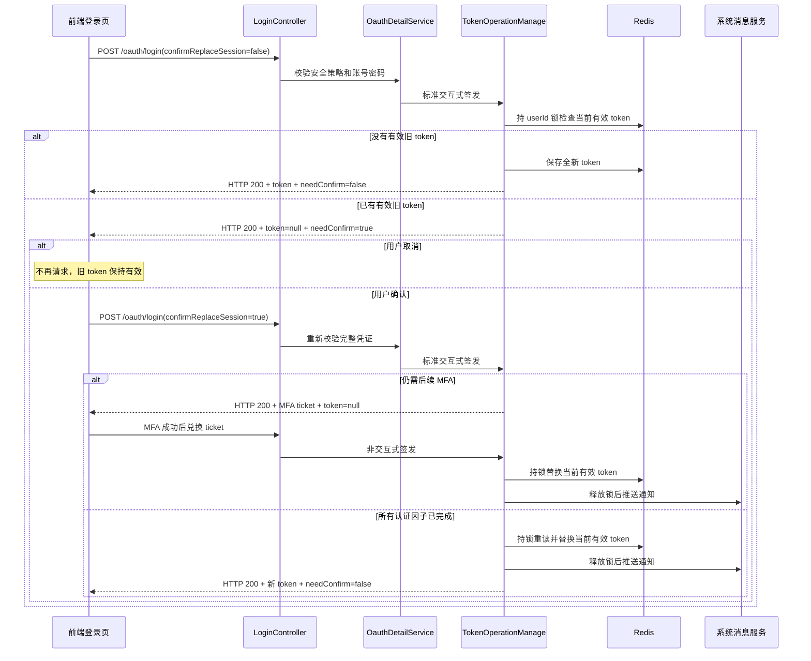
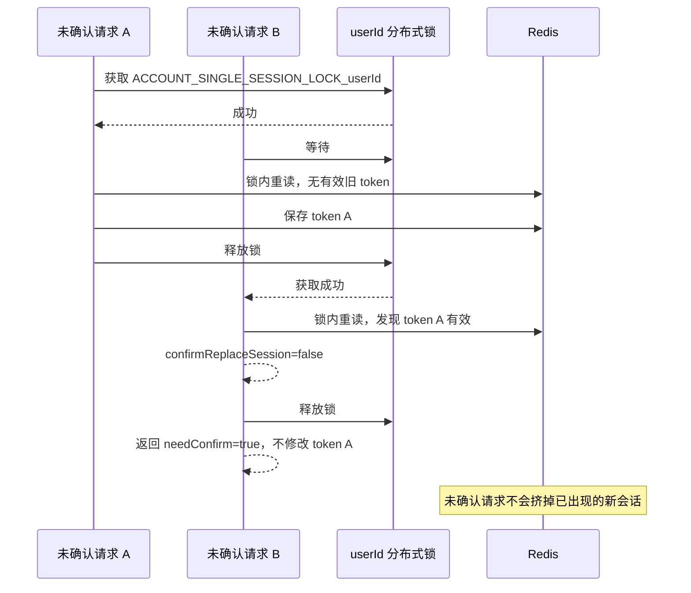
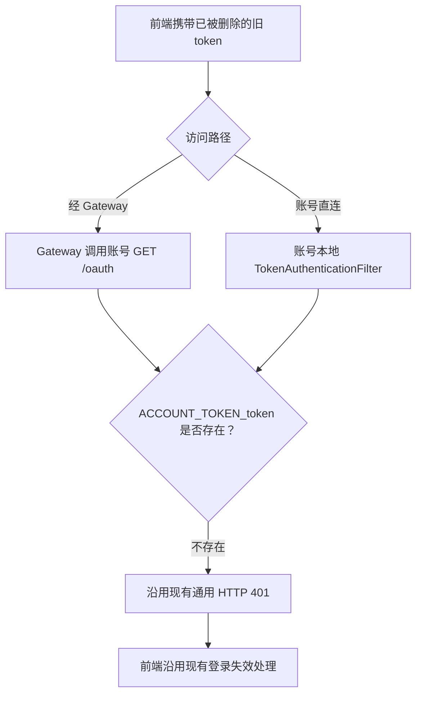

# 禁止多端登录实施计划

> 状态：评审中
> 最后更新：2026-08-26
> 适用范围：`deepfos-platform` 账号会话模块、企业多端登录配置、标准登录二次确认、会话替换通知及前端登录交互
> 关联文档：产品需求《企业多端登录配置支持“禁止多端登录”》（2026-08-13）；[前端联调说明](../规划/前端联调说明.md)；[跨企业单会话判定规则](../决策记录/2026-08-26-跨企业单会话判定规则.md)；[被替换会话沿用通用401决策](../决策记录/2026-08-14-被替换会话沿用通用401.md)

## 1. 交付目标

在企业多端登录配置已有 `mode=1/2/3` 数据能力的基础上，实现 `mode=3` 的单会话控制：

1. 只有用户所属所有企业都明确配置 `mode=3` 时，新会话才生成全新 token；任一企业为 `mode=1/2` 或缺少配置时均走非单会话逻辑。
2. 标准账号密码登录 `POST /oauth/login` 检测到已有有效 token 时，首次请求仍返回现有登录 VO，仅增加 `needConfirmReplaceSession=true`；不签发 token、不删除旧会话，用户确认后再次请求才执行替换。
3. `/oauth/login/password`、SSO/OAuth 等非主标准登录入口不增加确认交互，继续在登录成功时自动替换现有会话。
4. 同一账号的确认判断和会话切换按 `userId` 使用 Redis 分布式锁串行执行，最终只保留最后一次成功切换产生的 token。
5. 新 token 生效前删除旧 `token → userId` 和旧 `tokenListener`，并更新 `userId → OauthDetail`、在线集合及有效期。
6. 被替换 token 不保留任何额外状态；旧端后续访问沿用现有通用 HTTP 401，响应状态、body 和前端处理均不变。
7. 每次确实替换了一个仍有效的旧会话后，复用现有站内信推送能力，向本次登录账号发送“已替换其他会话”通知；使用已确认的 `deep_single_login_notice` 模板。
8. 异步续期和在线活跃写入不能把已替换的旧 token 或旧 `OauthDetail` 写回 Redis。
9. `mode=1/2` 的现有行为保持不变。

## 2. 依据与当前代码事实

### 2.1 代码基线

本计划基于 2026-08-14 的以下代码状态：

| 仓库 | 分支 | HEAD | CodeGraph 状态 |
| --- | --- | --- | --- |
| `deepfos-platform` | `jdk21` | `394e3577 fix: 获取登出url统一解码` | 已索引，并已用于定位账号会话调用链 |
| `web-gateway` | `jdk21` | `f2c40dd 更新版本` | 未建立 `.codegraph/`，已按仓库规范使用 `rg` 和源码核查 |

### 2.2 已确认事实

| 已确认事实 | 代码定位 | 对本计划的影响 |
| --- | --- | --- |
| 多端登录枚举已经包含 `NO_MULTI_LOGIN(3)` | `deepfos-platform/seepln-account/seepln-account-core/src/main/java/com/seepln/account/core/multilogin/enums/MultilLoginModeEnum.java` | 无需新增数据库模式值，主要实现会话行为 |
| 配置 create/update 当前可以接收并保存 `mode=3` | `.../multilogin/service/impl/MultiLoginConfigServiceImpl.java`、`.../multilogin/manage/MultiLoginConfigManage.java` | 需补模式校验、默认值一致性和变更日志，不需要新增接口 |
| `generateToken` 和 `generateToken1` 都先调用 `getToken(userId)`，存在时复用旧 token | `.../oauth/manage/TokenOperationManage.java`，`generateToken`、`generateToken1`、`getToken` | `mode=3` 必须在公共签发流程绕过 `getToken` 并生成新 token |
| 标准账号密码登录入口为 `POST /oauth/login` | `.../rest/oauth/LoginController.java#login` | 只有这个入口新增用户确认协议；SSO/OAuth Controller 不增加确认分支 |
| `loginByUserName` 在完成安全策略和 `AuthenticationManager` 密码认证后才调用 `generateToken` | `.../oauth/service/impl/OauthDetailService.java#loginByUserName` | 可以保证只有凭证正确的请求才知道“已有会话”，避免账号枚举；确认门禁应放在签发前 |
| `loginByUserName` 同时被主 `POST /oauth/login` 和 `POST /oauth/login/password` 调用 | `.../rest/oauth/LoginController.java#login`、`#loginPassword` | 不能仅根据 `loginByUserName` 方法名判断是否需要确认；主入口需显式传入“需要交互确认”，`/password` 保持非交互式行为 |
| `UserNameLoginDTO` 当前没有替换确认字段，`LoginVO/TicketLoginVO` 也没有是否需要确认的字段 | `.../oauth/dto/UserNameLoginDTO.java`、`.../oauth/vo/LoginVO.java`、`.../oauth/vo/TicketLoginVO.java` | 请求增加可选确认字段，现有登录 VO 增加一个布尔响应字段即可，不新增 HTTP 错误协议 |
| 当前新 token 由“用户名 + 当前毫秒”加密生成 | `TokenOperationManage.java` | 并发请求可能落入同一毫秒，需加入 UUID 或等价随机量保证唯一性 |
| `saveToken` 只写新 token、`tokenListener` 和 `OauthDetail`，不会删除旧 token | `TokenOperationManage.java#saveToken` | 仅生成新 token 不足以禁止多端登录，必须增加专用替换流程 |
| `RenewalTokenTask` 保存前会比较 token，但比较与保存不是一个原子临界区 | `.../task/RenewalTokenTask.java#doTask` | 仍可能在比较后被新登录切换，再把旧会话写回 |
| `saveOnlineActive` 也存在“校验后再保存”的时间窗口 | `TokenOperationManage.java#saveOnlineActive` | 在线活跃写入必须与单会话替换使用相同的互斥规则 |
| `/oauth` 通过 `OauthDetailService#getUserIdByToken` 查询 `ACCOUNT_TOKEN_{token}`；账号本地过滤器也会校验 token key | `.../oauth/service/impl/OauthDetailService.java#getUserIdByToken`、`.../rest/oauth/OauthApiController.java#getOauthDetailByToken`、`.../server/filter/TokenAuthenticationFilter.java` | 删除旧 token 映射后，两条鉴权路径都会按现有逻辑返回通用 401，不需要新增失效原因判断 |
| Gateway 已有账号鉴权失败的通用 401 处理 | `web-gateway/.../filter/TokenAuthFilter.java#filter` | 产品已确认被挤用户不需要专用提示，因此 Gateway 本次不修改，仅做回归验证 |
| `mode=2` 已通过 `IMultiLoginServiceImpl#sendMultiLoginNotification` 调用 `SystemApi#pushStationMessage`，模板为 `deep_login_notice` | `.../oauth/service/impl/IMultiLoginServiceImpl.java`、`.../account/constants/OauthConstant.java` | 新通知复用接收人、参数和推送通道，但应使用新的模板编码，不能把“多端登录提醒”模板直接当成“已挤掉旧会话”模板 |
| 账号服务会话链路日志输出完整 token | `OauthDetailService`、`TokenOperationManage` | 本次触达的账号会话日志只记录 token 哈希短前缀或不记录 token；Gateway 本期不改日志代码 |

### 2.3 已确认设计决策

1. `mode=3` 使用按 `userId` 的 Redis 分布式锁，不使用 JVM 本地锁。
2. 每次完成 `mode=3` 登录都创建全新会话；存在有效旧会话时执行替换，不依赖 UA 或 IP 是否变化。
3. 旧 token 的有效映射必须删除，不保留墓碑、历史集合或任何“被替换原因”状态。
4. 被替换 token 后续访问完全沿用现有通用 401；不增加 `reasonCode`、提示文案、Gateway 转换或前端弹窗。
5. 标准登录确认使用同一 `POST /oauth/login`：请求增加可选布尔字段 `confirmReplaceSession`，默认 `false`；现有登录 VO 增加 `needConfirmReplaceSession`。已有会话且未确认时返回 HTTP 200、`needConfirmReplaceSession=true`、`token=null`，用户确认后携带 `true` 重试完整登录请求。
6. “是否已有有效会话”的最终判断必须在单会话锁内完成；锁外预查只能用于优化，不能据此删除或替换 token。
7. `/oauth/login/password`、SSO/OAuth 等入口使用“自动替换”签发路径，不返回确认标识；只有主 `POST /oauth/login` 显式启用确认门禁。
8. 替换通知以锁内实际删除了有效旧 token 为准，在新会话保存成功、释放锁后发送；通知失败不回滚已成功的登录。
9. 主登录仍有邮箱等后续 MFA 时，确认请求只返回 MFA ticket，不签发新 token、不删除旧会话、不发通知；MFA 完成并兑换 ticket 时再自动替换。已通过的一次性 CAPTCHA 使用服务端短期证明跨越确认轮次，不要求用户重复验证。

### 2.4 假设与待确认事项

| 类型 | 内容 | 未确认影响 |
| --- | --- | --- |

## 3. 范围与非目标

### 3.1 本次包含

- `mode=3` 登录策略判断和新 token 签发。
- `POST /oauth/login` 已有会话时的二次确认协议，以及前端确认/取消交互。
- 按 `userId` 加锁的旧会话删除、新会话保存和在线状态更新。
- 被替换 token 通过账号直连和 Gateway 访问时沿用现有通用 401 的回归验证。
- 续期队列、续期兜底和在线活跃任务的旧会话防回写。
- 配置模式校验、默认行为和配置变更操作日志。
- `/oauth/login/password`、SSO/OAuth 等非主入口自动替换、主标准账号密码入口确认后替换的差异化覆盖。
- 成功替换旧会话后的当前账号站内信通知，复用现有 `SystemApi#pushStationMessage` 通道。
- 前端标准登录确认弹框所需的 VO 字段和联调验收。
- 本次触达的账号会话链路中的完整 token 日志脱敏。

### 3.2 明确不包含

- 不按 IP 或 UA 绑定会话。
- 不增加设备指纹或可信设备管理。
- 不增加可配置的最大会话数，`mode=3` 固定为 1。
- 不为 `/oauth/login/password`、SSO/OAuth、票据、注册自动登录等非主 `POST /oauth/login` 入口增加确认弹框。
- 不通过 WebSocket 主动关闭旧页面。
- 不为被替换用户增加专用弹窗、Toast、文案或退出页交互。
- 不增加 token 墓碑、失效原因 key、历史 token 集合或 ZSet。
- 不增加 `SESSION_REPLACED` 等 `reasonCode`，不修改账号现有 401 body，也不修改 Gateway 401 转换逻辑。
- 不保证站内信强一致送达，也不为此新增消息事务/Outbox；推送失败按现有通知能力记录日志和指标。
- 不保存完整历史 token 列表，不增加 ZSet 排名。
- 不在本期拆分企业维度 token。
- 不因配置从 1/2 切到 3 而批量注销存量在线用户。

### 3.3 前置条件与依赖

- 跨企业策略已确认：只有用户所属所有企业都明确为 `mode=3` 才启用账号单会话，缺少配置按默认 `mode=1` 处理。
- 多因素认证场景必须在所有必需因子完成后才替换会话；CAPTCHA 确认短期证明依赖账号 Redis，并使用 3 分钟有限 TTL。
- 已获得会话替换站内信模板编码、标题、正文和参数；需按本计划 DML 写入系统消息服务，并在灰度前验证模板可查询、可渲染。
- 前端版本支持登录 VO 的 `needConfirmReplaceSession` 后，再为测试企业启用 `mode=3`；被替换用户继续走现有通用 401 处理。
- 账号服务使用现有 Redis 分布式锁能力；若目标环境未部署或未配置该能力，需先完成环境验证，不能降级为 JVM 锁。

## 4. 系统全景与组件边界

下图用于说明浏览器、Gateway、账号服务与 Redis 在本需求中的职责边界。



职责约束：

- 账号服务 Redis 是 token 是否有效的唯一事实来源。
- 被替换 token 删除后，Gateway 和账号本地过滤器继续走既有通用 401，不增加跨服务响应协议。
- 标准登录的“是否需要确认”只通过登录 VO 的 `needConfirmReplaceSession` 返回，前端不能根据本地 cookie 推断。
- `/oauth/login/password`、SSO/OAuth 等登录入口不新增确认协议，但仍服从 `mode=3` 单会话约束。
- 站内信是会话替换后的附加通知，不能参与锁内 Redis 切换，也不能因发送失败回滚登录。

## 5. Redis 单会话设计

### 5.1 Key 设计

| Key | 类型 | 值 | TTL | 说明 |
| --- | --- | --- | --- | --- |
| `ACCOUNT_USER_ID_{userId}` | 现有 String/Object | 当前 `OauthDetail` | 当前 token 有效期 | 唯一当前会话详情 |
| `ACCOUNT_TOKEN_{token}` | 现有 String | `userId` | 当前 token 有效期 | token 有效性的直接依据 |
| `{token}\|tokenListener` | 现有 String | `userId` | 当前 token 有效期 | 现有 token 监听辅助 key |
| `ACCOUNT_USER_ONLINE_SET` | 现有 ZSet | `userId → 到期时间` | 集合长期存在 | 在线用户集合 |
| `ACCOUNT_USER_ONLINE_ACTIVE_SET` | 现有 ZSet | `userId → 最近活跃时间` | 集合长期存在 | 在线活跃集合 |
| `ACCOUNT_SINGLE_SESSION_LOCK_{userId}` | 新增 String | 随机 `requestId` | 短租约 | 单账号会话写互斥 |

约束：

- 有效旧会话要求 `ACCOUNT_USER_ID_{userId}` 中记录的 token 与 `ACCOUNT_TOKEN_{token}` 映射同时存在。
- 会话替换只删除旧 `ACCOUNT_TOKEN_{oldToken}` 和 `{oldToken}|tokenListener`，随后覆盖当前 `ACCOUNT_USER_ID_{userId}`。
- 不读取旧 token 的 PTTL，不创建墓碑或历史记录；旧 token 一旦删除即与普通无效 token 无差别。
- `ACCOUNT_SINGLE_SESSION_LOCK_{userId}` 必须使用有限租约和随机持有者标识，只允许持有者释放。

### 5.2 会话状态生命周期

下图用于说明 token 被替换后直接进入普通无效状态。



## 6. `mode=3` 登录确认、切换与通知设计

### 6.1 标准登录二次确认协议

`POST /oauth/login` 继续使用同一个接口和现有成功响应 VO，不新增“检查是否在线”接口，也不增加确认专用错误状态、`reasonCode` 或错误 body。请求 DTO 增加可选字段：

| 字段 | 类型 | 必填 | 默认值 | 说明 |
| --- | --- | --- | --- | --- |
| `confirmReplaceSession` | Boolean | 否 | `false` | `true` 表示用户已经明确同意退出当前有效旧会话；仅对 `POST /oauth/login` 生效 |

现有 `LoginVO/TicketLoginVO` 增加一个响应字段：

| 字段 | 类型 | 默认值 | 说明 |
| --- | --- | --- | --- |
| `needConfirmReplaceSession` | Boolean | `false` | `true` 表示本次未完成登录，前端需要询问用户是否替换当前有效旧会话 |

已有会话且未确认时，账号服务在账号密码校验成功后仍返回 HTTP 200，例如：

```json
{
  "token": null,
  "needConfirmReplaceSession": true
}
```

接口规则：

1. 只有 `mode=3`、账号凭证已经校验通过、并且 Redis 中存在有效旧 token 时才返回 `needConfirmReplaceSession=true`；密码错误仍返回原错误，不得泄露账号在线状态。
2. “有效旧 token”要求 `ACCOUNT_USER_ID_{userId}` 中有 token，且对应 `ACCOUNT_TOKEN_{oldToken}` 仍存在；只有残留的用户详情 key 不触发弹框。
3. 确认响应沿用 `TicketLoginVO`，其中 `token=null`、`needConfirmReplaceSession=true`；不写 cookie，不写墓碑，不删除或续期旧会话，也不记录“登录成功”。
4. 前端必须先判断 `needConfirmReplaceSession`，为 `true` 时弹框并停止现有登录成功/MFA/跳转处理；用户取消时结束流程，不再调用后端。
5. 用户确认时，前端用原用户名、密码及其他校验字段重新请求同一接口，并传 `confirmReplaceSession=true`；服务端必须重新执行完整凭证校验，不能把布尔字段当成登录凭证。
6. 第二次请求进入锁后再次读取当前会话；当前会话已自然失效时直接创建新会话，不写墓碑、不发“已挤掉”通知。
7. 正常完成登录时返回 `needConfirmReplaceSession=false`；`mode=1/2` 忽略请求字段并保持原行为，`/oauth/login/password`、SSO/OAuth 等入口不进入该确认分支。
8. `mode=3` 确认后仍需邮箱等后续 MFA 时，本次返回 `token=null` 和现有 MFA ticket，旧会话继续有效；ticket 兑换成功后由非交互签发入口完成替换并发送通知。
9. CAPTCHA 首轮验证成功但需要弹替换确认时，服务端保存与登录名和 CAPTCHA token 绑定的一次性证明；确认请求原子消费证明，证明不存在、过期或登录名不匹配时仍按原逻辑重新校验 CAPTCHA。

下图用于说明标准登录首次请求、用户取消和用户确认三条路径。



### 6.2 公共签发入口

`OauthDetailService#loginByUserName` 当前同时服务主 `POST /oauth/login` 和 `POST /oauth/login/password`。采用最小改动方式增加一个 `requireReplaceConfirmation` 布尔参数或等价重载：主入口传 `true`，`/password` 继续传 `false`。只有前者调用标准交互式签发方法，例如 `generateTokenForPasswordLogin(oauthDetail, ip, confirmReplaceSession)`；现有 `TokenOperationManage#generateToken/generateToken1` 继续作为非交互式自动替换入口，并与交互式入口复用同一个内部 token 选择与保存方法。

建议行为：

```text
if 用户不适用 mode=3:
    沿用现有 getToken + loginSaveToken/saveToken
else if requireReplaceConfirmation == true:
    持锁检查有效旧 token
    if 有旧 token and confirmReplaceSession != true:
        返回 token=null、needConfirmReplaceSession=true 的登录 VO，不修改会话
    else:
        生成全新唯一 token 并切换
else:
    /oauth/login/password、SSO/OAuth 等入口直接生成全新唯一 token 并切换
```

`OauthDetailService#loginByUserName` 收到 `needConfirmReplaceSession=true` 的登录 VO 后，按一次成功的凭证校验清理原有登录失败计数，但不得执行成功登录日志。`LoginController#login` 构造 `TicketLoginVO` 后必须优先判断该字段；确认后仍有 MFA 时调用延迟签发入口，只生成 ticket，最终由 `loginByTicket` 兑换时完成 mode=3 替换。CAPTCHA 确认证明只允许同一登录名原子消费一次。新 token 的输入至少包含 UUID 或等价安全随机量，不能只依赖 `System.currentTimeMillis()`。

### 6.3 加锁确认与切换顺序

确认门禁和替换操作必须使用同一把 `userId` 锁。锁外查询后再决定是否替换存在竞态：查询时没有旧 token，不代表进入保存阶段时仍没有旧 token。

下图用于说明两个并发的标准登录请求如何避免未经确认挤掉会话。



确认后或非交互式登录进入替换分支时，锁内固定顺序：

1. 重新读取 `ACCOUNT_USER_ID_{userId}`，不能使用加锁前缓存的旧 token。
2. 联合检查旧 `OauthDetail.token` 和 `ACCOUNT_TOKEN_{oldToken}`，确定是否存在有效旧会话。
3. 标准登录存在有效旧会话且 `confirmReplaceSession != true` 时，生成不含 token、`needConfirmReplaceSession=true` 的返回结果并释放锁；此前不得产生任何会话写入。
4. 生成全新 token。
5. 删除旧 `ACCOUNT_TOKEN_{oldToken}` 和 `{oldToken}|tokenListener`，不保存墓碑或失效原因。
6. 初始化新 `OauthDetail` 的 token、登录时间、续期时间和有效期。
7. 保存新 token 映射、tokenListener、`userId → OauthDetail` 和在线集合。
8. 记录本次是否实际替换了有效旧会话，但不把旧 token 带出锁或写入日志。
9. 释放锁；随后才执行站内信通知并返回登录结果。

异常规则：

- 获取锁失败时本次登录失败，不允许降级为无锁保存。
- Redis 保存失败时不返回新 token；记录无明文 token 的错误日志。
- `mode=3` 不根据 UA 决定是否替换；现有 `mode=2` 通知逻辑保持不变。
- `confirmReplaceSession=true` 只代表允许替换，不代表一定发生了替换；通知以锁内实际有效旧会话为准。

### 6.4 会话替换成功通知

通知复用 `IMultiLoginServiceImpl` 已有的 `SystemApi#pushStationMessage`、`MessageReceiverVO`、`MessageTemplateParamVO` 和 `MsgPushBaseRequestVO` 组装方式，新增模板编码 `deep_single_login_notice` 和独立发送方法，不复用 `deep_login_notice` 模板。

发送规则：

1. 仅当锁内确认并删除了一个有效旧 token，且新 token 已完整保存后发送；首次登录、旧 token 已过期、用户取消和 `needConfirmReplaceSession=true` 的确认响应均不发送。
2. 接收人为本次登录的 `userId`，即产品所述“当前登录人”；发送原因不依赖 UA/IP 是否变化。
3. 调用发生在释放分布式锁之后，避免外部消息服务延迟扩大锁持有时间。
4. 推送失败只记录脱敏错误日志和指标，不删除新 token、不恢复旧 token、不把登录响应改成失败。
5. 本次模板固定为：标题“账户登录通知”；正文“您的账户刚刚成功登录，原登录会话已自动退出。如非本人操作，请立即修改密码。”；内容参数为 `loginTime`、`loginApp`、`loginSystem`、`enterpriseName`，均为内容范围（`scope=2`）。
6. 若产品后续要求“必须送达”或失败重试，应另行设计可靠消息/Outbox，不在本期隐式增加。

### 6.4.1 消息模板定义

| 项目 | 值 |
| --- | --- |
| 消息渠道 | 站内消息（`type=2`） |
| 空间 | 全局空间（`space_id=-1`） |
| 消息标题 | 账户登录通知 |
| 模板编码 | `deep_single_login_notice` |
| 正文 | 您的账户刚刚成功登录，原登录会话已自动退出。如非本人操作，请立即修改密码。 |
| 参数 | `${loginTime}`、`${loginApp} on ${loginSystem}`、`${enterpriseName}` |
| 参数范围 | 全部为内容参数（`scope=2`） |

### 6.4.2 消息模板 DML

以下语句沿用 `system-server/src/main/resources/SYSTEM-INIT/*sql` 中现有模板初始化写法。执行前先确认 `space_id=-1、template_code=deep_single_login_notice、type=2` 尚不存在，避免重复插入模板和参数。

```sql
-- 会话被替换后的登录通知模板
INSERT INTO message_template
    (space_id, template_code, template_name, language, status, type, title, content,
     file_content, source, create_time, create_user, modify_time, modify_user,
     valid_days, valid_days_enable)
VALUES
    ('-1', 'deep_single_login_notice', '{"zh-cn":"账户登录通知"}', 'zh-cn', 1, 2,
     '账户登录通知',
     '<div class="lake-content">\n<div class="lake-content">\n<div class="lake-content">\n<div class="lake-content">\n<p><span class="ne-text">您的账户刚刚成功登录，原登录会话已自动退出。如非本人操作，请立即修改密码。</span></p>\n<ul class="ne-ul">\n<li><strong><span class="ne-text">时间</span></strong><span class="ne-text">：${loginTime}</span></li>\n<li><strong><span class="ne-text">设备</span></strong><span class="ne-text">：${loginApp} on ${loginSystem}</span></li>\n<li><strong><span class="ne-text">企业</span></strong><span class="ne-text">：${enterpriseName}</span></li>\n</ul>\n</div>\n</div>\n</div>\n</div>',
     '[]', 2, now(), '-1', now(), '-1', 0, 2);

-- 模板参数：时间、设备、企业，均属于正文参数 scope=2
INSERT INTO message_template_param (message_template_id, param_name, scope)
VALUES ((SELECT id FROM message_template
         WHERE space_id = '-1' AND template_code = 'deep_single_login_notice' AND type = 2),
        'loginTime', 2);

INSERT INTO message_template_param (message_template_id, param_name, scope)
VALUES ((SELECT id FROM message_template
         WHERE space_id = '-1' AND template_code = 'deep_single_login_notice' AND type = 2),
        'loginApp', 2);

INSERT INTO message_template_param (message_template_id, param_name, scope)
VALUES ((SELECT id FROM message_template
         WHERE space_id = '-1' AND template_code = 'deep_single_login_notice' AND type = 2),
        'loginSystem', 2);

INSERT INTO message_template_param (message_template_id, param_name, scope)
VALUES ((SELECT id FROM message_template
         WHERE space_id = '-1' AND template_code = 'deep_single_login_notice' AND type = 2),
        'enterpriseName', 2);
```

说明：`message_template_param.desc` 为可空字段，DML 省略该列，避免 MySQL/OceanBase 的 `` `desc` ``、PostgreSQL/Kingbase/OpenGauss 的 `"desc"`、DM 的未加引号写法差异。若需要严格保持对应初始化 SQL 的列清单，再按目标数据库方言补上该列并填 `NULL`。

### 6.5 异步写回一致性

`renewalSaveToken`、`RenewalTokenTask#doTask` 和 `saveOnlineActive` 都可能在旧请求线程或异步任务中持有旧 `OauthDetail`。只在加锁前比较 token 不足以消除竞态。

统一规则：

1. 最终写 `ACCOUNT_USER_ID_{userId}` 前获取同一个 `ACCOUNT_SINGLE_SESSION_LOCK_{userId}`。
2. 锁内重新读取当前 `OauthDetail`。
3. 同时确认：
   - `ACCOUNT_TOKEN_{candidateToken}` 仍存在；
   - 当前 `OauthDetail.token` 等于 `candidateToken`。
4. 任一条件不满足则丢弃本次续期/活跃更新，不重新创建 token 映射。
5. 条件满足才合并活跃上下文和有效期并保存。

建议把该逻辑收敛为专用的 `saveCurrentSessionIfMatch`，避免队列分支和队列满兜底再次出现不同校验顺序。

## 7. 被替换 token 沿用现有 401

产品已确认被挤用户不需要专用弹窗或文案。旧 token 的有效映射删除后，与主动退出、自然过期等无效 token 一样，沿用当前系统的通用 401。

下图用于说明该路径不新增任何失效原因分支。



实现约束：

- 不新增 token 墓碑或失效原因查询。
- 不新增 `SESSION_REPLACED`、`reasonCode`、响应头或错误 DTO。
- 不修改 `OauthDetailService#getUserIdByToken`、`OauthApiController`、`TokenAuthenticationFilter` 的现有 401 响应契约。
- 不修改 `web-gateway` 的 `TokenAuthFilter`、`ResponseResult` 或通用 `unauthorized` 逻辑。
- 测试只需确认旧 token 删除后两条访问路径仍返回当前版本原有的 401，不锁定或改变历史 body 字段。

## 8. 配置行为与操作日志

### 8.1 策略判定

在公共 token 签发前查询用户企业关系和多端登录配置：

- 没有企业或没有配置：按 `mode=1`。
- 只有 `mode=1/2`：保持现有多端登录与通知行为。
- 所有企业都明确为 `mode=3`：按全账号单会话处理。
- 任一企业为 `mode=1/2`，或任一企业缺少配置：按非单会话处理。

策略查询失败时不应静默降级为 `mode=1`。对安全配置无法可靠读取的登录请求应返回失败并记录错误，避免暂时性数据库异常绕过禁止多端登录。

### 8.2 配置接口

现有 `/api/multi-login/get`、`create`、`update` 保持路径不变：

- create/update 的 `mode` 只允许 1、2、3。
- `mode` 为空时统一归一为 1，不能由数据库落成默认 0。
- 未创建配置时继续按 1 解释，不改变存量数据。
- 从 1/2 切到 3 时不立即批量清理当前会话；用户下一次成功登录才触发替换。
- 成功更新后记录企业、操作人、旧模式、新模式和操作时间。

## 9. 实施步骤

### 1. 增加单会话锁常量

- 修改位置：`deepfos-platform/.../oauth/constants/OauthRedisConstant.java`
- 具体改动：增加 `ACCOUNT_SINGLE_SESSION_LOCK_{userId}` key 前缀和构造方法；不增加墓碑、失效原因或专用异常常量。
- 依赖关系：无。
- 验证方式：单元测试验证不同 `userId` 生成不同锁 key，且锁 key 不包含 token。

### 2. 增加单会话策略判断

- 修改位置：
  - `deepfos-platform/.../oauth/service/IMultiLoginService.java`
  - `deepfos-platform/.../oauth/service/impl/IMultiLoginServiceImpl.java`
  - `deepfos-platform/.../multilogin/manage/MultiLoginConfigManage.java`
- 具体改动：
  - 增加按用户判断是否适用 `mode=3` 的公共方法。
  - 复用现有用户企业关系和批量配置查询，不在每个登录 Controller 重复实现。
  - `mode=3` 判断不依赖 UA/IP；`mode=2` 的 UA 通知逻辑保持现状。
- 依赖关系：无。
- 验证方式：覆盖无企业、全部无配置、部分缺少配置、只有 1、只有 2、全部为 3 和 1/2/3 混合配置。

### 3. 接入标准登录二次确认

- 修改位置：
  - `deepfos-platform/.../oauth/dto/UserNameLoginDTO.java`
  - `deepfos-platform/.../oauth/vo/LoginVO.java`
  - `deepfos-platform/.../oauth/vo/TicketLoginVO.java`
  - `deepfos-platform/.../oauth/service/impl/OauthDetailService.java#loginByUserName`
  - `deepfos-platform/.../oauth/manage/TokenOperationManage.java`
  - `deepfos-platform/.../rest/oauth/LoginController.java#login`
- 具体改动：
  - 增加可选 `confirmReplaceSession`，缺省按 `false`。
  - 在现有登录 VO 增加 `needConfirmReplaceSession`，缺省为 `false`，并保证 `LoginVO` 到 `TicketLoginVO` 的复制构造保留该字段。
  - 为 `loginByUserName` 增加 `requireReplaceConfirmation` 参数或等价重载；`LoginController#login` 显式启用，`#loginPassword` 沿用非交互式调用。
  - 只有启用确认的主标准登录在账号密码校验成功后进入确认门禁；存在有效旧 token 且未确认时返回 `token=null、needConfirmReplaceSession=true` 的登录 VO。
  - `LoginController#login` 在进入 MFA、写 cookie 和成功返回处理前优先判断该字段；为 `true` 时直接返回当前 `TicketLoginVO`。
  - 邮箱等后续 MFA 未完成时，mode=3 只返回用户资料和 MFA ticket，不签发/替换会话；ticket 兑换完成后再调用非交互入口替换。
  - CAPTCHA 已通过但需要替换确认时，保存 3 分钟一次性证明；确认重试原子消费证明，避免重复使用已失效的 CAPTCHA token。
  - 清理已通过密码校验的失败计数，但不记录成功登录、不写 cookie/token。
  - `mode=1/2` 忽略确认字段；`/oauth/login/password` 和现有 SSO/OAuth 调用方不新增请求字段、不进入确认分支。
- 依赖关系：步骤 1、2；依赖现有 MFA ticket 兑换链路和账号 Redis。
- 验证方式：正确密码首次请求返回 HTTP 200、`needConfirmReplaceSession=true` 且旧 token 不变；错误密码不暴露在线状态；确认重试后才返回新 token；取消不产生后端副作用。

### 4. 实现持锁的新会话替换

- 修改位置：`deepfos-platform/.../oauth/manage/TokenOperationManage.java`
- 具体改动：
  - 收敛 `generateToken`、`generateToken1` 和标准交互式签发入口的 token 选择逻辑。
  - `mode=1/2` 继续调用 `getToken`；`mode=3` 生成含随机量的新 token。
  - 新增 `replaceSingleSessionToken` 或等价内部方法，复用 `DistributedLockIntensity` 按 `userId` 加锁。
  - 锁内联合判断用户详情和 token 映射；未确认的标准登录在任何写操作前退出，确认后/非交互式登录才删除旧映射并保存新会话。
  - 返回“本次是否实际替换有效旧会话”的最小结果，供通知判断；不得返回或传播旧 token。
  - 所有锁释放放在 `finally`；锁获取失败不得无锁降级。
- 依赖关系：步骤 1、2、3。
- 验证方式：顺序和并发登录只有确认/自动替换路径能删除旧会话；旧 key/listener 删除，新 `OauthDetail.token` 与唯一有效 token 一致。

### 5. 发送会话替换成功通知

- 修改位置：
  - `deepfos-platform/seepln-account/seepln-account-client-cloud/src/main/java/com/seepln/account/constants/OauthConstant.java`
  - `deepfos-platform/.../oauth/service/IMultiLoginService.java`
  - `deepfos-platform/.../oauth/service/impl/IMultiLoginServiceImpl.java`
  - `deepfos-platform/.../oauth/manage/TokenOperationManage.java`
  - 本计划 6.4.2 的系统消息模板 DML（实际落地到对应 `SYSTEM-INIT` 方言脚本）
- 具体改动：
  - 新增模板编码 `deep_single_login_notice` 和参数常量，不复用 `deep_login_notice` 的模板语义。
  - 复用 `SystemApi#pushStationMessage` 的接收人和请求构造逻辑，增加“当前账号已替换旧会话”的发送方法。
  - 仅在步骤 4 返回“实际替换成功”且释放锁后调用；首次登录、确认 VO、过期残留和用户取消均不调用。
  - 推送异常只记录脱敏日志和指标，不影响新 token 和登录响应。
- 依赖关系：步骤 4；先执行 6.4.2 DML 并确认模板和 4 个参数可查询、可渲染。
- 验证方式：mock `SystemApi` 验证接收人为当前 `userId`、模板编码为 `deep_single_login_notice`、参数值和消息内容正确、调用发生在锁释放后；推送抛异常时登录仍成功且 Redis 会话不回滚。

### 6. 阻止异步任务写回旧会话

- 修改位置：
  - `deepfos-platform/.../oauth/manage/TokenOperationManage.java`
  - `deepfos-platform/.../task/RenewalTokenTask.java`
  - 如实际调用链需要：`.../task/OnlineActiveTask.java`
- 具体改动：
  - 增加 `saveCurrentSessionIfMatch` 或等价的锁内 compare-and-save。
  - 队列消费、队列满兜底和在线活跃保存统一调用该方法。
  - token 已被替换时只记录脱敏 skip 日志，不创建旧 token key、不覆盖当前 `OauthDetail`。
- 依赖关系：步骤 4 的锁 key 和锁封装。
- 验证方式：人为阻塞旧续期任务，在新登录完成后恢复任务，确认 Redis 仍只保留新 token。

### 7. 补充配置校验和变更日志

- 修改位置：
  - `deepfos-platform/.../multilogin/service/impl/MultiLoginConfigServiceImpl.java`
  - `deepfos-platform/.../multilogin/manage/MultiLoginConfigManage.java`
  - 对应错误枚举和操作日志枚举/调用位置
- 具体改动：
  - 校验 mode 取值并统一空值为 1。
  - create/update 成功后记录企业、操作人和前后模式。
  - get 未配置时保持默认模式 1 的兼容语义。
- 依赖关系：无。
- 验证方式：覆盖 1/2/3、空值、非法值、重复 create、更新不存在配置和操作日志内容。

### 8. 清理账号会话链路中的明文 token 日志

- 修改位置：
  - `deepfos-platform/.../oauth/manage/TokenOperationManage.java`
  - `deepfos-platform/.../oauth/service/impl/OauthDetailService.java`
- 具体改动：删除完整 token 输出，确需关联时只记录 SHA-256 前 8～12 位和 `userId`。
- 依赖关系：无；不为日志脱敏引入新的 Redis key 或跨仓库依赖。
- 验证方式：执行登录、确认、替换和续期并检查账号日志，不出现完整 token 或密码。

### 9. 前端接入登录确认弹框

- 修改位置：前端原型分支 `ywz-disable-multilogin`，具体仓库和文件路径待前端项目确认。
- 具体改动：
  - 配置页增加 `mode=3` 和说明文案。
  - 登录响应 `needConfirmReplaceSession === true` 时弹确认框，并停止现有成功登录/MFA/跳转逻辑；取消不重试，确认后仅给重试请求增加 `confirmReplaceSession=true`，并防止重复点击。
  - 被替换 token 的 401 继续交给现有全局响应拦截器，不新增判断或提示。
- 依赖关系：步骤 3 的登录 VO 字段可用。
- 验证方式：确认/取消路径正确；旧 token 返回现有 401 时前端行为与改造前一致。

## 10. 测试计划

### 10.1 账号服务单元测试

- `mode=1/2` 继续复用 token。
- `mode=3` 每次完成会话创建/替换时均生成不同 token，不调用旧 token 复用分支。
- 用户所属企业全部明确为 `mode=3` 时启用单会话；任一企业为 `mode=1/2` 或缺少配置时不启用。
- 标准登录存在有效旧 token 且 `confirmReplaceSession` 缺省/为 `false` 时，返回 HTTP 200、`token=null、needConfirmReplaceSession=true`，Redis 会话无写入。
- 标准登录密码错误时不返回 `needConfirmReplaceSession=true`；正确密码触发确认时清理失败计数但不记录成功登录。
- 标准登录 `confirmReplaceSession=true` 时重新校验凭证，并以锁内当前会话为准执行替换。
- 邮箱等后续 MFA 未完成时，确认请求不删除旧 token、不发通知、不记录登录成功；ticket 兑换后才替换。
- CAPTCHA 首轮确认响应保存短期证明，确认重试可消费一次；错误用户名、过期或重复消费均不能复用。
- 只有残留 `ACCOUNT_USER_ID`、没有有效 token 映射时直接创建新会话，不误报确认。
- `/oauth/login/password`、SSO/OAuth 等非交互式入口不进入确认 VO 分支，存在旧会话时自动替换。
- 替换顺序包含删除旧 token、删除 listener、保存新 token 和更新 OauthDetail，且不创建任何失效原因 key。
- 仅实际替换有效旧会话后调用站内信；首次登录、`needConfirmReplaceSession=true` 和过期残留均不调用。
- 站内信接收人为当前 `userId`；消息服务返回空或抛异常时，登录和新会话仍成功。
- 执行 6.4.2 DML 后，`message_template` 恰有目标模板，`message_template_param` 存在 `loginTime`、`loginApp`、`loginSystem`、`enterpriseName` 4 个 `scope=2` 参数；使用示例值渲染后与产品展示内容一致。
- 配置组合按预期判定单会话策略。

### 10.2 Redis 并发集成测试

并发一致性不能只用 Mockito 验证，需使用可执行 Redis 的集成环境：

1. 无存量会话时，两个未确认的标准登录同时进入：一个创建新会话，另一个在锁内发现新 token 后返回 `needConfirmReplaceSession=true`，不能挤掉前者。
2. 两个已确认请求或非交互式登录同时切换：最终 `ACCOUNT_USER_ID_{userId}.token` 与唯一存在的 `ACCOUNT_TOKEN_{token}` 一致，最后一次持锁写入生效。
3. 确认请求等待锁期间旧会话自然过期：直接创建新会话，不发送替换通知。
4. 被替换 token 和 listener 均不存在，不产生额外 Redis 失效记录；每个实际替换动作至多发送一次通知。
5. 旧续期任务和在线活跃任务晚于新登录执行时，不能覆盖当前会话。
6. 锁获取失败时登录失败，不能产生半写入的新 token，也不能发送通知。

### 10.3 账号接口测试

在现有 `OauthApiControllerTest` 基础上增加：

- `/oauth/login` 无旧会话：HTTP 200，返回新 token。
- `/oauth/login` 有旧会话且未确认：HTTP 200，`needConfirmReplaceSession=true`、`token=null`，旧 token 仍可鉴权。
- `/oauth/login` 用户确认：HTTP 200，返回新 token，旧 token 映射被删除。
- `/oauth/login` 错误密码：沿用原错误，不返回 `needConfirmReplaceSession=true`。
- 有效 token：HTTP 200。
- 被替换 token：沿用账号接口当前的通用 HTTP 401，不新增 `reasonCode` 或专用文案。
- 账号本地过滤器对被替换 token 沿用其当前通用 401。

### 10.4 现有鉴权回归

本期不修改 Gateway 和账号鉴权响应代码，只验证删除旧 token 后原有链路仍然生效：

- 旧 token 经 Gateway 请求业务接口：返回当前版本已有的通用 401，不调用下游业务服务。
- 旧 token 直接访问账号受保护接口：返回账号当前版本已有的通用 401。
- 新 token 经两条路径访问：鉴权成功。
- 对比改造前的无效 token 响应，HTTP 状态和 body 字段没有新增或删除。
- API Key/OpenAPI 分支不受影响。

### 10.5 端到端与回归

- 设备 A 登录得到 token A；设备 B 以标准账号密码登录时先收到 `needConfirmReplaceSession=true` 的登录 VO，token A 仍然有效。
- 设备 B 取消时不产生第二次请求，token A 持续有效且不发送替换通知。
- 设备 B 确认后得到不同 token B，token A 失效；当前账号收到一次“已替换其他会话”站内信。
- token B 访问 Gateway 后业务接口成功。
- token A 访问同一接口，Gateway 返回改造前已有的通用 401，前端不展示“被挤下线”专用提示。
- token A 直接访问账号受保护接口时同样沿用账号原有通用 401。
- 相同 UA、不同 UA 均执行替换。
- `/oauth/login/password`、SSO/OAuth 等非主登录存在旧 token 时自动替换，不返回确认标识、不要求新增前端确认交互，并在实际替换后发送站内信。
- 没有旧 token 的首次标准登录或 SSO 登录不发送“已替换”站内信。
- 手机/邮箱验证码、票据和注册自动登录按非交互式入口的既有流程回归，不误入标准登录确认分支。
- `mode=1` 多端访问正常；`mode=2` 多端访问正常且通知不回归。
- 被替换、主动退出和自然过期在响应契约上不做区分。

## 11. 发布、兼容与回滚

### 11.1 发布顺序

1. 先发布账号服务：支持登录 VO 确认字段、持锁会话替换和通知调用；企业仍保持 `mode=1/2`。
2. 再发布前端：支持登录 VO 确认弹框；现有 401 处理不变。
3. 执行 6.4.2 DML，在系统消息服务创建并验证 `deep_single_login_notice` 模板及 4 个参数，确保模板编码和账号服务常量一致。
4. 最后由测试企业显式把配置切到 `mode=3` 进行灰度。

该顺序保证启用 `mode=3` 前前端已理解新增 VO 字段，消息模板也已就绪。Gateway 无版本依赖，不纳入本次发布。

### 11.2 数据迁移

- 会话控制不需要数据库 DDL 或存量业务数据迁移；系统消息服务可能需要新增一条模板配置，以其现有发布机制为准。
- 新增 Redis 锁 key 使用有限 TTL；不增加其他 Redis 数据结构。
- 不批量处理当前在线 token；配置生效后的下一次成功登录开始替换。

### 11.3 回滚

1. 先把灰度企业配置切回 1/2，停止产生新的确认、替换和通知。
2. 前端回滚到旧登录处理；现有通用 401 处理无需变更。
3. 再回滚账号服务；消息模板可保留为未使用配置，或按系统消息服务的可恢复流程下线。
4. 已存在锁 key 等待短 TTL 自动清理，无需执行全量 Redis 删除。

禁止使用扫描全库并批量删除 token 的回滚方式。

## 12. 安全、可靠性与可观测性

### 12.1 安全要求

- 服务端 Redis 是 token 有效性的唯一依据，不能只依赖前端清 token。
- 不保存旧 token 墓碑、失效原因或历史列表；日志不得输出完整 token。
- `confirmReplaceSession=true` 只是用户意图，不是认证凭证；每次确认重试必须重新校验密码和其他必需字段。
- 只有凭证校验通过后才能返回“已有会话”信息，避免使用登录接口探测账号在线状态。
- 登录配置查询异常不得静默放宽安全策略。
- IP/UA 只用于审计或 mode=2 通知，不作为会话唯一性依据。

### 12.2 建议日志与指标

建议记录以下不含明文 token 的指标或结构化日志：

- `single_session_replace_total`
- `single_session_confirm_required_total`
- `single_session_lock_failed_total`
- `stale_session_write_skipped_total`
- `session_replace_notice_success_total`、`session_replace_notice_failed_total`
- 切换耗时、锁等待耗时

日志关联字段只使用 `userId`、企业数量、模式和 token hash 短前缀。

## 13. 风险与应对

| 风险 | 影响 | 应对 |
| --- | --- | --- |
| 确认判断只在锁外执行 | 并发窗口中未确认请求仍可能挤掉刚创建的会话 | 确认门禁和替换写入使用同一把 `userId` 锁，并增加两个未确认请求的竞态测试 |
| 消息模板 DML 未执行或参数不完整 | 推送失败或展示错误文案 | 执行 6.4.2 DML 后查询模板和 4 个参数，再启用 `mode=3`；代码不得直接复用 `deep_login_notice` |
| 站内信服务异常 | 当前登录人收不到替换结果通知 | 通知放在锁外且不回滚登录，记录失败指标；若产品要求必达，另立可靠消息任务 |
| 旧前端不识别 `needConfirmReplaceSession` | 可能把无 token 的确认 VO 当作登录成功 | 前端必须优先判断新字段；先发布支持确认协议的前端，最后才为企业启用 `mode=3` |
| 异步任务未全部接入同一互斥规则 | 旧 token 或旧 OauthDetail 被重新写回 | 对所有写 `ACCOUNT_USER_ID` 的路径做调用点复核和竞态测试 |
| 锁服务异常 | 登录失败或切换延迟 | 失败关闭，不无锁降级；监控锁等待和失败数 |
| 新 token 仍可能重复 | 并发登录不能可靠区分 | 生成输入加入 UUID/SecureRandom，并增加唯一性测试 |
| 前后端字段不一致 | 确认 VO 可能被误当成登录成功 | 以 `needConfirmReplaceSession` 为唯一新增前端契约，前端在处理 token/MFA 前优先判断 |

## 14. 完成标准

- [ ] 给定用户所属所有企业都明确配置 `mode=3` 且已有有效 token，当标准账号密码登录凭证正确但未确认替换，则返回 HTTP 200、`needConfirmReplaceSession=true`、`token=null`，旧 token 仍有效。
- [ ] 给定用户任一所属企业为 `mode=1/2` 或缺少配置，当登录时，则不启用单会话确认和替换逻辑。
- [ ] 给定上述确认 VO，当用户取消，则前端不重试，服务端不删除旧 token、不发送替换通知。
- [ ] 给定上述确认 VO，当用户确认并以 `confirmReplaceSession=true` 重新提交完整登录请求，则服务端重新校验凭证，生成不同的新 token，并且只有新 token 有效。
- [ ] 给定确认后仍需邮箱等 MFA，当 MFA 尚未完成，则旧 token 继续有效且不发送通知；当 MFA ticket 兑换成功，才替换旧 token 并发送一次通知。
- [ ] 给定首次请求已通过 CAPTCHA 并返回确认 VO，当使用相同 CAPTCHA 参数确认，则服务端消费一次短期证明并继续登录；重复、过期或其他用户名不能复用该证明。
- [ ] 给定密码错误或账号不存在，当调用标准登录，则不得返回 `needConfirmReplaceSession=true` 或其他能暴露账号在线状态的信息。
- [ ] 给定两个未确认的标准登录并发进入且初始无会话，当请求完成，则一个创建新 token，另一个返回 `needConfirmReplaceSession=true`，后者不能挤掉前者。
- [ ] 给定 `/oauth/login/password`、SSO/OAuth 等非主登录且已有有效 token，当登录成功，则不返回确认标识，自动替换为新 token。
- [ ] 给定两个已确认或非交互式并发登录请求，当两次切换完成，则 Redis 最终只有最后一次持锁保存的 token 有效。
- [ ] 给定实际替换了有效旧 token，当新会话保存成功，则释放锁后向当前 `userId` 发送一次会话替换站内信；模板编码、文案和参数已由产品确认并在消息服务验证。
- [ ] 给定 `deep_single_login_notice` DML 已执行，模板类型为站内消息（`type=2`），标题、正文和 4 个内容参数与产品定义一致。
- [ ] 给定首次登录、用户取消、确认 VO 或旧 token 已过期，当流程结束，则不发送会话替换站内信。
- [ ] 给定站内信服务失败，当会话替换已经成功，则新 token 仍有效、旧 token 仍失效，并记录失败指标。
- [ ] 给定被替换 token，当通过 Gateway 请求业务接口，则沿用改造前已有的通用 HTTP 401，响应不增加 `reasonCode` 或专用文案。
- [ ] 给定被替换 token，当直接访问账号受保护接口，则沿用账号改造前已有的通用 HTTP 401。
- [ ] 会话替换不创建旧 token 墓碑、失效原因 key、历史集合或 ZSet。
- [ ] 给定已排队的旧 token 续期或活跃任务，当新登录已完成，则旧任务不能重建旧 token 或覆盖当前 `OauthDetail`。
- [ ] 给定相同 UA 的两次登录，当用户所属所有企业均为 `mode=3`，则第二次仍替换第一次会话。
- [ ] 给定模式 1 或 2，当多设备登录，则原有允许多端和通知行为不变。
- [ ] 标准账号密码登录进入确认式签发流程；验证码、票据、SSO/OAuth 和注册自动登录保持非交互式流程且仍服从单会话约束。
- [ ] `web-gateway` 无业务代码改动；Gateway 和账号直连的无效 token 回归结果与改造前一致。
- [ ] 配置 create/update 拒绝 1/2/3 之外的 mode，并记录变更前后模式。
- [ ] 前端对 `needConfirmReplaceSession=true` 只弹一次确认框并防止重复确认请求；被替换 token 继续执行原有通用 401 处理，不新增提示。
- [ ] 登录、替换和续期日志中不出现完整 token。
- [ ] 账号服务、前端按既定顺序完成联调和灰度验证，回滚步骤经过演练或评审确认。
