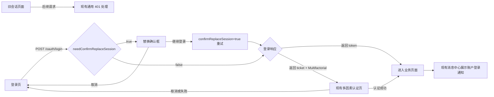
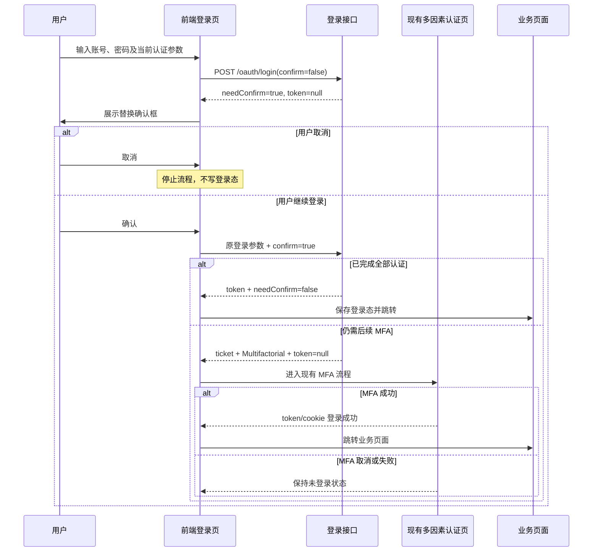

# 禁止多端登录前端联调说明

> 状态：评审中
> 最后更新：2026-08-26
> 适用范围：前端主账号密码登录 `POST /oauth/login`、已有多因素认证流程、通用 401 处理和消息中心回归
> 关联文档：[禁止多端登录实施计划](../代码执行计划/2026-08-14-禁止多端登录实施计划.md)；[跨企业单会话判定规则](../决策记录/2026-08-26-跨企业单会话判定规则.md)；[被替换会话沿用通用401决策](../决策记录/2026-08-14-被替换会话沿用通用401.md)

## 1. 联调目标

账号所属所有企业都启用禁止多端登录（`mode=3`）后，前端主登录页具备以下交互。任一企业为 `mode=1/2` 或缺少配置时，不触发本确认流程。

1. 当前账号没有其他有效会话时，沿用现有登录流程。
2. 当前账号已有有效会话时，登录接口返回确认标识，前端询问用户是否继续登录并退出原会话。
3. 用户取消时停止登录，原会话保持不变。
4. 用户确认时重新提交登录请求，然后继续走现有单因素或多因素认证流程。
5. 被替换的旧页面后续请求只收到现有通用 401，不展示“被挤下线”专用提示。
6. 当前登录账号在替换成功后，通过现有消息中心收到“账户登录通知”。

## 2. 本文范围

### 2.1 本次需要前端改动

- 主账号密码登录请求增加 `confirmReplaceSession`。
- 主登录响应优先判断 `needConfirmReplaceSession`。
- 增加“是否退出原会话并继续登录”的确认框及防重复提交控制。
- 确认请求成功后，继续复用现有 token、cookie 和多因素认证处理。

### 2.2 不需要前端改动

- 不增加新的“查询账号是否在线”接口。
- 不增加新的 401 `reasonCode`、响应头或错误文案。
- 不增加被替换用户专用弹窗、Toast 或退出页面。
- 不修改 SSO/OAuth、`/oauth/login/password` 等非主登录入口。
- 不修改消息中心的消息渲染和已读逻辑。

### 2.3 不纳入本次主路径联调

- `/oauth/login/verification-code` 验证码登录的二次确认交互。
- 设备管理、可信设备、设备指纹和最大登录设备数。

## 3. 前端全景

下图说明登录页、现有多因素页面、业务页面和消息中心的关系。



前端新增判断只发生在登录响应处；业务页面、通用 401 和消息中心继续复用现有能力。

## 4. 主登录接口契约

### 4.1 接口

`POST /oauth/login`

以下示例只展示业务数据字段。若当前请求库已经统一解包 `data`，继续使用现有解包方式，不为本需求更改响应外层结构。

### 4.2 请求字段

在现有账号密码登录参数中增加：

| 字段 | 类型 | 必填 | 默认值 | 前端语义 |
| --- | --- | --- | --- | --- |
| `confirmReplaceSession` | Boolean | 否 | `false` | `true` 表示用户已经在确认框中选择继续登录并退出原会话 |

首次登录请求：

```json
{
  "username": "demo",
  "password": "******",
  "confirmReplaceSession": false,
  "captchaLoginParam": {
    "captchaToken": "captcha-token",
    "captchaType": "blockPuzzle",
    "pointJson": "{}"
  }
}
```

确认后的重试请求：

```json
{
  "username": "demo",
  "password": "******",
  "confirmReplaceSession": true,
  "captchaLoginParam": {
    "captchaToken": "captcha-token",
    "captchaType": "blockPuzzle",
    "pointJson": "{}"
  }
}
```

约束：

- 确认重试复用本次登录表单中的用户名、密码、平台编码及认证参数。
- `confirmReplaceSession` 只对当前一次确认重试有效，不得写入持久化登录配置或作为后续登录默认值。
- 请求完成或失败后恢复默认值 `false`。
- 密码继续只保存在当前登录页内存中，不写入 `localStorage`、`sessionStorage` 或日志。

### 4.3 需要弹确认框的响应

HTTP 状态仍为 200。前端只依赖 `needConfirmReplaceSession=true`，此时 token 和其他登录字段可能为空。

```json
{
  "token": null,
  "needConfirmReplaceSession": true
}
```

处理要求：

1. 必须在读取 token、设置本地登录状态、跳转页面或进入 MFA 前优先判断该字段。
2. 为 `true` 时，本次登录尚未完成，不得把响应当作登录成功。
3. 不写 token，不写用户缓存，不跳转，不进入 MFA。
4. 展示确认框，并解除登录按钮的普通 loading；确认请求开始后再进入确认 loading。

### 4.4 正常登录响应

`needConfirmReplaceSession=false` 时，按现有逻辑处理：

```json
{
  "token": "new-token",
  "userId": "user-1",
  "type": 1,
  "authType": "SingleFactor",
  "needConfirmReplaceSession": false
}
```

若返回 token，按现有成功登录流程保存登录态并跳转。

### 4.5 确认后仍需多因素认证

用户确认替换后，如果仍需邮箱、短信或 CAPTCHA 等后续认证，响应可能没有 token，但会返回现有 MFA 字段：

```json
{
  "token": null,
  "userId": "user-1",
  "username": "demo",
  "type": 1,
  "ticket": "mfa-ticket",
  "authType": "Multifactorial",
  "secondAuthFactor": "Email",
  "needConfirmReplaceSession": false
}
```

此时：

- 继续进入现有 MFA 页面，不得因为 token 为空判定为系统异常。
- MFA 未完成、取消或失败时，不能展示“原会话已退出”或登录成功状态。
- MFA 成功后沿用现有 ticket 登录结果设置 cookie/token 并跳转。

`authType` 和 `secondAuthFactor` 取值继续沿用现有约定：

| 字段 | 可能值 |
| --- | --- |
| `authType` | `SingleFactor`、`Multifactorial` |
| `secondAuthFactor` | `Email`、`Phone`、`Captcha` |

## 5. 核心交互流程

下图说明用户确认、CAPTCHA 复用和后续 MFA 的顺序。



## 6. CAPTCHA 确认重试

主登录首轮已经通过 CAPTCHA 且响应 `needConfirmReplaceSession=true` 时：

- 用户点击继续登录后，前端复用原请求中的 `captchaLoginParam`。
- 不需要在确认框之后立即要求用户重新完成同一个 CAPTCHA。
- 确认必须立即发起，不建议让确认框长时间停留。
- 如果确认请求返回 CAPTCHA 过期或校验失败，关闭确认状态，刷新 CAPTCHA，让用户重新验证；不得无限自动重试。

前端不需要感知或保存额外的 CAPTCHA 证明字段。

## 7. 前端判断优先级

登录响应必须按以下顺序处理：

| 优先级 | 判断 | 动作 |
| --- | --- | --- |
| 1 | `needConfirmReplaceSession === true` | 只弹替换确认框，终止本次其余登录处理 |
| 2 | `authType === "Multifactorial" && ticket` | 进入现有 MFA 流程，允许 token 为空 |
| 3 | 返回有效 token/cookie | 按现有登录成功流程处理 |
| 4 | 其他业务失败 | 按现有登录错误处理 |

不要仅用 `token == null` 判断登录失败，因为确认响应和等待 MFA 响应都可能没有 token。

## 8. 推荐页面逻辑

以下伪代码只说明分支顺序，不限定前端框架：

```typescript
let loginSubmitting = false;
let replaceConfirmVisible = false;

async function submitLogin(form, confirmed = false) {
  if (loginSubmitting || replaceConfirmVisible) return;

  loginSubmitting = true;
  try {
    const result = await login({
      ...form,
      confirmReplaceSession: confirmed,
    });

    if (result.needConfirmReplaceSession === true) {
      loginSubmitting = false;
      replaceConfirmVisible = true;
      let accepted = false;
      try {
        accepted = await showReplaceSessionConfirm();
      } finally {
        replaceConfirmVisible = false;
      }
      if (!accepted) return;
      return await submitLogin(form, true);
    }

    if (result.authType === "Multifactorial" && result.ticket) {
      return enterExistingMfaFlow(result);
    }

    return completeExistingLogin(result);
  } finally {
    loginSubmitting = false;
  }
}
```

实现注意：

- 确认框只能存在一个实例。
- 确认按钮需要防连点，同一表单同一时刻只允许一个确认请求。
- 用户修改用户名或密码后，必须丢弃上一轮确认状态。
- 页面卸载、路由跳转或重新打开登录页时，确认状态恢复默认。

## 9. 现有 MFA 接口继续复用

主登录返回 `ticket + Multifactorial` 后，继续使用现有接口：

| 二次认证方式 | 接口 | 请求关键字段 |
| --- | --- | --- |
| CAPTCHA | `POST /apis/v3/account/authentication/actions/captcha-ticket/login` | `ticket`、`captchaToken`、`captchaType`、`pointJson` |
| 手机验证码 | `POST /apis/v3/account/authentication/actions/phone-ticket/login` | `ticket`、`value`、`verificationCode` |
| 邮箱验证码 | `POST /apis/v3/account/authentication/actions/email-ticket/login` | `ticket`、`value`、`verificationCode` |

本需求不改变上述接口的页面、校验码发送、倒计时、错误提示和成功跳转规则。

## 10. 通用 401 处理

被替换的旧页面在下一次访问时：

- 继续收到当前系统已有的通用 HTTP 401。
- 响应中没有新增 `SESSION_REPLACED` 或其他 `reasonCode`。
- 前端继续执行现有清理登录态、跳转登录页和通用提示。
- 不根据 401 文案推断是否被其他登录挤掉。
- 不增加专用提示，也不修改全局响应拦截器分支。

## 11. 站内消息展示回归

确认替换并最终完成登录后，当前登录账号通过现有消息中心收到：

> **账户登录通知**
>
> 您的账户刚刚成功登录，原登录会话已自动退出。如非本人操作，请立即修改密码。
>
> 时间：2026-08-17 14:30:00  
> 设备：Chrome on Windows  
> 企业：示例企业

前端不增加单独的消息弹窗，继续按现有站内消息列表、详情、未读数和已读能力展示。

以下场景不应出现该通知：

- 账号第一次登录，没有替换其他有效会话。
- 用户在确认框选择取消。
- MFA 尚未完成、失败或取消。

## 12. 异常和边界处理

| 场景 | 前端行为 |
| --- | --- |
| 确认框取消 | 结束流程，恢复按钮状态，不自动重试 |
| 确认请求网络失败 | 保留登录表单，允许用户手动重试；下一次默认重新确认 |
| 确认期间账号原会话自然失效 | 正常接收后续登录结果，不展示额外错误 |
| 确认后返回 MFA ticket | 进入现有 MFA，旧会话状态不作为前端判断条件 |
| CAPTCHA 确认证明过期 | 刷新 CAPTCHA，要求重新完成验证 |
| 连续收到多个确认响应 | 只保留一个确认框和一个有效确认请求 |
| 旧页面收到 401 | 走现有通用 401 处理 |
| `mode=1/2` 登录 | 不弹替换确认框，行为与改造前一致 |

## 13. 联调测试矩阵

| 编号 | 前置条件 | 操作 | 预期结果 |
| --- | --- | --- | --- |
| 1 | `mode=1/2` | 主账号密码登录 | 不出现替换确认框，现有登录流程正常 |
| 2 | 所属所有企业均为 `mode=3`，无其他会话 | 主账号密码登录 | `needConfirmReplaceSession=false`，正常完成登录或进入 MFA |
| 3 | 所属所有企业均为 `mode=3`，已有会话 | 首次提交正确账号密码 | HTTP 200，`needConfirmReplaceSession=true`、token 为空，只展示确认框 |
| 3A | 任一企业为 `mode=1/2` 或缺少配置 | 主账号密码登录 | 不出现替换确认框，走非单会话逻辑 |
| 4 | 同编号 3 | 点击取消 | 不重试接口，不写登录态，原会话继续可用 |
| 5 | 同编号 3，单因素 | 点击继续登录 | 携带 `confirmReplaceSession=true`，返回新 token 并进入业务页 |
| 6 | 同编号 3，邮箱 MFA | 点击继续登录 | 返回 ticket、token 为空，进入邮箱 MFA；MFA 前不视为登录成功 |
| 7 | 同编号 6 | MFA 失败或取消 | 当前页面保持未登录；不出现登录成功消息 |
| 8 | 同编号 6 | MFA 成功 | 完成登录，旧页面后续请求走通用 401，当前账号收到站内消息 |
| 9 | 同编号 3，已通过 CAPTCHA | 点击继续登录 | 复用原 CAPTCHA 参数完成确认，无需立即重复滑块/点选 |
| 10 | CAPTCHA 确认停留过久 | 点击继续登录 | 按现有 CAPTCHA 失效处理，刷新后重新验证 |
| 11 | 确认按钮连续点击 | 快速点击多次 | 只发送一个有效确认请求，不出现重复跳转或多个弹框 |
| 12 | SSO/OAuth 登录 | 正常登录 | 不出现本文新增确认交互，原流程不变 |
| 13 | 被替换旧页面 | 调用任一受保护接口 | 走现有通用 401，无专用 `reasonCode` 和被挤提示 |

## 14. 联调完成标准

- [ ] 主登录请求和响应字段已按本文接入。
- [ ] `needConfirmReplaceSession` 判断优先于 token、MFA 和页面跳转。
- [ ] 取消确认不会产生第二次登录请求。
- [ ] 确认请求携带 `confirmReplaceSession=true`，并防止重复提交。
- [ ] CAPTCHA 确认重试可复用本轮参数，过期后能回到重新验证流程。
- [ ] MFA 未完成时不误判登录成功；MFA 成功后正常设置登录态。
- [ ] 被替换旧页面继续走现有通用 401，不新增前端分支。
- [ ] 站内消息通过现有消息中心正确展示，且取消/MFA 失败时不出现。
- [ ] `mode=1/2`、SSO/OAuth 和其他非主登录流程回归通过。

## 15. 待确认事项

| 事项 | 当前联调约定 |
| --- | --- |
| 替换确认框最终标题和正文 | 不影响接口联调；以前端产品稿为准。建议表达“继续登录将退出原登录会话” |
| 确认按钮名称 | 不影响接口联调；建议“取消 / 继续登录” |
| 确认框关闭按钮行为 | 等同“取消”，不得自动继续登录 |
