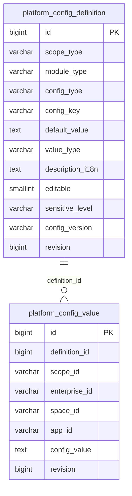
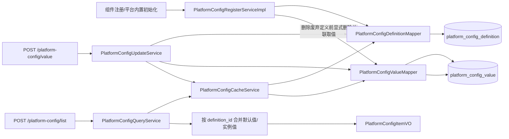
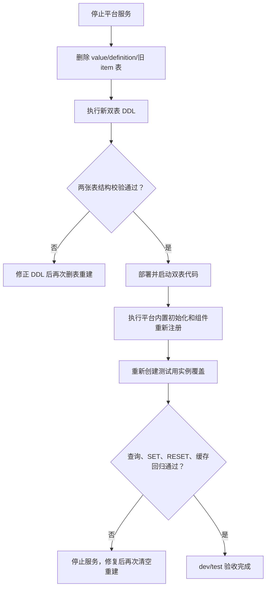

# 平台配置双表重构实施计划

> 状态：评审中
> 最后更新：2026-08-28
> 适用范围：`deepfos-platform` 的平台配置注册、查询、编辑、缓存、导出、初始化 DDL，以及 dev/test MySQL 表结构重建
> 关联文档：产品推荐的“配置定义表 + 空间取值表”截图（本会话，2026-08-28）；`deepfos-platform/environment-config-schema-enums.md`

## 1. 交付目标

将当前同时保存“配置定义”和“实例覆盖值”的单表 `platform_config_item` 拆分为：

1. 配置定义表 `platform_config_definition`：每个配置项只保存一行，负责层级、模块、分类、key、默认值、值类型、描述、编辑权限、敏感等级和协议版本等定义信息。
2. 配置取值表 `platform_config_value`：只在企业、空间或应用产生实例覆盖时保存一行，通过 `definition_id` 关联定义。
3. 在定义表中保留并明确 `value_type`，枚举继续使用 `STRING`、`INTEGER`、`DECIMAL`、`BOOLEAN`，默认 `STRING`，用于前端选择文本框、整数输入框、数字输入框或布尔开关。
4. 配置值仍统一按字符串传输和存储；本次不把 `config_value` 改成数据库原生布尔或数值列。
5. 保持现有组件注册、平台内置配置初始化、查询、编辑、重置、导出、权限、敏感值掩码和乐观锁接口语义不变。
6. 将六种数据库的原始初始化 DDL 直接改成双表结构；当前仍在 dev 阶段，不新增 Flyway 或正式生产升级脚本。
7. dev/test MySQL 直接删除旧表及数据，再按新 DDL 创建双表；不保留、不复制现有平台配置数据。

## 2. 依据与当前代码事实

### 2.1 代码基线

| 项目 | 分支 | 基线提交 | 状态 |
| --- | --- | --- | --- |
| `deepfos-platform` | `jdk21` | `28cd4454 perf: 环境变量增加类型` | `valueType` 已进入注册 DTO、内部 API DTO、持久化、查询 VO、六套 DDL 和测试 |
| 独立文档项目 | 当前工作区 | 2026-08-28 | 本计划仅修改文档项目，不在本轮继续修改平台代码或数据库 |

当前平台仓库另有 `application-lease.properties`、`mq-config.properties` 的本地修改，后续实施双表重构时必须保留，不能覆盖或顺带整理。

### 2.2 已确认的现状

| 已确认事实 | 代码位置 | 对双表重构的影响 |
| --- | --- | --- |
| 组件注册和平台内置初始化最终都调用 `PlatformConfigRegisterService#registerDefaults` | `system-server/.../module/service/impl/ModuleServiceImpl.java`、`.../env/init/PlatformConfigDefinitionInitializer.java` | 注册入口不变，内部由写单表改为写定义表 |
| 当前默认记录使用 `scope_id=DEFAULT`，全局默认记录使用 `scope_id=GLOBAL` | `PlatformConfigRegisterServiceImpl` | 双表后定义表不再需要 `scope_id`；`GLOBAL` 仅由 `scope_type` 表示 |
| 当前定义元数据和实例覆盖元数据重复存储在 `platform_config_item` | `PlatformConfigItemPO`、`PlatformConfigItemMapper.xml` | 拆分后实例表不再复制 `config_type`、`value_type`、描述、可编辑性、敏感等级和协议版本 |
| 查询当前先读取默认记录和实例记录，再按逻辑主键合并 | `PlatformConfigQueryService#merge` | 双表后改为按 `definition.id` 合并定义与实例值 |
| 没有实例覆盖时，响应 revision 来自默认定义；有覆盖时来自实例记录 | `PlatformConfigQueryService#toVO`、`PlatformConfigUpdateService#assertExpected` | 两张表都必须保留独立 `revision`，以维持现有并发协议 |
| `SET` 首次覆盖时校验客户端看到的 `DEFAULT + definition.revision`，已有覆盖时校验 `INSTANCE + value.revision` | `PlatformConfigUpdateService#set` | 拆表后仍按相同规则加锁、插入或更新取值表 |
| `RESET` 删除实例记录并恢复默认值 | `PlatformConfigUpdateService#reset` | 拆表后只删除 `platform_config_value`，定义表不变 |
| `SECRET` 配置查询不返回明文，导出显示“已配置” | `PlatformConfigQueryService#toVO`、`PlatformConfigExportService#row` | 敏感等级继续从定义表读取，行为不变 |
| `valueType` 是渲染元数据，当前不校验实际字符串是否符合布尔、整数或小数格式 | `PlatformConfigValueTypeEnum`、`PlatformConfigRegisterServiceImpl#validateConfig` | 本次只保留类型元数据，不扩大为值格式校验需求 |
| 缓存当前按“定义层级 + 协议版本”和“实例层级 + scopeId + 协议版本”分开存储 | `PlatformConfigCacheService` | 双表后仍保持定义缓存和实例缓存分离，避免定义更新时清空所有实例缓存 |

### 2.3 dev/test 重建口径

当前仍处于 dev 阶段，产品和开发已确认现有 `platform_config_item` 数据无需保留。实施时采用以下口径：

- dev/test 直接删除 `platform_config_item` 表及全部数据。
- 如果调试期间已经提前创建过 `platform_config_definition` 或 `platform_config_value`，一并删除后重建，避免残留结构干扰验收。
- 不编写单表到双表的数据复制 SQL，不核对旧值，不保留备份表。
- 新表创建后通过平台内置初始化和组件重新注册重新生成定义；实例覆盖由测试过程重新设置。

### 2.4 已确认设计决策

1. 采用产品推荐的双表方向，不继续扩展单表。
2. 定义表名称为 `platform_config_definition`，取值表名称为 `platform_config_value`。
3. 产品截图中缺少的 `value_type` 必须放在定义表，列名不使用含义过宽的 `type`。
4. 产品截图中的 `version` 统一沿用当前代码名称 `config_version`，避免与乐观锁 `revision` 混淆。
5. 产品截图中缺少的 `description_i18n`、`app_id` 和审计字段必须保留：当前系统支持多语言说明、`APPLICATION` 层级和修改人/修改时间展示。
6. 定义唯一键使用 `(scope_type, module_type, config_key, config_version)`。
7. 取值唯一键使用 `(definition_id, scope_id)`。
8. `GLOBAL` 配置只有定义和默认值，不产生 `platform_config_value` 记录；当前版本仍不允许平台编辑 `GLOBAL`。
9. 外部查询、编辑和导出接口不改 URL，不要求前端改配置身份字段；双表关系由后端内部解析。
10. 本次不做数据迁移、新旧表双写或兼容读取；dev/test 停止服务后直接删表重建，再启动双表代码。
11. `definition_id` 只作为逻辑关联字段，不建立数据库物理外键；删除定义时由服务在同一事务内先显式删除关联取值，再删除定义。

### 2.5 待评审事项

| 事项 | 推荐方案 | 影响 |
| --- | --- | --- |
| 导出文件是否增加“值类型”列 | 默认本次不加，保持现有导出格式；如产品需要，应单独确认列位置 | 不影响前端页面渲染，避免把表结构重构扩大成导出协议变更 |

## 3. 范围与非目标

### 3.1 本次包含

- 六种数据库原始初始化 DDL 的双表替换。
- dev/test MySQL 删除旧表、执行双表 DDL、重新注册定义并完成空库回归。
- 定义、取值两个持久化对象和 Mapper 的拆分。
- 注册同步、删除废弃定义及实例级覆盖的事务内关联清理。
- 查询合并、分类统计、关键字过滤、值来源判定和敏感值掩码。
- `SET`、`RESET` 和乐观锁并发控制。
- Redis 缓存载荷拆分、缓存 key 版本升级及事务提交后失效。
- `value_type` 在定义表、DTO、VO 和接口 Schema 中的保留。
- 平台配置相关单元测试、Mapper/DDL 方言测试、MySQL 空库建表测试和接口回归。
- 枚举说明文档中的表名和字段位置更新。

### 3.2 明确不包含

- 不修改 `valueType` 的四个既有枚举值。
- 不把配置值改成 JSON、布尔、整数或小数数据库原生类型。
- 不新增最小值、最大值、正则表达式、候选项等复杂 JSON Schema。
- 不修改前端具体控件实现，只保证查询响应继续返回 `valueType`。
- 不新增查询、编辑或导出接口。
- 不改变 `GLOBAL` 首版只读限制。
- 不为生产环境编写 Flyway、Liquibase 或在线双写迁移。
- 不迁移、备份或恢复 dev/test 现有平台配置数据。
- 不修改本任务无关的 MQ、登录、权限或数据源配置。

## 4. 目标数据模型

### 4.1 数据关系

下图说明一条配置定义可以有多个不同实例的覆盖值，但每个实例最多有一条覆盖。



定义表回答“这个配置是什么、默认值是什么、如何展示和编辑”；取值表只回答“某个企业/空间/应用是否覆盖了默认值，以及覆盖成什么”。

### 4.2 配置定义表 `platform_config_definition`

| 字段 | 建议类型 | 约束/默认值 | 说明 |
| --- | --- | --- | --- |
| `id` | bigint | 主键、自增/identity | 配置定义 ID |
| `scope_type` | varchar(16) | 非空 | `GLOBAL`、`ENTERPRISE`、`SPACE`、`APPLICATION` |
| `module_type` | varchar(64) | 非空 | 组件标识，复用注册接口 `moduleType` |
| `config_type` | varchar(64) | 非空，默认 `COMPONENT_PARAMETER` | 配置分类 |
| `config_key` | varchar(255) | 非空 | 配置 key |
| `default_value` | text | 非空 | 解析环境变量表达式后的默认值，仍按字符串存储 |
| `value_type` | varchar(16) | 非空，默认 `STRING` | `STRING`、`INTEGER`、`DECIMAL`、`BOOLEAN`；产品图中缺失、本次必须补充 |
| `description_i18n` | text | 可空 | 多语言描述 JSON |
| `editable` | tinyint/smallint | 非空，默认 0 | 0 只读，1 可编辑 |
| `sensitive_level` | varchar(16) | 非空，默认 `PUBLIC` | `PUBLIC`、`INTERNAL`、`SECRET` |
| `config_version` | varchar(32) | 非空，默认 `v1` | 配置协议版本，不使用截图中的泛化列名 `version` |
| `revision` | bigint | 非空，默认 0 | 默认值/定义的乐观锁版本；注册更新时加 1 |
| `created_by` | varchar(36) | 可空 | 创建人 |
| `created_at` | datetime/timestamp | 非空，默认当前时间 | 创建时间 |
| `updated_by` | varchar(36) | 可空 | 最后修改人 |
| `updated_at` | datetime/timestamp | 非空，默认当前时间 | 最后修改时间 |

索引和约束：

- 主键：`pk_platform_config_definition(id)`。
- 唯一键：`uk_platform_config_definition(scope_type, module_type, config_key, config_version)`。
- 分类查询索引：`idx_platform_config_definition_module(module_type, config_type)`。
- 层级查询索引：`idx_platform_config_definition_query(scope_type, config_version, module_type, config_key)`。

### 4.3 配置取值表 `platform_config_value`

| 字段 | 建议类型 | 约束/默认值 | 说明 |
| --- | --- | --- | --- |
| `id` | bigint | 主键、自增/identity | 实例覆盖 ID |
| `definition_id` | bigint | 非空、逻辑关联 | 对应 `platform_config_definition.id`，不建立物理外键 |
| `scope_id` | varchar(64) | 非空 | 企业、空间或应用 ID；不允许 `DEFAULT`、`GLOBAL` |
| `enterprise_id` | varchar(36) | 可空 | 企业上下文；企业/空间/应用覆盖均填写 |
| `space_id` | varchar(50) | 可空 | 空间上下文；空间/应用覆盖填写 |
| `app_id` | varchar(50) | 可空 | 应用上下文；应用覆盖填写。产品图中未列出，但当前 `APPLICATION` 层级必须保留 |
| `config_value` | text | 非空 | 实例覆盖值，仍按字符串存储 |
| `revision` | bigint | 非空，默认 0 | 实例覆盖的乐观锁版本 |
| `created_by` | varchar(36) | 可空 | 创建人 |
| `created_at` | datetime/timestamp | 非空，默认当前时间 | 创建时间 |
| `updated_by` | varchar(36) | 可空 | 最后修改人 |
| `updated_at` | datetime/timestamp | 非空，默认当前时间 | 最后修改时间 |

索引和约束：

- 主键：`pk_platform_config_value(id)`。
- 唯一键：`uk_platform_config_value(definition_id, scope_id)`。
- 实例查询索引：`idx_platform_config_value_scope(scope_id, definition_id)`。
- 上下文索引：`idx_platform_config_value_context(enterprise_id, space_id, app_id)`。
- 不建立物理外键；服务删除定义时必须在同一事务内先按 `definition_id` 删除取值，防止产生孤儿数据。

### 4.4 层级字段约束

| 定义 `scope_type` | 取值表上下文 | `scope_id` 对应字段 |
| --- | --- | --- |
| `GLOBAL` | 不允许产生取值记录 | 无 |
| `ENTERPRISE` | `enterprise_id` 非空，`space_id/app_id` 为空 | `enterprise_id` |
| `SPACE` | `enterprise_id/space_id` 非空，`app_id` 为空 | `space_id` |
| `APPLICATION` | `enterprise_id/space_id/app_id` 均非空 | `app_id` |

这些跨字段规则继续由 `PlatformConfigUpdateService` 校验；不依赖各数据库对复杂 `CHECK` 约束支持的一致性。

### 4.5 单表职责拆分

本次不迁移旧数据，下表只用于明确代码字段应该落在哪张新表：

| 当前混合字段 | 双表后的归属 |
| --- | --- |
| `scope_type`、`module_type`、`config_type`、`config_key` | 定义表 |
| 默认记录的 `config_value` | 定义表 `default_value` |
| `value_type`、`description_i18n`、`editable`、`sensitive_level`、`config_version` | 定义表 |
| 实例记录的 `scope_id`、`enterprise_id`、`space_id`、`app_id`、`config_value` | 取值表 |
| `revision` 和审计字段 | 两张表各自保留，分别描述定义和实例值的版本/修改信息 |

## 5. 目标代码结构与调用关系

下图说明拆表后注册只维护定义，编辑只维护实例值，查询在缓存层读取两类数据后合并。



建议新增/替换的核心类型：

| 类型 | 目标路径 | 用途 |
| --- | --- | --- |
| `PlatformConfigDefinitionPO` | `system-server/src/main/java/com/proinnova/system/env/po/` | 映射定义表 |
| `PlatformConfigValuePO` | 同上 | 映射取值表 |
| `PlatformConfigValueRecord` | `system-server/src/main/java/com/proinnova/system/env/mapper/` 或内部投影 | 在缓存查询时携带从定义表 join 得到的 `scopeType/configVersion`，数据库取值表本身不冗余这两列 |
| `PlatformConfigDefinitionMapper` | `system-server/src/main/java/com/proinnova/system/env/mapper/` | 定义注册、锁定查询、批量查询和删除 |
| `PlatformConfigValueMapper` | 同上 | 实例值查询、插入、乐观锁更新和删除 |
| 两份 Mapper XML | `system-server/src/main/resources/mapper/common/` | 分别维护两个表的 SQL |

完成拆分后删除 `PlatformConfigItemPO`、`PlatformConfigItemMapper` 和原 `PlatformConfigItemMapper.xml`，避免继续存在可误用的混合模型。

## 6. 实施步骤

### 1. 将六套原始 DDL 改为双表

- 修改位置：
  - `system-server/src/main/resources/SYSTEM-INIT/mysql.sql`
  - `oceanbase.sql`、`postgresql.sql`、`opengauss.sql`、`kingbase8.sql`、`dm.sql`
- 具体改动：删除 `platform_config_item` 建表块，按第 4 节新增定义表和取值表；同步主键、唯一键、索引和字段注释，不创建物理外键。
- 关键约束：定义表必须包含 `value_type`；取值表必须包含 `app_id`；统一使用 `config_version`；`definition_id` 仅建立普通索引/唯一键中的逻辑关联。
- 依赖关系：无。
- 验证方式：扩展 `PlatformConfigDialectTest`，逐套断言两个表、字段、默认值、唯一键和索引；断言不存在平台配置物理外键，且初始化 DDL 不再创建 `platform_config_item`。

### 2. 拆分持久化对象和 Mapper

- 修改位置：`system-server/src/main/java/com/proinnova/system/env/po/`、`.../mapper/`、`system-server/src/main/resources/mapper/common/`。
- 具体改动：新增定义 PO/Mapper 和取值 PO/Mapper；将原 Mapper 的默认记录 SQL 移入定义 Mapper，将实例 SQL 移入取值 Mapper。
- 查询要求：
  - 定义按 `scope_type + config_version` 批量查询。
  - 取值按 `scopeType + scopeId + configVersion` 查询时，通过定义表 join 过滤层级和版本。
  - 加锁查询定义使用唯一键；加锁查询取值使用 `definition_id + scope_id`。
- 清理：调用方改造完毕后删除单表 PO/Mapper/XML。
- 验证方式：MyBatis XML 可解析；SQL 不依赖 MySQL 专属 upsert；六种数据库公共 Mapper 测试通过。

### 3. 改造配置注册同步

- 修改位置：`PlatformConfigRegisterServiceImpl#registerDefaults`。
- 具体改动：
  1. `ModuleConfigRegisterDTO` 的校验和缺省值规则保持不变，包括 `valueType` 缺省为 `STRING`。
  2. 将 `defaultValue` 写入定义表 `default_value`，其余 Schema 元数据只写定义表。
  3. 按定义唯一键新增或更新，更新时 `revision = revision + 1`。
  4. 同步删除条件由当前仅比较 `configKey` 改为比较完整身份 `(scopeType, configKey, configVersion)`，防止同模块同 key 的不同层级/版本互相误保留。
  5. 删除本次未声明的定义时，在同一事务内先按 `definition_id` 批量删除取值，再删除定义；任一步失败均整体回滚。
- 依赖关系：步骤 2。
- 验证方式：覆盖新增、更新、完整身份去重、先删取值后删定义、任一步异常整体回滚、环境变量默认值解析、非法 `valueType` 拒绝。

### 4. 拆分缓存载荷并升级缓存 key

- 修改位置：`PlatformConfigCacheService`、`PlatformConfigCacheServiceTest`。
- 具体改动：
  - 定义缓存：按 `scopeType + configVersion` 保存定义列表。
  - 取值缓存：按 `scopeType + scopeId + configVersion` 保存实例覆盖列表。
  - 缓存 key 前缀升级为 `platform:config:v2:`，避免旧单表 JSON 被新代码反序列化。
  - 注册成功后只失效涉及层级/版本的定义缓存；实例 `SET/RESET` 后只失效对应实例缓存。
  - 所有失效仍在事务提交后执行；Redis 失败继续回源数据库。
- 依赖关系：步骤 2、3。
- 验证方式：覆盖批量 miss、空结果短缓存、Redis 异常回源、事务提交后失效、定义/实例缓存互不污染；确认旧 `platform:config:*` key 最长 30 分钟自然过期或在 dev/test 手工清理。

### 5. 按 `definition_id` 重写查询合并

- 修改位置：`PlatformConfigQueryService`、`PlatformConfigQueryServiceTest`。
- 具体改动：
  - 删除 `DEFAULT/GLOBAL scope_id` 识别定义的逻辑。
  - 先取得当前权限上下文允许的定义，再取得对应 `scopeId` 的实例覆盖。
  - 以 `definition.id` 为键合并：无取值行时使用 `default_value`、`DEFAULT`、定义 revision/审计字段；有取值行时使用 `config_value`、`INSTANCE`、取值 revision/审计字段。
  - 分类、关键字、可编辑性、敏感等级和 `valueType` 始终来自定义表。
  - `SECRET` 掩码、排序、分类计数和多语言描述回退保持现状。
- 依赖关系：步骤 4。
- 验证方式：覆盖四种 scope、默认值、实例覆盖、孤儿值不可见、SECRET 掩码、`valueType` 返回、过滤/排序/分类计数。

### 6. 改造实例值编辑和乐观锁

- 修改位置：`PlatformConfigUpdateService`、`PlatformConfigUpdateServiceTest`。
- 具体改动：
  1. 按 `(scopeType, moduleType, configKey, configVersion)` 加锁读取定义。
  2. 校验定义存在、可编辑且不是 `GLOBAL`。
  3. 按 `(definitionId, scopeId)` 加锁读取实例值。
  4. 首次 `SET` 继续校验客户端提交的 `DEFAULT + definition.revision`，插入取值行并依赖唯一键处理并发。
  5. 已有实例时校验 `INSTANCE + value.revision`，按预期 revision 更新并加 1。
  6. `RESET` 按预期 revision 删除取值行，返回定义默认值。
  7. 取值行只保存上下文、值和审计字段，不复制定义元数据。
- 依赖关系：步骤 2、4、5。
- 验证方式：覆盖首次 SET、重复并发插入、同值幂等、版本冲突、RESET、GLOBAL 拒绝、保留值 scopeId 拒绝及三种可编辑层级的上下文字段。

### 7. 保持注册 DTO、查询 VO 和控制器协议兼容

- 修改位置：
  - `merge-common/.../ModuleConfigRegisterDto.java`
  - `system-server/.../ModuleConfigRegisterDTO.java`
  - `PlatformConfigUpdateDTO.java`
  - `PlatformConfigItemVO.java`
  - `PlatformConfigController.java`
- 具体改动：DTO/VO 字段和 URL 原则上不变；继续透传 `valueType`，不向前端暴露 `definitionId`，避免前端依赖数据库主键。
- 依赖关系：步骤 5、6。
- 验证方式：内部 System API JSON 转换保留 `valueType`；现有 `/platform-config/list`、`/value`、`/export` 请求和响应回归通过。

### 8. 更新测试和说明文档

- 修改位置：全部 `PlatformConfig*Test`、`deepfos-platform/environment-config-schema-enums.md`。
- 具体改动：测试工厂从混合 `PlatformConfigItemPO` 拆成定义和值；文档将单表说明改成双表，并明确 `value_type` 位于定义表。
- 依赖关系：步骤 1 至 7。
- 验证方式：第 8 节测试命令通过；文档示例可由注册 DTO 反序列化，字段名与 DDL 一致。

## 7. dev/test MySQL 删表重建与发布

### 7.1 重建原则

- dev/test 现有平台配置数据全部废弃，不备份、不复制、不校验旧值。
- 停止平台服务后执行删表，避免旧代码在重建过程中继续访问或写入。
- 删除顺序为取值表、定义表、旧单表；即使前两张表尚不存在也按幂等方式处理。
- 新代码和新表同时启用，不提供旧表兼容读取或双写。
- 新表创建后，定义数据只通过平台内置初始化和组件注册重新生成；实例覆盖由测试重新设置。

### 7.2 重建流程

下图说明 dev/test 不迁移数据，直接从空双表重新开始。



建议执行顺序：

1. 确认双表代码和六套原始 DDL 已完成评审，平台配置相关测试已通过。
2. 停止 dev 或 test 平台服务以及会触发组件注册的相关任务。
3. 按下列顺序删除表和数据：

   ```sql
   DROP TABLE IF EXISTS platform_config_value;
   DROP TABLE IF EXISTS platform_config_definition;
   DROP TABLE IF EXISTS platform_config_item;
   ```

4. 从更新后的 MySQL 原始 DDL 执行 `platform_config_definition`、`platform_config_value` 建表块。
5. 核对字段、默认值、唯一键和索引，重点确认定义表存在 `value_type`、取值表存在 `app_id`，且两张表之间没有物理外键。
6. 部署并启动双表代码，启用 `platform:config:v2:` 缓存 key。
7. 执行 `PlatformConfigDefinitionInitializer`；重新触发各组件注册，使定义表生成配置定义。
8. 确认预期组件均已注册后，再通过平台接口重新设置测试所需的企业/空间/应用覆盖值。
9. 执行查询、SET、RESET、组件重新注册、缓存失效和服务重启回归。
10. dev 验收通过后按同样步骤处理 test，不复用 dev 数据导入 test。

### 7.3 空库和重新注册门禁

- [ ] 三个可能存在的表均已删除，旧 `platform_config_item` 不再存在。
- [ ] 新建后只有 `platform_config_definition`、`platform_config_value` 两张平台配置表。
- [ ] 两张表初始均为空，不存在任何从旧表复制的数据。
- [ ] 平台启动不再访问 `platform_config_item`。
- [ ] 平台内置初始化和组件注册可从空表成功创建定义。
- [ ] 同一组件重复注册不会产生重复定义。
- [ ] 尚未设置覆盖时 `platform_config_value` 为空，查询使用 `default_value` 并返回 `DEFAULT`。
- [ ] 通过 SET 创建覆盖后只新增取值行；RESET 后取值行删除并恢复默认值。
- [ ] `value_type` 缺省为 `STRING`，显式四种类型均可注册和查询。
- [ ] Redis 中不存在可被新代码读取的旧单表缓存载荷。

### 7.4 其他数据库

OceanBase、PostgreSQL、openGauss、Kingbase8、达梦只修改原始初始化 DDL并执行空库建表测试。本阶段不为任何数据库编写旧单表数据迁移；如果某个非 dev/test 环境已经有旧表，处理前必须重新确认是否同样允许直接删除。

### 7.5 回退方式

由于现有数据明确不保留，回退也不恢复历史数据：

1. 停止平台服务。
2. 删除双表。
3. 回滚代码和原始 DDL到单表版本。
4. 重新创建空 `platform_config_item`。
5. 重新执行平台内置初始化和组件注册。

回退只恢复可运行的单表结构，不承诺恢复重建前或双表测试期间产生的配置值。

## 8. 测试计划

### 8.1 单元测试

- `PlatformConfigRegisterServiceImplTest`：类型缺省/校验、定义新增更新、完整身份去重、废弃定义与覆盖清理。
- `PlatformConfigCacheServiceTest`：定义和值分开缓存、批量 miss、空缓存、异常回源、提交后失效、v2 key。
- `PlatformConfigQueryServiceTest`：默认/实例合并、valueSource、revision、`valueType`、敏感掩码、过滤排序和分类计数。
- `PlatformConfigUpdateServiceTest`：首次 SET、并发唯一键冲突、乐观锁更新、RESET、GLOBAL/只读/非法上下文拒绝。
- `PlatformConfigExportServiceTest`：查询数据来源改变后导出格式和 SECRET 掩码保持不变。
- `PlatformConfigPermissionServiceTest`：四种层级权限行为不受拆表影响。
- `PlatformConfigDefinitionInitializerTest`：内置 JSON 仍注册定义，`valueType` 能解析并落入定义表。

### 8.2 DDL 和 Mapper 测试

- 六套 DDL 均包含两个表及完整字段。
- 每套 DDL 的自增、时间、布尔/小整数和注释使用原生方言，且平台配置双表均不创建物理外键。
- 定义和值唯一键顺序正确。
- 公共 Mapper XML 能被 MyBatis 解析，且无 MySQL 专属 upsert。
- 原 `platform_config_item` 建表和 Mapper 引用全部移除。

### 8.3 集成与人工回归

- 在空 MySQL 库执行原始 DDL，启动后注册组件并查询默认值。
- 在 dev/test 删除所有平台配置表后执行双表 DDL，确认启动和组件重新注册可以从空库恢复定义。
- 确认没有任何旧单表数据被复制到双表。
- 分别对 `ENTERPRISE`、`SPACE`、`APPLICATION` 执行 SET/RESET；确认上下文字段和 valueSource。
- 查询 `GLOBAL` 默认值并确认编辑仍被拒绝。
- 更新组件定义的默认值、敏感等级和 `valueType`，确认已有实例覆盖值不被覆盖，但响应元数据使用最新定义。
- 删除组件配置定义，确认关联实例覆盖同步删除且无孤儿缓存。
- 重启服务并等待旧缓存 TTL，确认没有反序列化错误或旧值回流。
- 前端按四种 `valueType` 渲染并保存，再刷新确认值和 revision 一致。

### 8.4 建议验证命令

```bash
mvn -pl system-server -am \
  -DskipTests=false \
  -Dtest='PlatformConfig*Test' \
  -Dsurefire.failIfNoSpecifiedTests=false \
  test

mvn -pl system-server -am -DskipTests compile

git diff --check
```

## 9. 风险与应对

| 风险 | 影响 | 应对 |
| --- | --- | --- |
| 产品图未包含 `value_type` | 前端无法判断控件类型 | 定义表强制加入 `value_type`，DDL/DTO/VO/测试同时断言 |
| 产品图未包含 `app_id` | 应用级覆盖无法保留完整上下文 | 取值表保留 `app_id`，按当前四层 scope 规则验证 |
| 定义和值 revision 混用 | 并发编辑误报或漏报 | 无覆盖返回定义 revision，有覆盖返回值 revision，保持现有 expectedSource 协议 |
| 注册删除仅按 configKey 判断 | 同 key 不同层级/版本可能误保留 | 改为完整定义身份集合 |
| 无物理外键时服务删除顺序错误 | 产生孤儿取值 | 注册删除在同一事务内先删取值再删定义，并增加异常回滚与孤儿检查测试 |
| Redis 仍有旧单表 JSON | 新代码反序列化异常或脏读 | 缓存 key 升级到 v2，旧 key 自然过期或发布时清理 |
| 删表时服务仍在运行 | 运行中请求持续报表不存在 | 先停止平台服务及注册任务，再删表重建 |
| 组件没有重新注册 | 定义表为空，前端看不到配置 | 重建后按组件清单逐一触发注册，并将“预期组件均已出现”设为启动门禁 |
| 测试依赖旧实例覆盖 | 重建后用例或页面表现变化 | 明确旧数据废弃，按当前测试需求重新通过 SET 创建覆盖 |

## 10. 完成标准

- [ ] 六种数据库原始 DDL 仅创建 `platform_config_definition` 和 `platform_config_value`，不再创建旧单表。
- [ ] 定义表包含 `value_type`，四个枚举、默认值和接口 Schema 与当前提交一致。
- [ ] 取值表包含 `app_id`，唯一键和定义关联满足第 4 节要求。
- [ ] 注册只写定义，实例编辑只写取值，不再重复保存定义元数据。
- [ ] 查询、导出、权限、SECRET 掩码、valueSource 和 revision 外部语义与拆表前一致。
- [ ] dev/test 已删除旧单表和旧数据，并从空双表完成初始化与组件重新注册。
- [ ] dev/test 未执行任何旧数据复制 SQL，双表数据均由新代码重新产生。
- [ ] 全部 `PlatformConfig*Test` 通过，六套 DDL/Mapper 方言检查通过，全模块编译通过。
- [ ] dev/test 完成默认查询、SET、RESET、组件重注册、服务重启和缓存过期回归。
- [ ] 双表未建立物理外键，定义删除通过服务事务显式清理关联取值。
- [ ] 导出是否增加类型列这一待评审事项已有明确结论。
- [ ] 枚举说明文档已更新为双表结构，且明确 `value_type` 位于定义表。
