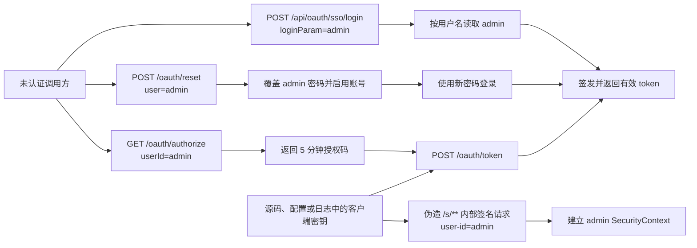

# 超级管理员账号安全审计报告

> 状态：评审中
> 最后更新：2026-08-31
> 适用范围：`deepfos-platform` 仓库 `feature_env` 分支，提交 `db418e151a7e7a94e5271232be789cfdfd8941eb` 对应的当前工作区源码；重点覆盖账号服务的超级管理员密码、登录、SSO、OAuth、ticket、token、共享密钥及日志
> 关联文档：[禁止多端登录前端联调说明](../多端登录控制/规划/前端联调说明.md)

## 1. 结论

当前代码存在可导致超级管理员账号被直接接管的严重问题，答案是明确的：

1. **可以不知道 admin 密码直接拿到有效 token。** 默认开启的 `POST /api/oauth/sso/login` 接收调用方提供的 `loginParam`，按用户名查询用户后直接签发 token；该路由又被整体加入免鉴权名单。传入内置账号标识 `admin` 即进入超级管理员 token 签发链路。
2. **可以不知道旧密码直接覆盖 admin 密码。** `POST /oauth/reset` 处于免鉴权范围，服务端仅凭请求中的 `user` 和 `username` 定位账号并写入新密码，没有校验旧密码、登录身份、邀请票据或验证码。
3. **可以通过 OAuth 授权码链路获取 admin token。** `GET /oauth/authorize` 允许调用方指定任意 `userId`，没有与当前登录人绑定；兑换 token 所需的客户端密钥又以明文硬编码在源码和配置默认值中。
4. **admin 的出厂明文密码写在源码中。** 数据库保存的是 BCrypt/Argon2 哈希，不是明文；但新装环境的原始密码是固定源码常量，若部署后未轮换即可直接登录。
5. **日志会泄露有效 token、客户端密钥、签名密钥和一次性票据。** 具备日志读取权限的人可能直接复用 admin token，或利用泄露的共享密钥构造内部接口身份。

综合评级：**严重（Critical）**。在确认外部入口是否可访问之前，应按“已可被利用”处置，而不是等待动态 PoC。

本报告不复制真实默认密码和真实密钥，只给出精确代码位置。原因是这些值已属于应立即轮换的凭据，把明文再次写入文档会扩大泄露面。

## 2. 审计范围与方法

### 2.1 已完成

- 使用 CodeGraph 对 admin 初始化、密码校验、SSO、OAuth、ticket 与 token 签发建立调用链。
- 核对 Spring Security 免鉴权规则、过滤器顺序、内部签名逻辑与请求身份来源。
- 搜索源码、配置、SQL、日志语句和 Git 历史中的默认密码、共享密钥与 token 输出。
- 核对密码最终使用 BCrypt 或 Argon2 保存，确认票据和 token 是否还依赖 Redis 在线状态。

### 2.2 未执行

- 未向任何运行中的环境发送利用请求，尤其未执行会修改 admin 密码的 `/oauth/reset`。
- 未读取生产数据库、Redis、日志平台、环境变量、WAF、Ingress 或负载均衡配置。
- 未审计工作区中的独立 `web-gateway` 仓库。因此“互联网是否可直接到达这些服务本地路由”仍需由部署负责人确认。

代码层面的“免鉴权且可签发 token/修改密码”是已确认事实；网络是否额外拦截是部署层待确认事项，不能抵消代码漏洞。

## 3. 已确认的攻击路径

下图只展示身份获取关系，不包含真实密码或密钥。

## 4. 风险汇总

| 编号 | 等级 | 已确认问题 | 主要结果 |
| --- | --- | --- | --- |
| F-01 | 严重 | 默认开启、免鉴权的 SSO 可按任意用户名直接签发 token | 无密码取得 admin token |
| F-02 | 严重 | 免鉴权重置接口可覆盖任意已知用户密码 | 修改 admin 密码并接管账号 |
| F-03 | 严重 | OAuth 授权码未绑定当前用户，客户端密钥硬编码 | 无 admin 密码取得 admin token |
| F-04 | 严重 | `/s/**` 共享密钥认证可由泄露密钥伪造，身份取自请求头 | 以 admin 身份调用内部接口 |
| F-05 | 高 | 固定 admin 初始密码写入源码，且 admin 显式绕过 MFA | 新装或未轮换环境可直接登录 |
| F-06 | 高 | 日志记录 token、ticket、clientSecret/platformSecret | 日志读取者可重放凭据 |
| F-07 | 高 | 固定加密键和平台密钥存在源码、配置默认值及 Git 历史 | 密钥轮换困难，放大其他漏洞 |
| F-08 | 中；条件满足时严重 | `mesureur: true` 分支无密码返回固定配置 token | 配置为有效 token 时直接泄露 |

## 5. 详细发现

### F-01：免鉴权 SSO 按任意用户名直接签发 token

**已确认事实**

- `SecurityConfig.FILTRATION_API` 包含 `/api/oauth/sso/**`，并通过 `web.ignoring()` 完全绕过 Spring Security：
  - `deepfos-platform/seepln-account/seepln-account-server/src/main/java/com/seepln/account/server/config/SecurityConfig.java:44`
  - 同文件 `:52-53`、`:108-112`
- SSO 控制器的本地路径是 `POST /api/oauth/sso/login`，请求体只需要 `loginParam`：
  - `deepfos-platform/seepln-account/seepln-account-rest/src/main/java/com/seepln/account/rest/sso/SSOController.java:50`
  - 同文件 `:75-84`
- `sso.login.switch` 默认值为 `on`：
  - `deepfos-platform/seepln-account/seepln-account-core/src/main/java/com/seepln/account/core/oauth/service/impl/OauthDetailService.java:87-88`
- 服务按调用方提供的用户名、手机号、邮箱或外部映射键查询用户，没有校验密码、IdP assertion、签名或一次性证明，随后直接调用 `generateToken1`：
  - 同文件 `:235-307`
  - `deepfos-platform/seepln-account/seepln-account-core/src/main/resources/mapper/common/OauthDetailMapper.xml:51-62`
- SQL 没有限制 `sso_user=1`；启动逻辑还会把查询到的所有用户预热进 SSO 缓存：
  - `deepfos-platform/seepln-account/seepln-account-core/src/main/java/com/seepln/account/core/init/AccountModuleInitializer.java:81-86`

**利用条件**

- 账号服务本地路由可从攻击者所在网络到达。
- admin 账号处于启用状态；初始化代码默认启用。
- 未显式把 `sso.login.switch` 设置为 `off`；代码默认开启。

**影响**

调用方不需要 admin 密码或任何已有 token，即可请求一个由服务端写入 Redis 的真实登录 token。该问题本身已足以完成超级管理员账号接管。

**根因分类**

- CWE-306：关键功能缺少认证。
- CWE-639：以调用方可控身份标识访问其他用户。

### F-02：免鉴权接口可直接覆盖 admin 密码

**已确认事实**

- `/oauth/**` 被整体加入免鉴权名单：
  - `deepfos-platform/seepln-account/seepln-account-server/src/main/java/com/seepln/account/server/config/SecurityConfig.java:52`
- `POST /oauth/reset` 虽在 OpenAPI 中标记 `hidden`，但该标记不提供安全保护：
  - `deepfos-platform/seepln-account/seepln-account-rest/src/main/java/com/seepln/account/rest/oauth/ResetPasswordController.java:17-27`
- 请求 DTO 允许调用方直接提交 `username`、`password`、`confirmPassword` 和 `user`：
  - `deepfos-platform/seepln-account/seepln-account-core/src/main/java/com/seepln/account/core/user/dto/ResetPasswordDTO.java:11-27`
- 服务只按 `user` 查询账号、检查新用户名不与别人冲突、检查密码历史，然后写入新密码并把账号状态设为启用：
  - `deepfos-platform/seepln-account/seepln-account-core/src/main/java/com/seepln/account/core/user/service/impl/UserInfoServiceImpl.java:745-764`
- 密码与确认密码一致性检查已被注释；代码中不存在旧密码、当前登录用户、邀请 ticket、短信/邮箱验证码或一次性重置 token 的校验：
  - 同文件 `:748`

**为什么可命中 admin**

内置账号的用户 ID 和用户名均为 `admin`。当请求同时提供这两个公开可猜值时，用户名唯一性检查会因为查到的是同一个用户而通过；攻击者选择一个未使用过的新密码即可通过密码历史检查。

**影响**

- 攻击者覆盖 admin 密码并把账号设为启用。
- 接口没有同步撤销该用户已有 token，导致合法管理员旧会话与攻击者新会话可能同时存在。
- 这是 CWE-620（未验证的密码修改）与 CWE-306 的组合。

### F-03：OAuth 授权码可为任意 userId 签发 token，密钥又已泄露

**已确认事实**

- `GET /oauth/authorize` 直接接收 `clientId` 和 `userId`，没有从已认证 principal 获取用户，也没有比较 `RequestContext.getUser()`：
  - `deepfos-platform/seepln-account/seepln-account-rest/src/main/java/com/seepln/account/rest/oauth/OauthApiController.java:145-155`
- 服务只确认该 `userId` 存在，然后生成包含 `userId` 的 5 分钟授权码：
  - `deepfos-platform/seepln-account/seepln-account-core/src/main/java/com/seepln/account/core/oauth/service/impl/AuthorizationInfoServiceImpl.java:123-142`
- `POST /oauth/token` 使用授权码和客户端密钥解出其中的 `userId`，直接按该用户生成 token：
  - `deepfos-platform/seepln-account/seepln-account-rest/src/main/java/com/seepln/account/rest/oauth/OauthApiController.java:158-165`
  - `deepfos-platform/seepln-account/seepln-account-core/src/main/java/com/seepln/account/core/oauth/service/impl/AuthorizationInfoServiceImpl.java:144-193`
- 三组客户端 ID/密钥以明文写在初始化代码中，并会在全新数据库初始化时插入：
  - `deepfos-platform/seepln-account/seepln-account-core/src/main/java/com/seepln/account/core/oauth/manage/AuthorizationInfoManage.java:28-35`
  - `deepfos-platform/seepln-account/seepln-account-core/src/main/java/com/seepln/account/core/init/service/impl/InitServiceImpl.java:43-54`
- 至少一组相同平台密钥还作为配置默认值存在：
  - `deepfos-platform/system-server/src/main/resources/application.properties:60-61`

**影响**

只要使用代码库、历史提交、部署配置或日志中任意仍有效的客户端密钥，攻击者就能先为 `userId=admin` 生成授权码，再兑换真实 admin token。授权码短期和单次使用并不能弥补“身份可由调用方指定”的根因。

### F-04：泄露的共享密钥可伪造 /s/** 请求并注入 admin 身份

**已确认事实**

- `SignFilter` 对 `/s/**` 使用 `platform-code`、`platform-secret`、`user-id`、`timestamp` 和 `sign` 请求头做共享密钥校验：
  - `deepfos-platform/seepln-account/seepln-account-server/src/main/java/com/seepln/account/server/filter/SignFilter.java:35-37`
  - 同文件 `:45-72`
- 签名算法只是对请求字段做 MD5 比较；代码没有校验 timestamp 的时间窗，也没有 nonce 或重放记录：
  - `deepfos-platform/seepln-account/seepln-account-core/src/main/java/com/seepln/account/core/oauth/service/impl/AuthorizationInfoServiceImpl.java:93-120`
- 签名通过后，`TokenAuthenticationFilter` 直接使用原请求头中的 `userId` 加载用户并建立 `SecurityContext`：
  - `deepfos-platform/seepln-account/seepln-account-server/src/main/java/com/seepln/account/server/filter/TokenAuthenticationFilter.java:96-132`
  - 同文件 `:199-208`
- 共享密钥已在源码、配置和日志中暴露，见 F-03、F-06、F-07。

**影响**

若 `/s/**` 对攻击者网络可达，泄露的任一有效平台共享密钥可用于构造 `user-id=admin` 的签名请求。攻击者不一定需要取得 token，也能让账号服务把请求视为 admin 身份。没有时间窗和 nonce 还允许捕获后重放。

### F-05：固定 admin 初始密码公开，且 admin 绕过 MFA

**已确认事实**

- 全新数据库初始化时会创建固定 ID、固定用户名的超级管理员，并对源码中的固定明文初始密码做三次 SHA-256 后再使用 BCrypt/Argon2 保存：
  - `deepfos-platform/seepln-account/seepln-account-core/src/main/java/com/seepln/account/core/user/manage/UserInfoManage.java:92-106`
  - `deepfos-platform/seepln-account/seepln-account-core/src/main/java/com/seepln/account/core/utils/PasswordUtil.java:32-49`
- 初始化只在账号库没有版本记录时执行，因此已运行环境是否仍使用该密码取决于上线后是否轮换：
  - `deepfos-platform/seepln-account/seepln-account-core/src/main/java/com/seepln/account/core/init/service/impl/InitServiceImpl.java:43-47`
- `POST /oauth/login/password` 接收原始密码并在服务端做三次 SHA-256，可直接验证这个出厂密码：
  - `deepfos-platform/seepln-account/seepln-account-rest/src/main/java/com/seepln/account/rest/oauth/LoginController.java:236-242`
- 主登录逻辑对 admin 显式设置单因素认证并提前返回，不进入后续 MFA 分支：
  - 同文件 `:205-210`
- Git 历史搜索确认该明文曾存在于早期提交；仅修改当前分支不能把它恢复为秘密。

**影响**

新装、测试、灾备恢复、数据重建或从未修改过初始密码的环境可以被直接登录。哈希存储只能保护数据库泄露后的密码，不能保护已经公开的原始默认密码。

### F-06：日志直接记录可重放凭据

以下均是当前源码中的 info/debug 日志，不是推测：

| 泄露内容 | 代码位置 |
| --- | --- |
| `platformSecret`、`userId`、timestamp、sign | `deepfos-platform/seepln-account/seepln-account-server/src/main/java/com/seepln/account/server/filter/SignFilter.java:51-57` |
| OAuth token 请求 DTO，包含 `clientSecret` 和授权码 | `deepfos-platform/seepln-account/seepln-account-rest/src/main/java/com/seepln/account/rest/oauth/OauthApiController.java:160-164` |
| 请求中的 token | 同文件 `:172-178`；`SOauthApiController.java:50-58` |
| 登录后保存的真实 token | `deepfos-platform/seepln-account/seepln-account-core/src/main/java/com/seepln/account/core/oauth/manage/TokenOperationManage.java:181-195` |
| token 续约队列日志 | 同文件 `:224-227` |
| 新旧 token | `deepfos-platform/seepln-account/seepln-account-core/src/main/java/com/seepln/account/core/task/RenewalTokenTask.java:77-79` |
| 一次性 ticket | `deepfos-platform/seepln-account/seepln-account-core/src/main/java/com/seepln/account/core/oauth/service/impl/OauthDetailService.java:643-653` |
| API 授权码与最终登录 token | `deepfos-platform/seepln-account/seepln-account-core/src/main/java/com/seepln/account/core/oauth/service/impl/AuthorizationInfoServiceImpl.java:243`、`:299` |

token 是服务端 Redis 中的 bearer credential。当前生成逻辑还会优先复用用户已有 token，而不是每次登录都轮换：

- `deepfos-platform/seepln-account/seepln-account-core/src/main/java/com/seepln/account/core/oauth/manage/TokenOperationManage.java:101-120`
- 同文件 `:150-163`

因此日志中的 token 可能长期有效，读取日志本身可等价为读取用户会话。该问题属于 CWE-532（日志中插入敏感信息）。

### F-07：固定密钥存在当前源码、配置默认值和 Git 历史

**已确认事实**

- OAuth 平台共享密钥硬编码在 `AuthorizationInfoManage.java:28-35`。
- 至少一个相同密钥被写入 `system-server/src/main/resources/application.properties:60-61` 的默认值，并在多个环境配置中重复出现。
- token 与 ticket 的 AES key 是固定源码常量：
  - `deepfos-platform/seepln-account/seepln-account-core/src/main/java/com/seepln/account/core/oauth/constants/OauthRedisConstant.java:13-21`
- Git `-S` 历史搜索确认默认 admin 密码和平台密钥在历史提交中存在。

**边界说明**

仅知道 token/ticket AES key **不能单独伪造有效登录态**：`TokenAuthenticationFilter` 会检查 `ACCOUNT_TOKEN_<token>` 是否存在，`loginByTicket` 也会先从 Redis 读取 ticket 对应用户并在使用后删除。因此这里不把“AES key 泄露即可直接伪造 token/ticket”作为结论。

但固定键仍会降低纵深防御，并使跨环境、历史备份和日志中的数据长期可关联。平台共享密钥则已经能直接放大 F-03 和 F-04。

### F-08：mesureur 分支无密码返回固定 token

**已确认事实**

- `LoginController` 定义了带固定默认值的 `LOGIN_TOKEN`：
  - `deepfos-platform/seepln-account/seepln-account-rest/src/main/java/com/seepln/account/rest/oauth/LoginController.java:88-93`
- 调用 `POST /oauth/login` 并设置请求头 `mesureur: true` 时，代码跳过所有密码、验证码、状态和 MFA 校验，直接返回该 token：
  - 同文件 `:143-160`

**边界说明**

当前代码没有把默认固定 token 自动写入 Redis，所以默认值不一定能通过后续 token 校验。本问题的实际严重性取决于部署是否把 `LOGIN_TOKEN` 配成了真实 token，或是否用相同 token 预热 Redis。

即便默认 token 无效，这也是生产登录接口中的隐藏认证旁路。应删除而不是依赖“默认 token 恰好无效”。

## 6. 未发现或不能据此断言的事项

为避免把风险写得比证据更大，本次确认以下边界：

1. **没有发现当前 REST 控制器直接把 `UserInfo.password` 返回给外部调用方。** 数据库中的密码字段为 BCrypt/Argon2 哈希；主要密码泄露是源码中的固定初始明文，而不是普通查询接口直接回传明文。
2. **单凭固定 token/ticket AES key 不能生成可用会话。** 仍需要 Redis 在线记录，见 F-07。
3. **`mesureur` 默认 token 不等于已确认有效的 admin token。** 这是部署相关条件风险，见 F-08。
4. **Actuator 的 `env`、`mappings`、`beans`、`loggers` 路径虽然出现在账号安全免鉴权数组中，但当前 `system-server/application.properties:31` 默认只暴露 `health,prometheus`。** 若环境变量 `EXPORT_ACTUATOR_WEB_EXPOSURE` 扩大范围，这些免鉴权规则会再次形成信息泄露面。
5. 外部网关、网络 ACL 或 WAF 可能额外阻断部分路径，但当前仓库中的账号服务不能依赖未在本代码边界内证明的外围规则。

## 7. 紧急处置建议

### 7.1 立即止血：0—4 小时

1. 在最外层 Ingress/WAF/Gateway 暂时阻断或仅允许可信服务访问：
   - `POST /api/oauth/sso/login`
   - `POST /oauth/reset`
   - `GET /oauth/authorize`
   - `POST /oauth/token`
   - 全部 `/s/**`
2. 在所有环境显式设置 `sso.login.switch=off`，不能依赖默认值。
3. 立即轮换 admin 密码，确认不是源码中的出厂值，并强制启用 MFA。
4. 撤销所有 admin 会话。Redis 中至少需要同时处理 `ACCOUNT_USER_ID_admin` 与其指向 token 对应的 `ACCOUNT_TOKEN_<token>`，避免只删一侧。
5. 轮换所有 `authorization_info.platform_secret`，同步更新所有调用方。源码、Git 历史和日志中的现值一律按已泄露处理。
6. 收紧日志平台访问权限，停止继续采集 secret/token/ticket 明文。

### 7.2 排查是否已被利用：当天完成

重点检索以下事件并关联源 IP、User-Agent、时间和 admin 登录日志：

- `POST /api/oauth/sso/login` 且 `loginParam=admin`。
- `POST /oauth/reset` 及 admin 的密码修改、激活记录。
- `GET /oauth/authorize` 且 `userId=admin`，随后 5 分钟内出现 `POST /oauth/token`。
- 带 `mesureur: true` 的登录请求。
- `/s/**` 请求头或服务日志中的 `userId=admin`，尤其来自非服务网段的请求。
- admin token 在不同 IP、设备或异常时间段的并发使用。

同时核对：

- admin 的 `password_last_modified_time`、用户激活记录和历史密码备注表。
- 登录日志、网关访问日志、应用日志和审计日志之间是否存在缺口。
- 当前 Redis 中 admin token 的创建/续约时间及关联 UA。
- `authorization_info` 是否仍保存源码中的出厂密钥。

### 7.3 代码修复：24—72 小时

1. **收窄安全白名单**
   - `web.ignoring` 仅保留真正的静态资源。
   - 动态接口进入 Spring Security 链；确需匿名访问的端点用精确的 HTTP method + path `permitAll`，并在业务层完成自身身份证明。
   - 删除 `/oauth/**`、`/api/oauth/sso/**` 这种通配放行。
2. **重做 SSO 身份证明**
   - 不再接受“一个用户名就是 SSO 证明”。
   - 验证 IdP 签发的 assertion/token，并校验 `iss`、`aud`、`sub`、`exp`、`nonce/jti`。
   - 服务端按可信 `sub` 映射本地用户，禁止调用方直接选择 `admin`。
   - 服务间接口优先使用 mTLS/工作负载身份，不使用跨环境共享静态 secret。
3. **重做密码重置**
   - `userId` 必须从已验证、一次性、限时、用途绑定的 reset ticket 中得到，不能信任请求体。
   - 验证旧密码或已验证的短信/邮箱/管理员 break-glass 流程。
   - admin 重置采用更强审批和 MFA，不允许普通邀请激活接口命中。
   - 修改密码后原子撤销该用户所有 token。
4. **修复 OAuth 授权码**
   - 授权主体来自当前认证 principal，不接受任意 `userId`，或必须严格等于当前用户。
   - 校验 client、redirect URI、scope、state，并支持 PKCE。
   - 客户端密钥放入密钥管理系统，数据库只保存可校验的哈希或安全引用。
5. **移除隐藏旁路**
   - 删除 `mesureur` 分支和固定 `LOGIN_TOKEN`。
   - 删除固定 admin 初始密码；首次启动生成一次性随机 bootstrap secret，只通过受控通道交付，并强制首次修改。
   - admin 不得绕过 MFA。
6. **凭据与日志治理**
   - 日志统一对 `password`、`secret`、`token`、`ticket`、`authorization`、cookie 做字段级脱敏。
   - token 使用密码学安全随机数生成；服务端存储 token 摘要，避免日志或存储泄露直接重放。
   - 固定 AES key 从源码移除并轮换；不同环境、不同用途使用不同 key。
7. **防重放**
   - 如果短期仍保留签名头，必须校验 timestamp 时间窗、一次性 nonce、请求 method/path/body 摘要，并使用 HMAC-SHA-256 或更强算法。

## 8. 修复验收标准

- [ ] 给定未认证请求，当调用 `POST /api/oauth/sso/login` 且 `loginParam=admin`，则返回 401/403，Redis 不新增或续约 admin token。
- [ ] 给定未认证请求，当调用 `POST /oauth/reset` 并提交 `user=admin`，则返回 401/403，admin 密码、状态、修改时间和历史记录均不变化。
- [ ] 给定普通已登录用户，当请求 `/oauth/authorize` 并指定其他用户或 admin 时，则拒绝；授权码中的主体只能来自当前 principal。
- [ ] 给定错误、过期或重放的 SSO assertion/reset ticket/OAuth code，则请求失败且不产生 token 或密码写入。
- [ ] 给定有效共享密钥但伪造 `user-id=admin`，则不能建立 admin `SecurityContext`。
- [ ] admin 首次初始化不使用仓库固定密码，首次登录必须修改密码并完成 MFA。
- [ ] 轮换后，源码、配置默认值、构建产物和 Git 新提交中不再出现旧密码或旧平台密钥。
- [ ] 登录、续约、OAuth、SSO、ticket、签名校验和异常路径的日志中不出现可复用的密码、secret、token、ticket 或 cookie。
- [ ] 修复上线时，历史 admin token 和旧平台密钥全部失效。
- [ ] 对主密码登录、短信/邮箱登录、MFA、SSO、OAuth、单会话替换及登出执行完整回归。

## 9. 待确认事项

| 待确认项 | 负责人建议 | 影响 |
| --- | --- | --- |
| 生产入口是否能直接访问四个严重接口和 `/s/**` | 网关/运维负责人 | 决定互联网暴露面，但不改变代码漏洞等级 |
| 各环境 `sso.login.switch` 当前实际值 | 配置中心负责人 | 默认是 `on` |
| admin 是否已改过出厂密码、何时修改 | 账号平台负责人 | 判断 F-05 是否已被直接利用 |
| `LOGIN_TOKEN` 是否被覆盖为真实会话 token | 性能测试/运维负责人 | 决定 F-08 是否可直接利用 |
| 平台共享密钥是否已在不同环境轮换 | 各服务负责人 | 决定 F-03/F-04 的现时利用范围 |
| 日志平台保留期、访问主体和历史导出情况 | 安全/运维负责人 | 评估 token 与密钥泄露范围 |
| 是否存在未纳入本仓库的网关鉴权、mTLS 或服务网格策略 | 平台负责人 | 用于制定临时止血，不应替代代码修复 |

