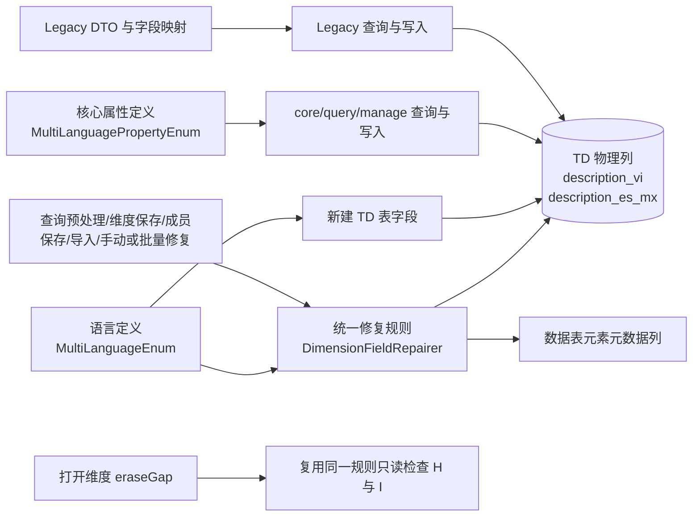
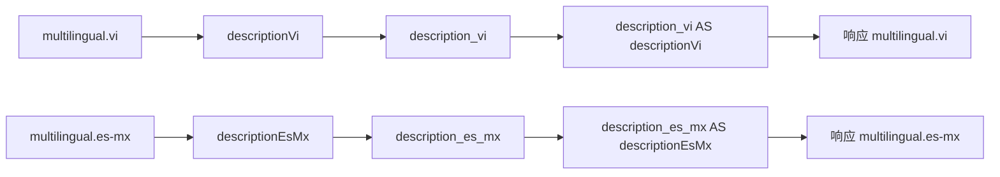
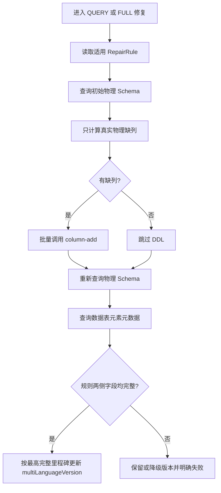

# 维度服务新增越南语和墨西哥西班牙语适配计划

> 状态：草稿
> 最后更新：2026-08-24
> 适用范围：`dimension-server` 的 `core`、`query`、`manage`、`dimension-web` 模块；代码基线为 `main_1.2_alpha` 分支 `9a0225c403659e4c8933f1a3383173071d15d01f`
> 关联文档：[平台新增语言适配实施计划](../../../平台/国际化/代码执行计划/2026-08-21-新增语言适配实施计划.md)

## 1. 交付目标

在维度服务已有葡萄牙语 `pt` 适配基础上，以当前分支的统一字段修复架构为准，增加以下两种成员描述语言：

| 语言 | 语言代码 | 数据库物理列 | Java/接口字段 | 枚举常量 |
| --- | --- | --- | --- | --- |
| 越南语 | `vi` | `description_vi` | `descriptionVi` | `VI` |
| 墨西哥西班牙语 | `es-mx` | `description_es_mx` | `descriptionEsMx` | `ES_MX` |

完成后应同时具备：

- 新建维度的 TD 成员表自动包含两个新物理列。
- 历史维度由当前统一的 `DimensionFieldRepairer` 补齐物理列和数据表元素元数据，并按最终状态更新 `multiLanguageVersion`。
- Legacy `dimension-web` 链路与 `core/query/manage` 对象化链路均能保存、查询和返回两种描述。
- 当前语言 `description`、显式 `fieldList`、`multilingual` Map、成员导入导出和成员搜索均使用同一字段映射。
- 原有通用西班牙语 `es` 与墨西哥西班牙语 `es-mx` 独立存储、独立查询，互不覆盖。
- 维度打开时的 `eraseGap`、单维度手动修复和当前 App 批量修复自动纳入两个新字段，不再维护额外补列清单。

## 2. 新分支复核结论

### 2.1 代码基线与检查方式

本次修订基于以下当前事实：

- 当前分支：`main_1.2_alpha`。
- 当前提交：`9a0225c403659e4c8933f1a3383173071d15d01f`。
- 扫描时 `dimension-server` 工作树无本地修改。
- 按当前 `harness/README.md` 重新加载后加字段兼容、字段一致性提示、字段映射、成员写路径和元素模型边界。
- 使用当前 `.codegraph/` 索引重扫多语言定义、建表、字段修复、查询预处理、维度保存、成员保存、导入、手动修复、批量修复及 `eraseGap` 调用链。
- 使用 Git 历史和当前 `pt` 落点重新核对葡萄牙语适配。
- 当前仓库仍只有 `MembersToSaveBuilderTest` 一份 Java 测试，没有多语言或 `DimensionFieldRepairer` 覆盖测试。

### 2.2 旧计划中已经失效的判断

上一版计划基于旧分支，显式生产文件为 18 个。当前分支逐文件核对后的差异是：

| 类型 | 旧计划 | 当前事实 |
| --- | --- | --- |
| 对象化查询补列 | `DimensionConvertUpdate.MultiLanguageUpdateDimension` | 类已删除；query 通过 `DimensionQueryPreprocessor` 在元素转换前调用统一修复器 |
| Legacy 补列 | `DimensionFieldHandler.checkMultiLanguage` | 类已删除；Legacy 查询、保存和成员写入也进入统一修复器 |
| 当前统一入口 | 旧计划未包含 | `DimensionFieldRepairer` 是唯一标准字段规则和 Schema 对账来源 |
| 显式生产文件数 | 18 | 17：新增修复器 1 个，移除两个旧补列器 |

当前葡萄牙语显式落点与旧计划对比结果为：

```text
当前 PT 落点：17 个文件
旧计划文件：18 个文件
旧计划漏项：DimensionFieldRepairer
旧计划过时项：DimensionFieldHandler、DimensionConvertUpdate
```

因此，本次不得在 query 或业务 Service 中重新增加第二套补列逻辑。

### 2.3 当前统一字段修复链路

当前 `DimensionFieldRepairer.repairRules()` 是标准增量字段的唯一规则源。每条规则同时描述：

- 维度主体中的修复标识。
- 适用维度类型。
- QUERY 或 FULL 修复范围。
- 要求存在的 TD 物理列。
- 要求存在的数据表元素元数据列。
- 根据最终两侧 Schema 回写修复标识的方式。

多语言目前由一条 `multiLanguageVersion` 规则管理 `description_ja`、`description_he`、`description_pt`。规则注释已经明确：未来语言不能只提高枚举版本，必须同步扩展对应的 `RepairRule` 里程碑。

下图展示两个新字段进入当前架构后的全景。



### 2.4 修复入口与副作用

| 入口 | 当前调用 | 新语言适配后的预期 |
| --- | --- | --- |
| Legacy 标准查询 | `DimensionInfoServiceImpl.getDimension(..., true)` → `repairForQuery` | `multiLanguageVersion` 未到新版本时补齐两个字段并局部保存版本 |
| core/query 查询 | `DimensionQueryStrategyConfiguration` → `DimensionQueryPreprocessor.beforeConvert` | 复用已查询元素执行相同 QUERY 修复，不恢复已删除的 `DimensionConvertUpdate` |
| 维度完整保存 | `repairBeforeSave` | 全量对账；最终版本只写入待保存对象，由正常元素保存提交 |
| 成员保存/树保存 | 编辑锁内 `repairBeforeMemberSave` | TD/TC DML 前补齐并立即提交最终标准修复标识；失败阻断成员写入 |
| 平台导入 REAR | `repairAfterImport` | 先清空标准标识，再修复两侧 Schema，成功后提交新版本 |
| 手动修复 | `/refactor/dimension/tools/repair-fields` | 强制执行全量规则并处理两个新列 |
| 当前 App 批量修复 | `/refactor/dimension/tools/repair-fields-by-app` | 顺序修复全部维度，单维度失败汇总后继续 |
| 打开维度 | `inspectRepairState` → `eraseGap` | 只读检查版本、两个新物理列和元数据列；不执行 DDL、不写标识 |

### 2.5 `es-mx` 连字符的额外风险

葡萄牙语代码 `pt` 不含地区连字符，单纯复制 PT 落点会漏掉当前两处旧式拼接：

```java
"description_" + language
```

当 `language=es-mx` 时会错误生成 `description_es-mx`，而目标物理列是 `description_es_mx`。当前两处都位于 `DimensionQueryServiceImpl`，本次必须改为复用：

```java
DimensionNormalUtil.getLanguageColumnActual(language)
```

其它已扫描的当前语言列路径均通过 `MultiLanguageEnum` 或 `MultiLanguagePropertyEnum` 解析，不需要额外做连字符替换。不得在通用代码中增加 `language.replace("-", "_")`，避免绕过预置语言校验。

## 3. 字段与版本决策

### 3.1 字段映射



- 对外显式字段、Java DTO 属性和 SQL alias 使用 `descriptionVi`、`descriptionEsMx`。
- 建表、补列和写路径使用 `description_vi`、`description_es_mx`。
- `multilingual` Map 和导入导出表头使用 `vi`、`es-mx`。
- 不新增 `es_MX`、`vi-VN` 等额外代码兼容。
- 大小写行为沿用当前 `LinkedCaseInsensitiveMap`；下划线和不同地区代码不视为同一语言。
- 历史兼容 DTO `DimensionMembersDto` 继续使用其既有 snake_case 形式，新增 `description_vi`、`description_es_mx`，不在本需求中重命名旧字段。

### 3.2 版本里程碑

计划新增：

```java
public static final long ADD_VI_ES_MX_VERSION = 20260824L;
public static final long CURRENT_VERSION = ADD_VI_ES_MX_VERSION;
```

实现开始前必须重新确认目标分支没有更大的并行版本；如存在，选择更大且唯一的单调版本。

`multiLanguageVersion` 的最终状态必须由同一条规则按 Schema 完整程度计算：

```text
JA + HE + PT + VI + ES_MX 两侧完整 -> ADD_VI_ES_MX_VERSION
JA + HE + PT 两侧完整             -> ADD_PT_VERSION
JA + HE 两侧完整                  -> ADD_JA_HE_VERSION
其它                              -> 0
```

不新增第二个同名状态字段，也不创建业务 Service 私有补列清单。

## 4. 范围

### 4.1 本次包含

- 两套语言枚举和字段三元组。
- 新建维度 TD 表字段派生。
- `DimensionFieldRepairer` 中唯一的多语言修复规则和版本状态机。
- Legacy DTO、Swagger 模型、Map/Bean 转换、查询 SQL、保存适配。
- 两处 `description_ + language` 的 `es-mx` 安全修正。
- core/query/manage 枚举驱动的查询、保存、CSV 导入和成员搜索回归。
- 查询、完整保存、成员保存、导入、手动/批量修复、`eraseGap` 的规则传播验证。
- 聚焦单测、模块测试、建包和真实数据表服务联调。

### 4.2 明确不包含

- 不在平台、空间、account、system 等服务中注册、翻译或启用 `vi`、`es-mx`。
- 不自动翻译或复制已有 `es`、`pt` 描述；新列初始值为 `null`。
- 不新增静态消息资源文件或数据库初始化 SQL。
- 不恢复 `DimensionFieldHandler` 或 `DimensionConvertUpdate`。
- 不修改 `DimensionQueryPreprocessor`、`DimensionElementResolver`、`DimensionFieldRepairBatchService`、`DimensionToolsController` 或 `eraseGap` 响应模型；它们通过同一规则自动获得新字段。
- 不重构两套语言枚举、Legacy DTO 或所有硬编码语言列为新的统一框架。
- 不改变权限、缓存、表达式语法、分页、排序、空结果和异常格式。
- 不让 `es-mx` 自动回退到 `es`，也不接受数据库物理列名作为新增接口字段。

### 4.3 影响模块

| 模块 | 影响 | 说明 |
| --- | --- | --- |
| `core` | 直接修改 | 增加对象化成员属性定义 |
| `query` | 无生产代码修改，需回归 | 查询、成员搜索和缓存从 core 属性及查询预处理扩展点自动获得新语言 |
| `manage` | 无生产代码修改，需回归 | CSV 表头和保存属性从 core 枚举动态获取 |
| `dimension-web` | 直接修改 | 统一修复规则、Legacy DTO、SQL、适配和导入导出集成 |
| `common` | 不修改 | 未发现语言专属逻辑 |

## 5. 最小生产代码改动清单

当前显式生产代码改动为 17 个文件。

### 5.1 语言定义与统一字段修复：3 个文件

| 文件与符号 | 具体改动 |
| --- | --- |
| `dimension-server/core/src/main/java/com/proinnova/dimension/core/MemberProperties.java`，`MultiLanguagePropertyEnum` | 增加 `VI("vi", "description_vi", "descriptionVi", "越南语描述")` 和 `ES_MX("es-mx", "description_es_mx", "descriptionEsMx", "墨西哥西班牙语描述")` |
| `dimension-server/dimension-web/src/main/java/com/proinnova/refactor/v2/dimension/MultiLanguageEnum.java` | 增加 `VI`、`ES_MX`、`ADD_VI_ES_MX_VERSION`，将 `CURRENT_VERSION` 指向新里程碑 |
| `dimension-server/dimension-web/src/main/java/com/proinnova/refactor/handler/DimensionFieldRepairer.java`，`repairRules` | 为多语言规则声明两个新 `DataTableColumnDTO`；扩展 `flagComplete`、字段集合和里程碑回写；将规则说明更新为 `description_ja/he/pt/vi/es_mx`，Account QUERY 更新为 4 条规则/8 个字段、FULL 更新为 6 条规则/12 个字段 |

`DimensionFieldRepairer` 应继续只向 `/column-add` 提交初始物理 Schema 真正缺失的列，随后重新查询物理列和数据表元素元数据，以最终状态决定版本。不得退回“捕获已存在列即视为成功”的旧逻辑。

### 5.2 Legacy DTO、写入与兼容适配：8 个文件

| 文件与符号 | 具体改动 |
| --- | --- |
| `dimension-server/dimension-web/src/main/java/com/proinnova/dimension/domain/dto/DimensionMembersDto.java` | 增加历史字段 `description_vi`、`description_es_mx` |
| `dimension-server/dimension-web/src/main/java/com/proinnova/refactor/domain/dto/DimensionMemberNewDto.java` | 增加内部字段 `descriptionVi`、`descriptionEsMx`，沿用 `@JsonIgnore` |
| `dimension-server/dimension-web/src/main/java/com/proinnova/refactor/domain/dto/DimensionMemberOperationDto.java` | 增加内部操作字段 `descriptionVi`、`descriptionEsMx`，沿用 `@JsonIgnore` |
| `dimension-server/dimension-web/src/main/java/com/proinnova/refactor/domain/dto/DimensionMembersQueryDto.java` | 增加两个查询字段；`getDescription(language)` 增加 `vi`、`es-mx` 分支 |
| `dimension-server/dimension-web/src/main/java/com/proinnova/refactor/domain/swag/DimensionMembersQuerySw.java` | 增加两个 Swagger 返回字段 |
| `dimension-server/dimension-web/src/main/java/com/proinnova/dimension/service/impl/DimensionCompatibleServiceImpl.java` | 旧 snake_case DTO 转 NewDto 时复制两个字段 |
| `dimension-server/dimension-web/src/main/java/com/proinnova/refactor/service/impl/DimensionMemberRefactorServiceImpl.java` | `handleDescription` 从 `multilingual` 读取两个 key；两处 NewDto → OperationDto 转换复制两个字段 |
| `dimension-server/dimension-web/src/main/java/com/proinnova/refactor/util/BeanToMapUtil.java` | Map → `DimensionMembersQueryDto` 时读取两个 camelCase 字段 |

### 5.3 Legacy 查询字段与结果转换：6 个文件

| 文件与符号 | 具体改动 |
| --- | --- |
| `dimension-server/dimension-web/src/main/java/com/proinnova/refactor/constants/DimensionMemberFieldConstants.java` | 增加 `descriptionVi`、`descriptionEsMx` 常量 |
| `dimension-server/dimension-web/src/main/java/com/proinnova/refactor/constants/MapKeyConstants.java` | `MULTILINGUAL_KEY` 增加两条物理列 `AS` 映射；`MULTILINGUAL_COL_KEY` 增加两个物理列 |
| `dimension-server/dimension-web/src/main/java/com/proinnova/refactor/dao/SqlUtils.java` | 增加两个物理列常量，并在默认结果列表中使用 camelCase alias |
| `dimension-server/dimension-web/src/main/java/com/proinnova/refactor/dao/DefaultMemberQueryDao.java` | 在当前 3 处完整多语言物理列片段中加入两个新列 |
| `dimension-server/dimension-web/src/main/java/com/proinnova/dimension/service/impl/DimensionQueryServiceImpl.java` | 更新当前 2 处完整多语言列片段；另将 2 处 `"description_" + language` 改为 `getLanguageColumnActual(language)` |
| `dimension-server/dimension-web/src/main/java/com/proinnova/refactor/util/DimensionNormalUtil.java` | 更新 `commonKey`、`combMultLingualBean`、`getDataByMethodV2` 和反射 getter Map；保留其它枚举驱动逻辑 |

### 5.4 无需修改但必须回归的自动扩展路径

| 路径 | 自动覆盖依据 |
| --- | --- |
| `TableCreateRefactorUtil.createDimension` | 遍历 `MultiLanguageEnum.values()` 创建新 TD 列 |
| `TableDimensionColumns.languageColumns` | 遍历 Web 枚举生成字段元数据 |
| `DimensionUpgradeServiceImpl.getDataTableChangeParam` | 遍历 Web 枚举生成升级字段 |
| `DimensionInfoServiceImpl.initializeTableAndElement` | 新建维度使用 `MultiLanguageEnum.CURRENT_VERSION` |
| `DimensionQueryPreprocessor` 和 `DimensionQueryStrategyConfiguration` | core/query 元素转换前自动进入 `DimensionFieldRepairer` |
| `repairBeforeSave`、`repairBeforeMemberSave`、`repairAfterImport`、`repairManually` | 均复用 `repairRules()`，不维护字段副本 |
| `DimensionFieldRepairBatchService` | 逐维度调用单维度全量修复 |
| `inspectRepairState` 与 `NewDimensionVo.eraseGap` | 复用全部适用规则，只读检查两侧 Schema |
| `MemberProperties` 默认查询/返回/编辑集合 | 遍历 `MultiLanguagePropertyEnum.values()` 注册属性 |
| `MemberQueryServiceImpl`、`MemberQueryDaoImpl`、`MemberSearchDocumentProjector` | 通过 core 枚举选择当前语言列 |
| `ImportFullByCsvInputStream` | 通过 core 枚举识别语言代码、字段名、列名和注释 |
| `SupportLanguageServiceImpl`、`NoModelDataListener`、`DimensionMemberExportServiceImpl` | 从空间动态取得语言代码并读写 `multilingual` Map |

## 6. 实施步骤

### 1. 冻结标识、字段名和版本

- 修改位置：不改代码；核对两套枚举、当前最大多语言版本和平台语言代码。
- 具体改动：确认 `vi`、`es-mx` 及两套字段名；确认本批次使用一个新里程碑。
- 依赖关系：平台/空间必须使用完全相同的语言代码。
- 验证方式：评审 `/language/manage-list` 样例和请求头；确认现有 `es` 继续独立存在。

### 2. 扩展两套语言定义和唯一 RepairRule

- 修改位置：第 5.1 节 3 个文件。
- 具体改动：增加两套枚举项和新版本；在现有 `multiLanguageVersion` RepairRule 中加入两个字段并完善四级里程碑回写。
- 依赖关系：步骤 1。
- 验证方式：断言代码、Java 字段、物理列、描述、类型和长度；断言规则要求列集合为 JA、HE、PT、VI、ES_MX，且旧里程碑可正确降级。

标准修复流程如下：



### 3. 补齐 Legacy DTO、保存和兼容转换

- 修改位置：第 5.2 节 8 个文件。
- 具体改动：按葡语相邻位置增加两个字段、Map 拆装和 DTO 复制，保持现有注解、空值与异常语义。
- 依赖关系：步骤 2 的字段定义已冻结。
- 验证方式：使用同时包含 `vi`、`es`、`es-mx` 的样例做 Map → NewDto → OperationDto → QueryDto → Map 往返，断言三种值互不覆盖。

### 4. 补齐查询映射并修正地区代码列名

- 修改位置：第 5.3 节 6 个文件。
- 具体改动：补齐物理列和 alias；显式字段继续只接受 camelCase；两处直接拼列名改为枚举解析。
- 依赖关系：步骤 2、3。
- 验证方式：覆盖默认字段、显式字段、`multilingual`、当前语言 `description` 和 Legacy 树/权限分支；生成 SQL 中不得出现 `description_es-mx`。

### 5. 增加统一修复与映射测试

- 修改位置：优先在已有测试依赖完整的 `dimension-web/src/test/java` 新增测试，建议：
  - `com.proinnova.refactor.handler.DimensionFieldRepairerTest`
  - `com.proinnova.refactor.v2.dimension.MultiLanguageDefinitionTest`
  - `com.proinnova.refactor.util.DimensionMultiLanguageMappingTest`
  - `com.proinnova.dimension.service.impl.DimensionQueryServiceLanguageTest`
- 具体改动：覆盖新里程碑、缺列计划、最终两侧复查、入口标识提交策略、`eraseGap`、连字符列名和 DTO/Map 往返。
- 依赖关系：步骤 2 至 4。
- 验证方式：聚焦测试失败时能够指出具体缺少的语言、物理列、元数据列、版本或映射方向。

### 6. 执行批量迁移和端到端验收

- 修改位置：不新增生产代码；使用当前分支已有手动/批量修复入口。
- 具体改动：先部署代码并保持平台语言未开放；按 App 执行批量字段修复，处理失败项后再开放语言。
- 依赖关系：步骤 5；平台/空间已注册但尚未对用户启用两个代码。
- 验证方式：保存批量结果、字段修复日志、两侧 Schema、元素版本、接口响应和导入导出证据。

## 7. 测试计划

### 7.1 `DimensionFieldRepairer` 聚焦场景

| 场景 | 初始状态 | 预期 |
| --- | --- | --- |
| PT 版本升级 | 版本为 `ADD_PT_VERSION`，两侧均缺 VI/ES_MX | 增列请求只含两个新列；最终两侧完整后版本升至新里程碑 |
| 部分物理列已存在 | VI 已存在、ES_MX 缺失 | 只提交 ES_MX，不重复提交 VI |
| 物理完整、元数据缺失 | 两个物理列存在但元数据不完整 | 不错误晋级；修复明确失败，`eraseGap=true` |
| 增列接口抛错但最终完整 | 并发或幂等场景最终两侧已完整 | 以最终状态为准，允许成功并记录被忽略的增列异常 |
| 增列后仍缺列 | 最终任一侧缺字段 | 版本不晋级，QUERY/SAVE/MEMBER_SAVE/MANUAL 按既有失败语义处理 |
| 旧里程碑降级 | 仅 JA/HE/PT 完整 | 版本保持 PT；仅 JA/HE 完整时回到 JA_HE；其余为 0 |
| QUERY 快速路径 | 元素已标记新版本 | 沿用能力证书直接返回，不实时查 Schema |
| 标记完成但 Schema 被破坏 | 新版本但缺新列 | `inspectRepairState` 返回 gap；MANUAL/批量全量修复负责收敛 |
| SAVE | 最终完整 | 只更新待保存对象，不提前调用平台 update-element |
| MEMBER_SAVE/TREE_SAVE | 最终完整 | 在成员锁内、TD/TC DML 前立即提交新版本；失败阻断写入 |
| IMPORT | 导入元素携带任意旧标识 | 先清空标准标识，再按最终 Schema 提交新版本；提交失败按当前回滚语义处理 |

### 7.2 字段、查询和接口场景

- 两套枚举均可用语言代码、物理列和 Java 字段查到 VI、ES_MX。
- 新建表派生字段同时包含 `description_vi`、`description_es_mx`，类型为 `varchar(255)` 可空。
- `fieldList=[descriptionVi, descriptionEsMx]` 生成物理列 `AS` camelCase。
- `fieldList=[multilingual]` 返回 Map 含 `vi`、`es-mx`。
- 当前语言为 `es-mx` 的 Legacy 树/权限查询使用 `description_es_mx`，SQL 中无 `description_es-mx`。
- `fieldList` 传 `description_es_mx` 或语言传 `es_MX` 时继续按原未知字段/不支持语言语义处理。
- `es` 与 `es-mx` 同时保存、查询、搜索时不串值。
- Lucene 成员搜索作用域用 `es-mx` 时能从 core 枚举投影正确字段，缓存/索引语言隔离不变。
- Excel/CSV 导入导出表头为 `vi`、`es-mx`，数据能往返。

### 7.3 端到端验证

1. 新建一个普通维度，确认 TD 物理 Schema、数据表元素元数据及 `multiLanguageVersion` 均为新状态。
2. 准备一个 PT 版本历史维度，调用普通查询，确认 QUERY 修复补齐新列。
3. 准备一个字段部分存在的历史维度，调用单维度手动修复，确认只提交真实缺列。
4. 对测试 App 调用：

   ```text
   POST /refactor/dimension/tools/repair-fields-by-app
   ```

   确认 `totalCount = successCount + failureCount`，失败项不阻断后续维度，最终 `allSucceeded=true` 后才进入语言开放。
5. 打开维度检查 `eraseGap`。注意它覆盖全部适用 RepairRule；若仍为 `true`，按 `INSPECTION_RESULT` 日志区分多语言、Alias、指标公式或其它字段，不把布尔值直接等同于多语言失败。
6. 保存成员：

   ```json
   {
     "multilingual": {
       "vi": "Mô tả tiếng Việt",
       "es": "Descripción general",
       "es-mx": "Descripción de México"
     }
   }
   ```

7. 分别用 `vi`、`es`、`es-mx` 查询 `description`、显式字段及 `multilingual`。
8. 完成一次导入导出往返和一次成员搜索验证。
9. 至少在目标发布数据库完成真实补列；数据库方言差异继续由数据表服务和 DAO 层处理。

### 7.4 构建与静态检查

在 `dimension-server` 根目录执行：

```bash
git diff --check
mvn -pl :dimension-web -am test
mvn -pl :dimension-web -am package
```

提交前检查葡语显式落点与新增字段，不把枚举驱动文件误判为漏改：

```bash
rg -n -i 'description[_]?pt|ADD_PT_VERSION|"pt"' core query manage dimension-web
rg -n 'descriptionVi|description_vi|descriptionEsMx|description_es_mx|ADD_VI_ES_MX_VERSION' \
  core query manage dimension-web
rg -n '"description_" *\+ *language' dimension-web/src/main/java
```

最后一条应无命中；若出现新命中，必须判断该位置需要物理列还是仅为显示文本。

## 8. 发布、迁移与回滚

### 8.1 发布前置条件

- 平台/空间已注册 `vi`、`es-mx`，但在维度字段迁移完成前不对最终用户开放。
- 数据表服务的 `/column-add` 能同时更新 TD 物理列和数据表元素元数据；联调环境可分别查询两侧。
- 目标分支的新版本常量未与并行开发冲突。
- 产品确认 `es-mx` 是独立语种，不读取 `es` 作为回退。

### 8.2 推荐迁移顺序

1. 发布维度服务代码，平台语言保持关闭。
2. 用单个测试维度验证 QUERY 修复和 `eraseGap`。
3. 按 App 调用 `/refactor/dimension/tools/repair-fields-by-app`，保存成功/失败清单。
4. 对失败维度修复路由或数据表状态后，调用 `/repair-fields` 单独重试，再重新执行 App 批次确认全量成功。
5. 抽查 `multiLanguageVersion`、物理列和元数据列三方一致性。
6. 验证成员保存、查询、搜索、导入导出后，再由平台/空间开放两个语言。

QUERY 修复仍提供懒升级兜底，但不应代替上线前批量迁移。App 批量入口是顺序执行且允许部分失败，发布流程必须检查响应而不是只看 HTTP 成功。

### 8.3 监控

- 过滤日志前缀 `[DIMENSION_FIELD_REPAIR]`，关注 `COLUMN_ADD_FAILED`、`SCHEMA_RESULT`、`STATE_SAVE` 和 `INSPECTION_RESULT`。
- 过滤 `[DIMENSION_FIELD_REPAIR_BATCH]`，关注 `failureCount` 和逐维度失败原因。
- 监控首批 `es-mx` 查询是否出现 `description_es-mx`、未知字段或数据库列不存在异常。
- 对 `eraseGap=true` 按规则明细分类，避免把其它后加字段问题误归因于新语言。

### 8.4 回滚

- 先在平台/空间禁用 `vi`、`es-mx`，再回滚维度服务。
- 已新增的物理列、元数据列和成员描述数据不删除。
- 不手工降低 `multiLanguageVersion`；旧代码只识别到 PT 里程碑时会忽略更高版本和额外列。
- 重新发布后可再次执行 App 批量修复，按最终两侧 Schema 幂等收敛。
- 回滚后回归中文、英文、通用西班牙语和葡萄牙语，确认旧语言不受影响。

## 9. 风险与待确认事项

| 类型 | 风险/待确认事项 | 应对 |
| --- | --- | --- |
| 已知风险 | 两套语言枚举可能漂移 | 同一提交修改并增加双枚举一致性测试 |
| 已知风险 | `multiLanguageVersion` 同时承载多个历史里程碑 | 只扩展现有 RepairRule 状态机，覆盖新、PT、JA_HE、0 四级结果 |
| 已知风险 | Legacy 两处直接拼接语言代码会生成 `description_es-mx` | 改用预置枚举解析，并以静态搜索和 Legacy 集成测试门禁 |
| 已知风险 | QUERY 快速路径信任完成标识，不实时验证 Schema | 沿用当前能力证书设计；上线批量修复，打开时由 `eraseGap` 只读发现结构损坏 |
| 已知风险 | 物理列存在但元数据缺失时不会重复提交已存在物理列 | 最终两侧复查必须失败并进入人工/数据表服务修复，不允许错误晋级 |
| 发布风险 | App 批量修复顺序执行且允许部分失败 | 检查响应计数和失败清单，逐项重试直到 `allSucceeded=true` |
| 外部依赖 | 空间未启用语言时导入导出没有对应表头 | 字段迁移后再启用，维度服务不硬编码空间语言列表 |
| 兼容风险 | 调用方发送 `es_MX` 或期望 `es` 回退 | 契约固定为 `es-mx`，不增加无来源兼容 |
| 数据风险 | 新列没有历史翻译 | 需要翻译或复制时另立数据迁移任务，本计划保持 `null` |
| 验证缺口 | 当前没有统一字段修复和多语言专项测试 | 本次必须新增聚焦测试，并保留真实两侧 Schema 联调证据 |

## 10. 完成标准

- [ ] 给定新建维度，当 TD 创建完成时，则物理 Schema 和数据表元素元数据均包含 `description_vi`、`description_es_mx`，版本为新里程碑。
- [ ] 给定 PT 版本历史维度，当进入 QUERY 修复时，则只提交真实缺失的新列，最终两侧完整后才提升版本。
- [ ] 给定任一新列已存在，当执行修复时，则不会把已存在物理列再次发送给 `/column-add`。
- [ ] 给定物理列或元数据列任一侧不完整，当修复结束时，则不得写入新版本；失败语义与入口约定一致。
- [ ] 给定新版本标识但 Schema 被异常删除，当打开维度时，则 `eraseGap=true`；手动或 App 批量修复可以重新收敛。
- [ ] 给定成员同时含 `es` 与 `es-mx`，当保存、查询和搜索时，则两个值互不覆盖。
- [ ] 给定请求语言 `vi` 或 `es-mx`，当查询当前语言 `description` 时，则分别使用 `description_vi`、`description_es_mx`。
- [ ] 给定 `fieldList=[descriptionVi, descriptionEsMx]`，当查询成员时，则返回 camelCase 字段并使用明确 SQL alias。
- [ ] 给定 `fieldList=[multilingual]`，当查询成员时，则响应含 `vi`、`es-mx`，原有 key 和空值语义不变。
- [ ] Legacy 路径生成的 SQL 中不存在 `description_es-mx`，源码中不存在 `"description_" + language` 残留。
- [ ] App 批量修复结果最终为 `allSucceeded=true`，失败项均已关闭或明确移交。
- [ ] 成员导入导出和成员搜索使用 `vi`、`es-mx` 完成往返。
- [ ] 中文、英文、通用西班牙语、葡萄牙语及旧接口响应结构回归通过。
- [ ] `git diff --check`、`mvn -pl :dimension-web -am test`、`mvn -pl :dimension-web -am package` 全部通过，失败或跳过项有明确记录。
- [ ] 生产代码改动保持在第 5 节列出的 17 个文件内；如扩大范围，已有独立证据和评审结论。
