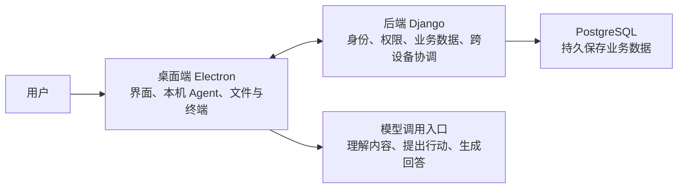

# 用后端经验看架构

> 状态：草稿
> 最后更新：2026-09-08
> 适用范围：Java 开发者理解 TabTin 桌面端与后端
> 关联文档：[入门目录](说明.md) · [上一篇](02-核心概念.md) · [下一篇：任务流程](04-一次任务如何完成.md)

**你的接口、数据库、权限、事务和异步任务经验都能用上。新增的重点是：桌面客户端也承担实际执行工作。**

## 先看四个主要部分

这张图只说明职责；真实请求会走 HTTP、进程通信或实时连接等不同通道。

图中的“模型调用入口”是逻辑概括。平台模型通常经 Django 代理访问供应商；部分配置有专用调用路径。

## Electron 为什么值得后端同学了解

Electron 用网页技术做桌面应用。主进程和渲染进程分工如下：

| 部分 | 负责什么 | 你排查什么问题时会碰到 |
| --- | --- | --- |
| 渲染进程（React） | 显示页面、接收操作、更新界面状态 | 页面没刷新、消息展示不对 |
| 主进程（Node.js） | 管理窗口，承载本机 Agent，访问文件、终端等设备能力 | 命令没执行、本地文件读不到 |
| 预加载脚本（Preload） | 向页面暴露受控接口，衔接主进程能力 | 页面调用本机能力失败 |

**Preload 是桥接脚本。** 主进程与渲染进程通过进程间通信（IPC）配合；Preload 不是独立的第三个进程。

所以排查“AI 没有生成本地文件”时，也要看 Electron 主进程和实际目录。

## 用 Spring 经验对照 Django

以下是职责类比，具体写法和运行机制仍按 Django 理解。

| Java 项目里熟悉的东西 | 这里先看什么 |
| --- | --- |
| Spring Boot / Web 框架 | Django + Django Ninja：应用配置、HTTP 路由、接口处理 |
| Controller | `api.py` 或 `routers/*.py` 中的路由函数 |
| DTO、参数校验 | `Schema`，常在 `schemas.py` 或 `schemas/` |
| Service | `services/` 中的业务函数或服务类 |
| Entity、Repository、查询构造器 | Django Model 和 QuerySet；常直接通过 `Model.objects` 查询 |
| Flyway / Liquibase | `migrations/`：数据库结构变更记录 |
| 配置文件 | `settings.py` 和仓库根目录 `.env` |
| 异步任务消费者、定时任务 | Celery Worker 和 Beat |

Django 里的 `apps/tabtinspace` 这类 app 是**后端业务模块**，多个模块随同一个 Django 服务运行；产品里的 TabDoc 等 App 是**用户能力入口**。

Redis 主要用于缓存、消息通道和异步任务队列；需要长期保存的核心业务数据仍写 PostgreSQL。

## 目录先认这些就够

下表路径相对于 TabTin 代码仓库；点击可打开本机目录。

| 代码位置 | 你去这里找什么 |
| --- | --- |
| [apps/tabtin_django](/Users/yang/Documents/larchiveai/TabTin/apps/tabtin_django) | 后端接口、权限、模型、异步任务 |
| [apps/tabtin-electron](/Users/yang/Documents/larchiveai/TabTin/apps/tabtin-electron) | 桌面界面、本机执行能力 |
| [packages/agent-runtime](/Users/yang/Documents/larchiveai/TabTin/packages/agent-runtime) | Agent 怎样反复调用模型和工具 |
| [apps/collab-live](/Users/yang/Documents/larchiveai/TabTin/apps/collab-live) | 文档、表格等多人编辑同步 |
| [apps/tabtin-im](/Users/yang/Documents/larchiveai/TabTin/apps/tabtin-im) | 当前聊天服务，使用 Go，接腾讯云 IM |
| [packages/tabtin-cli-go](/Users/yang/Documents/larchiveai/TabTin/packages/tabtin-cli-go) | `tabtin` 命令行入口 |

仓库还有 iOS、Android、管理后台及无头执行端。先跟着负责的功能进入对应目录。

## 实时问题按现象找服务

| 现象 | 优先了解的链路 |
| --- | --- |
| Agent 执行进度没有更新 | Electron 事件流；跨设备同步还涉及 Django Gateway |
| 文档修改没有同步给另一人 | Collab Live |
| 普通聊天消息、未读数异常 | Electron 腾讯 Provider → TabTin IM / 腾讯云 IM |
| 非聊天的产品通知没更新 | Centrifugo |

现行普通聊天主链路使用腾讯云 IM。Django 的旧 `apps/tabchat/` 实现仍有残留，不能据此选定修复位置。

依据：[后端依赖](/Users/yang/Documents/larchiveai/TabTin/apps/tabtin_django/requirements.txt) · [Electron 预加载入口](/Users/yang/Documents/larchiveai/TabTin/apps/tabtin-electron/src/preload/index.ts) · [仓库工作说明](/Users/yang/Documents/larchiveai/TabTin/AGENTS.md)。
