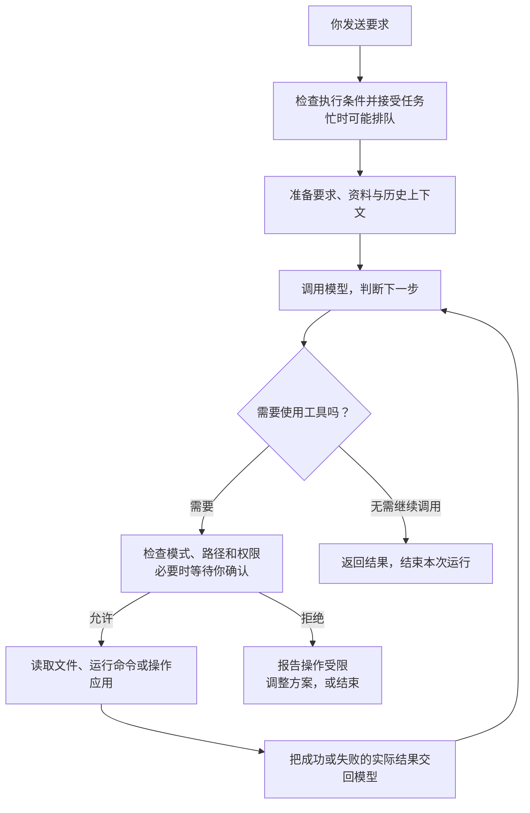

# 一次任务如何完成

> 状态：草稿
> 最后更新：2026-09-08
> 适用范围：理解 TabTin 的本机 Agent 执行流程
> 关联文档：[入门目录](说明.md) · [上一篇](03-用后端经验看架构.md) · [下一篇：上手路线](05-第一周上手路线.md)

普通接口通常是“请求进来 → 执行业务 → 返回结果”。

**Agent 任务可能持续较久：读材料、调用模型、执行工具、等待授权，再继续下一步。** 发送被接受，只表示开始处理或进入队列。

## 继续用“整理学习清单”举例

这次要求：“读取工作目录里的入职资料，生成一份学习清单文件。”假设你已经有可用的模型、执行设备和目录。

下图描述本机执行的主要过程：

在这个例子中，模型可能先请求读文件，拿到内容后整理清单，再请求写文件。工具结果会告诉它读取或写入是否成功。

这个反复“判断下一步 → 执行 → 查看结果”的过程，就是 Agent 运行时（Runtime）负责组织的核心工作。

## 模型和工具各干什么

模型负责理解、选择行动和生成内容。**真正读取文件、写入文档、运行命令的是工具及其执行程序。**

因此，模型说“我已经生成了文件”，还要核对写入结果和实际文件。

平台会依据当前模式和权限决定操作能否进行。看到“等待确认”时，任务可能正在等待人的决定；看到明确失败时，要沿失败的步骤排查。

## 为什么公司强调命令行能力

命令行接口（CLI）让人和 Agent 都能通过 `tabtin` 命令调用平台能力，也便于脚本组合和验证。

例如一项“读取文档”的能力，需要考虑界面如何使用、Agent 如何调用、错误怎样返回，以及结果怎样验证。具体命令以 CLI 帮助和对应能力文档为准。

本机命令可能调用 Electron 提供的设备能力，也可能请求后端 API，执行位置由能力决定。

## 运行中会留下什么

| 你看到或要检查的东西 | 去哪里理解 |
| --- | --- |
| 正在输出的回答、工具步骤、运行状态 | 客户端界面与事件处理 |
| 本机执行过程的详细记录 | Electron 本地运行档案与日志 |
| 需要跨设备查看的任务记录和状态 | Django 持久化与事件同步 |
| 最终文档、表格或文件 | 对应 App 资源，或实际文件目录 |

本地过程记录、后端记录和最终成果可能更新于不同时间。重开任务后内容丢了，与“工具没有执行成功”应沿不同位置排查。

## 第一次读代码只跟三个入口

1. [ElectronAgentHost](/Users/yang/Documents/larchiveai/TabTin/apps/tabtin-electron/src/main/agent/ElectronAgentHost.ts)：找 `submitQuery`，理解宿主怎样接受执行请求。
2. [AgentLoop](/Users/yang/Documents/larchiveai/TabTin/packages/agent-runtime/src/engine/core/loop.ts)：理解模型与工具怎样循环配合。
3. [relay_handler.py](/Users/yang/Documents/larchiveai/TabTin/apps/tabtin_django/apps/services/common/ws/handlers/relay_handler.py)：理解运行事件怎样进入后端同步链路。

这些文件较大，首次只跟一个方法及其直接调用。完整启动过程和其他执行路径，等接到相应需求再读。
