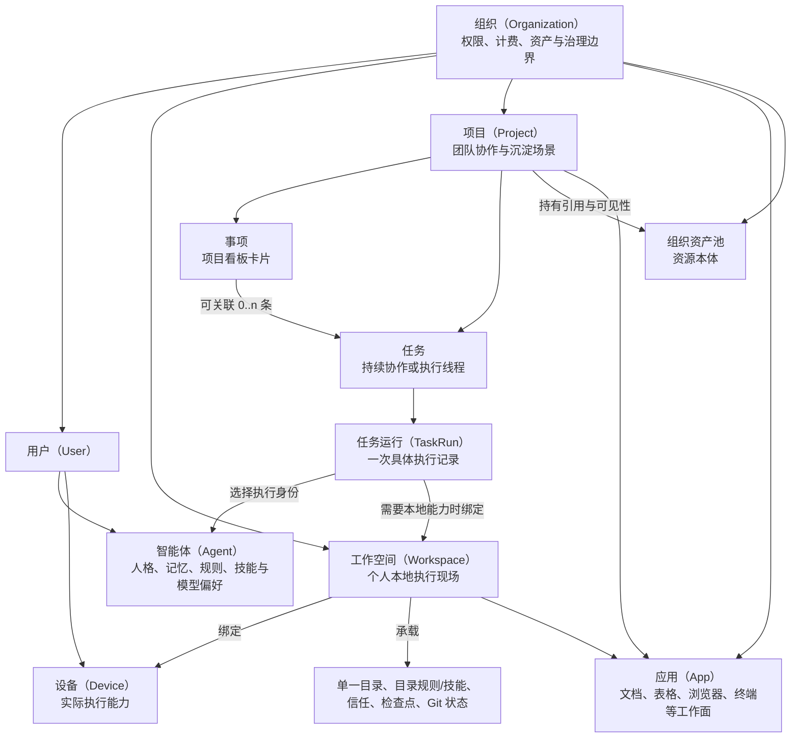
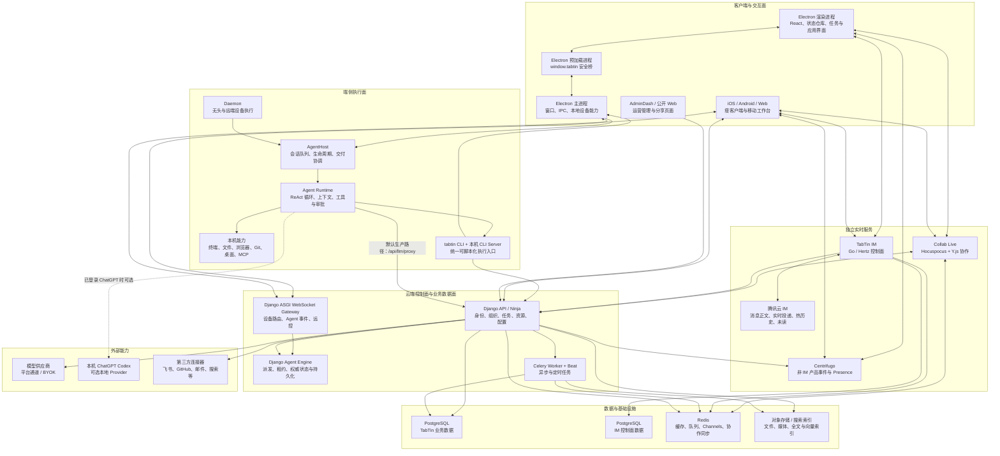
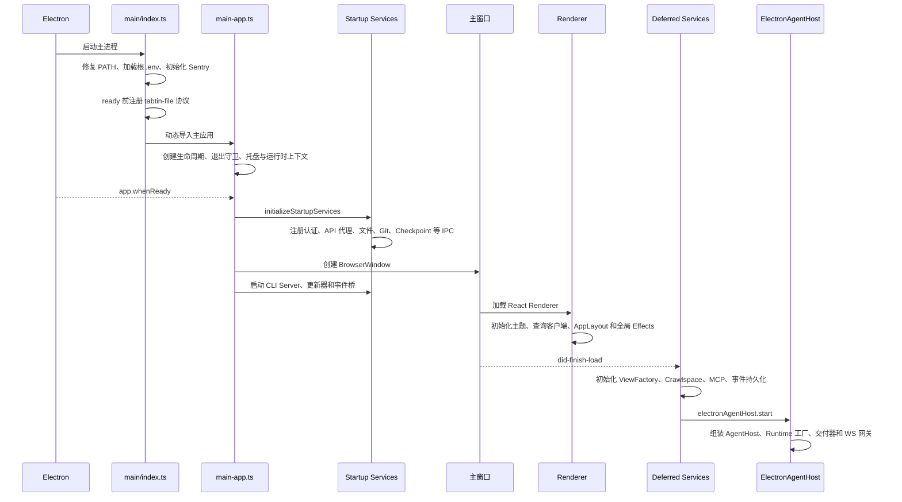
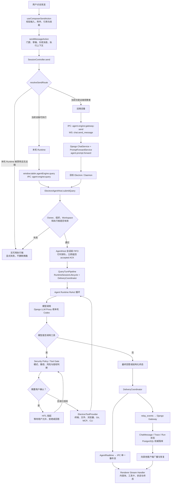
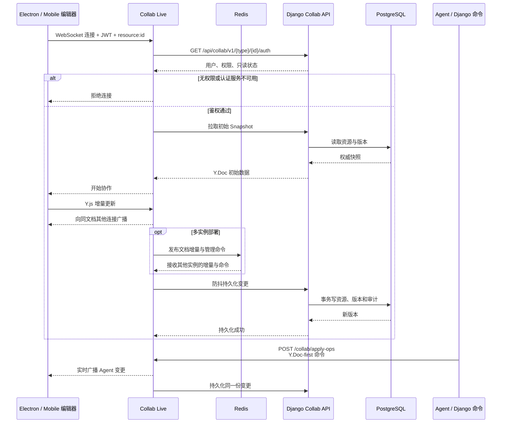

# 原始架构扫描（留档）

> 状态：已废弃（已由入门系列替代）
> 最后更新：2026-09-08
> 适用范围：本次重写前的说明快照，仅供追溯
> 关联文档：[新人入门](../说明.md)

原文完整保留在下方。首次学习请从入门系列开始；本页不作为当前产品定义或操作依据。

重写时已核对的差异：Preload 是预加载脚本，不是独立进程；当前代码中的 Project 已有独立模型，不能继续按旧 Space 类型理解。原文其余详细实现未在本次逐项重新验收。

---

# TabTin 项目架构导览

> 状态：草稿
> 最后更新：2026-09-08
> 适用范围：TabTin 单仓 `release/260905`，重点覆盖 Electron、Agent Runtime、Django、实时协作、即时通信和统一 CLI
> 关联文档：暂无；本文是 `docs` 仓库中的新人入口，代码事实源列在“代码锚点”章节
> 扫描基线：`fd820118b30c`；扫描时工作树存在 3 处与本文无关的既有修改，本文未改动或引用它们

## 1. 先记住三句话

1. **TabTin 是端侧 Agent 平台，不是普通的前后端应用。** Electron 主进程既是桌面宿主，也是本地 Agent 执行面；React 渲染进程只负责交互和状态投影。
2. **Django 是云端控制面和业务数据面。** 它负责身份、组织、任务、应用资源、执行路由、权威配置、事件落库和异步任务；需要本地文件、终端或浏览器能力时，执行会落到 Electron 或 Daemon 所在设备。
3. **实时链路不止一条。** Agent 事件走 Django WebSocket Gateway，协作文档走 Collab Live，非 IM 产品通知走 Centrifugo，聊天正文和热历史的现行主链路走 TabTin IM + 腾讯云 IM。

本文面向刚入职、尚未形成项目心智的研发同学。结论来自 2026-09-08 对当前工作树的 CodeGraph 扫描和源码复核；它描述的是静态代码架构，不代表生产流量、容量或部署实例数。

## 2. 产品对象先于代码目录

理解代码前，先把以下几个对象分开。很多历史文件仍使用 `Space`、`Task`、`Conversation` 等旧实现名，不能反向拿它们定义当前产品语言。

下图回答“谁拥有、在哪里协作、在哪里执行、由谁执行”。



必须避免的三个混淆：

- `Workspace` 是个人执行现场，`Project` 是团队协作场景；Project 不是共享本地目录。
- “事项”是看板卡片，“任务”是协作/执行线程；一次任务还可以有多次 `TaskRun`。
- Agent 是“谁在执行”，Workspace 是“在哪里执行”，Device 是“能力实际落在哪台机器”。

当前产品正典是：

- `TabTin/docs/principle/core-concepts.md`
- `TabTin/docs/principle/workspace-project.md`
- `TabTin/docs/principle/terminology.md`

## 3. 系统全景

下图回答“用户的一次工作会跨过哪些运行面，以及每个运行面负责什么”。



### 3.1 四个关键边界

| 边界 | 当前职责 | 不应放入的职责 |
| --- | --- | --- |
| Electron Renderer | 交互、客户端状态、乐观投影、流式渲染 | 文件系统、PTY、凭据和高权限工具执行 |
| Electron Preload | 通过 `contextBridge` 暴露受控的 `window.tabtin` API | 业务编排和领域状态 |
| Electron Main | 本地 Agent、IPC、CLI Server、浏览器/终端/文件/桌面能力 | 直接渲染业务页面 |
| Django | 权威身份与业务数据、跨设备路由、事件落库、计费与异步任务 | 假装拥有用户本机目录或直接执行本机 GUI |

## 4. Electron 启动与进程边界

下图回答“桌面客户端从启动到本地 Agent 可用，依次发生什么”。



关键入口：

- `apps/tabtin-electron/src/main/index.ts`：主进程最早入口。
- `apps/tabtin-electron/src/main/main-app.ts`：Electron 生命周期编排。
- `apps/tabtin-electron/src/main/main-app-handlers.ts`：ready、建窗、后台服务和退出清理。
- `apps/tabtin-electron/src/main/startup-services.ts`：同步注册核心 IPC 与本地系统能力。
- `apps/tabtin-electron/src/main/deferred-services.ts`：首屏后加载重服务。
- `apps/tabtin-electron/src/preload/index.ts`：将 `electronAPI` 和 `api` 暴露为 `window.electron`、`window.tabtin`。
- `apps/tabtin-electron/src/renderer/src/main.tsx`：渲染进程启动和首屏预热。
- `apps/tabtin-electron/src/renderer/src/App.tsx`：顶层 UI 组合，不承载具体业务状态。

## 5. 一条 Agent 任务如何跑完

下图回答“用户发送一句话后，消息、模型、工具和持久化如何闭环”。本机与跨设备发送最终复用同一套 Host 执行管线。



这条链里最值得先理解的设计：

- `SessionController` 是 Renderer 的单一会话门面，调用方不自行分叉本机/远端逻辑。
- `beginSubmitHostQuery` 在队列接受后立即 ACK，实际运行继续在后台；同一任务的多个发送由会话级 FIFO 串行。
- Renderer 只消费一条常驻 IPC 事件流；本机事件与云端镜像的仲裁、去重在主进程 `AgentRealtime` 完成。
- Runtime 每轮会重新读取权威 Agent/Workspace 配置，不能把 Renderer 缓存当成权限真值。
- 工具是否可执行由模式、工作区边界、硬红线、审批记忆和用户交互共同决定；提示词不是安全边界。
- 本机先写运行档案，再通过 `relay_events` 把关键事件同步写入 Django；关键写入失败返回 NAK，客户端可重试。

主要代码锚点：

- Composer：`apps/tabtin-electron/src/renderer/src/stores/chat/session/composerSendAction.ts`
- 发送编排：`apps/tabtin-electron/src/renderer/src/stores/chat/messages/actions/sendMessageAction.ts`
- 会话门面：`apps/tabtin-electron/src/renderer/src/services/agentService/index.ts` 的 `SessionController`
- IPC 客户端：`apps/tabtin-electron/src/renderer/src/services/localAgentClient.ts` 的 `LocalAgentClient.query`
- Electron 宿主：`apps/tabtin-electron/src/main/agent/ElectronAgentHost.ts` 的 `submitQuery`
- 通用宿主：`packages/agent-host/src/agent-host.ts` 的 `AgentHost.beginSubmitHostQuery`
- 一轮执行：`packages/agent-host/src/conversation/query-turn-pipeline.ts` 的 `DefaultQueryTurnPipeline`
- Runtime 内核：`packages/agent-runtime/src/runtime-assembly.ts` 的 `createRuntime`、`packages/agent-runtime/src/engine/core/loop.ts` 的 `AgentLoop`
- 权限判断：`packages/security-policy/src/judge.ts` 的 `judge`
- 云端远控：`apps/tabtin_django/apps/services/common/ws/handlers/chat_send_message.py`、`apps/tabtin_django/apps/services/agent_engine/services/prompt_forward_service.py`
- 云端落库：`apps/tabtin_django/apps/services/common/ws/handlers/relay_handler.py`、`relay_message_writer.py`

## 6. 协作资源如何实时保存

下图回答“多人或 Agent 同时编辑文档/表格时，谁负责实时同步，谁保存权威数据”。



当前支持的协作资源包括 TabDoc、TabData、TabSlide、TabVideo 和 TabWhiteboard。Collab Live 只维护在线 Y.Doc 与同步协议，权限和持久化仍以 Django 为准；Redis 是多实例同步层，不是资源权威数据库。

关键代码锚点：

- `apps/collab-live/src/start.ts`
- `apps/collab-live/src/server.ts` 的 `Server.initialize`
- `apps/collab-live/src/core/auth.ts` 的 `createCollabAuthHandler`
- `apps/collab-live/src/services/django-api.ts`
- `apps/collab-live/src/extensions/*-database.ts`
- `apps/tabtin_django/apps/collab/`

## 7. 数据与事件分别存在哪里

| 数据 | 权威位置 | 说明 |
| --- | --- | --- |
| 组织、Workspace、Project、任务、App 资源 | 主 PostgreSQL | 标准开发环境是单 PostgreSQL；根 `.env` / Docker 基线使用 `tabtin_single` |
| Agent 任务消息与运行投影 | 主 PostgreSQL | `relay_events` 的关键事件写入 `ChatMessage`、Run、Trace 等模型 |
| 本机 Agent 完整运行档案 | Electron 用户数据目录 | 按 `用户/组织/Workspace/任务` 隔离；保存 `messages.jsonl`、`events.jsonl`、`snapshots.jsonl` 和 `tool-logs/` |
| 缓存、Channels、Celery Broker、租约和恢复标记 | Redis | 不是业务事实源；关键业务仍需数据库或可恢复 Outbox |
| 协作中的 Y.Doc | Collab Live 内存 + Redis 同步 | 最终通过 Django Collab API 持久化到 PostgreSQL |
| IM 会话映射、成员关系、Agent Outbox | 独立 IM PostgreSQL | 本地默认库名 `tabtin_im`，与 Django 主业务库分开 |
| 普通 IM 正文、热历史、未读和会话顺序 | 腾讯云 IM | TabTin IM 负责身份、目录、映射、服务端发送与 Agent 触发 |
| 文件、图片、视频和导出产物 | 对象存储 + `FileRecord` 引用 | 业务对象持引用，生命周期和引用计数由资产服务治理 |
| 全文与向量检索 | FTS / RAG 索引 | 由专用 Celery 队列异步维护，不能当源数据读取 |

注意：部分旧注释仍写“双库”或 MySQL，这是迁移残留。当前 `apps/tabtin_django/tabtin/settings.py` 的默认模式是 `single_pg`；旧双库只保留为显式兼容/回退路径。

## 8. 即时通信与其他实时通道

这四条通道用途不同，排障时先判断现象属于哪一条：

| 通道 | 客户端入口 | 服务端 | 主要用途 |
| --- | --- | --- | --- |
| Agent Gateway | `ElectronWsGateway` / `@tabtin/ws-gateway-client` | Django Channels `/ws/v1/gateway` | Agent 派发、事件中继、设备能力、远控、取消与恢复 |
| Collab Live | Hocuspocus Provider | `apps/collab-live`，默认 4100 | 文档、表格、演示、视频、白板的 Y.js 实时协作 |
| Centrifugo | `useCentrifugoClient` | Centrifugo，默认 8100 | 用户级非 IM 事件、Project Presence、资料失效通知 |
| TabTin IM | Tencent Provider | `apps/tabtin-im` + 腾讯云 IM，入口默认 6070 | 消息正文、实时消息、热历史、未读、会话目录与 @Agent 触发 |

**IM 硬约束：**现行主链路是 Electron Tencent Provider → `apps/tabtin-im` → 腾讯云 IM。`apps/tabtin_django/apps/tabchat/**` 中仍有大量历史实现和 Centrifugo 兼容代码，但不能因为目录还在，就把 Django IM 当作当前消息正文主链路。

## 9. 单仓代码地图

### 9.1 可运行应用

| 目录 | 角色 | 新人何时看 |
| --- | --- | --- |
| `apps/tabtin-electron` | 核心桌面产品、本地 Agent 宿主和设备能力 | 做任务、桌面 UI、终端、浏览器、文件、Agent 时首先看 |
| `apps/tabtin_django` | 云端 API、WebSocket Gateway、业务模型、Celery | 做组织、资源、执行路由、计费、权限或云端持久化时看 |
| `apps/collab-live` | Y.js 实时协作服务 | 做 TabDoc/TabData 等多人编辑时看 |
| `apps/tabtin-im` | Go IM 控制面，当前接腾讯云 IM | 做聊天、会话目录、未读、@Agent 时看 |
| `apps/tabtin-daemon` | 无头设备 Runtime | 只有需求明确涉及无头/远端部署时再看；默认交付不要求同步改 |
| `apps/tabtin-ios`、`apps/tabtin-android` | 移动端客户端 | 做移动任务、远控、移动协作资源时看 |
| `apps/admindash` | 运营和管理后台 | 用户明确涉及后台治理时看 |
| `apps/tabtin-web`、`apps/tabtin-www*` | 分享页、公开 Web 和官网 | 做外部访问、分享或官网时看 |

### 9.2 关键共享包

| 包 | 责任 |
| --- | --- |
| `packages/agent-host` | 平台无关的会话队列、Runtime 生命周期、交付协调、实时观察和宿主状态 |
| `packages/agent-runtime` | ReAct 循环、上下文管理、模型协议、工具编排、HITL、子 Agent 和本地运行档案 |
| `packages/security-policy` | 工具风险、模式、路径、硬红线和授权判定 |
| `packages/agent-wire` | Agent 事件、IPC/WS 载荷与跨语言契约 |
| `packages/ws-gateway-client` | Django WebSocket Gateway 客户端协议 |
| `packages/cli-server-core`、`packages/cli-routes` | Electron/Daemon 共用的本机 CLI Server 与路由 |
| `packages/tabtin-cli-go` | 用户和 Agent 使用的统一 `tabtin` CLI |
| `packages/apps/*/app.json` | App 身份、能力、打开方式和目录信息的清单事实源 |
| `packages/doc-editor`、`table-*`、`tabdoc-*` 等 | 各内嵌 App 的编辑器、引擎和宿主适配层 |

整体原则是：`apps/` 负责装配与进程入口，`packages/` 负责可复用的领域内核和跨宿主契约。

## 10. App 与 CLI 如何接入平台

App 不是一个 React 页面，而是“清单 + UI Surface + 后端资源 + Agent 能力”的组合：

1. `packages/apps/<app>/app.json` 定义 App 身份、分发方式、目录排序、可打开资源和能力。
2. Django 的 `apps/services/common/app_registry/` 扫描清单，组织应用目录由 `app_catalog_service.py` 管理。
3. Electron Renderer 用 `import.meta.glob` 自动发现 Context handler，并从同一批清单注册 Resource Router。
4. Agent 通过 Tool、Skill 或 `tabtin` CLI 使用 App 能力；执行结果仍回到 App 资源和任务事件。

统一 CLI 的本机路径是：

```text
Agent / 用户
  -> tabtin Go CLI
  -> Unix Socket（macOS/Linux）或 Named Pipe（Windows）
  -> Electron CLI Server
  -> 本机 action-tools / 浏览器 / 终端 / 文件，或代理到 Django API
```

CLI Server 使用短期本机 token、CSRF 头、请求体上限和路由级审批。不要绕过它直接让 Renderer 获取高权限 Node 能力。

## 11. 新人推荐阅读顺序

### 第一小时：先建立正确名词

1. `README.md`
2. `AGENTS.md`
3. `docs/principle/core-concepts.md`
4. `docs/principle/workspace-project.md`

目标：能解释 Organization、Workspace、Project、Agent、Device、事项、任务和 App 的区别。

### 第二小时：走一遍桌面主链

1. `apps/tabtin-electron/src/main/index.ts`
2. `apps/tabtin-electron/src/main/main-app.ts`
3. `apps/tabtin-electron/src/preload/index.ts`
4. `apps/tabtin-electron/src/renderer/src/main.tsx`
5. `apps/tabtin-electron/src/renderer/src/App.tsx`

目标：知道 Renderer、Preload、Main 三个进程之间为什么不能跨层偷拿能力。

### 第三小时：跟一条消息到底

1. `composerSendAction.ts`
2. `sendMessageAction.ts`
3. `services/agentService/index.ts`
4. `services/localAgentClient.ts`
5. `main/agent/ElectronAgentHost.ts`
6. `packages/agent-host/src/conversation/query-turn-pipeline.ts`
7. `packages/agent-runtime/src/engine/core/loop.ts`
8. `apps/tabtin_django/apps/services/common/ws/handlers/relay_handler.py`

目标：能画出发送、排队、模型、工具、审批、流式事件和云端落库的闭环。

### 按负责领域下钻

- 文档/表格协作：`apps/collab-live/README.md` → `src/server.ts` → 对应 `*-database.ts`。
- IM：`apps/tabtin-im/README.md` → `control/cmd/tabtin-im-control/main.go` → Electron `services/im/providers/tencent*`。
- App 平台：`support/app/APP-SPEC.md` → `packages/apps/*/app.json` → Context registry。
- CLI：`packages/tabtin-cli-go/README.md` → `apps/tabtin-electron/src/main/cli/cli-server.ts`。
- 后端业务：`tabtin/urls.py`、`urls_deferred.py`、对应 Django App 的 `api/service/model/tasks`。

## 12. 本地开发拓扑

标准日常开发不是 deploy 栈。先起服务，再单独起 Electron：

```bash
bash dev.sh
# 菜单选择 1；等价主路径为 scripts/start-all.sh

cd apps/tabtin-electron
pnpm dev
```

| 服务 | 标准端口 | 健康检查或说明 |
| --- | ---: | --- |
| Django API + ASGI Gateway | 6060 | `GET /health` 返回 `healthy` |
| TabTin IM 入口 | 6070 | 启用 `IM_SERVICE_ENABLED=true` 后，`GET /health/ready` 返回 `ready` |
| Collab Live | 4100 | `GET /health` 返回 `ok` |
| Centrifugo | 8100 | WebSocket `/connection/websocket` |
| Electron Vite | 5175 | 根 `.env` 的标准值；实际以 `VITE_DEV_SERVER_PORT` 为准 |
| PostgreSQL / Redis | 5432 / 6379 | `docker-compose.dev.yml` 提供本地基础设施 |

`scripts/start-all.sh` 当前会依次准备 PostgreSQL/Redis、迁移、Django、Celery、Channel Longpoll、Collab Live、可选 TabTin IM 和 Centrifugo。deploy 栈会与原生开发栈争用端口，不要同时运行。

## 13. 最容易踩的坑

1. **从旧文档学习产品对象。** `docs/_archive/` 只看历史，不作为当前设计；产品概念冲突时以 `docs/principle/` 为准。
2. **把 `Space` 当成当前用户语言。** 代码里 `workspace` 映射 Workspace，`team_space` 映射 Project；写产品文档要按真实对象翻译。
3. **把 Django 当作唯一 Agent 执行器。** Django 负责控制和权威数据，本地终端/文件/浏览器通常在 Electron/Daemon Runtime 执行。
4. **把 Renderer 当 Node 应用。** 高权限能力必须经 Preload IPC 到 Main；不要在 Renderer 直接读文件、起进程或拿凭据。
5. **把所有 WebSocket 混成一个。** Agent Gateway、Collab Live、Centrifugo、腾讯 IM 的协议、权威数据和恢复策略都不同。
6. **沿 Django `tabchat` 修 IM。** 当前消息数据面先走 Electron Tencent Provider → `apps/tabtin-im` → 腾讯云 IM。
7. **相信旧“双库/MySQL”注释。** 当前标准是主业务单 PostgreSQL；只有显式回退路径才启用旧库。
8. **默认顺手改 Daemon。** 当前交付边界默认 Electron + Django，除非需求明确点名无头端。
9. **只看页面，不看事件持久化。** 一条 Agent 任务至少要同时检查 Renderer 投影、本机 JSONL 和 Django 权威消息/Run 状态。
10. **把 `app.json` 当完整 App。** 清单只是入口；后端资源、UI handler、Tool/CLI/Skill、权限和验收缺一不可。

## 14. 代码事实与待确认项

### 已确认事实

- Electron 主进程通过 `ElectronAgentHost` 组装 `AgentHost`、Runtime 生命周期和交付器。
- 同一任务内发送采用会话级 FIFO；Host 接受后早 ACK，运行继续在后台。
- 默认平台/BYOK 模型通过 Django `POST /api/llm/proxy`，已登录 ChatGPT 时可走本机 Codex Provider。
- Django ASGI 同时承载 HTTP 和 `/ws/v1/gateway`。
- Django 默认数据库模式是 `single_pg`，Celery Broker、Cache 和 Channels 依赖 Redis。
- Collab Live 通过 Django 验证权限和持久化，Redis 只做多实例同步。
- Centrifugo 当前承载非 IM 产品事件；IM 消息数据面由 Tencent Provider 更新。
- `packages/apps/*/app.json` 是 App 清单事实源，Electron 和 Django 从它派生目录与路由信息。

### 待确认

- 生产环境各服务的副本数、流量比例、峰值容量和 SLO；本文未访问生产观测数据。
- 各业务域当前维护人和评审人；仓库代码没有统一、可靠的 Owner 清单。
- `release/260905` 后续合并可能继续移动文件或拆分超大宿主类；引用以符号名优先于固定行号。

## 15. 代码锚点索引

| 主题 | 文件或符号 |
| --- | --- |
| 产品正典 | `docs/principle/core-concepts.md`、`workspace-project.md` |
| Electron 启动 | `apps/tabtin-electron/src/main/index.ts`、`main-app.ts` |
| 主窗口与服务 | `main-runtime-context.ts`、`main-app-handlers.ts`、`startup-services.ts`、`deferred-services.ts` |
| Preload 边界 | `apps/tabtin-electron/src/preload/index.ts` 的 `contextBridge.exposeInMainWorld` |
| Renderer 根 | `renderer/src/main.tsx`、`renderer/src/App.tsx` |
| 发送主链 | `sendMessageAction.ts`、`SessionController.send`、`LocalAgentClient.query` |
| 端侧 Agent 宿主 | `ElectronAgentHost.submitQuery`、`AgentHost.beginSubmitHostQuery` |
| Runtime 内核 | `DefaultQueryTurnPipeline`、`createRuntime`、`AgentLoop` |
| 权限闸 | `packages/security-policy/src/judge.ts` |
| 模型路由 | `electron-runtime-assembly.ts`、`TabTinProxyProvider`、`LocalCodexResponsesProvider` |
| Agent 事件网关 | `tabtin/routing.py`、`GatewayConsumer`、`relay_handler.py` |
| Django 路由 | `tabtin/urls.py`、`tabtin/urls_deferred.py` |
| Celery 拓扑 | `tabtin/celery.py`、`tabtin/runtime/registry.py` |
| 实时协作 | `apps/collab-live/src/server.ts`、`core/auth.ts`、`services/django-api.ts` |
| 当前 IM 主链 | `apps/tabtin-im/README.md`、`control/cmd/tabtin-im-control/main.go`、Electron `tencent*Provider` |
| App 平台 | `packages/apps/*/app.json`、Django `app_registry/`、Electron Context registry |
| 统一 CLI | `packages/tabtin-cli-go`、`apps/tabtin-electron/src/main/cli/cli-server.ts` |
