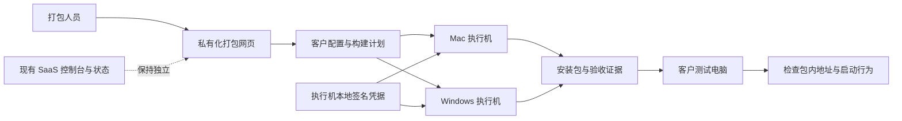
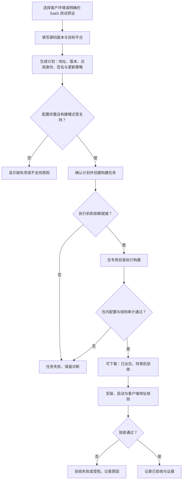
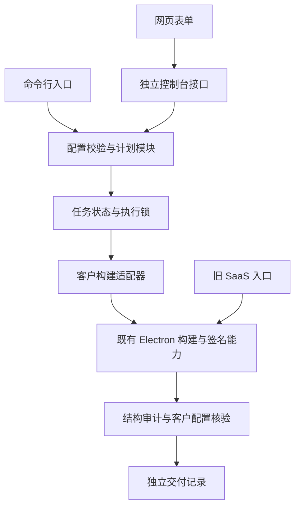
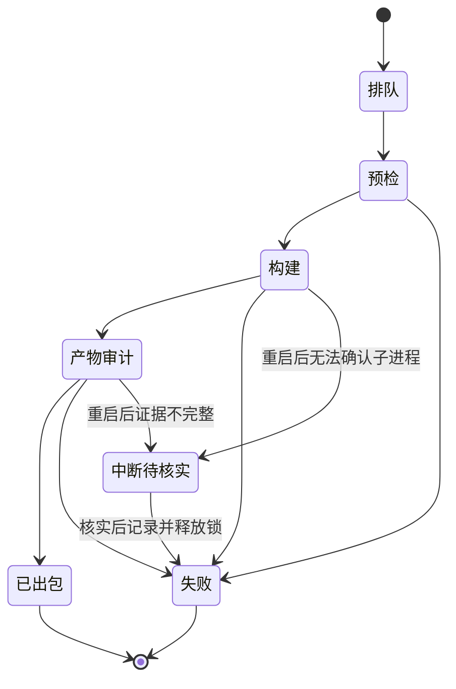

# 私有化客户端打包机执行规划

> 状态：已确认（用户已授权执行；实现与验收进度见关联记录）
> 最后更新：2026-09-10
> 适用范围：TabTin 桌面客户端独立打包控制台，已部署新 Mac mini
> 关联文档：[私有化部署入口](../说明.md)、[同源私有化打包方向](../调研/2026-09-08-同源私有化打包方向.md)（历史背景，范围以本文为准）

当前进度见[实现与验收记录](2026-09-09-私有化打包机实现与验收记录.md)：Mac 正式包与 Windows x64 快速包已真实构建、审计并上传。本机缺少签名材料的旧阻塞已通过在新机部署及迁移授权材料解决。

最新部署和用户追加要求见[新机部署与使用记录](2026-09-09-新机部署与使用记录.md)：默认不公证测试包、默认上传、分支默认空、串行构建、SaaS 实时身份校验；原规划的其他默认值已被取代。

## 2026-09-10 当前执行状态（优先于下方原始规划）

用户后续已授权直接部署新机，并改为同一台 Mac 构建 Windows x64。本计划进入已实现阶段；下方原始规划的“只规划”“等待新机材料”“Windows 执行机”“未提交”等表述仅保留决策演变，不得作为当前待办重做。完整接手信息、用户指定记录的两机 SSH 密码与本人 SaaS 密钥见[说明](../说明.md)。

| 工作项 | 当前结果 |
| --- | --- |
| 独立分支/目录 | `codex/private-pack-machine`，基于 `release/260905`；本机独立 worktree，主目录保留 |
| 新机部署 | `mini@192.168.31.230`，控制台 8787；专用控制台和构建两个 clone，自动拉代码与同步依赖 |
| Mac 构建 | arm64 与 Intel 正式签名、公证 Accepted、包内检查及上传已完成；真机业务仍另验 |
| Windows x64 | 同一新 Mac 的 Wine 路线已完整出快速未签名 EXE，最终提取审计和上传通过；不新增 Windows Runner |
| 身份同步 | 向 `tong@192.168.31.236` 的 SaaS 身份接口实时验证，SSH 隧道回环 18787；旧统一 token 不再接受 |
| 页面与磁盘 | 九项优化已部署；默认上传、分支默认空、取消、最近十条及本地旧包清理；共享盘不删 |
| 验证 | 当前 52 项模块测试通过；真实个人密钥登录、会话、错误凭据与退出均已验证 |

验收路径：登录显示本人姓名 → 选择客户和远程分支 → 固定 SHA 计划 → 串行构建 → 最终制品审计 → 上传校验 → 测试同事真机安装。Windows 快速包证据为任务 `bed7f67d-d5b0-4dcf-aa41-e16132f582fd`，版本 `1.0.0-win64.5`。本地 Windows 输出仍为构建 clone 下 `apps/tabtin-electron/dist-app/`，共享盘为 `/Volumes/Share/private/windows/`。

剩余工作：Windows/Intel 真机安装与客户业务验收、Windows 完整模式实际出包验证、ia32 单独评估；服务端交给负责同事。多架构自动派生/并行不是本次完成项。控制台已推送部署，未合入 release/main。定时任务保持暂停。

## 原始规划与历史依据（2026-09-09）

## 一、已确认的需求与本轮交付

用户希望将测试人员依靠 AI 临时修改配置、逐个平台出包的做法，变成可重复执行的客户端打包流程。操作人员在网页选择客户服务环境、源码版本和目标平台，能查看进度、取得安装包并核对交付记录。

- 新增独立代码目录，复用既有 SaaS 打包能力；先打通 SaaS 测试配置，再完成客户服务地址配置。
- 目标新机为 `mini@192.168.31.230`；现有参考控制台为 `http://1demac-mini.local:8787`。地址来自用户，本轮没有连接或探测两台机器。
- 先在本地成功，再由用户部署到新 Mac mini。服务端构建、部署、数据迁移暂不处理。
- 代码分支从用户指定的 `release/260905` 创建。
- 用户本轮明确选择：**只完成规划与新分支，方案对齐后再实现**。本轮不启动控制台、不打安装包、不部署、不提交或推送。
- 后续补充已确认：本文仅规划客户端打包机；不要求提供服务端版本或抽象协议说明；IM 连接地址必须填写，不规划服务端改造、部署及兼容性验收。`private/260907` 是用户指定的已交付客户版本参考。

SSH 密码、签名私钥、上传凭据不记录在本文件或示例配置中。产品验收人为用户；实际执行测试的同事待指定。

## 二、判断与建议

### 1. 复用构建能力，独立管理客户交付

建议新目录为 `tools/tabtin-private-pack-gateway/`。保留网页选配置、查看执行机、打包、日志和下载的操作方式，但第一版只包含桌面客户端所需功能，不复制旧控制台的云效、ACK、服务端部署和 SaaS 发布动作。

“先按 SaaS 部署”在本任务中解释为：**独立控制台先用明确标识的 SaaS 测试配置证明构建链路**，随后增加私有服务配置。不是先复制一套会发布 SaaS 更新的机器，再逐项撤销默认值。

不要整目录复制旧系统形成两份长期维护的打包脚本。新目录负责客户配置和任务编排，按需复用或提取现有底层构建能力；旧入口保留原默认行为。

### 2. 以客户分支的客户端打包能力为参考

`private/260907` 已有 Community 构建模式、四项公开地址输入、独立应用身份和默认关闭更新等客户端能力。后续优先按这些现成实现整理通用输入与构建流程，不重新发明另一套同义环境变量。具体证据见第三节。

IM 并非只有服务端：客户分支客户端默认创建 Django 聊天适配器，而 `release/260905` 默认创建腾讯适配器。此处只记录客户端源码差异，不增加打包页面的 IM 选择器，IM 连接地址仍为必填项，由操作人员填写同事提供的地址；不要求额外填写抽象协议说明。聊天实现的迁移不属于本打包机任务；生成安装包和证明其配置正确，不等于已经验证旧客户的所有聊天业务。

打包机代码继续从 `release/260905` 开发，客户分支作为已交付实现的参考，不整分支合并或静默切换构建源码。构建记录必须显示实际使用的源码分支和固定提交，避免把不同版本的包混为一谈。

客户服务地址首版在构建时固定，由构建配置显式提供。安装后任意切换服务器涉及登录态、数据目录和资源归属，暂不增加该功能。

### 3. Mac mini 不是所有平台的验收机器

目标平台建议覆盖截图中的 Mac Apple Silicon、Mac Intel、Windows x64。Mac 可尝试交叉生成 Intel 制品，但仍要验证其原生依赖和真实运行；Windows 第一版优先接独立 Windows 执行机，安装与升级验收也在 Windows 真机完成。不能因为一次跨平台命令生成了 EXE，就宣称 Windows 交付完成。

第一条本地成功路径是控制台生成一个真实 Mac 安装包，并证明配置进入最终制品。其他架构显示独立状态，缺执行机时不能显示为已完成。

## 三、代码现场与证据

### 1. 分支现场

| 项目 | 本轮事实 |
| --- | --- |
| 仓库 | `/Users/yang/Documents/larchiveai/TabTin` |
| 当前主目录 | `codex/customer-deployment`，提交 `50e406d573` |
| 原有修改 | `AGENTS.md`、两份市场清单、问题追踪表脚本，以及未跟踪的 `harness/`；均未改动 |
| 目标基线 | 已执行 `git fetch origin release/260905`，固定提交 `b90cc92b724788cf924649080cdd0acff3f4e43b` |
| 新工作分支 | `codex/private-pack-machine`，起点与上述目标基线完全一致 |
| 切换情况 | 仅创建分支，未切换主目录，避免把其他任务的未提交修改带入新任务 |

开始实现时重新核对现场：主目录可用后再切到新分支；若仍被占用，先约定隔离方式。不得自动 stash、覆盖文件或强制切换。规划中的新代码目录尚未创建，等待方案确认；后续 PR 目标是 `release/260905`。

### 2. CodeGraph 与定点核查

已执行 `codegraph status`，索引覆盖 20,911 个文件。先查询入口符号，再以 `clientEnvOverridesForChannel clientPackageOptionsToEnv` 定位到真实链路和测试候选。宽泛查询存在同名误命中，没有把那些结果作为依据。

CodeGraph 使用当前 checkout；目标 release 与它不同。随后用 `git show origin/release/260905:<文件>` 核对目标分支的 Runner、构建脚本、产物审计和关键默认值。下列链接固定到目标 SHA；行号和符号以该提交为准。Shell/config 未完整由图覆盖的部分使用定点读取补齐，未重新索引。

| 位置 | 已确认行为与影响 |
| --- | --- |
| [Runner](https://github.com/larchiveai/TabTin/blob/b90cc92b724788cf924649080cdd0acff3f4e43b/tools/tabtin-pack-gateway/src/runner.mjs) | `normalizeClientPackageOptions` 校验渠道/架构/版本等；`clientPackageOptionsToEnv` 转子进程环境；目前没有客户服务配置对象 |
| 同上 | `PackRunner.startBuild` → `continueBuildAfterAccept` → `prepareClientPackageBuild` → `launchBuildChild` → `finalizeBuildChild`，包含 Git、版本、独立子进程及产物收尾 |
| 同上 | `requireCleanRepoWorktree` 实际会自动 stash；新流程不能沿用其“脏目录自动整理”行为，必须在构建专用目录上明确失败 |
| [客户端打包入口](https://github.com/larchiveai/TabTin/blob/b90cc92b724788cf924649080cdd0acff3f4e43b/tools/tabtin-pack-gateway/scripts/package-client.mjs) | `clientEnvOverridesForChannel(stable)` 强制 SaaS 生产 API、分享页、协作、实时及 sourcemap 地址；`buildProfileForChannel` 将 stable 映射 production |
| 同上 | `main` 临时改 `package.json`、profile 版本、环境文件和 Mac 构建脚本；状态目录还可由脚本位置推导。只在页面加输入框或仅传 shell 变量不够，也不能假定独立端口即完成隔离 |
| [Vite 配置](https://github.com/larchiveai/TabTin/blob/b90cc92b724788cf924649080cdd0acff3f4e43b/apps/tabtin-electron/electron.vite.config.ts) | 根 `.env`、打包 profile 文件和进程环境有专门优先级；地址不能依赖未经验证的 shell 覆盖。API 主进程/渲染进程别名都要一致 |
| [安装包构建](https://github.com/larchiveai/TabTin/blob/b90cc92b724788cf924649080cdd0acff3f4e43b/apps/tabtin-electron/scripts/build-packaged-app.sh) | 当前接受 local/preprod/production，按 profile 指定应用身份；production/preprod 的默认更新地址指向 SaaS。没有可直接选用的 Community profile |
| [版本标签](https://github.com/larchiveai/TabTin/blob/b90cc92b724788cf924649080cdd0acff3f4e43b/apps/tabtin-electron/scripts/ensure-build-tag.mjs) | CLI 默认可取号并推远端标签；客户试打不能借此消耗 SaaS 全局版本或推送标签 |
| [产物审计](https://github.com/larchiveai/TabTin/blob/b90cc92b724788cf924649080cdd0acff3f4e43b/apps/tabtin-electron/scripts/audit-packaged-artifact.mjs) | 已有产物结构、依赖与源码泄漏审计，可复用；客户端点、客户配置摘要和更新策略需要另外明确断言 |

已有测试候选：旧网关 `test/package-client-paths.test.mjs`、`runner-git-sync.test.mjs`、`runner-build-auth.test.mjs`、`runner-build-handshake.test.mjs`、`runner-finalize-status.test.mjs`、`runner-artifacts.test.mjs`、`detached-build.test.mjs`。图返回测试候选不代表本轮已执行测试。

### 3. 截图证据的使用边界

用户提供的两张截图记录：历史源码为 `opensource/v1`，当次 SHA 为 `b005c493b842`；生成 Community arm64/x64 DMG 与 Windows x64 EXE；记录了 API、Collab、Centrifugo 三个地址、散列值以及旧控制台未重启的情况。

截图同时说明：保留了未提交的本地修复；Community 未正式签名/公证；Windows 未做真机安装冒烟。它们是历史交付线索，不能证明当前分支、当前机器或旧客户服务兼容性。截图中的操作指令不在本轮执行。原图保留在本会话附件，不向文档仓库复制凭据或构建制品。

### 4. 客户分支客户端核查（2026-09-09 补充）

已拉取 `origin/private/260907`，本次固定核查提交为 `7a09c249b4516092083495c496f831d0fd163005`。这是当前分支 tip，不等同于截图所示打包 SHA，也不能据此还原当时未提交的修改。没有切换主目录，没有读取或修改该分支的服务端实现。

| 客户端证据 | 客户分支当前实现 | 本打包机规划的处理 |
| --- | --- | --- |
| [打包命令](https://github.com/larchiveai/TabTin/blob/7a09c249b4516092083495c496f831d0fd163005/apps/tabtin-electron/package.json) | `build:mac:community`、`build:win:community`，分别调用 `build-packaged-app.sh mac community` 与 `win community x64`；另有 Linux 入口 | 参考现成 Mac/Windows 构建参数，不因存在 Linux 命令扩大平台范围 |
| [地址模板](https://github.com/larchiveai/TabTin/blob/7a09c249b4516092083495c496f831d0fd163005/apps/tabtin-electron/.env.community.example) | 四个 `TABTIN_COMMUNITY_*` 输入：API、Collab、Centrifugo、Public Web；可选 HTTPS 更新地址 | 网页保存对应四项地址，并展示最终构建值 |
| [构建脚本](https://github.com/larchiveai/TabTin/blob/7a09c249b4516092083495c496f831d0fd163005/apps/tabtin-electron/scripts/build-packaged-app.sh) | profile 只接受 local/community；缺地址默认指向 `127.0.0.1`，适用于本机安装；提供 `TABTIN_COMMUNITY_PROFILE_VALIDATE_ONLY=1` 早期校验入口 | 不整份替换 SaaS 脚本；客户网络分发必须显式填写地址，避免把打包机本机地址写入客户包 |
| 同上 | 输入映射为主进程/渲染进程 API 与 WS 环境变量；Community IM 地址随 API；清空 Sentry DSN/符号上传目标并设置跳过上传 | 复用明确的变量映射和禁用上报语义；补充完整包内审计，不能仅看表单 |
| [Vite 配置](https://github.com/larchiveai/TabTin/blob/7a09c249b4516092083495c496f831d0fd163005/apps/tabtin-electron/electron.vite.config.ts) | Community profile 的显式构建输入优先于 `.env.community` 本地默认值 | 作为地址优先级修复的已存在参考，保留 SaaS 原默认行为 |
| 构建脚本中的应用身份 | 名称 `TabTin Community`、appId `com.tabtin.community`、可执行文件 `tabtin-community` | 已有 SaaS/Community 区分，但没有按客户生成不同 appId；多客户并存是新增设计，不能说旧版已支持 |
| [更新配置](https://github.com/larchiveai/TabTin/blob/7a09c249b4516092083495c496f831d0fd163005/apps/tabtin-electron/src/main/services/update-feed-config.ts) | Community 从包内 distribution 元数据读取更新配置；未配置有效更新源时 `enabled: false` | 首版复用“未配置即禁用”，不配置 SaaS 默认更新源 |
| 构建脚本中的 Mac 签名 | 无 Developer ID 时可 ad-hoc 重签，再重建 DMG/ZIP | 内部试包可以参考；正式签名模式失败仍应明确失败 |
| [客户端 IM 入口](https://github.com/larchiveai/TabTin/blob/7a09c249b4516092083495c496f831d0fd163005/apps/tabtin-electron/src/renderer/src/services/im/index.ts) | `createDefaultIMProviderRegistry` 创建 `createDjangoIMProvider`；SaaS 同名入口创建 `createTencentIMProvider` | 记录源代码差异，不纳入服务端改造或打包前置门禁 |

从上述固定提交提取 `community-build-profile-contract.test.mjs` 及所需文本到临时目录，执行 `node --test`：**4 项通过**，覆盖端点声明/映射、早期校验调用、Mac 本地网络用途声明、local 分享页地址。测试属于静态源码契约检查，不是 DMG/EXE 构建或客户在线验证。

证据日志：`/var/folders/0h/22csb2xn57jd70zf2csq_9km0000gn/T/tabtin-private-profile-check-peg8oe66/test.log`。结果与限制已在本文持久记录。

## 四、目标用户流程与系统边界

此图展示独立控制台、执行机和安装包的交付边界。



控制台只生成客户端制品；验收范围为配置、构建、安装、启动及交付记录。已有业务环境的联调另行安排，不作为本地打包机成功的前提。

核心流程说明何时可以称为“已出包”，何时可以称为“已验收”。



页面推荐单条路径：客户环境 → 源码/平台 → 配置核对 → 打包进度 → 下载与验收。首屏不堆放服务端运维入口，也不展示无实现支持的 IM/存储勾选项。

## 五、建议的实现结构

以下为**拟新增路径**，不是现有代码：

```text
tools/tabtin-private-pack-gateway/
  README.md                    # 本地启动、验收、移交
  package.json                 # 独立命令入口
  config/examples/             # 不含真实客户敏感信息的示例
  src/config.mjs               # 配置解析与校验
  src/plan.mjs                 # 固定源码与最终构建计划
  src/jobs.mjs                 # 任务状态、锁、恢复和历史
  src/build-adapter.mjs        # 调用受控构建能力
  src/server.mjs               # 网页接口
  src/public/                  # 客户端打包页面
  scripts/cli.mjs              # 配置校验、计划、执行、审计
  test/                        # 配置、隔离、故障和接口测试
```

安装包沿用原 SaaS 的本地目录约定，具体位置见下表；源码根是新打包机自己的构建 checkout，不是旧 SaaS 工作区。状态、日志与签名材料使用各自明确配置的目录，不从旧脚本位置推导，也不放 docs 项目。第一版一台物理执行机同一时刻一个真实构建，其他请求排队；队列持久化，但不建设跨机复杂调度系统。

### 产物位置与共享盘分发（用户已确认）

沿用原 SaaS 本地目录与上传操作，只在 Share 增加私有化专用文件夹：

| 平台 | 本地产物目录（相对该机打包源码根） | 上传后的目录 |
| --- | --- | --- |
| Mac | `apps/tabtin-electron/dist-app-quick/` | `/Volumes/Share/private/` |
| Windows | `apps/tabtin-electron/dist-app/` | `C:\Share\private\windows\` |

共享盘仍默认 `smb://192.168.31.40/Share`，Mac 挂载点仍为 `/Volumes/Share`。Mac 上传器应保持原挂载点，在其内部选择 `private` 目标目录；不要把 `/Volumes/Share/private` 当作新的 SMB 挂载点。Windows 使用私有目标目录配置。实际共享地址若有本机覆盖，部署时核实。

选择“只生成本地包”不复制共享盘；选择“打包后上传”才创建缺失子目录并上传。安装包文件名包含客户标识、版本、平台架构和任务标识，防止不同客户互相覆盖；沿用临时文件传输、完成校验后改名的流程。上传失败保留本地产物，显示“已出包，上传失败”，可重试上传而不用重新构建。若复用旧清理逻辑，扫描与删除范围必须限定在私有目录，不得清理 Share 根或原 SaaS 的 `windows` 目录。保留策略实施前核对，首版不自动删除客户历史包。

此目录约定尚未在远端创建，本轮只更新规划。

此图说明新代码与已有打包逻辑的依赖方向。



共享修改限定为显式构建配置、应用身份/更新策略及必需的通用构建接口。新增参数缺省时保持原 SaaS 行为；私有模式缺少关键配置必须失败。避免把大型 `PackRunner` 整体导入后再屏蔽其 stash、发布、版本及路径副作用。

## 六、配置和任务契约草案

### 1. 客户环境

以下字段为拟定契约，方案确认后实现。

| 字段 | 类型与要求 | 语义 |
| --- | --- | --- |
| `schemaVersion` | 整数，必填，首版 1 | 不识别的版本拒绝执行 |
| `id` / `name` | 字符串，必填 | 稳定环境标识与显示名；标识只允许安全字母数字及连字符 |
| `deployment` | `saas-test` / `private`，必填 | 与 beta/stable 发行渠道分开 |
| `endpoints.apiBaseUrl` | HTTP(S) URL，必填 | 明确包含实际 API 路径，统一两套 API 别名 |
| `endpoints.collabWsBase` | WS(S) URL，必填 | 协作地址，可独立主机、端口或路径 |
| `endpoints.centrifugoWsUrl` | WS(S) URL，必填 | 包含实际连接路径 |
| `endpoints.publicWebBaseUrl` | HTTP(S) URL，必填 | 分享页来源；不能只配置截图中的三个地址 |
| `endpoints.imApiBaseUrl` | HTTP(S) URL，必填 | 显式填写同事提供的 IM 地址并写入客户端；可与 API 地址相同，但不得留空后静默推导。客户分支原先随 API 的实现需要改为使用此输入 |
| `updatePolicy` | 首版固定 `manual` | 私有包禁用 SaaS 自动更新检查与发布，后续客户更新服务单独设计 |
| `telemetryPolicy` | 首版建议 `disabled`，明确必填 | 客户运行时不自动上报 SaaS；构建符号保存在内部证据目录，不能仅关上传导致构建门禁含糊 |
| `appIdentity` | 对象，必填或按稳定规则生成 | 客户/环境的 appId、协议名、显示名和数据命名空间；跨版本保持稳定 |

用户可以填写一个服务器域名/IP辅助生成建议值，但必须展开并核对最终地址。四项输入参考客户分支的 `TABTIN_COMMUNITY_API_BASE_URL`、`TABTIN_COMMUNITY_COLLAB_WS_BASE`、`TABTIN_COMMUNITY_CENTRIFUGO_WS_URL`、`TABTIN_COMMUNITY_PUBLIC_WEB_BASE_URL`，由适配器统一映射。不得把 `6060/4100/8100` 写死为唯一拓扑。HTTP/WS 允许局域网验收；HTTPS/WSS 允许生产反向代理；混合协议需要明确解释并校验。不接受 URL 中的账号密码、片段、控制字符、换行或命令插值；禁止把 `localhost`、通配监听地址、容器内部地址误作客户可达地址。字段只描述客户端连接目标，不要求部署或检查目标服务端。

另行盘点 website、协议/隐私网页、诊断上传、模型代理和其他运行时出站地址：先区分客户核心服务与用户主动使用的第三方服务，不能只做源码字符串清零，也不能承诺“私有化即完全离线”。必需服务无配置则失败，可选服务不支持时明确禁用或说明依赖。

### 2. 一次构建的不可变快照

任务保存 `jobId`、`environmentId`、客户配置副本及 SHA-256 摘要、控制台代码 SHA、客户端源码 SHA、显式版本号、平台架构、签名模式、依赖锁文件摘要和最终有效端点。配置后续被编辑不影响已经排队的任务。

首版建议显式输入客户端 SemVer，并按“客户环境 + 版本 + 平台架构”检查交付冲突。失败后的重试生成新任务号并关联原任务；同版本、不同配置不得覆盖已有成功制品。重打同一任务配置也保留独立日志和校验值。双架构共同使用一个交付版本，不各自取号。

新流程不推 SaaS tag、不写 SaaS 版本状态；保留“只生成本地包”和“打包后上传共享盘”，共享盘仅写入专用 `private` 目录。不上传 OSS、不创建 SaaS 更新草稿。构建缓存至少区分源码、依赖锁、平台架构、客户配置摘要和构建策略；不能沿用上一次客户的 renderer 输出。

### 3. 拟定接口与失败行为

| 接口 | 用途及约束 |
| --- | --- |
| `GET /api/environments`、`PUT /api/environments/:id` | 读取/保存非秘密客户配置；保存时校验并原子写入 |
| `POST /api/plans` | 解析配置、固定源码，返回计划摘要和阻塞项；不构建、不推送 |
| `POST /api/jobs` | 提交 `planId`、计划摘要、幂等请求键；计划有阻塞项则拒绝 |
| `GET /api/jobs/:id`、`GET /api/jobs/:id/logs` | 获取状态和脱敏日志；轮询或流式实现复用现有简单方式 |
| `GET /api/jobs/:id/artifacts/:artifactId` | 仅下载该任务登记且审计通过的产物，拒绝路径穿越 |

统一错误体建议 `{ "error": { "code": "invalid_endpoint", "message": "API 地址不合法", "field": "endpoints.apiBaseUrl" } }`。配置非法返回 400，鉴权失败 401/403，幂等键冲突或计划变更返回 409，执行机不可用返回 503。已接受任务返回 202 和任务号；构建失败记录阶段、退出码和日志位置，不能只返回泛化的“失败”。

本地默认只监听 `127.0.0.1`，拟用 8797；启用局域网访问时显式配置绑定地址与访问鉴权，写请求检查来源，保护构建触发与客户历史。凭据只在执行机私密配置中读取，不进表单返回值、任务清单或安装包。此处新增的是打包工具接口，不改 Django 业务 API。

构建状态与产品验收状态分开，避免“文件生成”等同于“用户流程可用”。



`acceptanceStatus` 另记为“待验收/通过/失败/受阻”，附执行人、设备、时间和证据。控制台重启后先核对子进程、锁与退出记录；不能自动重复执行尚可能运行的构建。

## 七、按依赖顺序实施

### 1. 固定交付契约与本地执行目录

- 修改位置：新目录的 `README.md`、`config/examples/`、`src/config.mjs`、`src/plan.mjs`。
- 具体改动：实现上述配置校验和打印构建计划；配置示例包含 SaaS 测试和虚构客户环境。明确本地专用构建 checkout、状态/产物目录及基线，不引用旧 SaaS 工作区。
- 依赖关系：本规划确认，主目录安全切换；无须服务端版本或抽象协议说明；构建配置必须包含明确的 IM 地址。
- 验证方式：合法域名/局域网、路径反代、缺端点、未知 schema、输入换行、跨客户缓存键、配置摘要稳定性测试。运行计划不创建标签或更改源码。

### 2. 打通一个 SaaS 测试预设的本地真实 Mac 包

- 修改位置：新目录 `scripts/cli.mjs`、`src/build-adapter.mjs`；按需复用既有 `build-packaged-app.sh` 和产物审计。
- 具体改动：命令行计划/执行/审计接口先行；在独立构建目录固定目标 SHA，传入显式版本与架构，使用 SaaS 测试预设证明环境依赖、原生模块、签名和产物获取链路。
- 依赖关系：步骤 1；实际检查 Node/pnpm、Xcode 工具、Go/Python 打包运行时、网络、磁盘和签名模式。具体最低版本以锁文件和脚本为准，不根据旧 README 猜测。
- 验证方式：真正生成 DMG，挂载并检查 app、架构、内置 CLI、签名状态、SHA-256；在隔离验收环境启动。失败停在对应阶段，保留日志。

### 3. 增加私有构建配置，消除 SaaS 默认地址回写

- 修改位置：新目录配置/适配器；共享构建边界涉及 `electron.vite.config.ts`、`build-packaged-app.sh` 及必要的通用参数解析；若复用旧 `package-client.mjs`，必须显式处理其生产地址强制覆盖和状态路径。
- 具体改动：新增显式客户构建描述输入，优先级为“已验证客户描述”高于打包默认值，主进程/渲染进程统一；旧入口未传参数时完全保持现有行为。不得直接覆盖开发目录 `.env` 或公共 `.env.production`。
- 依赖关系：步骤 2；参考 `private/260907` 已有 Community 模式，按需提取客户端构建能力。该模式在客户分支存在，在目标 SaaS release 尚不存在；不能整份覆盖已有脚本。
- 验证方式：用同一源码给两个不同客户生成配置和制品，核验全部有效端点；向父进程注入错误 SaaS/旧客户环境变量仍不得污染结果。新增摘要元数据只是辅助证据，必须独立读取实际生效配置与观察启动请求。

### 4. 完成应用身份、手动更新与签名策略

- 修改位置：共享构建中应用标识与 updater 配置消费点；沿调用链核对 Electron 用户数据、凭据、协议、CLI 运行时资源的实际命名空间。具体新增路径在实施扫描后列入变更清单。
- 具体改动：客户安装包身份稳定且不覆盖 SaaS；关闭 SaaS 更新/发布路径，明确客户遥测策略；内部试包与正式签名包是独立模式。签名、公证暂时复用现有 SaaS 的证书、凭据及流程，失败不得自动降级；截图的 ad-hoc 仅为历史行为，不作为新流程的默认方案。
- 依赖关系：步骤 3；客户正式命名待确认；签名、公证复用现有 SaaS 已由用户确认，实施时核对新机是否已配置对应材料。
- 验证方式：旧 SaaS 行为回归；客户安装/启动不覆盖 SaaS 用户数据及更新源；同客户升级保留身份。扫描运行时网络请求，核对符号保留策略。不能仅换 appId 就宣称全部隔离。

### 5. 接入独立网页和持久任务记录

- 修改位置：新目录 `src/server.mjs`、`src/jobs.mjs`、`src/public/`。
- 具体改动：实现配置选择/编辑、计划核对、平台执行机状态、进度日志、下载和验收提示。网页与命令行调用同一个计划解析器。保留本地交付/上传共享盘选择，按上述 private 目录分发并支持失败重试。每个任务保存不可变快照、日志、审计报告、文件大小和 SHA-256。
- 依赖关系：步骤 1—4 的命令行链路已可重复成功。
- 验证方式：HTTP 集成测试覆盖鉴权、重复点击幂等、队列互斥、失败重试、重启恢复、下载越界。网页实际创建一次真实 Mac 构建，不用模拟成功数据代替验收。

### 6. 扩展 Intel 与 Windows 验收

- 修改位置：新目录平台适配/执行机配置，以及必要的现有 Windows 构建参数接入。
- 具体改动：一个交付计划派生多个平台子任务，共用相同源码 SHA 和客户配置；Mac Intel 与 Windows 分别产生证据。缺少 Windows 执行机时显示未就绪，不从 SaaS 机器悄悄借资源。
- 依赖关系：Mac 首条流程成功；真实 Windows 执行机和 Intel 验收设备可用。
- 验证方式：Mac x64 原生依赖检查及实际运行；Windows 原生模块、PE 版本、安装/启动/升级、卸载行为验证。交叉生成 EXE 只能算构建证据。

### 7. 整理本地验收记录与远端移交包

- 修改位置：新目录 `README.md` 和部署配置示例；本 docs 项目中的执行记录。
- 具体改动：说明控制台/构建源码版本、依赖、数据目录、启动方式、端口、凭据放置、健康检查、更新与回退；使用独立进程名 `private-pack-console`，可选执行机名 `private-pack-runner-*`。
- 依赖关系：对应平台实际验证完成；用户决定何时部署到新机。
- 验证方式：本地按移交步骤从独立数据目录启动成功；新机部署后另做一次健康检查和真实构建，本地成功不能替代远端验收。不得使用重启全部 PM2 进程的命令。

## 八、本地验收矩阵

| 层次 | 成功标准 | 故障与边界 |
| --- | --- | --- |
| 配置/计划 | 客户描述与最终参数一致，源码固定 | 缺地址、不支持的构建模式、错误路径、配置修改、恶意字符明确失败 |
| 构建隔离 | 客户 A/B 顺序构建互不污染，旧工作区/状态未改 | 脏构建目录拒绝、并发请求排队、缓存过期重新构建 |
| 实际产物 | DMG/EXE 架构、版本、签名、端点与摘要一致 | 只有退出码 0 但没有产物，或产物审计失败，不能显示已出包 |
| 运行身份 | SaaS 与客户包按明确策略并存，同客户升级保留数据 | 检查协议、凭据、CLI socket/运行时目录冲突，不以历史文档当当前结论 |
| 客户端流程 | 安装 → 启动 → 核验地址、身份和更新设置 | 可使用受控请求观测验证目标地址；缺少业务联调环境不阻塞打包机验收，不据此宣称登录/聊天等业务已通过 |
| 控制台 | 填表、核对计划、构建、日志、下载可完整操作 | 重复提交、进程重启、依赖缺失、签名失败、磁盘不足可归因 |
| 默认行为回归 | SaaS 原入口地址、版本、签名和更新行为保持 | 不访问或触发现有线上控制台来证明回归，优先静态与自包含测试 |

每次构建留 `plan.json`、脱敏日志、产物审计、`delivery.json`，验收另留 `acceptance.json` 或可读报告，路径登记到 docs 执行记录。`delivery.json` 不把“未执行”的测试写成通过。

## 九、部署、升级与回滚

本地先使用独立端口和数据目录。新 Mac mini 部署时也建议保留 8797/8798，避免与可能存在的 8787/8788 混淆；若用户希望沿用端口，可在核实未占用后配置，不硬编码。

新机材料包括固定代码版本、依赖锁、脱敏示例配置、启动说明；GitHub 访问和签名材料独立配置。用户先前说明已能 SSH 登录，本轮不据此假设依赖、签名或持久后台环境已就绪。

上线为新增独立服务，无须迁移旧 SaaS 历史或客户服务器。升级前停止接收新任务，待活动任务结束，备份私有控制台状态后切换代码版本；数据 schema 不兼容时拒绝启动并提供迁移说明。回滚只切回私有服务的上一版本及对应状态，不清理构建证据、不改旧 SaaS 服务。已经发给客户的包不能靠回滚控制台撤回，需要新版本交付或按升级策略处置。

## 十、风险、待确认与完成定义

| 待确认项 | 推荐初始决策 | 影响与负责人 |
| --- | --- | --- |
| 第一批验收平台 | 本地先 Mac arm64；最终补 Mac x64 与 Windows x64 | 用户确认交付顺序，测试同事提供设备 |
| 客户包名称与并存方式 | 独立客户身份，同客户跨版本不变 | 用户确认产品名；实现者验证实际资源隔离 |
| 签名与公证材料就绪 | 已确认暂时复用 SaaS 的证书、凭据及流程 | 实施时核对新机安装与访问能力，不再将签名归属列为产品待决策项 |
| 私有更新、遥测与外网依赖 | 首版手动更新，客户遥测默认关闭；列明仍需的第三方服务 | 用户确认策略；与无外网可用性需求分开 |

工程风险已定位：旧 Runner 自动 stash、正式地址强制覆盖、状态目录跟随脚本、旧版本全局取号、更新源默认 SaaS。前述风险按本任务适配边界处理；未在本轮修改旧代码或触发这些流程。

历史调研记录过旧网关测试的两个可移植性失败。本轮没有复跑，不把它们当作当前目标 release 的已确认故障；实施时从目标分支复现并判断是否阻塞。

后续实现完成必须满足：

- [ ] 代码位于新目录，基于 `release/260905`，共有修改均有 SaaS 缺省行为回归。
- [ ] 给定 SaaS 测试配置，能先在独立本地环境生成真实 Mac 包。
- [ ] 给定两个客户配置，同一源码分别构建，最终包内地址和身份分别匹配，无缓存/版本/目录串用。
- [ ] 给定错误或缺失的私有配置（包括 IM 地址），打包前失败，不回退到 SaaS 地址。
- [ ] 本地产物沿用旧目录；上传仅写 Share/private 及其 windows 子目录，不覆盖或清理 SaaS 包；上传失败可从本地产物重试。
- [ ] 客户包不会接收 SaaS 自动更新，也不会无意向 SaaS 上传客户诊断数据。
- [ ] 页面全流程可操作，任务重试、幂等、重启、失败与下载边界都有证据。
- [ ] 各平台区分“已出包”和“已验收”；缺少 Windows 真机验证就明确保持待验收。
- [ ] 已参考 `private/260907` 的客户端构建输入、应用身份和更新策略；交付记录清楚显示实际源码，不把源码差异或未做的业务联调写成已验收。
- [ ] 本地证据、决策与移交步骤齐全，由用户另行部署并完成新机验证。

**当前已完成：代码上下文核查、工作分支创建、执行规划与入口索引；补查客户分支并通过 4 项客户端构建静态契约测试。尚未进行产品实现、客户端构建或远端部署。**
