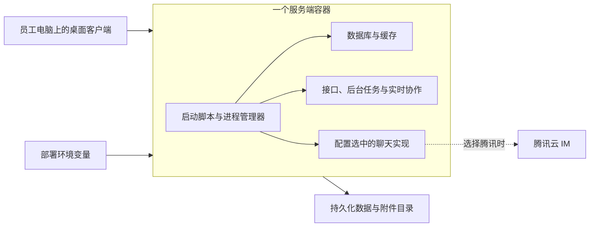
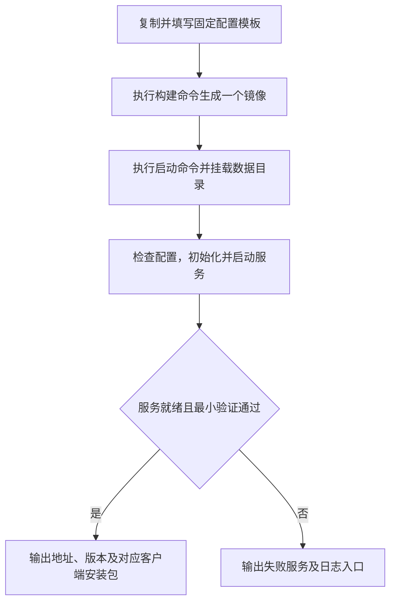

# 单镜像快速首版：范围与流程

> 状态：草稿
> 最后更新：2026-09-10（补充任务边界，方案正文保持原调查范围）
> 适用范围：同源 SaaS 的单机私有部署首版
> 关联文档：[私有化部署入口](../说明.md) · [同源打包调研](../调研/2026-09-08-同源私有化打包方向.md)

## 2026-09-10 任务边界更新

本文件的服务端单镜像方案仍由服务端负责同事独立推进，本次没有实施或验证此方案。客户端打包机已在 `mini@192.168.31.230` 部署，Mac 与 Windows x64 均有真实构建及共享盘证据；认证复用 `tong@192.168.31.236` 的 SaaS 实时身份源。当前地址、登录信息、背景和接手路径见[说明](../说明.md)。不要把下文“尚未开始改产品代码”的服务端规划状态误读为客户端打包机尚未实现。

## 1. 本轮收敛

用户希望快速、规范、流程化：用环境变量选择所需实现，将服务端打成一个镜像。此前文档把完整维护、组合裁剪与发布平台建设纳入同一阶段，范围偏大；本轮以本文的快速首版范围为准。此前 20～40 人日的完整方案估算不适用于此范围。

已确认目标仍然是同一份 SaaS 源码，不长期维护独立客户功能分支；服务器单镜像；桌面 DMG/EXE 单独交付。当前只收敛方案，尚未开始改产品代码。

第一版建议：一个完整运行镜像包含所需的可选实现，启动时根据配置只启用选中的实现。不做按客户裁剪镜像，也不把密钥写入镜像。这样同一版本的镜像可以复用，不需要每改一个部署选项就重新构建。这个“先带齐、按配置启用”的实现方式是建议，不代表已落实。

## 2. 最小结构

下图只说明单镜像与外部数据、桌面安装包的关系。

采用现成进程管理器，例如 Supervisor；复用各服务已有启动命令。无需自研编排系统。镜像里的 PG、Redis 等仍是独立进程，启动顺序由统一入口处理。

后台/分享网页按首个客户实际需要包含；桌面应用不在服务端容器中运行。客户首次安装使用新建数据目录；已有客户数据的跨版本迁移不隐含纳入首版。

## 3. 环境变量先管这几项

| 配置项 | 作用 | 当前实际基础 |
| --- | --- | --- |
| IM 实现选择 | 内置 / 腾讯 | 需补接。当前 SaaS 只接受腾讯，客户分支只接受 Django 自研 IM；还不是现成环境变量开关 |
| `SERVICES_OSS_PROVIDER` | `local` / `aliyun` | SaaS 已有工厂可复用；仍需核对本地挂载、访问地址与文件读写 |
| 客户服务器地址 | 让客户端、文件链接与实时连接指向客户服务器 | 复用现有端点配置，统一由模板填写 |
| 所选服务的凭据 | 数据库、共享密钥，以及需要的云服务凭据 | 安装时注入或首启生成并保存；未选服务不要求其凭据 |

IM 选择可命名为 `TABTIN_IM_PROVIDER`，这是拟新增字段，不是现有可直接使用的命令。登录必须沿用或确定一种可用方式；关闭短信后不能默认账号注册、登录与恢复已经解决。

客户端也要支持选中的 IM，并连接同一客户环境；只改服务器变量不能自动改变当前已发 SaaS 客户端。首版沿用现有打包脚本生成匹配安装包，暂时无需自建新打包平台。

## 4. 只做一条标准流程

下图体现首版的构建、启动、验证与失败反馈。

建议代码交付控制在以下几类文件，不在本次调研中创建：

1. 一个单镜像 Dockerfile，复用已有业务构建产物。
2. 一个启动入口与进程管理配置：等待 PG/Redis，就绪后执行所需迁移，再启动业务服务；必要初始化失败应明确退出或报告未就绪。
3. 一份环境变量模板：集中填选项、地址和凭据。
4. 一个带构建、启动、检查子命令的脚本，固定调用方式。
5. 一页使用说明：启动命令、数据位置、日志查看、停止方式。

页面勾选是长期目标。快速首版先让脚本消费固定配置跑通，页面后续只需生成同一份配置并触发同一入口，不另写一套打包逻辑。

## 5. 首版保留的最小验证

- [ ] 新目录能初始化，正常重启不会重新覆盖账号、密钥和数据库。
- [ ] 客户端可以登录；两个账号完成一次消息收发；Agent 能按所选模型配置回复。
- [ ] 可以上传并读取文件；若交付协作能力，两端能看到一次编辑同步。
- [ ] 重启/重建容器后，账号、已写数据和附件仍存在。
- [ ] 配置写错时明确报告失败；不会偷偷连接默认 SaaS 或切换另一 IM/存储实现。

数据挂载、正确启动、基本健康与日志是让单镜像可用的最小部分，使用现有工具完成即可。复杂恢复平台、自动升级、提供方热切换、全组合裁剪、跨 PG 大版本升级与高可用不进入首版。

## 6. 工作量重新理解

单镜像装配可以按此前 **3～5 人日的技术原型量级**安排首轮验证，前提是固定 Linux 架构，所选功能组合本身已经能运行，且由熟悉本仓库的工程师投入。这仍是粗估，不是已经构建验证的承诺。

自研 IM 接回 SaaS 是另外一块必要改动：至少要对齐 Provider 创建、客户端接线、后端 API 与事件路径。不能把这一块也算成“多加一个变量”，其耗时需要对关键差异进一步核对后再估算。存储选择则可以优先复用现有开关。

这轮先完成一个组合和一条固定流程，再扩展其他组合。无需为了证明单镜像可行，提前做完整交付平台。

## 7. 依据与状态

当前事实与测试结果见同源打包调研。客户分支是 Compose，SaaS 整机验收也用 Compose，线上另有 ACK/Kubernetes；本次只新增私有化单镜像入口，不要求改掉 SaaS 线上部署。

本轮只修订 docs 项目中的范围与流程，未修改业务代码、运行配置或部署环境。

## 8. 同事三阶段计划的对照与协作建议

### 8.1 原计划摘要

用户提供的同事计划：

1. 在客户 Mac mini 部署 `private/260907`：固定 IP、Docker Desktop、PG/Redis/Django/Celery/Centrifugo、`/health/ready`、LAN 客户端，以及注册、登录、BYOK、聊天、Agent、文件上传下载验证。
2. 产品化部署：新增 `compose.customer.yaml`，补 collab-live Dockerfile/服务，将 IP、端口、CORS/CSRF、公开文件地址参数化，构建目标架构镜像，压缩分发并 `docker load`，提供安装、启动、状态、备份脚本。
3. 从 `release/260902` 向客户版迁移：摘取业务提交，将 OSS、阿里云 ES、ACS Sandbox、ARMS、日志、发布、短信等云依赖改成本地实现、禁用项或可配置适配器，每批在 Mac mini 验证。

以上是同事提出的计划，不代表相关服务均已完成适配，也不代表所有列出的云依赖都是首版必经链路。

### 8.2 对当前目标的调整

| 阶段 | 建议保留 | 需要调整 |
| --- | --- | --- |
| 客户现场跑通 | 原有 Compose 先跑通 Mac mini，保留真实注册/登录/BYOK/聊天/文件验证 | 把 `private/260907` 定位为现状验证基线；记录固定提交、配置与客户端版本。需要协作时补双客户端文档同步；再从第二台电脑验证 LAN，不能只在服务器本机成功 |
| 流程固定与单镜像 | IP/端口参数化、目标架构构建、镜像离线分发、简单安装/启动/状态/备份命令 | 将多服务 `compose.customer.yaml` 主方案替换为单镜像装配入口；Compose 可留作开发或单容器启动包装，但不再维护一套独立客户多服务产品线。collab-live 构建可参考 SaaS 已有 Dockerfile |
| 源码统一与后续功能 | 按能力验证、每批在 Mac mini 回归 | 调整迁移方向：提取客户版必需的内置 IM/本地化能力到所选 SaaS release；后续直接从同源源码出包，不持续把 SaaS 业务功能摘取到客户分支 |

源码统一属于打包正式定版之前需要对齐的工作，可与镜像装配协作推进；它不妨碍先用旧客户版证明现场网络和现有用户流程能跑通。试验镜像和最终交付镜像须记录各自源码，避免误把旧分支镜像当作同源目标已经完成。

同事计划中的 `release/260902` 是历史参考，当前本机为 `release/260905`。正式实施时应确认双方共同使用的目标 release 和固定提交，不仅按文档日期或旧分支名称选择。

### 8.3 第一版不扩大为全量云能力替换

- **优先覆盖实际验收链路**：登录、BYOK、聊天、Agent、文件与所需协作。
- **搜索**：客户 Compose 当前设置 `SEARCH_ENGINE_ENABLED=false`、`RAG_ENABLED=false`。第一版可维持明确的关闭状态；仅当需求必须包含搜索时，再核对是否需要 ES、词法搜索或向量检索。先不自动新增本地 Elasticsearch。
- **Agent 执行**：先验证现有桌面本机执行能否满足首版。仅对真实调用 ACS Sandbox 且客户必须使用的能力做替换，不预设所有 Agent 执行都要重写为 Docker。
- **短信、ARMS、公司日志/发布**：按实际调用核对，不需要的路径关闭且不作为启动前提。关闭短信之后仍需通过约定登录流程，不能用“服务已关闭”替代认证验收。
- **简单备份**：可以保留 `backup.sh`，先覆盖本次本地数据库、附件和必要配置/密钥，并做一次基本恢复验证；不因此扩展成自动备份或恢复平台。

### 8.4 两人怎样合作

建议分工，尚非已确认人员职责：

| 工作线 | 建议承担者 | 交接物 |
| --- | --- | --- |
| 客户环境与内置能力 | 熟悉 `private/260907` 的同事 | Mac mini 跑通记录、所需服务和实际配置、内置 IM/本地存储需提取的改动 |
| 部署流程与交付 | 用户 | 同一配置模板、单镜像构建、启动/状态/备份入口、镜像和客户端版本记录 |
| 联合验收 | 两人共同 | 在同一 Mac mini、同一源码提交、同一配置上跑同一份检查表 |

开始各自实现前只需共同固定四件事：目标源码提交；首个组合（建议内置 IM + 本地存储）；服务器架构/地址/持久目录；最小验收清单。共享一份配置模板即可，不新增复杂协作平台。

Mac mini 的芯片需实机确认：Apple Silicon 的容器目标通常为 `linux/arm64`，Intel 为 `linux/amd64`；构建机不一定与目标机器同架构。首版只构建客户实际需要的一种。镜像压缩包使用保存镜像的分发流程，再由 `docker load` 导入；一个压缩包可包含多镜像，因此“一个包”本身不证明单镜像目标完成。
