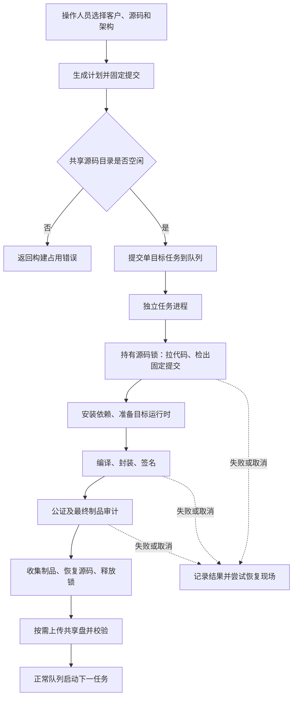
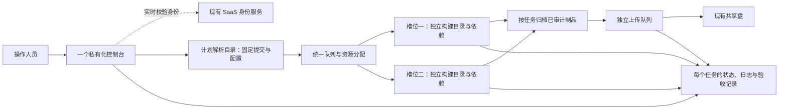
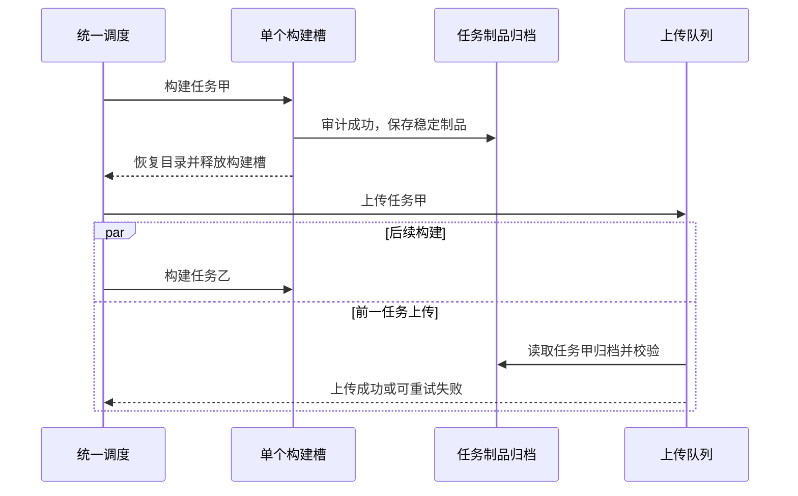
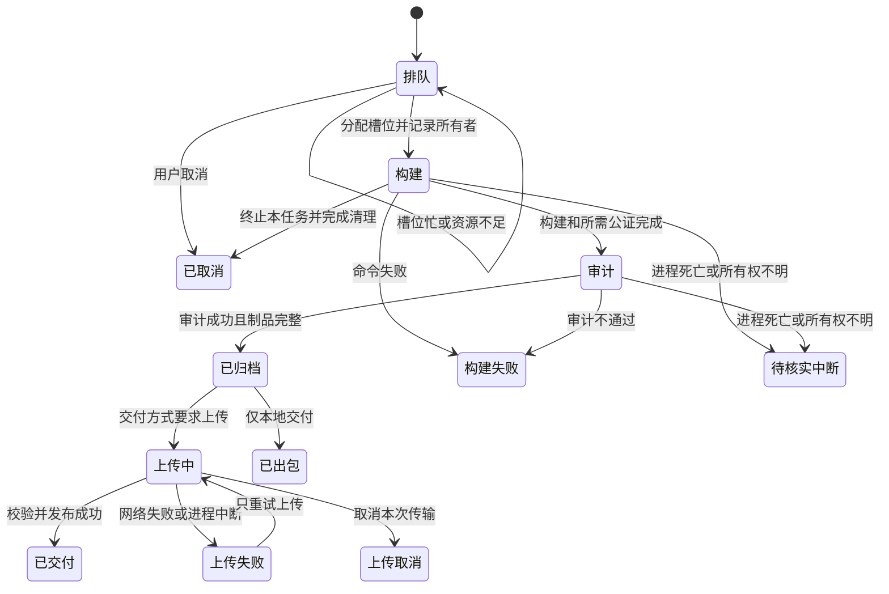

# 私有化客户端从串行改为并行打包的可行性

> 状态：评审中（代码与机器现状已核实；并行方案未实施、未压测）
> 最后更新：2026-09-10
> 适用范围：新 Mac mini 上的 Mac ARM、Mac Intel、Windows x64 私有化客户端打包
> 关联文档：[私有化部署入口](../说明.md)、[新机部署与使用记录](../代码执行计划/2026-09-09-新机部署与使用记录.md)、[客户端执行规划](../代码执行计划/2026-09-09-私有化客户端打包机执行规划.md)

后续进展：用户已授权直接实施双路并行和磁盘回收，当前实现与验收以[双路并行实施与验收记录](../代码执行计划/2026-09-10-双路并行实施与验收记录.md)为准。本文保留调研时的代码、资源快照和建议，不再代表“尚未开工”。

## 一、结论与建议

**可以改为并行，但需要先隔离每个任务的构建现场。建议保留一台机器、一个网页控制台，先让上传和下一包构建重叠，再用两套独立构建目录验证双任务并行。**

当前串行有实际保护作用：几个平台共用同一个源码目录，打包会修改文件、同步依赖、生成中间产物。直接把并发数改成 2，保留锁会让第二个任务报错，移除锁则有串包风险。[C1][C2][C3]

| 要做的事情 | 可行性判断 | 建议 |
| --- | --- | --- |
| 上一个包上传时，开始构建下一个包 | 可行，改造范围较小 | 先隔离最终制品，再拆分构建与上传调度 |
| 同时构建两个不同平台或不同客户的包 | 有条件可行 | 两套独立 clone、独立依赖和可写缓存；新机实测后开启 |
| Mac ARM、Mac Intel、Windows 三包同时完整构建 | 代码可以继续扩展，机器承载能力未证明 | 16 GB 内存下暂不设为默认 |
| 在同一源码目录里直接并行跑多条命令 | 当前不具备条件 | 不作为实施路线 |
| 一次勾选多个架构，自动生成一组任务 | 可独立增加的页面能力 | 并行调度本身不要求先做批量入口；批量任务应共享同一 SHA 与客户配置快照 |

这里优先讨论多个包之间的并行。单个包内部的“准备依赖 → 编译 → 封装 → 签名/公证 → 最终审计”存在先后依赖，不能把整条脚本改成同时执行。复用同一份前端编译结果也需要证明源码、客户地址、构建选项及目标相关输入一致；第一版保持每个任务完整构建，暂不引入跨任务编译结果复用。

预期收益主要是**缩短一批包全部交付的时间和后续任务排队时间**。两个任务争用 CPU、内存和磁盘时，单个包可能变慢，不能承诺“两路并行就快一倍”。

本次已完成资料、代码和新机只读调查，以及本地隔离测试；没有改打包代码、调整远端配置、重启服务或触发真实构建。产品验收人为用户，实施人和真机测试人员待指定。

## 二、调查使用的真实现场

### 1. 代码版本

必须区分“控制台程序”和“被打包的客户端源码”，两者不是同一个分支。

| 对象 | 本次核实结果 |
| --- | --- |
| 本机主目录 | `/Users/yang/Documents/larchiveai/TabTin`，`codex/customer-deployment`，`50e406d573`；有其他任务的未提交修改 |
| 私有化打包程序 | `/Users/yang/worktrees/TabTin/codex/private-pack-machine`，`codex/private-pack-machine`，`f44ab71765a7de39768fb566a2eb0b1c86e1e767`，工作区干净 |
| 新机已部署控制台 | `/Users/mini/workspace/work/TabTin-private-pack-gateway-runtime`，同为 `f44ab71765…`，工作区干净 |
| 新机客户端构建目录 | `/Users/mini/workspace/work/TabTin-private-pack-runner`，分离 HEAD 为 `62940c5cb5503be3824bcee5771773c42b226241`，工作区干净；对应已验证的 `private/260907` 源码 |

CodeGraph 先查主目录，随后切换查询路径到已有的私有化开发 worktree 索引；两处 `codegraph status` 均报告最新。通过 `Jobs / tick / startWorker`、`createPlan` 等查询确认入口、调用方与测试候选。完整路径和通用 `worker` 查询出现无关同名命中，因此未覆盖部分采用定点源码读取；客户端 Shell 使用固定提交核对。没有重建或升级索引。

### 2. 新机资源与运行状态

2026-09-10 14:45 左右（北京时间），通过 `mini@192.168.31.230` 只读 SSH 核实：

| 项目 | 观测值 | 对并行的含义 |
| --- | --- | --- |
| 系统与处理器 | macOS 15.2，Apple M4，10 核：4 个性能核、6 个能效核 | 核数不能直接当作可同时打包数量 |
| 内存 | 16 GiB | 双任务值得验证，但缺少构建进程树的峰值内存数据 |
| 空闲时内存快照 | `memory_pressure` 报告 free 55%；已用交换空间约 332 MiB | 是当时状态，不是并行压测结果，也不能证明存在持续内存压力 |
| 磁盘 | 数据卷约 228 GiB，可用约 116 GiB | 初步具备增加一个持久构建目录的空间 |
| 当前构建目录 | `du -sk` 约 14.62 GiB，其中根 `node_modules` 约 5.18 GiB | 额外构建现场有实际磁盘成本；这些数字包含当前缓存和历史产物 |
| 状态目录与缓存 | 状态目录约 3.71 GiB，pnpm store 约 3.82 GiB | 不与上表重复相加估算硬上限；链接、缓存复用和清理策略会影响实际增量 |
| 进程 | 控制台、防休眠、身份隧道均在线；17 条历史任务中无正在构建或上传的任务 | 仅指打包任务空闲；后续磁盘核查确认还运行六个后端容器，见第九节 |
| Windows 环境 | Wine 11.0，7-Zip 26.03；一个共享的 `wine-win64` prefix | 多个 Windows worker 的进程和可写环境需要额外隔离 |

只读取了机器配置中的目录、目标工具信息、任务时间和状态；本文不复制登录密码或签名凭据。上述空间快照不能替代冷缓存、完整源码映射、双任务同时解包时的峰值测量。

### 3. 已有耗时能说明什么

最近的 Windows 成功任务 `bed7f67d-d5b0-4dcf-aa41-e16132f582fd`，从新机 `jobs/<任务号>/job.json` 读取：

| 阶段 | 时间 | 耗时 |
| --- | --- | --- |
| 构建开始 → 已出包，含依赖与审计 | 12:13:24.358 → 12:17:12.207 | 227.849 秒，约 3 分 48 秒 |
| 上传开始 → 上传完成，含校验 | 12:17:12.207 → 12:18:46.900 | 94.693 秒，约 1 分 35 秒 |
| 开始构建 → 上传完成 | 同上 | 322.542 秒，约 5 分 23 秒 |

当前正常队列在这 95 秒上传期间也不启动下一构建。它占本次总时长约 **29%**，是可以研究重叠的时间，**不是已经测出的整体提速比例**。上传仍占磁盘和网络，开启重叠后的时间必须重测。[C1][C5]

该任务日志中 renderer 编译约 43 秒，说明把整个 3 分 48 秒都当作前端编译并不准确。旧 Mac 正式任务有成功公证记录，但缺少完整的阶段起止时间，不能把它们十几到二十分钟的耗时全部算成 Apple 等待，也不能与这次 Windows 包直接做性能对比。

## 三、为什么当前只能按正常队列逐个执行

下面展示现有主链路，以及生成计划也会占用源码锁的位置。

| 限制点 | 代码事实 | 并行改造的直接影响 |
| --- | --- | --- |
| 正常队列按一个任务推进 | `Jobs.tick()` 看到活跃构建或上传就 `return`，一次只取一个 `queued` 任务 | 需要按空闲槽位调度，逐项恢复死亡任务，不能遇到一个活跃任务就结束整个扫描 [C1] |
| 一套机器配置只有一个构建根 | `loadMachine()` 只有 `repoRoot`；worker 拿到的也是同一配置 | 增加构建槽位，并持久记录任务实际被分配到的目录 [C4] |
| 源码锁覆盖整个构建与审计 | `buildArtifact()` 开始拿锁，完成制品收集及恢复后才释放 | 必须保留每个构建目录的排他锁；不能靠删锁实现并行 [C2][C3] |
| 新计划也争同一把锁 | `/api/plans` → `fetchPlanSource()` → `lockSource()` | 构建期间通常不能生成新计划；应把计划解析移到独立源码元数据目录 [C2][C6] |
| 开发 worktree 不能直接当打包目录 | `managedSource()` 要求 `.git` 是目录；初始化显式拒绝 linked worktree | 第一版沿用独立 clone，比改成开发 worktree 更贴合现有约束 [C2] |
| 最终制品仍依附构建根 | Mac 最终归档到 `dist-app-quick`，Windows 到 `dist-app`；收集前都读取 `dist-app` | “文件名带任务号”只保护最终命名，不能保证上游中间目录安全 [C3][C7] |
| 上传重试另有入口 | `retryUpload()` 直接 `startWorker()`，不走 `tick()` 的全局调度 | 当前“串行”主要描述正常队列；重试也要纳入统一资源限制，不能只改正常启动路径 [C1] |
| 旧包清理依赖单一构建根 | `pruneOldArtifacts()` 的允许路径和构建锁均取 `machine.repoRoot` | 改多目录后要同步修改清理和下载边界，避免删错或永远不能清理 [C8] |
| 长队列的可见性不足 | 最近列表限十条，额外 `active=1` 列表不包含 `queued`，页面额外列表也过滤掉排队项 | 积压超过十条时，较早的排队任务可能看不到；并行调度应一并展示全部排队任务 [C6][C14] |

现有的单控制台租约、每任务 JSON 和日志、固定 SHA、依赖锁摘要、原子 JSON 写入、任务级取消标记、上传校验与临时文件发布都可以继续复用。它们是并行改造的基础，但并不自动解决资源隔离。[C1][C5][C9]

### 底层脚本的具体冲突

这些事实来自实际客户端 SHA `62940c5cb…` 和部署控制台 SHA `f44ab71765…`，不是对打包工具的一般性推测。

| 位置与当前行为 | 并行时的影响 |
| --- | --- |
| 客户端脚本第 1241 行删除共享 `apps/tabtin-electron/out`，之后编译，再从这里复制到任务 staging | 即使 `.deploy-runs` 已包含任务号，前面的编译输出仍会互相删除或覆盖 [C15] |
| Windows 适配器原地改写 `build-packaged-app.sh` 和 `flip-electron-fuses.cjs`，结束后恢复 | 同目录并行可能读到另一个任务的适配器，或被另一任务提前恢复；单独设置输出目录不够 [C17] |
| 客户端脚本 Windows 分支保留 `dist-app` 并复制顶层文件；Mac 分支则删除整个 `dist-app` 再复制 | 后续 Mac 构建可能删除仍位于这里的 Windows 历史包；若放开上传重叠，还可能破坏正在上传的源文件。因此所有平台都需要稳定任务归档 [C16] |
| Windows Python、filegen 在公共 `windows-cache` 下写固定归档名及 `python.json` / `filegen.json` | 两个 Windows 冷构建或不同源码并行会争写；原子写 JSON 不保护旁边的二进制归档 [C18] |
| 下载使用固定 `destination.part`；npm 解包使用固定 `root.unpack`，会先删除该目录 | 即使缓存包含版本，同版本首次并发生成也有冲突；需同键互斥或独立缓存 [C19][C20] |
| Windows 取消时执行指定 `WINEPREFIX` 下的 `wineserver -k` | 会结束该 prefix 的 Wine 进程；两个 Windows 任务不能共享这个取消边界 [C19] |
| Mac Python 签名在任务临时目录解包，回写的是 `.app` 内的归档和 manifest | 已有任务临时隔离可复用；只要应用包本身独立，不应误写成“所有 Python 签名必然共享一个全局归档” [C21] |

“Mac 后续构建清理 Windows 本地历史包”也是当前串行设计的潜在交付留存问题，不只影响未来并行；共享盘文件不在这段清理范围内。本轮只确认代码路径，没有删除现有包去做破坏性复现。

## 四、建议采用的整体结构

“构建槽位”指一套可独占使用的源码、依赖和临时目录。同一台机器有两个槽位，网页仍然只有一个入口。

下面的全景图说明职责和边界；虚线身份校验沿用已有系统。

### 1. 源码和依赖隔离

- 保留当前控制台 clone，增加两个持久构建 clone 槽位；实施初期可以把已有 runner 作为槽位一。不是每次任务都重新克隆和安装所有内容。
- 两个槽位各自拥有 `node_modules`、编译输出和打包 staging；不能把整个 `node_modules` 用符号链接共享给两个任务。会被改写的文件也不能共用硬链接。
- 计划解析使用独立、只承担拉取和读取 Git 元数据的目录，避免占用构建槽。计划阶段固定 `sourceSha`、锁文件摘要和客户配置，排队后不能重新解释为“分支最新”。
- 槽位只能执行已经确认的 SHA；若对象无法获取就明确失败，不能回退到另一个提交。
- 保留单控制台租约。两个 PM2 控制台指向同一个状态目录不是工作池方案，也不能通过多开进程绕过它。

### 2. 可写缓存、Windows 与签名隔离

共享的应当是**已完成、经过校验、按版本或内容区分的下载原件**，而不是两个任务正在修改的运行时。

| 资源 | 第一版建议 |
| --- | --- |
| 安装后的依赖、目标平台二进制、Python 签名工作副本 | 每槽位或每任务独立；从缓存取出后再修改 |
| 自定义缓存生成与发布 | 先用槽位独立缓存；要共享时补全缓存键、同键生成锁、临时目录和原子发布 |
| pnpm、Electron 下载缓存 | 可研究复用下载内容；依赖安装目录必须独立，并核对复制/链接方式，不把现有修改原地写回共享缓存 |
| Wine 可写环境（prefix） | 首轮限制同时最多一个 Windows 构建；未来允许两个 Windows 时，prefix、临时目录和取消清理均按槽位隔离 |
| Apple 签名身份 | 可以引用已有凭据文件，不需要为每个任务复制私钥；钥匙串准备操作集中完成，签名和公证并发按实机测试决定 |
| 最终制品与证据 | 按任务号独立保存；上传读取稳定归档，不再读取会被下一构建改写的输出目录 |

不要通过更换整个 `stateDir` 实现缓存隔离：worker 的 `Jobs` 也用它定位任务记录。应明确区分公共任务状态目录、槽位目录和缓存目录。[C4][C5]

### 3. 先分开构建容量与上传容量

第一阶段建议保持 **1 个构建 + 1 个上传**。完成最终审计和稳定归档、恢复构建目录后，就能启动下一构建，上一任务继续上传。

这一阶段仍然需要先处理最终制品路径、上传重试和清理边界，不能只删除 `tick()` 中检查 `uploadStatus` 的那一段。上传的文件必须在整个传输和校验期间保持不变。[C1][C3][C5][C8]

第二阶段增加第二个构建槽，先在验证配置中开放双任务；通过实测后再启用。容量建议分别表达为“构建数、Windows 数、上传数”，旧配置默认继续使用单构建模式，避免部署后突然扩大负载。

调度按提交顺序选择具备可用资源的任务：Windows 容量已满时，可以让后面的 Mac 任务使用空闲槽位；仍要避免等待任务被持续插队。等待原因在页面展示为“构建槽已满”“Windows 正在构建”等明确状态。

Mac 正式包等待公证时，可以让另一独立槽位继续工作；**当前代码的公证仍在持锁区间内**。若希望只有一个构建目录也能做到“公证等待与下一构建重叠”，就必须进一步拆出公证、staple 和最终审计阶段，这比上传分离复杂，建议后置。[C3]

下面的时序图仅说明第一阶段的重叠关系，不表示已经取得对应性能。

### 4. 任务失败、取消与恢复

一个任务失败或取消只影响自己的进程、构建槽与上传残片。资源不足时让新任务继续排队，运行中的任务不因为调低并发数而被杀掉。

下图展示建议的生命周期；图中的“资源不足”是等待，和构建失败分开处理。

实现时还需要：启动进程前占住槽位，记录任务号、进程身份和启动时间；重启后逐个恢复，不因一个活跃任务跳过其他死亡任务。PID 存在不等于它仍属于原任务，不能仅凭 PID 存活就永久占用槽位。[C1]

继续保留 `status`、`uploadStatus` 和 `acceptanceStatus` 的不同含义。“已交付”指制品已上传，不等于测试同事已经完成 Windows/Intel 真机业务验收。

## 五、改造范围与实施顺序建议

以下是评审用的拆分建议，不是已批准开工的执行计划。

| 顺序 | 改动位置 | 要解决的问题与验证方式 |
| --- | --- | --- |
| 1. 补阶段观测 | `worker.mjs`、`build-adapter.mjs`、打包阶段日志 | 保存同步、依赖、编译、封装、签名、公证、审计、上传时间，以及任务进程树内存/磁盘峰值；先得到串行基线 |
| 2. 分离最终制品和计划解析 | `config.mjs`、`plan.mjs`、`source.mjs`、`build-adapter.mjs`、`server.mjs` | 最终包移到不会被构建覆盖的任务目录；新计划不争用构建根；核对旧任务下载和上传重试 |
| 3. 构建与上传重叠 | `jobs.mjs`、`worker.mjs`、`upload.mjs`、`retention.mjs` | 全部启动和重试纳入资源计数；先验 1 构建 + 1 上传，证明上传源不变、清理不删除活跃文件 |
| 4. 增加两个持久构建槽 | `machine.mjs`、`jobs.mjs`、`source.mjs`、`dependencies.mjs` 及平台适配器 | 配置和持久记录槽位；独立可写文件与缓存；相同 SHA 的不同客户包也不得混入彼此地址 |
| 5. 页面与恢复语义 | `server.mjs`、`src/public/app.js`、`recovery.test.mjs` | 页面显示全部排队/运行任务和等待原因；独立取消；控制台或 worker 中断后正确归属资源 |
| 6. 真实混合验证后启用 | 新机、现有测试设备 | 比较串行与并行总交付时间、峰值资源、失败率及制品一致性；不达标保持构建数为 1 |

**兼容处理：**保留现有计划/任务/下载 API 和错误封装，新槽位配置、归档路径及运行字段采用可选新增；无新配置时按原 `repoRoot` 单槽运行。新任务使用独立归档，历史任务仍按其保存的路径读取，不要求批量搬迁既有成功包。变更 `artifactDir` 时同步处理计划校验、下载、上传和保留规则。[C5][C6][C7][C8]

**回退：**先停止新增第二槽位派发，等已有任务退出，再设为单构建模式；已归档制品和新记录继续可读。软件版本回退需要支持新旧任务格式，不能把“并发数改回 1”和“直接回滚旧二进制”视为同一操作。升级时仍遵循现有交接要求，等待活动构建和上传收尾后再重启控制台。

工程量粗估：熟悉现有实现的一位开发，上传/归档/计划解耦约 1–2 人日，双槽位、缓存和取消恢复约 2–4 人日，真实混合验收约 1–2 人日，总计约 **4–8 人日**。这是方案估算，未包含新 Windows 签名、ia32、客户服务端改造或平台安装问题；若需深拆签名公证阶段，应单独估算。

## 六、怎样证明并行真的值得开

### 1. 同一批任务比较

固定客户端 SHA、客户配置、平台、版本策略和打包方式，分别记录单槽与双槽结果；每种组合至少重复 3 次，冷缓存和热缓存分开，记录中位数与最慢值。少量样本不宣称获得稳定的 P95。

- Mac ARM 测试包 + Windows x64 快速包：先验证混合平台资源和 Windows 取消隔离。
- Mac ARM 正式包 + Mac Intel 正式包：验证签名、Python 架构和公证交叠。
- 相同平台、不同客户地址：验证不会串地址、版本、源码映射或制品。
- 两个 Windows 任务：第一版应有一个等待，证明 Windows 并发上限生效；只有完成 prefix 隔离后才验证双 Windows。
- Windows 完整源码映射与冷缓存：作为单独压力场景；当前交接记录尚未有 full 模式真实出包验收。

比较口径：从该批第一任务开始，到最后一个包上传校验完成。排队时间和单包完成时间另外记录；共享盘慢或 Apple 公证慢时，必须能从阶段数据解释差异。

若两包的构建时间分别为 B1/B2，上传为 U1/U2，完全串行约为 `B1 + U1 + B2 + U2`。单构建配单上传、无额外争用时约为 `B1 + max(U1, B2) + U2`；这是帮助理解收益的模型，不是当前机器实测预测。双构建场景需把 CPU、内存、磁盘争用和平台准备开销一并测量。

### 2. 验收清单

- [ ] 给定已有构建正在执行，当另一人生成计划并提交，则能够固定 SHA 并入队，不因占用构建目录而无法提交。
- [ ] 两个槽位运行时，实际源码、依赖和中间目录不同；第三个任务明确等待，数量不超配置。
- [ ] 两个客户使用不同地址同时构建，最终 DMG/EXE 内的五项地址、版本、SHA、配置摘要及目标原生架构分别正确。
- [ ] 前一 Windows 包上传时启动下一包，前一包哈希不变，上传成功，已有下载仍可用。
- [ ] 取消一个任务，其余任务继续运行；Windows 取消不会结束另一个 Wine 环境或无关进程。
- [ ] 同一任务重复点击上传只运行一个上传；不同任务上传也受总容量限制。
- [ ] 模拟一个 worker 死亡、控制台恢复和残留锁，存活任务不被重打，死亡任务不长期显示运行，未知锁不自动删除。
- [ ] 清理仅处理已结束且超保留范围的本地任务，不删活跃任务、上传源、共享盘文件或另一个槽位的文件。
- [ ] 同批并行交付时间相对串行有稳定改善，且没有新增配置混用、内存耗尽或持续交换导致的明显退化；是否值得默认开启由用户根据实测决定。
- [ ] Windows/Intel 真机安装、启动、终端和文件生成功能仍通过；制品审计不替代真机验收。

### 3. 本轮已经验证的部分

本地运行已有四组测试：`jobs-upload.test.mjs`、`recovery.test.mjs`、`cancel-retention.test.mjs`、`source.test.mjs`，**17 项通过**。测试只使用临时 Git 仓库、上传夹具和独立 worker；不连接客户服务、不生成真实安装包。本地 Node 为 25.3.0，新机使用 22.17.0，后续实现还须在新机版本验证。

另用现有 `Jobs` 类运行隔离调度探针，依次断言：活跃构建阻止下一任务；活跃上传也阻止下一构建；上传完成才派发下一任务。三项均通过，夹具位于本机 `/var/folders/0h/22csb2xn57jd70zf2csq_9km0000gn/T/private-pack-test-qJzEAG/state`。这些结果证明本报告对当前串行行为的判断，**不证明并行实现已经通过测试**。

## 七、尚未确定的事项与保留边界

1. 双任务的峰值内存、持续交换量、冷缓存磁盘峰值和整体提速尚未测量；16 GB 新机是否适合长期双编译，必须通过第六节验证。
2. Apple 签名、公证以及自定义缓存的实际并发行为需要混合任务验证；不从“证书相同”推导成“必须串行”，也不从“路径不同”推导成“全部安全”。
3. 17 条任务记录中有历史失败和中断，来自此前逐步接通平台能力的过程，不能用来计算并行故障率；它们说明恢复、取消和可追溯证据需要继续保留。
4. 当前多架构一键成组、ia32、Windows 签名、Windows full 真实出包、Windows/Intel 真机业务验收不是已经完成的能力。批量入口是否本次一起做，后续开工时决定。
5. 本文只评估私有化客户端打包；不改 SaaS 打包服务、客户端 IM 主链路、客户服务器或部署镜像。

## 八、证据索引与复查入口

控制台链接固定到本次已部署提交，客户端脚本链接固定到 `62940c5cb…`。下列为主要结论的定位入口，不能拿控制台分支里的客户端脚本替代实际客户源码。

| 编号 | 一手来源 | 关注点 |
| --- | --- | --- |
| C1 | [jobs.mjs:15–106][C1] | 正常队列、幂等、上传重试、取消、进程恢复 |
| C2 | [source.mjs:21–93][C2] | 独立 clone 限制、源码排他锁、计划 fetch、固定 SHA |
| C3 | [build-adapter.mjs:29–119][C3] | 源码锁跨度、平台准备、公证、审计、最终归档 |
| C4 | [machine.mjs:7–26][C4] | 单一 repoRoot、公共 stateDir、Windows prefix |
| C5 | [worker.mjs:9–50][C5] / [upload.mjs:9–39][C10] | 构建后上传、状态写入、哈希校验、临时文件发布 |
| C6 | [server.mjs:135–181][C6] / [plan.mjs:13–27][C11] | 创建计划、提交任务、固定配置摘要、下载路径边界 |
| C7 | [config.mjs:75–76][C7] | Mac 与 Windows 最终制品目录 |
| C8 | [retention.mjs:8–37][C8] | 保留最近十条、清理路径和活跃任务保护 |
| C9 | [lease.mjs:6–17][C9] / [files.mjs:9–13][C12] | 控制台租约与原子 JSON 写入 |
| C13 | [dependencies.mjs:5–17][C13] | 各任务在构建根执行依赖同步 |
| C14 | [public/app.js:39][C14] | 最近十条之外的运行任务显示，当前不包含排队项 |
| C15 | [客户端 build-packaged-app.sh:1241][C15] | 删除共享编译输出，任务 staging 隔离尚不完整 |
| C16 | [客户端 build-packaged-app.sh:2237–2247][C16] | Windows 保留输出根，Mac 删除同一个输出根 |
| C17 | [windows-adapter.mjs:32–68][C17] | 原地注入和恢复构建脚本及封装 hook |
| C18 | [windows-runtime.mjs:9–65][C18] | 公共缓存的固定二进制与记录文件 |
| C19 | [windows-tools.mjs:10–49][C19] | Wine prefix、取消范围和固定下载临时文件 |
| C20 | [windows-package.mjs:20–36][C20] | npm 缓存固定解包目录及发布方式 |
| C21 | [python-signing.mjs:22–51][C21] | Python 签名在任务临时目录执行，回写目标应用包 |

新机证据：`/Users/mini/.tabtin-private-pack/jobs/` 下的 `job.json`、`build.log`、`apple-submission.json`、`package-audit.json`、`delivery.json`。任务号及时间见第二节；历史记录字段不全时已明确标注，未伪造阶段耗时。

复查命令仅需：两份工作目录的 `git status --short` / `git rev-parse HEAD`，机器的 `sysctl -n hw.memsize` / `hw.ncpu`、`df -h /System/Volumes/Data`、`memory_pressure`、`sysctl vm.swapusage`，以及对上述任务 JSON 的指定字段读取。无需启动构建或重启服务就能复核本轮现状。

[C1]: https://github.com/larchiveai/TabTin/blob/f44ab71765a7de39768fb566a2eb0b1c86e1e767/tools/tabtin-private-pack-gateway/src/jobs.mjs#L15
[C2]: https://github.com/larchiveai/TabTin/blob/f44ab71765a7de39768fb566a2eb0b1c86e1e767/tools/tabtin-private-pack-gateway/src/source.mjs#L21
[C3]: https://github.com/larchiveai/TabTin/blob/f44ab71765a7de39768fb566a2eb0b1c86e1e767/tools/tabtin-private-pack-gateway/src/build-adapter.mjs#L29
[C4]: https://github.com/larchiveai/TabTin/blob/f44ab71765a7de39768fb566a2eb0b1c86e1e767/tools/tabtin-private-pack-gateway/src/machine.mjs#L7
[C5]: https://github.com/larchiveai/TabTin/blob/f44ab71765a7de39768fb566a2eb0b1c86e1e767/tools/tabtin-private-pack-gateway/src/worker.mjs#L9
[C6]: https://github.com/larchiveai/TabTin/blob/f44ab71765a7de39768fb566a2eb0b1c86e1e767/tools/tabtin-private-pack-gateway/src/server.mjs#L135
[C7]: https://github.com/larchiveai/TabTin/blob/f44ab71765a7de39768fb566a2eb0b1c86e1e767/tools/tabtin-private-pack-gateway/src/config.mjs#L75
[C8]: https://github.com/larchiveai/TabTin/blob/f44ab71765a7de39768fb566a2eb0b1c86e1e767/tools/tabtin-private-pack-gateway/src/retention.mjs#L8
[C9]: https://github.com/larchiveai/TabTin/blob/f44ab71765a7de39768fb566a2eb0b1c86e1e767/tools/tabtin-private-pack-gateway/src/lease.mjs#L6
[C10]: https://github.com/larchiveai/TabTin/blob/f44ab71765a7de39768fb566a2eb0b1c86e1e767/tools/tabtin-private-pack-gateway/src/upload.mjs#L9
[C11]: https://github.com/larchiveai/TabTin/blob/f44ab71765a7de39768fb566a2eb0b1c86e1e767/tools/tabtin-private-pack-gateway/src/plan.mjs#L13
[C12]: https://github.com/larchiveai/TabTin/blob/f44ab71765a7de39768fb566a2eb0b1c86e1e767/tools/tabtin-private-pack-gateway/src/files.mjs#L9
[C13]: https://github.com/larchiveai/TabTin/blob/f44ab71765a7de39768fb566a2eb0b1c86e1e767/tools/tabtin-private-pack-gateway/src/dependencies.mjs#L5
[C14]: https://github.com/larchiveai/TabTin/blob/f44ab71765a7de39768fb566a2eb0b1c86e1e767/tools/tabtin-private-pack-gateway/src/public/app.js#L39
[C15]: https://github.com/larchiveai/TabTin/blob/62940c5cb5503be3824bcee5771773c42b226241/apps/tabtin-electron/scripts/build-packaged-app.sh#L1241
[C16]: https://github.com/larchiveai/TabTin/blob/62940c5cb5503be3824bcee5771773c42b226241/apps/tabtin-electron/scripts/build-packaged-app.sh#L2237
[C17]: https://github.com/larchiveai/TabTin/blob/f44ab71765a7de39768fb566a2eb0b1c86e1e767/tools/tabtin-private-pack-gateway/src/windows-adapter.mjs#L32
[C18]: https://github.com/larchiveai/TabTin/blob/f44ab71765a7de39768fb566a2eb0b1c86e1e767/tools/tabtin-private-pack-gateway/src/windows-runtime.mjs#L9
[C19]: https://github.com/larchiveai/TabTin/blob/f44ab71765a7de39768fb566a2eb0b1c86e1e767/tools/tabtin-private-pack-gateway/src/windows-tools.mjs#L10
[C20]: https://github.com/larchiveai/TabTin/blob/f44ab71765a7de39768fb566a2eb0b1c86e1e767/tools/tabtin-private-pack-gateway/src/windows-package.mjs#L20
[C21]: https://github.com/larchiveai/TabTin/blob/f44ab71765a7de39768fb566a2eb0b1c86e1e767/tools/tabtin-private-pack-gateway/src/python-signing.mjs#L22

## 九、磁盘占用追查补充

2026-09-10 14:58 起，因用户追问磁盘占用进行了只读 SSH 核查，未删除文件或 Docker 资源。**空间不是全部被无用打包残留占用；机器还承载一套运行中的私有化后端。**

### 磁盘总账

`diskutil apfs list` 报告主 APFS 容器容量 245.1 GB（约 228.3 GiB），已用 120.5 GB（约 112.2 GiB），未分配 124.6 GB（约 116.1 GiB）。此前“116 G 可用”采用的是 `df -h` 的二进制单位，不是整块磁盘被打包占去了 140 GB。

已用空间中，数据卷约 75.0 GiB；系统卷约 17.4 GiB、启动卷约 14.7 GiB、恢复卷约 2.1 GiB、交换空间卷约 2.0 GiB。后三类与系统合计约 36–37 GiB。数据卷没有 APFS 快照；系统卷存在 macOS 更新快照，不能当作普通构建缓存删除。

### 数据目录的大头

以下是目录 `du` 计量，子项已明确包含关系；APFS 克隆和硬链接可能影响实际释放量，不能把目录数字直接当作删除后必然增加的可用空间。

| 目录或内容 | 约占用 | 性质 |
| --- | --- | --- |
| `~/workspace/work/TabTin-private-pack-runner` | 14.62 GiB | 当前构建目录；包含 5.18 GiB 安装依赖、3.38 GiB staging、2.70 GiB `dist-app`、0.97 GiB 最终 Mac 包等 |
| `~/workspace/work/TabTin-private-pack-gateway-runtime` | 5.29 GiB | 当前控制台源码，其中 `node_modules` 4.13 GiB；是否能缩减须核对运行依赖，不能整目录删除 |
| `~/Library/Containers/com.docker.docker` | 11.65 GiB | Docker 虚拟磁盘为主，承载正在运行的私有化服务 |
| `~/tabtin-private` | 5.25 GiB | `20260909` 与 `2026-09-09-21-24-11` 两套服务端离线部署材料，各约 2.63 GiB；不是客户端编译垃圾，应用镜像归档大小也并不完全相同 |
| `~/Library/pnpm` | 3.82 GiB | 可复用依赖下载仓库，清空会增加后续下载成本 |
| `~/.tabtin-private-pack` | 3.71 GiB | 其中任务目录 1.59 GiB、诊断副本 1.42 GiB；其余包括 Wine、Windows 缓存及任务配置 |
| `~/Library/Caches` | 2.64 GiB | Electron、Go、Python、运行时等缓存；不与 pnpm 上一项重复 |
| `~/opt` / `~/Downloads` | 1.38 / 0.94 GiB | 已安装构建工具及下载的安装器；两者用途不同 |

### 已找到的旧构建和排错副本

- **3.38 GiB**：构建目录内 `apps/tabtin-electron/.deploy-runs/production-mac-arm64-20260909-165319-16645.stale.16645`。这是旧 staging；命名采用时间和 PID，未采用当前清理代码匹配的任务 UUID。当前没有活动打包任务。
- **1.42 GiB**：`~/.tabtin-private-pack/diagnostics`，主要是框架签名探针的 `.app` / `.framework` 副本和两个解包后的 Python。小日志与诊断结论可以保留，体积主要来自可再生成的二进制副本。
- **约 1.59 GiB**：`jobs` 下的历史证据载荷，主要包括成功任务 `d58a087e…` 保存的约 0.93 GiB `.app`、失败任务 `887aaff7…` 的约 0.47 GiB 载荷及旧取消任务内容。清理候选是大体积载荷，不是整个任务目录；`job.json`、日志、审计及交付记录应保留。

以上目录计量合计约 **6.4 GiB**，是优先评估清理的候选。`dist-app` 另有未压缩 `.app`、Mac DMG/ZIP、两个 Windows EXE 名称，总计约 2.70 GiB；其中有正在被任务下载入口引用的最终 EXE，不能整体删除。两份正式 Mac DMG 在 `dist-app-quick`，也应按交付保留规则处理。

### Docker 不是纯打包缓存

`docker ps -a` 确认六个容器均运行且健康：Django、Celery、Collab、PostgreSQL、Centrifugo、Redis。并行打包的内存预算必须给它们留余量，不应只计算控制台和构建进程。

`docker system df` 报告：14 个镜像共 9.996 GB，其中标记可回收 4.674 GB；容器可写层共 1.262 GB；四个数据卷共 114.4 MB 且全部在使用；构建缓存为 0。这里的 GB 是 Docker 输出单位。可回收镜像仍须核对回退用途，清理镜像也不保证宿主机虚拟磁盘立即缩小；不要直接删除 `Docker.raw` 或数据库卷。

复查使用 `df -h`、`diskutil apfs list`、定点 `du -x -k`、`docker system df`、`docker ps -a`、目录元信息和任务状态。未读取客户数据库、配置密钥或消息内容。上述清理均未执行。
