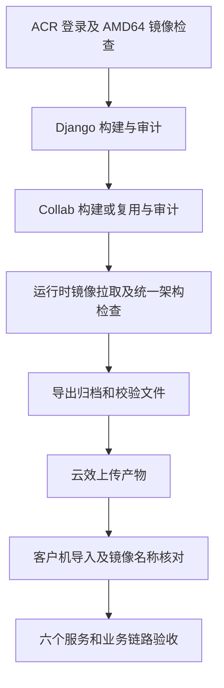

# 服务端 AMD64 构建结果与接手说明

> 状态：已确认（用户确认云效构建成功；客户机部署验收待补）
> 最后更新：2026-09-11
> 适用范围：TabTin Community 服务端 ARM64/AMD64 容器交付；不涉及客户端改造
> 关联文档：[私有化部署入口](../说明.md)、[服务部署历史快照](2026-09-08-服务部署现状.md)

## 当前结果与接手顺序

**2026-09-11，用户明确确认 AMD64 已在云效构建成功，ARM64 此前也已跑通。** 本文从早期调研更新为服务端接手依据，保留原文件路径以免已有链接失效。旧版本文中的“AMD 流水线尚未创建”“本机 Docker 未启动”“尚未完整构建”等描述已经过时。

接手时先做三件事：

1. 打开 AMD64 流水线，查看最近一次成功运行，记录运行编号、源代码 SHA 和产物位置。当前只收到用户对最终构建成功的确认，未取得最终成功日志；不要把中途失败日志的 build id 当成成功运行编号。
2. 使用本文的 ACR 标签表核对云效变量，检查构建节点为 `Linux/amd64`。五个 AMD64 基础/依赖镜像已补齐，不需要再次访问 Docker Hub 同步。
3. 核对下载到的完整离线交付包及安装镜像名，再开展 AMD64 客户机验收。云效构建成功不能代替部署和业务验收。

本次改动集中在流水线配置和 ACR 镜像准备，未为此修改客户端代码。构建源码分支为 `private/260907-build-opt`；已见失败运行日志中的源码 SHA 为 `2dd2ffe78c2814c9b4a0aa362c8600d902f4121b`，**最终成功运行的 SHA 仍应从云效补录**。

## 流水线与边界

| 流水线 | 用途与状态 |
|---|---|
| [5262318 TabTin AMD64 私有化](https://flow.aliyun.com/pipelines/5262318/current) | 用户从 ARM 流水线复制，截图核实编号；用户已确认构建成功 |
| [5253441 TabTin ARM64 私有化](https://flow.aliyun.com/pipelines/5253441/current) | 原流水线，保持不动 |
| [5257373 TabTin ARM64 私有化 · 构建优化](https://flow.aliyun.com/pipelines/5257373/current) | ARM 优化副本，保留原配置 |
| [5257418 TabTin ARM64 · Python 源测速](https://flow.aliyun.com/pipelines/5257418/current) | 独立手动测速任务，不作为交付流水线 |

AMD64 编辑地址为 `https://flow.aliyun.com/pipelines/5262318/edit`。本次云效日志显示 Docker server 为 Linux/x86_64、8 CPU、16 GiB；执行容器中的 Python 为 3.6.8，Docker CLI 为 26.1.3、Buildx 为 0.14.0、Compose 为 2.27.0。这些是当次运行快照，后续以实际日志为准。

架构范围是 `linux/arm64` 与 `linux/amd64`。AMD64 同时适用于 Intel/AMD x86-64 CPU。macOS/Windows 上运行 Linux 容器时依靠 Docker 的 Linux 虚拟机/后端；并不需要另做 macOS 服务端镜像。客户端仍按 macOS ARM64、macOS x64、Windows x64 等单独打包。

每套服务端交付包含五个镜像，对应六个服务：Django 和 Celery 共用后端镜像，另有 Collab Live、PostgreSQL/pgvector、Redis、Centrifugo。不能只换 Django 镜像而沿用 ARM 运行时依赖。

## ACR 镜像事实表

统一前缀：

```text
tabtin-acr-registry.cn-shanghai.cr.aliyuncs.com/tabtin
```

以下架构来自当次 Registry API 读取的远端 manifest/config，不是按名称推测。

| 仓库 | AMD64 构建采用的标签 | 已验证平台 | 当时无后缀标签的实际情况 |
|---|---|---|---|
| `base-python` | `3.11-slim` | `linux/amd64` | 此标签就是 AMD64；另有 `3.11-slim-arm64` |
| `pgvector` | `pg16-amd64` | `linux/amd64` | `pg16` 为 ARM64 |
| `base-node` | `22-bookworm-slim-amd64` | `linux/amd64` | `22-bookworm-slim` 为 ARM64；`20-slim` 虽是 AMD64，但不替代当前 Node 22 要求 |
| `base-debian` | `bookworm-slim-amd64` | `linux/amd64` | `bookworm-slim` 为 ARM64 |
| `redis` | `8-alpine-amd64` | `linux/amd64` | `8-alpine` 为 ARM64 |
| `centrifugo` | `v6-amd64` | `linux/amd64` | `v6` 为 ARM64 |

后五个 AMD64 标签已在本次会话中实际推送并逐个验证。原 ARM 标签未覆盖。**不要把无后缀标签一律理解为 AMD64，也不要把它们一律理解为多架构索引。** `--platform` 能选择已有架构，不能把单架构 ARM 镜像变成 AMD 镜像。

业务镜像默认名称仍为 `tabtin/community-django:private-260907` 和 `tabtin/community-collab-live:private-260907`。它们没有架构后缀，依靠独立的构建环境与交付目录隔离；不能因此判断业务镜像是 ARM。

## 云效常规执行配置

执行顺序：**Docker Login ACR → 构建前检查 → 正式构建 → 导出产物上传步骤**。一次性 Docker Hub 同步步骤已经不再需要；可禁用或删除。是否已经在页面删除，未独立核实。

下面是依据本次已验证镜像整理的维护用命令。正式构建块保留了本次使用的核心配置；检查块加强为实际拉取及架构校验。不要把它们误称为已经重新读取过的云效页面配置。复制时使用代码块中的纯文本，不能带入富文本的 `&#x20;`、链接括号或多余转义。

不同 Command 步骤中的 `export` 不应假定自动传递，正式构建必须自行设置所需变量。检查步骤不调用 `build-private-delivery.sh`，以免重复构建。

### 构建前检查

在 AMD64 云效节点运行，且此前已完成 Docker Login ACR。这个步骤只从 ACR 拉取，不访问 Docker Hub。

```bash
set -euo pipefail
registry=tabtin-acr-registry.cn-shanghai.cr.aliyuncs.com/tabtin

for image in \
  "$registry/base-python:3.11-slim" \
  "$registry/pgvector:pg16-amd64" \
  "$registry/base-node:22-bookworm-slim-amd64" \
  "$registry/base-debian:bookworm-slim-amd64" \
  "$registry/redis:8-alpine-amd64" \
  "$registry/centrifugo:v6-amd64"
do
  echo "检查镜像: $image"
  docker pull --platform linux/amd64 "$image"
  actual_platform="$(docker image inspect \
    --format '{{.Os}}/{{.Architecture}}' "$image")"
  echo "实际平台: $actual_platform"
  if [ "$actual_platform" != "linux/amd64" ]; then
    echo "FAIL: 架构不匹配: $image" >&2
    exit 1
  fi
  echo "PASS: $image"
done

echo "全部基础镜像通过 AMD64 检查"
```

`docker manifest inspect "$image" >/dev/null` 只证明 manifest 可读取，不能替代上述架构校验。源文件中现有的最终架构检查和源码审计仍需保留。

### 正式构建

```bash
set -euo pipefail
registry=tabtin-acr-registry.cn-shanghai.cr.aliyuncs.com/tabtin

echo "构建提交: $(git rev-parse HEAD)"
test -f scripts/backend/private-build-cache.py || {
  echo "请先同步并选择 private/260907-build-opt 分支"
  exit 2
}
grep -q '^ARG PIP_TRUSTED_HOST=' apps/tabtin_django/Dockerfile.private || {
  echo "请先将 85c318ab8a 或后续提交同步至 Codeup 优化分支"
  exit 2
}
python3 --version
python3 -m unittest \
  scripts.tests.test_private_build_cache \
  scripts.tests.test_private_collab_cache
docker info

export TABTIN_PRIVATE_PLATFORM=linux/amd64
export TABTIN_PRIVATE_OUTPUT_DIR="$PWD/dist/private-delivery-amd64"
export TABTIN_PRIVATE_BASE_IMAGE="$registry/base-python:3.11-slim"
export TABTIN_PRIVATE_POSTGRES_CLIENT_IMAGE="$registry/pgvector:pg16-amd64"
export TABTIN_PRIVATE_NODE_IMAGE="$registry/base-node:22-bookworm-slim-amd64"
export TABTIN_PRIVATE_RUNTIME_IMAGE="$registry/base-debian:bookworm-slim-amd64"
export TABTIN_PRIVATE_PGVECTOR_IMAGE="$registry/pgvector:pg16-amd64"
export TABTIN_PRIVATE_REDIS_IMAGE="$registry/redis:8-alpine-amd64"
export TABTIN_PRIVATE_CENTRIFUGO_IMAGE="$registry/centrifugo:v6-amd64"
export TABTIN_PRIVATE_PIP_INDEX_URL=http://mirrors.cloud.aliyuncs.com/pypi/simple/
export TABTIN_PRIVATE_PIP_TRUSTED_HOST=mirrors.cloud.aliyuncs.com
export TABTIN_PRIVATE_NPM_REGISTRY=https://registry.npmmirror.com
export TABTIN_PRIVATE_COLLAB_CACHE_REPOSITORY="$registry/collab"
export TABTIN_PRIVATE_DEPS_CACHE_REPOSITORY="$registry/base-python"
export TABTIN_PRIVATE_APT_MIRROR=mirrors.aliyun.com

if curl -fsS \
  --connect-timeout 5 \
  --max-time 15 \
  -o /dev/null \
  -w 'APT 内网探测: %{speed_download} bytes/s\n' \
  http://mirrors.cloud.aliyuncs.com/debian/dists/trixie/InRelease
then
  export TABTIN_PRIVATE_APT_MIRROR=mirrors.cloud.aliyuncs.com
fi

echo "APT mirror: $TABTIN_PRIVATE_APT_MIRROR"
echo "Build started: $(date -Iseconds)"
bash scripts/backend/build-private-delivery.sh
echo "Build finished: $(date -Iseconds)"
ls -lh "$TABTIN_PRIVATE_OUTPUT_DIR"
```

两处 pgvector 变量分别用于后端的 `pg_restore` 来源和离线数据库镜像，两处都必须使用 AMD64 标签。PyPI 内网地址是 HTTP，配合限定主机的 `PIP_TRUSTED_HOST`；不应全局关闭 TLS 校验。

## 产物与部署验收边界

本次构建输出目录是 `dist/private-delivery-amd64`。代码中的交付入口会先构建并审计 Django，再构建或复用并审计 Collab，最后拉取三个运行时镜像、统一检查架构、导出归档与校验文件。当前脚本实际为串行调用。

以下流程区分构建成功和客户部署通过：



完整交付目录包括：

- `tabtin-private-app-images-260907.tar` 与 `.sha256`；
- `tabtin-runtime-images.tar` 与 `.sha256`；
- `compose.yaml`、`compose.private-macmini.yaml`、`private-macmini.sh`；
- `.env`、`.env.community-runtime`、`community-assets/postgres-entrypoint.sh`、`README.md`。

上传步骤应包含隐藏的环境文件。不要只上传业务镜像 tar。最终 OSS 实际路径和归档校验值尚未补录。ARM 优化目录来自原交接：`tabtin-private-images/optimization/linux-arm64/`；AMD 建议独立放到 `tabtin-private-images/optimization/linux-amd64/<运行标识>/`，这个 AMD OSS 路径是建议值，未读取线上上传步骤确认。

**部署前必须核对运行时镜像名称。** 本次读取的 `2dd2ffe78c` 代码中，`build-private-delivery.sh` 会按 `TABTIN_PRIVATE_*_IMAGE` 指定的 ACR 名称导出运行时镜像；`private-macmini.sh` 的 `check_runtime_images` 则要求 `pgvector/pgvector:pg16`、`redis:8-alpine`、`centrifugo/centrifugo:v6`，其安装过程只为 Django/Collab 添加 `:local` 标签。若云效后续步骤没有额外转换标签，实际离线包可能缺少安装器要求的三项名称。**这是根据源码确认的接口差异，尚未检查最终产物是否已处理，不能写成已发生的客户部署故障。** 接手者应先看实际 tar 的标签/导入清单，再决定在交付打包环节统一名称或在安装环节补齐映射。

客户机验收需要覆盖归档 SHA-256、完全离线导入、六个服务健康、API、消息 WebSocket、协作，以及数据库备份恢复工具。不要因为 `channels_redis` 导入成功就认为复制进来的 `pg_restore` 也可执行。

## 本次故障及正确解释

| 现象 | 已核实原因或边界 | 处理方式 |
|---|---|---|
| `base-python:3.11-slim-amd64: not found` | 当时未创建这个标签；无后缀 `3.11-slim` 已是 AMD64 | 使用已验证的实际标签，不凭后缀猜测 |
| `TABTIN_PRIVATE_BASE_IMAGE: unbound variable` | 独立检查步骤没有定义变量，`set -u` 触发 | 每个步骤自行定义变量，或使用云效统一变量 |
| Django 耗时 573 秒完成后，Collab 报 `exec /bin/sh: exec format error` | Collab 的 Debian runtime 实际为 ARM64，后续 Node 检查也证实为 ARM64 | 补充真正的 AMD64 镜像，修改两处基础镜像变量 |
| pgvector、Node、Debian、Redis、Centrifugo 拉取提示 `wanted linux/amd64, actual linux/arm64` | 五个旧标签均是 ARM，不是自动选择平台的多架构标签 | 将 AMD64 放入独立的新标签 |
| 测试日志出现 `example.invalid/...arm64`、模拟缓存失败 | 16 项缓存单元测试的测试输出 | 区分测试段与实际构建段，不据此认定 AMD 构建跑错 |
| 云效同步任务逐个 Docker Hub 超时 | 2026-09-11 14:27 的节点无法直连 `registry-1.docker.io` | 改为本机代理同步；常规构建只拉 ACR |
| 本机执行 `pull --platform` 后普通 inspect 仍显示 ARM64 | 曾观察到的本地存储/平台解析现象，根因未完成诊断 | 不把“删除缓存即可解决”当作已证实结论；本次最终通过 Skopeo 绕过本地 daemon 完成复制 |
| `docker manifest inspect` 成功但后面执行失败 | manifest 存在性检查不验证 CPU 架构，更不验证镜像内每个可执行文件 | 实际检查配置的 OS/Architecture，运行验收放在目标平台 |

本机仅拉取/复制/上传 AMD 镜像**不需要仿真**；在 ARM 宿主执行 AMD 镜像里的程序或进行含 `RUN` 的构建，才需要仿真或 AMD64 builder。此前将上传问题归因于未启用仿真是不准确的，后续不要据此要求开启仿真。

## 以后升级基础镜像时如何同步

本次最终成功的方法：在本机安装 Skopeo，通过 `http://127.0.0.1:7897` 代理执行 `skopeo copy --override-os linux --override-arch amd64`，将 Docker Hub 的 AMD64 子镜像复制到 ACR；之后用 Registry API 读取远端 config 核实全部为 `linux/amd64`。本次没有运行 AMD 容器，也没有配置 Docker Desktop 的全局代理。复制过程仍传输镜像层，只是不依赖 Docker daemon 的本地镜像存储。

源与目标对应关系：

| Docker Hub 源 | ACR 仓库与标签 |
|---|---|
| `pgvector/pgvector:pg16` | `tabtin/pgvector:pg16-amd64` |
| `library/node:22-bookworm-slim` | `tabtin/base-node:22-bookworm-slim-amd64` |
| `library/debian:bookworm-slim` | `tabtin/base-debian:bookworm-slim-amd64` |
| `library/redis:8-alpine` | `tabtin/redis:8-alpine-amd64` |
| `centrifugo/centrifugo:v6` | `tabtin/centrifugo:v6-amd64` |

下列示例仅供未来明确升级镜像时参考，**不要每次出业务包都重新同步可变上游标签**。Skopeo 需要事先安装；凭据通过受控环境变量注入，正文不记录密码。`ACR_USERNAME`、`ACR_PASSWORD` 未设置时命令会停止。

```bash
set -euo pipefail
: "${ACR_USERNAME:?请先设置 ACR 用户名}"
: "${ACR_PASSWORD:?请先设置 ACR 密码}"
registry_host=tabtin-acr-registry.cn-shanghai.cr.aliyuncs.com
registry="$registry_host/tabtin"
auth_dir="$(mktemp -d)"
trap 'rm -rf "$auth_dir"' EXIT
export HTTP_PROXY=http://127.0.0.1:7897
export HTTPS_PROXY=http://127.0.0.1:7897

printf '%s' "$ACR_PASSWORD" | skopeo login \
  --authfile "$auth_dir/auth.json" \
  --username "$ACR_USERNAME" --password-stdin "$registry_host"

copy_image() {
  skopeo copy --override-os linux --override-arch amd64 \
    --authfile "$auth_dir/auth.json" \
    "docker://docker.io/$1" "docker://$registry/$2"
  platform="$(skopeo inspect --authfile "$auth_dir/auth.json" \
    --format '{{.Os}}/{{.Architecture}}' "docker://$registry/$2")"
  test "$platform" = linux/amd64
  echo "PASS: $registry/$2 $platform"
}
copy_image pgvector/pgvector:pg16 pgvector:pg16-amd64
copy_image library/node:22-bookworm-slim base-node:22-bookworm-slim-amd64
copy_image library/debian:bookworm-slim base-debian:bookworm-slim-amd64
copy_image library/redis:8-alpine redis:8-alpine-amd64
copy_image centrifugo/centrifugo:v6 centrifugo:v6-amd64
```

## 缓存、分支与后续待办

- 依赖缓存仓库是 `tabtin/base-python`，Collab 缓存仓库是 `tabtin/collab`。指纹包含架构，两个架构可以共用仓库，但各自使用独立缓存引用；无需一律另建仓库。
- 首次 AMD 构建建立缓存；后续是否命中需看真实构建段的 `DEPENDENCY_CACHE_HIT`、`COLLAB_CACHE_HIT`。缓存上传可能因超时失败，日志出现 push 行不等于已持久保存，后续应查询实际缓存标签。
- `TABTIN_PRIVATE_CACHE_EPOCH` 默认 `v1`。如果重新覆盖基础镜像的同名标签，现有内容指纹未必感知镜像内容变化；应使用不可变标签/digest，或按仓库说明提升 epoch。不要为本次已经验证的配置无故清空缓存。
- 保留 `audit-private-artifact.sh`、`audit-private-collab-artifact.sh` 及冻结程序对 `channels_redis.core`、`channels_redis.serializers` 的检查。CI 辅助脚本需兼容 Python 3.6。
- 原交接中 Codeup 同步为整库强制同步，且当时同事账号无法直接推送。后续同步前重新确认权限及差异，不能把当时权限问题等同于当前用户权限；也不能用同步覆盖两端未处理的改动。
- [x] 用户确认 ARM64 云效构建跑通。
- [x] 五个缺失 AMD64 镜像已补齐，远端架构全部验证。
- [x] 用户确认 AMD64 云效构建成功。
- [ ] 补录最终成功运行编号、源码 SHA、完成时间、产物地址及 SHA-256。
- [ ] 核对实际导出包中的运行时镜像标签与安装脚本要求一致。
- [ ] 在 AMD64 客户机完成离线安装、六个服务健康及业务链路验收。
- [ ] 记录后续构建的依赖/Collab 缓存命中情况。

代码依据位于 TabTin 仓库（本机路径 `/Users/yang/Documents/larchiveai/TabTin`）：`scripts/backend/build-private-delivery.sh`、`build-private-image.sh`、`build-private-collab-image.sh`、`private-macmini.sh`、`private-build-cache.py`、`private-collab-cache.py`、`private-build-optimization.md`，以及 `apps/tabtin_django/Dockerfile.private`、`apps/collab-live/Dockerfile.private`。交付包安装器名称仍为 `private-macmini.sh`，不能仅凭名称认为 AMD64 不能使用；实际部署以镜像架构和 Docker 环境为准。
