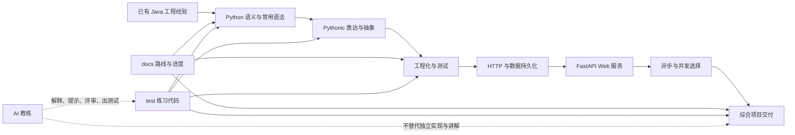
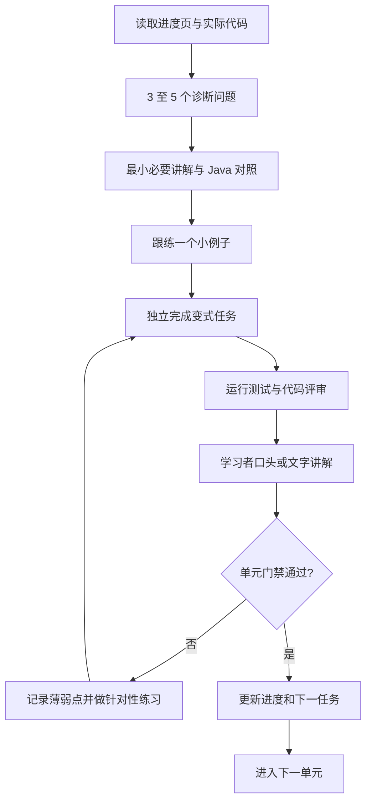

# Python 学习路线

> 状态：已确认
> 最后更新：2026-09-01
> 适用范围：有 Java 工程经验、目标为全栈开发的 Python 学习
> 关联文档：[Python 学习执行计划](../学习计划/Python学习执行计划.md)、[AI 带练会话约定](../学习计划/AI带练会话约定.md)、[Python 学习进度](../学习计划/Python学习进度.md)

## 背景与路线决策

### 已确认事实

- 学习者不是编程初学者，已经具备 Java 语法、面向对象和工程开发经验。
- 当前 Python 练习已涉及函数、类型标注、字符串、列表、字典和 `dataclass`，但尚未形成完整语言模型与工程闭环。
- `03.py` 的容器访问和 `04.py` 的比较语义已完成修正并通过断言；`PY-00` 已有学习记录和门禁证据。
- PyCharm 当前使用父项目 `.venv` 的 Python 3.12.0，系统 `python3` 也是 3.12.0；`test/.venv` 中仍保留未使用的 Python 3.9.6，需避免误激活。

### 设计决策

- 不从“什么是变量”开始，而是利用 Java 经验快速建立 Python 与 Java 的差异模型。
- 以 Python 3.12 为学习基线；Python 3.9 已结束官方安全维护，不作为新学习环境继续扩展。
- 学习顺序为“语言语义 → Pythonic 表达 → 工程化 → Web 与数据 → 并发 → 综合项目”。
- Web 主线选择 FastAPI、Pydantic v2 和 SQLAlchemy 2.0。Flask、Django 只做定位认知，不并行学习。
- 数据库主线使用 MySQL 5.7、PyMySQL 和 SQLAlchemy 2.0，不再以 SQLite 作为正式练习数据库；目标 schema 为 `afakmv_meta`，学习表统一使用 `py_learning_` 前缀。
- 冷门语法和底层机制只建立印象；常用能力必须通过独立编码、调试、测试和讲解四类证据验收。
- 每个单元采用“受限概念练习 → 开放实践练习 → 累积项目改造”的梯度；阶段之间持续演进同一个工具目录项目，不堆互不相关的小文件。
- 默认采用六周速成模式，每周 8–10 小时，总计约 48–60 小时；若压到四周，则每周需要 12–15 小时。
- 速成依靠诊断跳过已掌握的通用知识、合并概念题与项目题、后置低频主题，不通过删掉 Python 特有语义、测试或项目验收来制造完成感。

## 目标

完成路线后，学习者应当能够：

1. 不依赖 AI 完成中小型 Python 函数、模块、命令行程序和 Web API 的核心实现。
2. 准确解释 Python 的对象引用、可变性、相等与同一性、作用域、迭代协议、异常和异步模型。
3. 阅读常见 Python 项目，能定位入口、包结构、依赖、配置、测试和主要调用路径。
4. 使用类型标注、`pytest`、日志、格式与静态检查建立基本工程质量。
5. 使用 FastAPI、Pydantic 和 SQLAlchemy 构建带验证、持久化、异常处理和测试的后端服务。
6. 判断同步、`asyncio`、线程和进程各自适合的场景，不在异步代码中误用阻塞调用。
7. 把 AI 当作提示器、评审者和测试助手，并能识别、解释和修正 AI 生成代码中的问题。

## 非目标

本轮不追求以下内容：

- Go、HTML、CSS、JavaScript、TypeScript 或具体前端框架。
- 数据科学、机器学习、爬虫体系、桌面 GUI、游戏开发。
- 同时深入 Django、Flask 和 FastAPI 三套框架。
- 元类、描述符实现、字节码、AST、CPython C API、垃圾回收调优等底层专题。
- 为背诵而覆盖全部标准库；遇到业务场景时再查阅低频 API。
- 生产部署平台、Kubernetes 和完整 DevOps 流程；只掌握运行 Python 服务所需的最小概念。

## GitHub 路线调研与取舍

以下结论基于 2026-08-27 对仓库说明、课程目录和练习组织方式的核查。Star 数只用于发现候选，不作为质量结论；本路线借鉴结构和教学方法，不复制外部答案。

| 参考仓库 | 有价值的设计 | 本路线如何采纳 | 明确不照搬的部分 |
| --- | --- | --- | --- |
| [Practical Python Programming](https://github.com/dabeaz-course/practical-python) | 面向已有其他语言经验的职业开发者；约 130 个动手练习；从数据处理逐步进入程序组织、对象模型、生成器、测试和包 | 作为 `PY-01`～`PY-07` 的主要课程结构校验；采用连续演进的练习和“写代码而非只看视频”原则 | 课程主要基于较早的 Python 3 特性且不覆盖 Web；现代类型、工程工具和后端内容由本路线补齐 |
| [Advanced Python Mastery](https://github.com/dabeaz-course/python-mastery) | 后续练习建立在前序代码上，强调对象模型、错误与测试、迭代器、生成器、模块和包的完整心智模型 | `PY-04`～`PY-07` 可选择其中的代码阅读思路和递进方式，帮助从“会写脚本”过渡到“理解项目” | 元编程不是当前必修；该课程明确不覆盖 typing 和 async，不能单独承担现代后端路线 |
| [Exercism Python Track](https://github.com/exercism/python) | 将练习分成受限于少量语言特性的概念练习，以及可自由选择实现方式的实践练习，并用测试验证 | 每个单元至少设置一个概念小题和一个业务变式，先隔离知识点，再验证迁移能力 | 不追求刷完题库，也不以平台解锁顺序替代本项目的能力门禁 |
| [learn-python](https://github.com/trekhleb/learn-python) | 示例本身可执行，使用断言展示预期，并鼓励修改代码、增加断言、运行测试和代码检查 | 从 `PY-00` 起采用“预测 → 运行 → 修改 → 断言”的微循环；`PY-07` 后升级为 `pytest` | 其中部分 lint 工具组合较旧，本路线统一采用当前选定的 Ruff 和类型检查方案 |
| [30 Days Of Python](https://github.com/Asabeneh/30-Days-Of-Python) | 主题覆盖广，每日包含多个难度层级的练习，适合作为基础知识缺口的补题来源 | 仅在诊断发现具体缺口时选取同主题练习思路，例如字符串、容器、函数、异常和文件 | 不采用“30 天”日历压力；统计、Pandas、爬虫和 MongoDB 不进入当前主线 |
| [The Hitchhiker's Guide to Python](https://github.com/realpython/python-guide) | 把环境、项目结构、风格、文档、测试、日志、常见陷阱和打包放入日常工程实践 | 作为 `PY-07` 工程化检查表的参考，并强化“会运行”之外的项目质量 | 工具推荐可能随时间变化；具体工具和命令优先采用当前官方文档与本项目决策 |
| [Architecture Patterns with Python](https://github.com/cosmicpython/book) | 用领域模型、Repository、Service Layer、TDD 和 Unit of Work 管理业务复杂度 | 在 `PY-09`～`PY-12` 已有可运行功能后，选择性比较仓储层、服务层和事务边界 | 事件总线、CQRS 和复杂领域建模不作为当前主线，避免 Java 开发者过早复制重型架构 |
| [TheAlgorithms/Python](https://github.com/TheAlgorithms/Python) | 有大量可运行实现，可用于阅读陌生 Python 代码和比较实现方式 | 仅在需要额外代码阅读或算法小练习时选用 | 它是算法实现集合，不是 Python 语言或后端工程路线，不用于决定课程顺序 |

### 调研结论

1. 当前“核心语义 → Pythonic → 工程化 → Web/数据 → 并发 → 综合项目”的顺序保留。
2. 每个单元固定加入概念练习、开放业务练习和无完整答案的迁移题，避免只会复现示例。
3. 在 `PY-03`、`PY-06`、`PY-07`、`PY-10` 和 `PY-11` 后形成可运行的阶段产物，持续演进而不是每周换项目。
4. 外部仓库只作为补充资料和练习来源；本地执行计划与进度页仍是唯一课程主线。
5. 较早课程缺少的类型标注、现代 `pyproject.toml`、FastAPI、SQLAlchemy 2.0 和 `asyncio` 继续由本路线承担。

## 学习全景

下图说明从既有 Java 能力到可交付 Python 后端能力的完整主线，以及文档、练习项目和 AI 在其中的边界。

## 能力优先级

### 必须熟练

- 对象引用、可变与不可变、浅拷贝、`==` 与 `is`、真值判断。
- `str`、`list`、`tuple`、`dict`、`set` 的选择、遍历和常用操作。
- 条件、循环、函数、参数、返回值、作用域、类型标注。
- 推导式、拆包、排序键、`enumerate`、`zip`、迭代器和生成器。
- 异常处理、上下文管理器、`pathlib`、JSON、日期时间、日志。
- 类、`dataclass`、组合、常用双下方法、模块、包和导入。
- 虚拟环境、`pyproject.toml`、依赖管理、`pytest`、静态检查和调试。
- HTTP 客户端、超时、输入校验、SQL、事务、FastAPI、Pydantic、SQLAlchemy。
- `async` / `await`、任务、取消、超时，以及线程/进程/异步的选择。

### 会用并理解边界

- 装饰器、闭包、`functools`、`itertools`、`collections` 的常用部分。
- 抽象基类（ABC）与结构化类型（Protocol）。
- 正则表达式的常见匹配与提取，不追求复杂技巧。
- `argparse`、环境变量、配置分层、Mock 和测试替身。
- Alembic 数据库迁移基础、ASGI/WSGI 区别、GIL 的工程影响。
- 基础安全：密钥不入库、参数校验、SQL 注入、密码不可明文、最小权限。

### 只需有印象、按需查询

- 元类、描述符协议细节、复杂多继承与 MRO 边界案例。
- 字节码、AST、导入钩子、猴子补丁、CPython 内存布局与 C 扩展。
- 冷门双下方法、全部 `itertools` 组合、复杂正则技巧。
- 发布公共 PyPI 包、GUI、科学计算和机器学习生态。
- Django/Flask 内部实现；只需要知道它们与 FastAPI 的定位差异。

## 六周速成路线

| 周次 | 合并单元 | 每周主线 | 周末可运行产物 |
| --- | --- | --- | --- |
| 第 1 周 | `PY-00`～`PY-02` | Python 3.12 环境、对象引用、相等性、容器和控制流 | 能正确筛选、查找和校验工具数据的内存脚本 |
| 第 2 周 | `PY-03`～`PY-05` | 函数与类型标注、常用 Pythonic 写法、异常、JSON 和文件 | 带类型、异常契约和 JSON 输入的工具查询模块 |
| 第 3 周 | `PY-06`～`PY-07` | `dataclass`、组合、模块与包、`pytest`、Ruff、类型检查和日志 | 可导入、可测试、可通过 CLI 运行的 `tool_registry` 包 |
| 第 4 周 | `PY-08`～`PY-09` | HTTP 客户端、配置、MySQL、事务和 SQLAlchemy 2.0 | 能持久化工具并正确处理超时及事务失败的服务核心 |
| 第 5 周 | `PY-10`～`PY-11` | FastAPI、Pydantic、API 测试和 `asyncio` | 带数据库和异步健康检查的 Web API |
| 第 6 周 | `PY-12` | 收口测试、日志、运行说明、缺陷修复和低提示独立功能 | 通过综合验收的工具目录服务 |

各单元的具体知识点、练习和门禁见 [Python 学习执行计划](../学习计划/Python学习执行计划.md)。

### 四周高强度版本

若每周可以稳定投入 12–15 小时，可合并为：第 1 周完成 `PY-00`～`PY-03`，第 2 周完成 `PY-04`～`PY-07`，第 3 周完成 `PY-08`～`PY-10`，第 4 周完成 `PY-11`～`PY-12`。四周版本使用相同门禁和最终项目，不减少关键验收；无法稳定投入时回到六周版本。

## Java 到 Python 的关键映射

| Java 经验 | Python 对应方式 | 重点纠偏 |
| --- | --- | --- |
| 静态类型、编译期约束 | 动态运行时 + 类型标注 + 静态检查 | 类型标注默认不负责运行时校验 |
| `null` | `None` | 用 `is None`，不要写 `== None` |
| `equals` 与 `==` | `==` 与 `is` | `==` 比较值，`is` 判断是否同一对象 |
| `ArrayList` / `HashMap` / `HashSet` | `list` / `dict` / `set` | 先辨认容器层级，再选择索引、键或遍历 |
| Stream API | 推导式、生成器、内置函数 | 不把每段逻辑都写成长链；可读性优先 |
| Record / POJO | `dataclass`、普通类、Pydantic 模型 | 数据载体、领域行为和接口校验模型职责不同 |
| Interface | Protocol、ABC、鸭子类型 | 优先依赖行为，不为形式创建无意义继承层次 |
| try-with-resources | `with` / 上下文管理器 | 资源释放通过协议完成 |
| Maven / Gradle | `pyproject.toml` + 环境/依赖工具 | 虚拟环境与项目元数据是两个不同概念 |
| JUnit | `pytest` | 直接 `assert`、fixture、参数化是主流写法 |
| Spring Boot | FastAPI + Pydantic + 依赖注入 | Python 服务通常更轻，避免照搬 Java 分层数量 |
| `CompletableFuture` / 线程池 | `asyncio`、线程池、进程池 | I/O 与 CPU 场景要先分类，`async` 不等于自动并行 |

## 核心学习闭环

下图定义每个单元必须经历的流程；未通过门禁时回到针对性练习，而不是继续堆新知识。

## 单元门禁

每个单元从四个维度各记 0–2 分：

| 维度 | 0 分 | 1 分 | 2 分 |
| --- | --- | --- | --- |
| 概念理解 | 无法解释或存在关键误解 | 提示后能解释 | 能独立解释并与 Java 对比 |
| 独立实现 | 依赖完整答案 | 需要骨架或多次提示 | 能独立完成核心逻辑 |
| 调试与测试 | 不会定位失败 | 能按提示修复 | 能从报错/失败测试定位并补边界案例 |
| 工程质量 | 代码不可运行或结构混乱 | 可运行但有明显问题 | 命名、类型、异常和结构与当前阶段匹配 |

通过条件：总分至少 6 分，且“概念理解”“独立实现”“调试与测试”均不得为 0。分数只用于发现缺口，不用于追求形式上的满分。

## AI 使用原则

- 核心练习先独立尝试 15–25 分钟，再请求提示。
- 提示按“问题引导 → 局部提示 → 代码骨架 → 完整参考实现”逐级升级。
- AI 可以生成测试案例、解释报错、评审命名和结构，但第一次尝试不直接生成完整答案。
- 采用 AI 代码后，学习者必须能逐段解释，并完成一个不照抄的变式任务。
- 每个单元至少保留一个“关闭 AI 自动补全也能完成”的独立任务。
- 不考查可随时查到的低频 API 拼写，重点考查模型、边界和调试能力。

## 用户豁免与完成口径

- 学习者可以明确要求跳过某个主题、练习或单元门禁，并让路线继续推进。
- 未留下要求证据的内容不得写成“已通过”；统一记录为“已完成（含用户豁免）”，并列出被跳过的具体项目。
- “已完成（含用户豁免）”计入路线推进和完成数量，但最终报告必须同时给出“已通过”和“用户豁免”两套统计，不能把概念了解等同于独立实现。
- 用户豁免表示主动接受能力缺口，不删除已有失败、诊断或待补证据；后续真实项目需要该能力时可以恢复验证。
- 安全、数据完整性、事务、API 错误和异步资源边界即使被豁免，也必须在最终交付风险中明确提示，不能静默省略。

## 主要风险与应对

| 风险 | 表现 | 应对 |
| --- | --- | --- |
| 用 Java 写 Python | 过多类、接口、Getter/Setter 和层级 | 每次评审增加“能否用函数、组合或协议简化”检查 |
| 只会看不会写 | 看懂 AI 代码但不能从空文件开始 | 每单元设置独立变式与无提示复写 |
| 框架掩盖语义缺口 | 会调 FastAPI 装饰器但不会处理列表、异常或迭代 | `PY-07` 门禁前不进入 Web 主线 |
| 速成变成赶进度 | 单元按日期标完成，却不能独立编码或解释 | 只压缩讲解和重复题；关键门禁失败时允许顺延，不虚报通过 |
| 环境漂移 | 系统 Python、虚拟环境和依赖来源混乱 | `PY-00` 固定解释器并记录运行命令 |
| 知识铺得过宽 | 同时学习多框架和大量冷门机制 | 严格执行三级优先级，低频内容只留检索关键词 |
| 进度失真 | 新会话重复授课或跳过薄弱点 | 每次会话结束更新进度页并记录验证证据 |

## 路线完成标准

- [ ] `PY-00` 至 `PY-12` 均在进度页记录“已通过”或“已完成（含用户豁免）”，并分别统计。
- [ ] 能在不读取完整参考答案的情况下完成综合项目核心功能。
- [ ] 综合项目的自动化测试全部通过，并覆盖正常、异常和边界路径。
- [ ] 能解释综合项目中的对象模型、包结构、类型、异常、数据库事务和异步边界。
- [ ] 能对一段 AI 生成的 Python 代码指出至少三类潜在问题，并自行修正。
- [ ] 能独立阅读一个陌生的小型 Python 项目并找到启动方式、配置、核心逻辑和测试入口。
