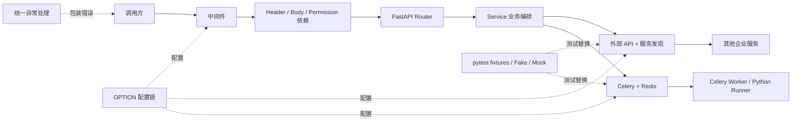

# 企业级 Python 项目上手路线

> 状态：待执行
> 最后更新：2026-09-02
> 适用范围：已完成基础 Python 学习路线，准备通过真实企业项目建立代码阅读、调试、测试与交付能力
> 参考项目：`/Users/yang/deepfinance_project/pyserver`
> 扫描基线：`master` 分支，提交 `25def03`
> 关联文档：[全栈开发学习说明](../说明.md)、[Python 学习路线](Python学习路线.md)、[企业级 Python 项目上手进度](../学习计划/企业级Python项目上手进度.md)、[Python 学习进度](../学习计划/Python学习进度.md)、[AI 带练会话约定](../学习计划/AI带练会话约定.md)

## 路线结论

基础语法和 Demo 阶段已经结束。下一阶段不再按函数、类、FastAPI、SQLAlchemy 分别刷题，而是围绕 `pyserver` 的真实调用链学习：

1. 先建立启动、配置、请求、外部调用和异步任务五张地图。
2. 再用现有测试和 Fake 隔离外部系统，做到不启动整套分布式环境也能验证代码。
3. 然后完整吃透一个纵向业务切片，而不是横向读完所有目录。
4. 最后完成一个带回归测试、影响面分析和交付说明的低风险改动。

“企业级”不等于使用更多框架。真正需要掌握的是：看懂系统边界、追踪数据与异常、判断副作用、建立可重复验证、控制改动影响面，并能解释部署后的进程与故障行为。

## 学习边界

### 本阶段要做到

- 能从进程入口追到 FastAPI 应用、生命周期钩子、路由注册和配置加载。
- 能从一个 HTTP 请求追到依赖校验、业务服务、外部 API 或 Celery，再追到统一响应。
- 能解释 `async`、线程/进程池、Gunicorn worker 和 Celery worker 在本项目中的不同职责。
- 能识别网络、Redis、MySQL、服务发现和任务队列等副作用边界，并在测试中替换它们。
- 能先写或补回归测试，再完成一次小而完整的项目改动。
- 能区分“项目为了兼容而保留的旧写法”和“新项目应采用的现代写法”。

### 本阶段暂不要求

- 在本机完整搭建公司所有依赖服务。
- 从头实现 Apollo、Nacos、Celery、Gunicorn 或服务发现框架。
- 通读每个模型、路由和工具函数。
- 一开始就升级 Pydantic、SQLAlchemy、Celery 或重构自研基础设施。
- 把已有 Java、事务、SQL、HTTP 基础重新学一遍；只补 Python 和本项目特有差异。

## 扫描确认的项目画像

| 关注面 | 项目现状 | 首要入口 | 学习优先级 |
| --- | --- | --- | --- |
| Web 服务 | FastAPI，自定义 `PythonServer(FastAPI)` | `src/main.py`、`src/server.py` | 必须掌握 |
| 请求入口 | 集中注册 APIRouter，依赖负责 Header、权限和请求体日志 | `src/routers/__init__.py`、`src/dependencies/` | 必须掌握 |
| 数据模型 | Pydantic v1 模型及自定义构造方法 | `src/models/` | 必须会读 |
| 业务编排 | Router 下沉到 service，再调用平台接口或任务系统 | `src/routers/service/` | 必须掌握 |
| 外部调用 | 自定义 Route 描述、`aiohttp`、服务发现、重试和异常翻译 | `src/api/base.py`、`src/api/discovery.py` | 必须掌握 |
| 异步任务 | Celery + Redis，包含自定义 backend、Request、bootstep 和 worker 管理 | `src/celeryd/` | 必须理解边界 |
| 配置 | 自定义描述符，环境变量与 Apollo/Spring/Nacos 配置链，支持热更新 | `src/options.py`、`src/conf/` | 必须会追踪 |
| 部署运行 | Gunicorn + Uvicorn，独立 server/worker 启动脚本 | `src/gunicorn.conf.py`、`src/*ctl.sh` | 会分析即可 |
| 测试 | pytest、session fixture、TestClient、AsyncMock、Fake 外部 API | `tests/conftest.py`、`tests/routers/` | 必须掌握 |
| 兼容约束 | Python 3.8+ 条件依赖、Pydantic v1、SQLAlchemy 1.3、内部依赖 | `src/requirements.txt` | 修改前必须确认 |

项目当前没有 `pyproject.toml`、`pytest.ini` 或 `tox.ini`；开发依赖由根目录 `requirements-dev.txt` 引用生产依赖。部分依赖是公司内部包，因此“新建虚拟环境后一定能从公共源完整安装”不能作为前提。

## 先建立的系统地图



### 启动链

```text
src/main.py
→ 加载 OPTION
→ 配置日志、监控与服务发现
→ 安装中间件
→ 创建 PythonServer
→ 注册 ROUTERS 与异常处理器
→ Uvicorn（开发）或 Gunicorn（部署）运行
```

### 脚本执行链

```text
POST /py/{element_name}/run
→ Header / 权限 / Pydantic 入参
→ TaskManager.create_task()
→ 解析参数并查询元素信息
→ CeleryTask.create()
→ apply_async()
→ 返回 task id
```

同步接口会继续等待 Celery result，并处理超时、终止和执行异常。学习时必须把“HTTP 请求成功发出任务”和“任务执行成功”看作两个不同结果。

### 文件管理链

```text
Router
→ PyFileService
→ 文件名、参数和模型转换
→ asyncio.gather(
     上传平台文件,
     创建外部元素元数据
   )
```

读取链还包含普通脚本/DeepCube 脚本分支、加密内容、内嵌内容回退、重新上传及错误列表重建。这条链适合训练并发副作用、失败一致性和复杂模型转换。

## 与 Java 经验最相关的 Python 差异

| 本项目现象 | 可类比的 Java 概念 | Python 中要特别注意 |
| --- | --- | --- |
| 模块顶层直接构造 `OPTION`、`app` 或 Celery 对象 | Spring 容器启动配置 | Python 的 `import` 会执行模块顶层代码；导入顺序、环境变量设置时机和测试隔离都可能改变行为 |
| FastAPI `Depends` | Filter、Interceptor、参数解析器的组合 | 依赖既能取参数也能执行 I/O 和抛异常，必须看具体函数，不能只看路由签名 |
| Pydantic 模型 | DTO + Bean Validation | 类型标注本身不做运行时校验，Pydantic 才做；项目采用的是 v1 API |
| `async def` 服务方法 | `CompletableFuture`/响应式调用 | 只有被 `await`、创建 Task 或由框架调度后才执行；阻塞调用会卡住事件循环 |
| Celery task | MQ 消费者 + 任务状态存储 | 发送成功不等于执行成功；重试、超时、撤销和幂等要分开分析 |
| pytest fixture | 测试生命周期扩展 + 测试容器 | fixture 可自动执行、跨 session 共享并修改全局环境，读测试时先看 `conftest.py` |
| Fake/Mock 动态替换属性 | Mockito stub/代理 | Python 可直接替换模块符号；patch 的目标必须是“被使用处的名字”，不一定是定义处 |
| 描述符 `Option.__get__/__set__` | 自定义配置绑定器 | 这是本项目的高级基础设施；要求会追踪，不要求现阶段仿写 |

## 兼容代码与现代写法的边界

阅读这个项目时以它锁定的版本为准；自己新建项目时以当前学习路线的现代基线为准。不要边学习边做全仓升级。

| 项目中的现状 | 新项目通常采用 | 本阶段处理方式 |
| --- | --- | --- |
| Pydantic v1：`.dict()`、`parse_obj_as`、`@validator` 等 | Pydantic v2：`model_dump()`、`TypeAdapter`、`@field_validator` 等 | 会读、会改现有 v1 代码；不混用 v2 API |
| SQLAlchemy 1.3 | SQLAlchemy 2.x | 只理解项目现状；新代码是否升级由独立迁移任务决定 |
| `typing.List/Dict/Optional` 等旧式标注 | `list[...]`、`dict[...]`、`X | None` | 修改旧模块时遵循兼容范围，不能只按本机 3.12 写 |
| Python 3.8+ 条件依赖 | 新项目可选更高最低版本 | 先确认实际部署版本，再决定允许的语法和包版本 |
| shell 脚本手工设置 `PYTHONPATH` 并启动进程 | 更统一的包、容器或进程管理方案 | 先看懂进程拓扑，不在上手期重写部署方式 |
| 自研配置描述符和多配置中心 | 常见 Settings/配置库 | 理解来源、优先级和热更新，不为了“更 Pythonic”直接替换 |
| Celery 内部类与 monkey patch | 优先使用公开扩展点 | 视为高风险区，修改前必须补测试并核查 Celery 版本 |

## 六周执行路线

默认每周 8–10 小时。已有经验可通过诊断压缩，但不能跳过调用链、测试和交付证据。

| 周次 | 单元 | 核心问题 | 阶段产物 |
| --- | --- | --- | --- |
| 第 1 周 | `ENT-PY-00`～`01` | 项目怎样运行，配置何时生效 | 可复现的环境基线、启动/配置时序图 |
| 第 2 周 | `ENT-PY-02` | 一个请求如何进入、校验并变成统一响应 | 请求生命周期调用链、异常测试 |
| 第 3 周 | `ENT-PY-03` | 服务如何发现并调用其他服务 | 外部 API 失败矩阵、隔离测试 |
| 第 4 周 | `ENT-PY-04` | HTTP 与 Celery 任务生命周期如何衔接 | 任务状态图、超时/失败测试 |
| 第 5 周 | `ENT-PY-05`～`06` | 如何吃透纵向业务并建立回归保护 | 文件或脚本切片说明、独立回归测试 |
| 第 6 周 | `ENT-PY-07`～`08` | 代码上线后怎样运行，如何安全交付改动 | 进程拓扑图、首个完整小改动 |

## 单元任务与门禁

### ENT-PY-00：环境与可复现基线

目标不是立刻启动服务，而是确认“用哪个解释器、装了什么、哪些测试能离线运行”。

学习内容：

- 区分项目支持的 Python 版本、线上实际版本和本机学习版本。
- 理解 requirements 中的版本条件，以及内部依赖为何可能阻止全新安装。
- 理解仓库根目录、`PYTHONPATH` 和 `python -m ...` 对导入路径的影响。
- 建立三级验证：纯单元测试 → 使用 Fake 的 Router 测试 → 真实外部依赖联调。

建议先验证：

1. `tests/test_option.py`
2. `tests/test_validator.py` 与 `tests/lib/test_cache.py`
3. 一个依赖 Fake 的小型 Router 测试

这里推荐 `python -m pytest ...`，意思是让“当前这个 Python 解释器”加载 pytest，可避免终端中的 `pytest` 恰好来自另一个虚拟环境；`-q` 只是减少输出。执行前必须先确认虚拟环境，不自动安装或启动 Redis、MySQL、Celery。

过关证据：记录解释器版本、依赖安装状态、至少一组可重复测试结果，并能说明失败属于代码、依赖、导入还是外部环境哪一层。

### ENT-PY-01：启动、配置与生命周期

阅读顺序：

1. `src/main.py`
2. `src/server.py`
3. `src/routers/__init__.py`
4. `src/options.py`
5. `src/conf/option.py`、`src/conf/reloader.py`
6. `src/gunicorn.conf.py` 与启动脚本

重点问题：

- 哪些对象在 import 时创建，哪些逻辑在 FastAPI startup/shutdown 时执行？
- 配置值来自环境变量、Apollo、Spring 或 Nacos 时，优先级是什么？
- `Option` 描述符何时做转换、校验、默认值和热更新？
- Gunicorn master、Uvicorn worker、线程池和监控任务分别在哪里出现？

动手产物：画一张带“进程/线程/协程”标记的启动时序图，并选一个配置项，从声明一路追到使用点和热更新回调。

过关证据：不看答案讲清 `import → OPTION → app → startup → serving → shutdown`，并能解释为什么测试要在导入 `src.main` 前设置环境。

### ENT-PY-02：HTTP 请求、依赖和异常契约

阅读顺序：

1. `src/routers/__init__.py`
2. `src/dependencies/header.py`
3. `src/dependencies/request_body.py`
4. `src/dependencies/permission.py`
5. 一个具体 Router 及其 Pydantic 模型
6. `src/errors/classes.py`、`src/errors/handlers.py`、`src/errors/enums.py`

动手任务：选脚本执行接口，标出 Header 从哪里取得、Body 在哪里校验、Permission 何时访问外部服务、业务异常怎样变成 HTTP 状态和统一 `Response`。

测试任务：只补请求边界测试，例如缺少 Header、非法 Body 或权限拒绝；暂不碰真实 Celery。

过关证据：能从一个请求示例追到最终 JSON，指出 FastAPI 自动校验与项目自定义校验的边界，并能定位错误码来源。

### ENT-PY-03：外部 API、服务发现与重试

核心文件：`src/api/base.py`、`src/api/discovery.py`、`src/api/app.py`、`src/lib/httpcli.py`。

重点问题：

- `Route` 装饰器如何保存请求元数据并在调用时生成请求？
- 请求 URL 如何经过服务发现确定实例？
- `aiohttp` 的 session、超时、状态码、JSON 解析和 Pydantic 解析在哪一层处理？
- 重试针对哪些异常，写操作重试是否可能产生重复副作用？
- 外部响应如何翻译成项目异常？

动手产物：为“无可用实例、连接异常、非 2xx、错误 JSON、业务 status=false、模型不匹配”制作失败矩阵，写一个完全不访问网络的测试。

过关证据：能解释一次失败到底应由调用方重试、客户端封装重试还是服务端幂等处理，不能只说“加重试”。

### ENT-PY-04：Celery 与分布式任务生命周期

阅读顺序：

1. `src/routers/service/pytask.py`
2. `src/celeryd/task/__init__.py`
3. `src/celeryd/task/pyrunner.py`
4. `src/celeryd/celeryconfig.py`
5. `src/celeryd/celeryapp.py`
6. `src/workerctl.sh`

重点问题：

- Task 如何注册，为什么 `task/__init__.py` 的 import 不能随便删除？
- broker、result backend、queue、worker pool 和 task id 分别是什么？
- `apply_async()` 返回时什么已经完成、什么还没有发生？
- run、run-sync、查询状态、取消、超时和 worker 丢失各走哪条路径？
- 自定义 Request、Redis backend、bootstep 与 Celery 私有 API 为什么属于高风险区？

动手产物：画任务状态图；使用现有 `FakeTask`/mock 为超时、失败和成功各验证一次，不要求先启动 Redis 与 Celery worker。

过关证据：能说明“请求重试、任务重试、结果读取重试、业务幂等”是四件不同的事，并解释任务可能重复执行的场景。

### ENT-PY-05：吃透一个纵向业务切片

默认先选文件管理，第二选择才是脚本执行。文件管理同时覆盖模型转换、外部 API、`asyncio.gather`、加密/回退分支和错误重建，更适合训练企业代码阅读。

任务：

1. 从 Router 定位请求模型和返回模型。
2. 追到 `PyFileService.add()` 与 `read()`。
3. 标出纯数据转换、I/O、副作用和异常边界。
4. 分析并发上传文件与创建元数据时，一边成功、一边失败会留下什么状态。
5. 从 `tests/routers/test_file.py` 找到 Fake 和断言如何保护这条链。

过关证据：提交一份一页以内的切片说明，包含正常链、三个关键分支、外部依赖和失败一致性风险；不要求记住所有模型字段。

### ENT-PY-06：pytest、fixture 与测试替身

核心文件：`tests/conftest.py`、`tests/routers/conftest.py`、`tests/routers/utils.py` 和所选切片测试。

重点问题：

- session/autouse fixture 何时执行，为什么会影响整个测试集合？
- `TestClient` 怎样触发 FastAPI 生命周期？
- `AsyncMock`、Fake API、Fake Task 各适合替换什么边界？
- patch 为什么要对准“使用符号的模块”？
- 如何保证测试不访问真实网络、Redis、MySQL 和 Celery？

动手任务：独立增加一个过去没有覆盖的失败分支测试。优先测试 service 或 TaskManager，不先修改生产实现。

过关证据：单测可以重复运行；断开外部服务仍通过；失败时能从 fixture、patch 目标、异步 mock 和业务逻辑四层定位。

### ENT-PY-07：部署、可观测性与故障定位

核心文件：`src/gunicorn.conf.py`、`src/serverctl.sh`、`src/workerctl.sh`、`src/startup.sh`、`src/log.py`、`src/init/`、`src/celeryd/celerystatus.py`。

动手产物：画出 Gunicorn master、Uvicorn worker、Celery prefork/threads worker、Redis 和外部服务的进程拓扑；选“HTTP 200 但任务失败”做一次纸面排障。

排障顺序：请求 id/task id → Web 日志 → 任务状态 → worker 日志 → broker/backend → 外部 API。不能一看到 500 就从所有日志同时搜索。

过关证据：能说明启动、优雅停止、worker 丢失、超时和配置热更新分别由谁负责，并列出最小排障证据。

### ENT-PY-08：首个企业级小改动

首个改动优先级：

1. 为 TaskManager 或 service 的未覆盖分支补测试。
2. 修复由该测试暴露的单点问题。
3. 小范围改善错误信息或边界校验。
4. 暂不选择全局配置、Celery patch、依赖大升级或架构重构。

完整流程：

```text
问题定义
→ CodeGraph 调用链与 blast radius
→ 基线测试
→ 先写失败测试
→ 最小实现
→ 相关测试 + 回归测试
→ 检查 diff
→ 写清影响、风险和回滚方式
```

过关证据：改动范围可解释、测试先失败后通过、没有真实外部副作用、没有秘密进入 diff，并能用 5 分钟说明为什么改和为什么这样验证。

## 每次学习会话的固定方式

1. AI 先用 CodeGraph 定位符号、调用路径和影响面，再决定是否直接读文件。
2. 开始前说明本次要用到的 Python/框架概念，以及它解决什么问题。
3. 已有 Java 通用知识只做快速诊断，不重复上基础课。
4. 学习者先追一段调用链或写核心测试；繁琐样板可明确要求 AI 代写。
5. 优先看实际运行、print、日志和测试结果，不用无意义的细枝末节拖慢主线。
6. 用户明确跳过的低频内容可记为“已完成（含用户豁免）”，但调用链、测试隔离和首个交付不能只靠豁免完成。
7. 每次只改一个逻辑主题；企业仓库默认只读，开始实改前另行确认工作分支和目标。

## 安全与仓库约定

- `.codegraph/` 仅用于代码理解，不把它误当作本次业务改动。
- 不在文档、代码、测试、命令或日志中新增真实账号、密码、Token、Cookie 或内网敏感配置。
- 测试目录即使已有历史样例凭据，也不复制到新文档或新测试；需要时使用明显的假值。
- 不为了跑通一个测试而直接连接真实生产或共享环境。
- 不先执行 `startup.sh`、`serverctl.sh start` 或 `workerctl.sh start`；只有理解配置和进程影响后才做受控联调。
- 依赖升级、全局配置、Celery patch 和部署脚本属于高风险修改，必须独立立项。

## 总体验收标准

完成本路线时，应当同时具备以下证据：

- 两张图：启动/进程图、一个完整请求或任务状态图。
- 两份短说明：配置值追踪、一个纵向业务切片。
- 三类测试：请求边界、外部 API 失败、异步任务状态。
- 一个完整小改动：有影响面、有失败测试、有最小实现、有回归验证和交付说明。
- 一次口头复盘：解释 import 副作用、FastAPI Depends、async 边界、Celery 语义、fixture/patch 位置和版本兼容约束。

只读完代码不算完成；只把服务启动起来也不算完成。能够安全定位、验证并交付一个改动，才算真正跨入企业级 Python 开发。

## 第一次会话任务卡

单元：`ENT-PY-00` 环境与可复现基线。

本次只做三件事：

1. 核对项目实际解释器和可用虚拟环境，不安装、不升级依赖。
2. 解释 `requirements-dev.txt` 如何间接加载 `src/requirements.txt`，以及条件依赖如何随 Python 版本选择。
3. 选择最小的纯单元测试运行；若失败，按“解释器、依赖、导入、代码”分类记录，不启动外部服务兜底。

完成条件：得到一条可重复的测试命令和一份真实基线结果，然后进入 `ENT-PY-01`。
