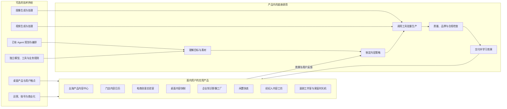
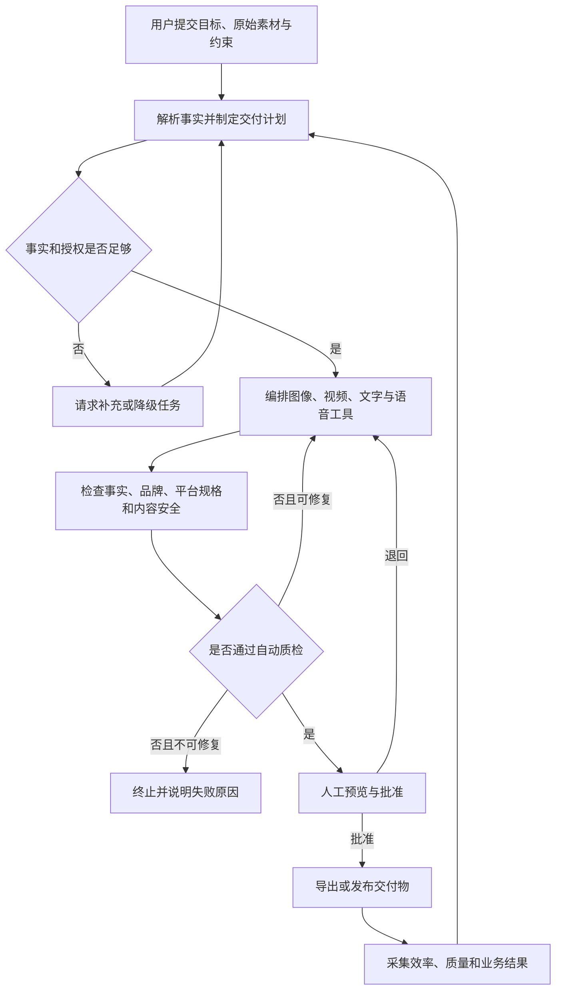

# 项目机会池

> 状态：草稿
> 最后更新：2026-09-06
> 适用范围：岩山科技旗下上海二三四五网络科技 AI Agent 项目负责人面试方向筛选
> 关联文档：[专题说明](../说明.md)、[真人衣橱搭配共创社区立项说明书](真人衣橱搭配共创社区立项说明书.md)、[主案选择决策](../决策记录/2026-09-06-选择真人衣橱搭配共创社区为面试主案.md)、[项目选题不以现有 Agent 为硬约束](../决策记录/2026-09-06-项目选题不以现有智能体为硬约束.md)

## 一、本轮结论

当前建议形成“一主两备”的面试方案组合：

1. **主案：真人衣橱搭配共创社区**。从“一件难搭单品求助”切入，以真人拖拽搭配、AI私人预览和实际穿着反馈形成闭环。详细方案见[立项说明书](真人衣橱搭配共创社区立项说明书.md)。
2. **备案一：个人风格与变美决策平台**。申请人具有虚拟试妆工作流和生活服务商家AI转化经验，但首版功能和合规边界更难收敛。
3. **备案二：出海产品内容中心**。B2B付费理由较强，但申请人的行业资源和可演示证据需要补充。

通用电商素材生成和 AI 漫剧虽然与岗位偏好匹配，但竞争拥挤、容易只比较生成效果和成本，不建议在没有独特用户资源或内容供给证据前作为唯一主案。

## 二、边界与信息信心

### 2.1 已确认事实

- 招聘方表示公司已搭建多媒体生产技术底座，可提供图像和视频生成及处理能力。
- 招聘方希望孵化多个场景应用，岗位信息表示优先基于已有 Agent 和多媒体底座的 AI 应用或 AI 生产力工具。
- HR 在电话中明确表示：项目不必基于公司现有 Agent，其他 AI 项目也会进入评审。
- 因此，复用现有 Agent 是加分项和可能的实施加速器，不是候选项目的入围条件。
- 岗位要求项目负责人完成定位、场景、目标、产品、商业模式、MVP 和增长的 0–1 责任。
- 二三四五官方网站当前列出浏览器、看图、压缩、输入法、天气和 PDF 等产品。

### 2.2 关键假设

- 对于选择复用公司底座的候选项目，假设多媒体底座已具备可编排的 API，并能支持稳定的角色、商品与风格一致性。
- 至少一个存量产品允许在合规且不伤害用户体验的前提下做产品内导流或能力集成。
- 小团队首版可以调用已有账号、支付、存储、内容安全和运营能力，不需全部自建。

### 2.3 待向公司确认

1. 多媒体底座的输入输出类型、生成耗时、单次成本、并发量、质量上限和版权政策。
2. “首个场景验证”是什么，已经验证了哪些假设，为何继续或停止。
3. 存量产品的活跃用户结构、商业用户占比、可用推广位、转化基线和渠道使用限制。
4. 项目团队的初始人数、研发角色、预算、算力额度和上线合规流程。
5. 公司更偏向 B2C 用户规模、B2B 收入，还是两者的可证明协同。

## 三、应用产品边界与机会全景图

### 3.1 什么才算一个可立项的产品

无论是否复用公司现有 Agent，候选项目都必须包含以下产品层，不以技术能力列表代替产品设计：

1. **明确的任务对象**：例如 SKU、门店、教程、二手商品或漫剧项目，而不是无边界的对话。
2. **专用工作台**：包含引导式创建、任务状态、素材预览、可编辑结果和错误恢复。
3. **持久资产**：沉淀品牌规范、用户偏好、源文档、产品事实、模板和版本记录。
4. **可控交付**：有人工编辑、审批、导出、回滚和产物溯源，不默认全自动对外发布。
5. **增长与收费机制**：明确免费价值、付费边界、计量对象、分享链路和留存来源。

### 3.2 全景图

下图展示两条合法的技术路径：候选产品可以复用公司现有 Agent 与多媒体能力，也可以采用独立模型与工具组合。无论选择哪条路，用户、任务对象、交付物和收费都必须独立成立。

关键取舍：首先按用户价值、申请人优势、MVP 可验证性和商业可行性选题，再决定技术路径。如果复用现有 Agent，首版只做能力适配，不改造或重建底座；如果不复用，应展示独立方案为何更适合问题。

## 四、评估方法与排名

### 4.1 评估维度

| 维度 | 权重 | 5 分含义 |
|---|---:|---|
| 用户痛点 | 20% | 高频或高损失，用户已在花钱或花大量时间解决 |
| 可复用优势 | 20% | 申请人的经验、已有原型、用户资源或公司底座能显著降低验证成本 |
| MVP 速度 | 15% | 4–6 周可以小团队交付并让真实用户完成任务 |
| 付费意愿 | 15% | 价值可换算为收入增加或成本下降，且付费人明确 |
| 增长可行性 | 10% | 有低成本触达、结果传播或合作渠道，不完全依赖买量 |
| 壁垒潜力 | 10% | 使用数据、工作流和垂直知识会随时间累积 |
| 风险可控性 | 10% | 成本、合规、平台依赖和内容风险可在首版收敛 |

评分为当前证据下的方向性判断，不是市场调研结论。每项按 1–5 分评估，总分为分项得分除以 5 后与权重的加权和。现有 Agent 与多媒体底座的匹配度纳入“可复用优势”，但不匹配不直接淘汰项目。

### 4.2 初始机会排名

下表形成于真人衣橱搭配共创方向完成收敛之前，仅保留为第一轮发散记录，不再代表当前主案决策。当前选择及复评条件以[主案选择决策](../决策记录/2026-09-06-选择真人衣橱搭配共创社区为面试主案.md)为准。

| 排名 | 项目方向 | 分数 | 主要优势 | 主要障碍 |
|---:|---|---:|---|---|
| 1 | 出海产品内容中心 | 91 | 价值可计算、多模态交付强、B2B 付费人明确 | 需要行业模板、多语质检和合规专业性 |
| 2 | 门店内容日历 | 89 | 问题直观、MVP 快、销售试点容易组织 | 商家留存和付费上限可能偏低 |
| 3 | 电商创意实验室 | 88 | 需求和付费强，与底座直接匹配 | 竞争拥挤，若没有效果回流只是生成器 |
| 4 | 企业知识影像工厂 | 85 | 企业付费明确，可从文档到视频形成差异 | 销售周期较长，知识准确性要求高 |
| 5 | 桌面内容快制 | 84 | 与已有桌面工具渠道协同最强 | 渠道是否可用与付费转化待验证 |
| 6 | 经纪人内容工坊 | 83 | 结构化数据充足，素材产量需求高 | 行业渠道强势，合规与虚假展示风险高 |
| 7 | 闲置快卖 | 82 | 用户输入简单，从照片到发布的价值链短 | 个人付费偏弱，跨平台发布受限 |
| 8 | 家庭时光机 | 78 | 与看图工具匹配，结果有情感传播性 | 低频，隐私与肖像授权要求高 |
| 9 | 看图防骗 | 78 | 社会价值高，可利用桌面用户触点 | 直接商业化弱，错误建议责任重 |
| 10 | AI 漫剧工作室 | 69 | 与多媒体底座高匹配，交付物容易展示 | 一致性、成本、版权和内容分发不确定性高 |

## 五、候选项目详解

### 5.1 出海产品内容中心（主案）

- **目标用户**：有 20–500 个 SKU 的外贸制造企业、跨境品牌和小型出海团队；优先从一个产品视觉易标准化、售后问题高频的品类进入。
- **需求场景**：一份中文说明书、产品图和卖点要被重复改造为多语商详图、短视频、安装教程、FAQ 和售后回复；外包成本高且信息易不一致。
- **产品形态**：以 SKU 为核心的 Web 工作台，包含产品事实库、品牌资产库、目标市场与渠道规格、内容日历、多语素材编辑器、审批和版本管理。
- **底座调用方式**：现有 Agent 在后台读取文档和图像，按市场与渠道制定内容计划，编排图像、视频、字幕和配音，并对每条宣称回溯来源。
- **MVP 切口**：只做一个品类、一种目标语言；输入一个 SKU 的 PDF 说明书和 3–10 张产品图，输出一套商详图、1 条 30–45 秒卖点视频和 1 条安装视频；人工确认后下载，首版不自动发布。
- **增长与商业化**：按月度席位、SKU 数和视频点数计费；通过跨境 ERP、产业园、商会和外贸服务商联合获客；先用“免费改造一个 SKU”展示对比结果。
- **壁垒**：不是单次生成效果，而是产品事实、品牌规范、渠道规则、语言质检、素材版本和售后问题之间的长期数据链。
- **一句话价值主张**：把一份中文产品资料包，转换成可上线、可追溯、可持续优化的海外销售与售后内容系统。

### 5.2 门店内容日历

- **目标用户**：餐饮、美业、健身和亲子等有持续内容需求，但没有专职运营的单店和小连锁。
- **需求场景**：店长有手机照片、菜单和优惠信息，但无法持续制作符合不同平台的图文、视频和活动素材。
- **产品形态**：以周日历为主界面的门店经营工作台，包含门店档案、菜单/服务库、活动日历、素材预览编辑和店长审批。
- **底座调用方式**：现有 Agent 根据经营目标和库存约束生成 7 天内容安排，批量制作并检查价格、日期、门店信息和禁用词。
- **MVP 切口**：在一个商圈招募 20 家餐饮店，每周交付 3 张图文和 1 条短视频，先不做平台自动发布。
- **商业化**：门店月订阅加高级视频点数，小连锁提供品牌模板、多门店协作和总部审批版。
- **主要风险**：低价替代多，商家留存取决于内容是否带来到店或团购转化，不能只看生成次数。

### 5.3 电商创意实验室

- **目标用户**：每周投放多批广告、有稳定 SKU 和效果数据的中小商家或代运营公司。
- **产品形态**：以“创意实验”为核心对象的广告工作台，将受众假设、素材变体、投放数据和实验结论串联在同一项目中。
- **核心差异**：不做“商品图生成器”；已有 Agent 在后台根据广告目标拆解卖点和受众假设，生成可归因的创意变体，将曝光、点击和转化结果回写为下一轮策略。
- **MVP 切口**：只支持一个广告版位，人工上传 CSV 效果数据，验证 Agent 提出的创意假设能否被观察，不在首版接入自动投放。
- **主要风险**：训练有效反馈需要投放量，平台接口和归因口径不稳定；没有数据回流时不构成壁垒。

### 5.4 企业知识影像工厂

- **目标用户**：有大量 SOP、产品手册、培训文档和客服问题的制造、连锁或软件企业。
- **产品形态**：面向企业的文档与教程项目库，展示源文档、分镜、成片、引用、版本差异和审批状态。现有 Agent 发现变更的文档，重组为分镜和解说稿，调用多媒体能力生成视频。
- **MVP 切口**：只处理 PDF 和屏幕截图，交付 2–5 分钟中文操作教程，测量人工编辑时长、事实性错误率和观看完成率。
- **商业化**：团队席位、知识库容量和视频时长计费；后续扩展到多语培训与客服视频答复。

### 5.5 桌面内容快制

- **目标用户**：经常处理截图、PDF、图片包和压缩包的运营、销售、教师和中小企业用户。
- **产品形态**：作为看图、PDF 或压缩工具中的固定任务面板，提供“制作操作教程”“转为图文”“生成汇报”等明确入口，并有项目历史、可编辑时间线和导出规格。
- **底座调用方式**：用户选中一批文件后，现有 Agent 自动去重、排序、补标注、生成解说，并编排成交付物。
- **MVP 切口**：先做独立 Web 演示或弱集成，验证“10 张截图到 60 秒操作教程”；再根据转化数据决定是否内置到存量工具。
- **商业化**：个人专业版订阅与团队协作席位；存量产品的真实导流能力是立项前置条件。

### 5.6 经纪人内容工坊

- **目标用户**：需要高频更新房源、车源图片和短视频的个体经纪人与小型门店。
- **产品思路**：从物业或车辆事实表生成平台适配图片、口播视频和客户跟进素材，所有展示均绑定原始图和已确认事实，禁止生成不存在的装修或设备。
- **MVP 切口**：只选房产或汽车中一个，只导出素材；通过门店试点测量每条线索内容成本。
- **主要风险**：外部平台掌握流量和数据，内容失真会直接产生法务和信任风险。

### 5.7 闲置快卖

- **目标用户**：有闲置物品但被拍摄、查价、写描述和回复问题阻碍的个人，以及专业二手卖家。
- **产品思路**：识别物品、检查照片缺口、去背景但保留真实瑕疵、结构化规格、生成视频和议价回复；价格建议必须显示依据和置信区间。
- **MVP 切口**：只做一个品类和一个平台的可复制发布包，不自动代发或代聊。
- **商业化**：个人用户点数包、专业卖家订阅、鉴定和回收服务导流；直接付费意愿需优先验证。

### 5.8 家庭时光机

- **目标用户**：有大量家庭照片和旧视频，需要节日或纪念日交付成片的家庭用户。
- **产品形态**：以人物和时间线为主视图的家庭影像库，提供重要日期、主题相册、故事脚本预览和成片编辑。已有 Agent 在后台去重、修复、排序和讲述；系统不得擅自推断人物关系。
- **商业化**：按成片或主题包付费，后续可连接相册印刷；低频特征使其更适合作为存量产品的增值功能而非独立订阅应用。
- **主要风险**：人脸、未成年人照片、家庭影像与云端生成涉及高隐私风险。

### 5.9 看图防骗

- **目标用户**：难以识别钓鱼页面、虚假促销和风险聊天的普通电脑用户及其家庭成员。
- **产品形态**：看图或浏览器中的安全功能，用户右键或点击“帮我看看是否有风险”，在原图上显示可疑区域、理由、置信度和安全处理入口。已有 Agent 负责多步检查和生成可理解图解。
- **商业化**：作为安全工具的付费增值项、家庭会员权益或银行/运营商合作能力；独立收费需求偏弱。
- **主要风险**：假阴性可能导致真实损失，产品必须严格限定承诺和高风险回答。

### 5.10 AI 漫剧工作室

- **目标用户**：有网文、脚本或品牌故事，但缺少分镜、角色管理和后期能力的工作室与内容团队。
- **产品形态**：以漫剧项目、角色库、场景库和分镜时间线为主界面的创作工作室。已有 Agent 负责拆解剧本、管理连续性、编排配音、字幕和剪辑，产品在每个成本放大点设置人工审批。
- **MVP 切口**：不做长剧，只做 60–90 秒、2–3 个角色、1–2 个场景的短剧，测量返工次数、一致性通过率和每分钟成片成本。
- **主要风险**：内容 IP 授权、生成素材版权、角色一致性、人物口型和生成成本都可能阻断规模化。

## 六、通用核心流程

下图定义应用产品如何调用已有 Agent 完成一次可控交付。用户操作的是垂直产品；Agent 计划、生产和检查是产品内部过程。

首版原则上停在“导出”，不自动代用户发布，以降低平台接口、账号安全和错误内容对外发布风险。只有当质检准确性和用户信任达到预设门槛，才在后续版本接入发布与效果回流。

## 七、组合策略

### 7.1 主案陈述结构

面试中建议将主案讲深，而不是平均分配时间给十个想法：

1. 用一个真实工作流说明外贸产品内容为何反复、昂贵且容易出错。
2. 展示“出海产品内容中心”的关键界面和一个 SKU 从中文资料到海外销售与售后内容包的产品流程，再说明已有 Agent 在哪些节点被调用。
3. 说清人工审批、事实溯源、生成成本和版权边界，体现负责人对上线风险的理解。
4. 用 4–6 周 MVP、10–15 家试点客户和明确停止阈值体现敏捷孵化。
5. 用两个备案说明如果公司的存量用户或底座能力与假设不同，如何快速收窄或转向。

### 7.2 不建议的陈述方式

- 不把“市场很大”当作用户需求证据。
- 不把公司历史用户数等同于新产品可无成本转化的有效用户。
- 不用“比现有模型更好”作为壁垒，因为基础模型效果会快速趋同。
- 不在 MVP 同时承诺全自动投放、多平台发布、海量品类和完全无人审核。

## 八、下一轮决策

需要申请人在下一轮确认一个主案。若没有额外个人行业优势，默认沿“出海产品内容中心”继续，后续输出：

1. 精确的首个品类与理想客户画像。
2. 问题访谈和桌面研究计划。
3. 竞品分层、替代流程与差异化价值主张。
4. 4–6 周 MVP 立项说明书，包含指标、成本预算、团队、里程碑、停止阈值和迭代 Roadmap。

## 九、参考信息

- 用户提供的招聘邀约和岗位截图，2026-09-06。
- [上海二三四五网络科技官方网站](https://www.2345.net/)，访问于 2026-09-06。官网的产品组合信息用于判断潜在用户触点；官网用户规模数字的统计日期待确认，未用于市场规模测算。
